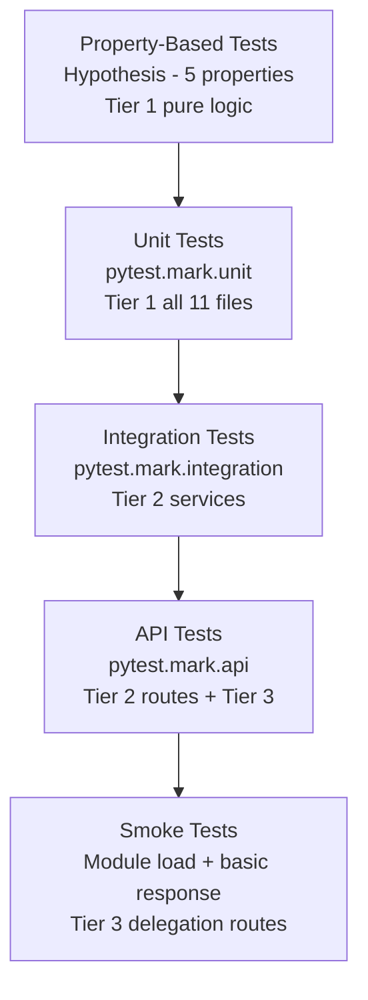
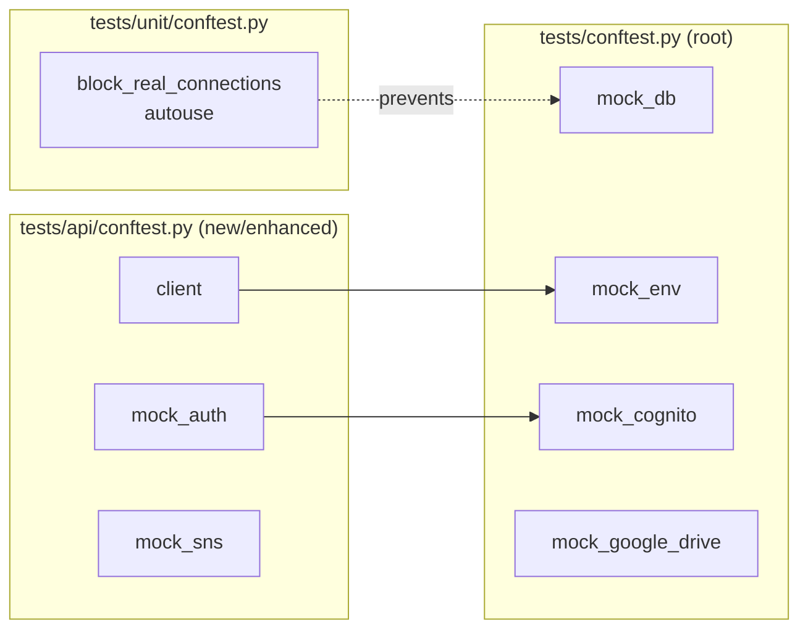

# Design Document: Missing Python Backend Tests

## Overview

This design covers the systematic addition of test coverage for 50 untested Python backend source files across three priority tiers. The approach leverages the existing pytest infrastructure (connection guard, shared fixtures, compliance checker) and introduces property-based tests using Hypothesis for core business logic functions.

The design prioritizes:

1. **Reuse** of existing fixtures (`mock_db`, `mock_env`, `mock_cognito`, `mock_google_drive`)
2. **Compliance** with `test-compliance-rules.json` from day one
3. **Property-based testing** for pure calculation/transformation functions (Tier 1)
4. **Incremental delivery** starting with small, dependency-free files

## Architecture

### Test Pyramid



### Directory Layout

```
backend/tests/
├── unit/
│   ├── conftest.py                          # Existing: connection guard
│   ├── test_business_pricing_model.py       # Tier 1
│   ├── test_business_pricing_model_props.py # Tier 1 PBT
│   ├── test_hybrid_pricing_optimizer.py     # Tier 1
│   ├── test_btw_processor.py               # Tier 1
│   ├── test_btw_processor_props.py         # Tier 1 PBT
│   ├── test_toeristenbelasting_processor.py # Tier 1
│   ├── test_ai_extractor.py                # Tier 1
│   ├── test_security_audit.py              # Tier 1
│   ├── test_security_audit_props.py        # Tier 1 PBT
│   ├── test_country_detector.py            # Tier 1
│   ├── test_country_detector_props.py      # Tier 1 PBT
│   ├── test_bnb_cache.py                   # Tier 1
│   ├── test_database_migrations.py         # Tier 1
│   ├── test_performance_optimizer.py       # Tier 1
│   ├── test_i18n.py                        # Tier 1
│   ├── test_i18n_props.py                  # Tier 1 PBT
│   ├── test_route_validator.py             # Tier 2
│   └── test_frontend_url.py               # Tier 2
├── integration/
│   ├── test_country_report_service.py      # Tier 2
│   ├── test_email_log_service.py           # Tier 2
│   ├── test_tenant_language_service.py     # Tier 2
│   ├── test_tenant_settings_service.py     # Tier 2
│   ├── test_user_language_service.py       # Tier 2
│   ├── test_aws_notifications.py          # Tier 2
│   └── test_migrate_revolut_ref2.py       # Tier 2
├── api/
│   ├── conftest.py                         # Enhanced: client + mock_auth + mock_sns
│   ├── test_admin_routes.py               # Tier 2
│   ├── test_audit_routes.py               # Tier 2
│   ├── test_scalability_routes.py         # Tier 2
│   ├── test_tenant_module_routes.py       # Tier 2
│   ├── test_tax_routes.py                 # Tier 3
│   ├── test_invoice_routes.py             # Tier 3
│   ├── test_auth_routes.py                # Tier 3
│   ├── test_chart_of_accounts_routes.py   # Tier 3
│   ├── ... (remaining Tier 3 route tests)
│   └── test_api_schemas.py                # Tier 3
```

### Fixture Dependency Graph



## Components and Interfaces

### Component 1: Shared API Test Fixtures (`tests/api/conftest.py`)

New or enhanced fixtures for API and integration tests:

```python
@pytest.fixture
def app():
    """Create Flask app with all blueprints registered."""
    from src.app import create_app
    app = create_app(testing=True)
    app.config['TESTING'] = True
    return app

@pytest.fixture
def client(app):
    """Flask test client with application context."""
    with app.test_client() as client:
        with app.app_context():
            yield client

@pytest.fixture
def mock_auth():
    """Generate valid authentication headers for API tests."""
    with patch('auth.cognito_utils.extract_user_credentials') as mock:
        mock.return_value = ('test@example.com', ['TenantAdmin'], 'test-tenant')
        yield {'Authorization': 'Bearer test-token'}

@pytest.fixture
def mock_auth_sysadmin():
    """Generate SysAdmin authentication headers."""
    with patch('auth.cognito_utils.extract_user_credentials') as mock:
        mock.return_value = ('admin@myadmin.com', ['SysAdmin'], None)
        yield {'Authorization': 'Bearer sysadmin-token'}

@pytest.fixture
def mock_sns():
    """Mock AWS SNS publish calls."""
    with patch('boto3.client') as mock_client:
        mock_sns_client = MagicMock()
        mock_client.return_value = mock_sns_client
        mock_sns_client.publish.return_value = {'MessageId': 'test-msg-id'}
        yield mock_sns_client
```

### Component 2: Property-Based Test Modules

Each PBT module follows the established pattern from `test_parameter_service_props.py`:

```python
"""
Property-based tests for {module_name}.

Uses Hypothesis to verify correctness properties from the design document.
Feature: missing-py-tests, Property {N}: {property_text}

Requirements: {X.Y}
Reference: .kiro/specs/missing-py-tests/design.md
"""
import pytest
from hypothesis import given, strategies as st, settings

@settings(max_examples=100)
@given(...)
def test_property_name(inputs):
    """Feature: missing-py-tests, Property {N}: {property_text}"""
    # Arrange, Act, Assert
```

### Component 3: Unit Test Modules (Tier 1)

Each unit test module covers one source file with:

- `@pytest.mark.unit` marker (auto-applied by directory)
- Fixture usage: `mock_db`, `mock_env` as needed
- Naming: `test_{function}_{scenario}_{expected}`
- Target: 80%+ line coverage

### Component 4: Integration Test Modules (Tier 2)

Each integration test module covers one service file with:

- `@pytest.mark.integration` marker (auto-applied by directory)
- Mocked external services (DB, Cognito, SNS)
- Tests component interaction flows
- Target: 60%+ line coverage

### Component 5: API Test Modules (Tier 2 + Tier 3)

Each API test module covers one route file with:

- `@pytest.mark.api` marker (auto-applied by directory)
- Flask test client + mock_auth fixture
- Tests: auth enforcement, input validation, error handling, happy path
- Target: 60% (Tier 2) or 40% (Tier 3) line coverage

## Data Models

### Test Input Strategies (Hypothesis)

For property-based tests, the following Hypothesis strategies generate test data:

| Strategy              | Domain           | Generator                                                                       |
| --------------------- | ---------------- | ------------------------------------------------------------------------------- |
| `valid_phone_st`      | Country detector | `st.sampled_from(COUNTRY_CODES).flatmap(lambda cc: st.just(f'+{cc} ...'))`      |
| `multiplier_input_st` | Pricing model    | `st.floats(min_value=0.0, max_value=1.0)` for occupancy, dates via `st.dates()` |
| `sql_injection_st`    | Security audit   | `st.sampled_from(KNOWN_PATTERNS)` combined with `st.text()`                     |
| `accept_language_st`  | i18n             | `st.text(alphabet=st.characters(), min_size=0, max_size=100)`                   |
| `transaction_set_st`  | BTW processor    | `st.lists(st.fixed_dictionaries({...}))` with balanced debits/credits           |

### Mock Return Value Patterns

Standard mock configurations for each source module:

```python
# Pricing model - mock DB returns for historical data
mock_db.execute_query.return_value = [
    {'date': '2024-01-15', 'price': 150.0, 'occupancy': 0.75}
]

# BTW processor - mock DB returns for account resolution
mock_db.execute_query.return_value = [
    {'account_number': '1520', 'account_name': 'BTW Af te dragen'}
]

# Security audit - no DB dependency (pure logic)
# Country detector - no DB dependency (pure logic)
# i18n - no DB dependency (pure logic)
```

## Correctness Properties

_A property is a characteristic or behavior that should hold true across all valid executions of a system — essentially, a formal statement about what the system should do. Properties serve as the bridge between human-readable specifications and machine-verifiable correctness guarantees._

### Property 1: Pricing Multiplier Bounds

_For any_ valid listing and date combination, each multiplier function in `BusinessPricingModel` (`_get_historical_multiplier`, `_get_occupancy_multiplier`, `_get_booking_pace_multiplier`, `_get_event_multiplier`) SHALL produce an output within its documented bounds (0.5 to 2.0 for standard multipliers, 0.0 to 0.21 for BTW adjustment).

**Validates: Requirements 3.1**

### Property 2: Phone Number Country Extraction

_For any_ valid E.164 formatted phone number with a known country calling code, `extract_country_from_phone` SHALL return a valid 2-letter ISO 3166-1 alpha-2 country code or None (never an invalid code, never an exception).

**Validates: Requirements 3.2**

### Property 3: SQL Injection Detection Invariance

_For any_ string containing a known SQL injection pattern (e.g., `' OR 1=1 --`, `; DROP TABLE`, `UNION SELECT`), `check_sql_injection` SHALL detect the threat regardless of surrounding text content, casing, or whitespace variations.

**Validates: Requirements 3.3**

### Property 4: Locale Detection Totality

_For any_ string value passed as an Accept-Language header (including empty, malformed, or adversarial inputs), `get_locale` SHALL return a value from the supported locale set `{'nl', 'en'}` — never None, never an unsupported locale.

**Validates: Requirements 3.4**

### Property 5: BTW Debit-Credit Balance Invariant

_For any_ set of transactions within a closed accounting period where the sum of debit amounts equals the sum of credit amounts, the BTW processor's `_calculate_btw_amounts` SHALL preserve this balance invariant in its output (total VAT receivable minus total VAT payable equals the net VAT position).

**Validates: Requirements 3.5**

## Error Handling

### Test-Level Error Handling

| Scenario                               | Expected Behavior                              | Test Approach                              |
| -------------------------------------- | ---------------------------------------------- | ------------------------------------------ |
| Source module import fails             | Test file skips with `pytest.importorskip()`   | Conditional import at module level         |
| Mock returns unexpected type           | Test fails with clear assertion message        | Use specific assertions, not bare `assert` |
| Hypothesis finds shrunk counterexample | Test reports minimal failing input             | Default Hypothesis shrinking enabled       |
| Connection guard triggers              | `RuntimeError` raised with descriptive message | Verify in dedicated guard test             |
| Fixture setup fails                    | Test marked as error (not failure)             | Use `pytest.fixture` with proper teardown  |

### Source Module Error Patterns to Test

| Module                   | Error Condition           | Expected Behavior                                |
| ------------------------ | ------------------------- | ------------------------------------------------ |
| `country_detector`       | Malformed phone number    | Returns `None`, logs debug                       |
| `business_pricing_model` | Missing historical data   | Falls back to base rate multiplier of 1.0        |
| `btw_processor`          | No VAT accounts found     | Raises descriptive error or returns empty report |
| `security_audit`         | Empty input string        | Returns valid result (no injection detected)     |
| `i18n`                   | Missing X-Language header | Defaults to `'nl'`                               |
| `ai_extractor`           | Invalid JSON from AI      | Falls back to secondary model or returns None    |
| `bnb_cache`              | Expired cache entry       | Triggers refresh, returns fresh data             |

## Testing Strategy

### Dual Testing Approach

**Unit tests** (example-based):

- Verify specific scenarios with concrete inputs/outputs
- Cover error paths, edge cases, and integration points
- Focus on: each function's happy path, boundary conditions, error returns
- Avoid: testing too many input variations (that's what PBT handles)

**Property tests** (Hypothesis):

- Verify universal invariants across randomized inputs
- Minimum 100 iterations per property (`@settings(max_examples=100)`)
- Each test tagged: `Feature: missing-py-tests, Property {N}: {property_text}`
- Focus on: bounds checking, round-trip properties, detection invariants

### Property-Based Testing Configuration

- **Library**: Hypothesis (already installed, `.hypothesis/` directory exists)
- **Iterations**: 100 per property (configurable via `@settings(max_examples=100)`)
- **Profiles**: Use default profile; CI may use `@settings(max_examples=200)` for thoroughness
- **Database**: Hypothesis example database at `.hypothesis/examples/` (already configured)
- **Deadline**: `@settings(deadline=None)` for tests involving mocked I/O

### Test File Naming Convention

| Type             | Pattern                         | Example                          |
| ---------------- | ------------------------------- | -------------------------------- |
| Unit test        | `test_{source_module}.py`       | `test_country_detector.py`       |
| Property test    | `test_{source_module}_props.py` | `test_country_detector_props.py` |
| Integration test | `test_{source_module}.py`       | `test_email_log_service.py`      |
| API test         | `test_{source_module}.py`       | `test_tax_routes.py`             |

### Coverage Targets

| Tier   | Target | Measurement                                                                               |
| ------ | ------ | ----------------------------------------------------------------------------------------- |
| Tier 1 | 80%+   | `pytest --cov=src/{module} tests/unit/test_{module}.py tests/unit/test_{module}_props.py` |
| Tier 2 | 60%+   | `pytest --cov=src/{module} tests/integration/test_{module}.py tests/api/test_{module}.py` |
| Tier 3 | 40%+   | `pytest --cov=src/routes/{module} tests/api/test_{module}.py`                             |

### Compliance Verification

After each batch of tests is created:

1. Run compliance checker: `python -m backend.scripts.test_maintenance.scanner`
2. Verify zero violations against `test-compliance-rules.json`
3. Verify no new mock violations detected
4. Run scoped runner to confirm tests pass: `python -m backend.scripts.test_maintenance.scoped_runner --full`

### Anti-Patterns Enforced

All new test files MUST NOT contain:

- `import mysql.connector` — use `mock_db` fixture
- `os.environ[...]` without `patch.dict` — use `mock_env` fixture
- `DatabaseManager(test_mode=True)` without mocking — use `mock_db`
- `load_dotenv()` — hardcode test values or use `mock_env`
- `sys.path.append/insert` — conftest handles path setup
- Imports from other test files — only from conftest fixtures and source modules

### Execution Order

1. **Batch 1**: `country_detector.py`, `i18n.py` (pure logic, no DB)
2. **Batch 2**: `business_pricing_model.py`, `btw_processor.py`, `bnb_cache.py` (mocked DB)
3. **Batch 3**: `security_audit.py`, `ai_extractor.py`, `hybrid_pricing_optimizer.py`, `database_migrations.py`, `performance_optimizer.py`, `toeristenbelasting_processor.py` (complex Tier 1)
4. **Batch 4**: Tier 2 service files (integration tests)
5. **Batch 5**: Tier 2 route + utility files (API tests)
6. **Batch 6**: Tier 3 route files batched by module
