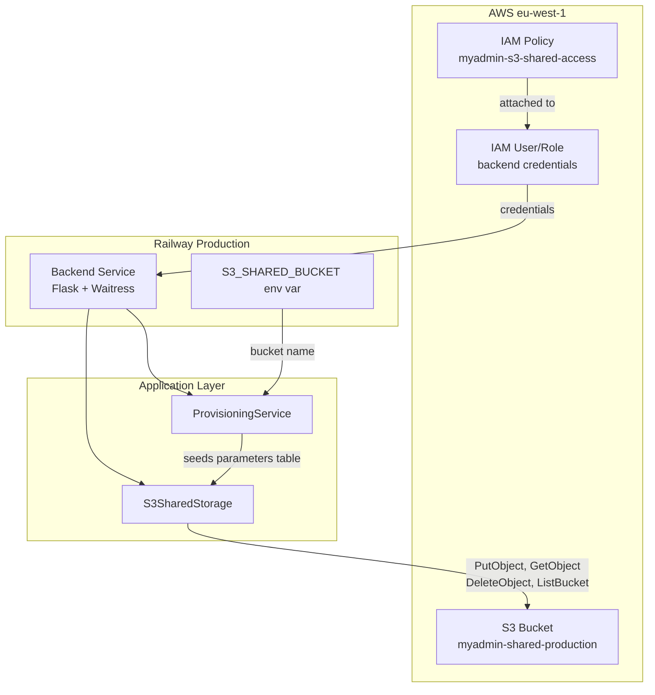

# Design Document: S3 Shared Bucket Infrastructure

## Overview

This design provisions the AWS S3 infrastructure required by the existing `S3SharedStorage` class. The application code already handles tenant-prefixed document storage — what's missing is the actual AWS bucket, IAM permissions, and environment variable wiring.

The implementation is a single Terraform file (`infrastructure/s3.tf`) that creates:

- An S3 bucket with versioning, encryption, lifecycle rules, and CORS
- An IAM policy scoped to the minimum required S3 actions
- Terraform outputs for the bucket name and ARN

No application code changes are needed. The `S3SharedStorage` class resolves its bucket from `os.getenv('S3_SHARED_BUCKET')`, which is set as a Railway environment variable in production and in `.env` locally.

## Architecture



### Integration with Existing Infrastructure

The new `s3.tf` file follows the same conventions as `cognito.tf`, `notifications.tf`, and `ses.tf`:

- Uses shared variables from `main.tf` (`var.aws_region`) and `variables.tf` (`var.project_name`, `var.environment`)
- Consistent tagging: `Name`, `Environment`, `Project`, `ManagedBy`
- Output blocks for resource identifiers
- File header comment describing purpose

### Data Flow

1. **Terraform apply** → creates S3 bucket + IAM policy
2. **Operator** → sets `S3_SHARED_BUCKET=myadmin-shared-production` in Railway env vars
3. **Backend starts** → `ProvisioningService` reads env var, seeds `storage.s3_shared_bucket` parameter
4. **S3SharedStorage** → resolves bucket name from parameter service (or env var fallback)
5. **Upload/Download** → uses boto3 with IAM credentials attached to the backend's AWS user

## Components and Interfaces

### Terraform Resources (infrastructure/s3.tf)

| Resource                                                    | Type         | Purpose                                 |
| ----------------------------------------------------------- | ------------ | --------------------------------------- |
| `aws_s3_bucket.shared`                                      | Bucket       | Primary document storage                |
| `aws_s3_bucket_versioning.shared`                           | Versioning   | Object version history                  |
| `aws_s3_bucket_server_side_encryption_configuration.shared` | Encryption   | AES-256 at rest                         |
| `aws_s3_bucket_public_access_block.shared`                  | Access block | Prevent public exposure                 |
| `aws_s3_bucket_lifecycle_configuration.shared`              | Lifecycle    | Transition to STANDARD_IA after 90 days |
| `aws_s3_bucket_cors_configuration.shared`                   | CORS         | Allow browser uploads                   |
| `aws_iam_policy.s3_shared_access`                           | IAM Policy   | Least-privilege S3 permissions          |

### IAM Policy Structure

The policy uses two statements to correctly scope permissions:

```json
{
  "Version": "2012-10-17",
  "Statement": [
    {
      "Sid": "AllowBucketListing",
      "Effect": "Allow",
      "Action": ["s3:ListBucket"],
      "Resource": "arn:aws:s3:::myadmin-shared-production"
    },
    {
      "Sid": "AllowObjectOperations",
      "Effect": "Allow",
      "Action": ["s3:PutObject", "s3:GetObject", "s3:DeleteObject"],
      "Resource": "arn:aws:s3:::myadmin-shared-production/*"
    }
  ]
}
```

**Design decisions:**

- No `s3:*` wildcards — only the four actions used by `S3SharedStorage`
- `ListBucket` scoped to bucket ARN (not objects) per AWS best practice
- Object actions scoped to `bucket/*` to cover all tenant prefixes
- No condition keys for tenant isolation — isolation is enforced at the application layer via key prefixes

### CORS Configuration

```hcl
cors_rule {
  allowed_headers = ["Content-Type", "x-amz-acl", "x-amz-meta-*"]
  allowed_methods = ["GET", "PUT", "HEAD"]
  allowed_origins = [
    "https://petergeers.github.io",
    "http://localhost:3000"
  ]
  expose_headers  = ["ETag", "Content-Length"]
  max_age_seconds = 3600
}
```

This enables future direct-upload from the browser without requiring a backend proxy.

### Environment Variable Integration

| Environment          | Source                 | Value                               |
| -------------------- | ---------------------- | ----------------------------------- |
| Production (Railway) | Railway env vars panel | `myadmin-shared-production`         |
| Local development    | `.env` file            | `myadmin-shared-dev` or test bucket |
| CI/Test              | Not set                | S3 storage skipped gracefully       |

### Variable Validation

The `environment` variable in `variables.tf` will be updated with a validation block:

```hcl
variable "environment" {
  description = "Environment name (dev, staging, production)"
  type        = string
  default     = "production"

  validation {
    condition     = contains(["dev", "staging", "production"], var.environment)
    error_message = "Environment must be one of: dev, staging, production."
  }
}
```

## Data Models

### S3 Key Structure

```
{tenant}/{category}/{reference}/{uuid}_{filename}
```

Categories:

- `invoices` — uploaded invoice/document PDFs (default). The `{reference}` is a logical grouping name (typically the creditor/vendor name, e.g., "railway", "kiro") or "general" for unclassified documents.
- `branding` — logos, letterheads (fixed keys, no UUID — intentional overwrite with versioning history)
- `templates` — invoice and report templates (no reference sub-level)

Examples:

- `KimGeers/invoices/railway/a1b2c3d4e5f6_factuur-mei.pdf`
- `KimGeers/invoices/kiro/f7e8d9c0b1a2_invoice-2026-05.pdf`
- `KimGeers/invoices/general/c8d0e1f2a3b4_receipt.png`
- `KimGeers/branding/company_logo.png`
- `KimGeers/templates/c0b1a2d4e5f6_str_invoice_nl.html`

### Terraform Outputs

| Output                        | Value                  | Usage                           |
| ----------------------------- | ---------------------- | ------------------------------- |
| `s3_shared_bucket_name`       | `myadmin-shared-{env}` | Set as Railway env var          |
| `s3_shared_bucket_arn`        | Full ARN               | Reference in other policies     |
| `s3_shared_access_policy_arn` | IAM policy ARN         | Attach to backend IAM principal |

### Tags Applied

```hcl
tags = {
  Name        = "myAdmin-Shared-Storage"
  Environment = var.environment
  Project     = var.project_name
  ManagedBy   = "terraform"
  Purpose     = "document-storage"
}
```

## Error Handling

| Scenario                    | Handling                                                                                                              |
| --------------------------- | --------------------------------------------------------------------------------------------------------------------- |
| `S3_SHARED_BUCKET` unset    | `ProvisioningService` skips S3 seeding; `S3SharedStorage.__init__` raises `ValueError` if instantiated without bucket |
| IAM policy not attached     | boto3 raises `ClientError` with `AccessDenied`; existing error handling in `S3SharedStorage` logs and re-raises       |
| Bucket doesn't exist        | boto3 raises `NoSuchBucket`; caught by existing `ClientError` handling                                                |
| `terraform validate` fails  | Variable validation block produces clear error message for invalid environment values                                 |
| `force_destroy = false`     | Terraform refuses to destroy bucket with objects, preventing accidental data loss                                     |
| Pre-signed URL cross-tenant | Endpoint returns 403 if key doesn't start with authenticated tenant prefix                                            |
| Pre-signed URL expired      | S3 returns 403 AccessDenied; user clicks again to get a fresh URL                                                     |

## Pre-signed URL Download Endpoint

### Backend Endpoint

**Route**: `GET /api/storage/presigned-url?key=<s3_key>`

**File**: `backend/src/routes/storage.py` (new blueprint)

```python
@storage_bp.route('/presigned-url', methods=['GET'])
@cognito_required(required_permissions=[])
@tenant_required()
def get_presigned_url(user_email, user_roles, tenant, user_tenants):
    key = request.args.get('key', '')

    # Tenant isolation: key must start with tenant prefix
    if not key.startswith(f"{tenant}/"):
        return jsonify({'error': 'Access denied'}), 403

    bucket = os.getenv('S3_SHARED_BUCKET', '')
    if not bucket:
        return jsonify({'error': 'S3 storage not configured'}), 503

    s3_client = boto3.client('s3')
    url = s3_client.generate_presigned_url(
        'get_object',
        Params={
            'Bucket': bucket,
            'Key': key,
            'ResponseContentDisposition': 'inline',
        },
        ExpiresIn=300
    )
    return jsonify({'success': True, 'url': url, 'expires_in': 300})
```

### Frontend Integration

**File**: `frontend/src/components/BankingProcessor.tsx`

Update `handleRef3Click`:

```typescript
const handleRef3Click = async (ref3: string) => {
  if (ref3.startsWith("https://drive.goo")) {
    window.open(ref3, "_blank");
  } else if (ref3 && !ref3.startsWith("http")) {
    // S3 key — fetch pre-signed URL from backend
    try {
      const resp = await authenticatedGet(
        `/api/storage/presigned-url?key=${encodeURIComponent(ref3)}`,
        { tenant: currentTenant || undefined },
      );
      const data = await resp.json();
      if (data.success && data.url) {
        window.open(data.url, "_blank");
      } else {
        copyToClipboard(ref3);
      }
    } catch {
      copyToClipboard(ref3);
    }
  } else {
    copyToClipboard(ref3);
  }
};
```

### Security Model

- **Authentication**: JWT required via `@cognito_required`
- **Tenant isolation**: Key prefix validated against authenticated tenant
- **Time-limited**: Pre-signed URL expires after 5 minutes
- **No direct S3 access**: Frontend never gets AWS credentials, only temporary URLs

## Provider-Aware Logo Resolution

### Shared Helper

**File**: `backend/src/services/logo_resolver.py` (new)

```python
def resolve_tenant_logo(tenant: str, branding_namespace: str, parameter_service, db=None) -> Optional[str]:
    """
    Resolve company logo as base64 data URI based on storage provider.

    Returns data URI string or None if no logo configured.
    """
    provider = parameter_service.get_param('storage', 'invoice_provider', tenant=tenant)

    if provider == 'google_drive':
        logo_file_id = parameter_service.get_param(branding_namespace, 'company_logo_file_id', tenant=tenant)
        if not logo_file_id:
            return None
        # Existing Google Drive fetch logic
        logo_url = f'https://lh3.googleusercontent.com/d/{logo_file_id}=w600'
        resp = requests.get(logo_url, timeout=10)
        if resp.status_code == 200:
            content_type = resp.headers.get('Content-Type', 'image/png')
            b64 = base64.b64encode(resp.content).decode('utf-8')
            return f'data:{content_type};base64,{b64}'
        return None

    elif provider in ('s3_shared', 's3_tenant'):
        s3_key = parameter_service.get_param(branding_namespace, 'company_logo_s3_key', tenant=tenant)
        if not s3_key:
            return None
        bucket = os.getenv('S3_SHARED_BUCKET', '')
        if not bucket:
            return None
        s3_client = boto3.client('s3')
        obj = s3_client.get_object(Bucket=bucket, Key=s3_key)
        content_type = obj['ContentType']
        b64 = base64.b64encode(obj['Body'].read()).decode('utf-8')
        return f'data:{content_type};base64,{b64}'

    return None
```

### Usage in Generators

Both `str_invoice_generator.py` and `pdf_generator_service.py` replace their inline logo fetch with:

```python
from services.logo_resolver import resolve_tenant_logo
company_logo = resolve_tenant_logo(tenant, 'str_branding', ps) or ''
```

### Logo Upload Endpoint

**Route**: `POST /api/storage/upload-logo`

**File**: `backend/src/routes/storage.py`

- Accepts multipart file upload (PNG, JPG, SVG, max 2MB)
- Stores at fixed key `{tenant}/branding/company_logo.{ext}` (overwrites previous; versioning preserves history)
- Updates `company_logo_s3_key` parameter via ParameterService
- Returns the S3 key for confirmation

## Testing Strategy

### Why Property-Based Testing Does Not Apply

This feature is pure Infrastructure-as-Code (Terraform). There are no functions with inputs/outputs to test with PBT. The resources are declarative configuration — either they exist with the correct settings or they don't.

### Appropriate Testing Approaches

1. **Terraform Validate** — Syntax and reference correctness

   ```bash
   cd infrastructure && terraform validate
   ```

2. **Terraform Plan** — Verify resources show as additions only, no modifications/deletions to existing resources

3. **Manual Verification Checklist** (post-apply):
   - Bucket exists in eu-west-1 with correct name
   - Versioning enabled
   - Encryption set to AES-256
   - Public access fully blocked
   - Lifecycle rule transitions to STANDARD_IA at 90 days
   - CORS allows specified origins and methods
   - IAM policy contains exactly 4 actions, no wildcards

4. **Integration Smoke Test** — After infrastructure is applied and env var is set:
   - `S3SharedStorage` can upload a test file
   - `S3SharedStorage` can download the uploaded file
   - `S3SharedStorage` can list files under a prefix
   - `S3SharedStorage` can delete the test file

5. **Environment Variable Verification**:
   - `.env.example` contains `S3_SHARED_BUCKET` entry
   - Railway env var is set (manual check)
   - `ProvisioningService` seeds parameters when env var is present
   - `ProvisioningService` skips seeding when env var is absent

6. **Pre-signed URL Endpoint Tests**:
   - Request with valid tenant-prefixed key → returns pre-signed URL with 200
   - Request with cross-tenant key (different prefix) → returns 403
   - Request without authentication → returns 401
   - Request when `S3_SHARED_BUCKET` is unset → returns 503
   - Frontend `handleRef3Click` with S3 key → opens pre-signed URL in new tab
   - Frontend `handleRef3Click` with Google Drive URL → opens directly (unchanged)
   - Frontend `handleRef3Click` when pre-signed URL fails → falls back to clipboard copy
