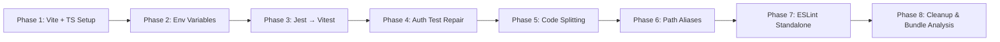
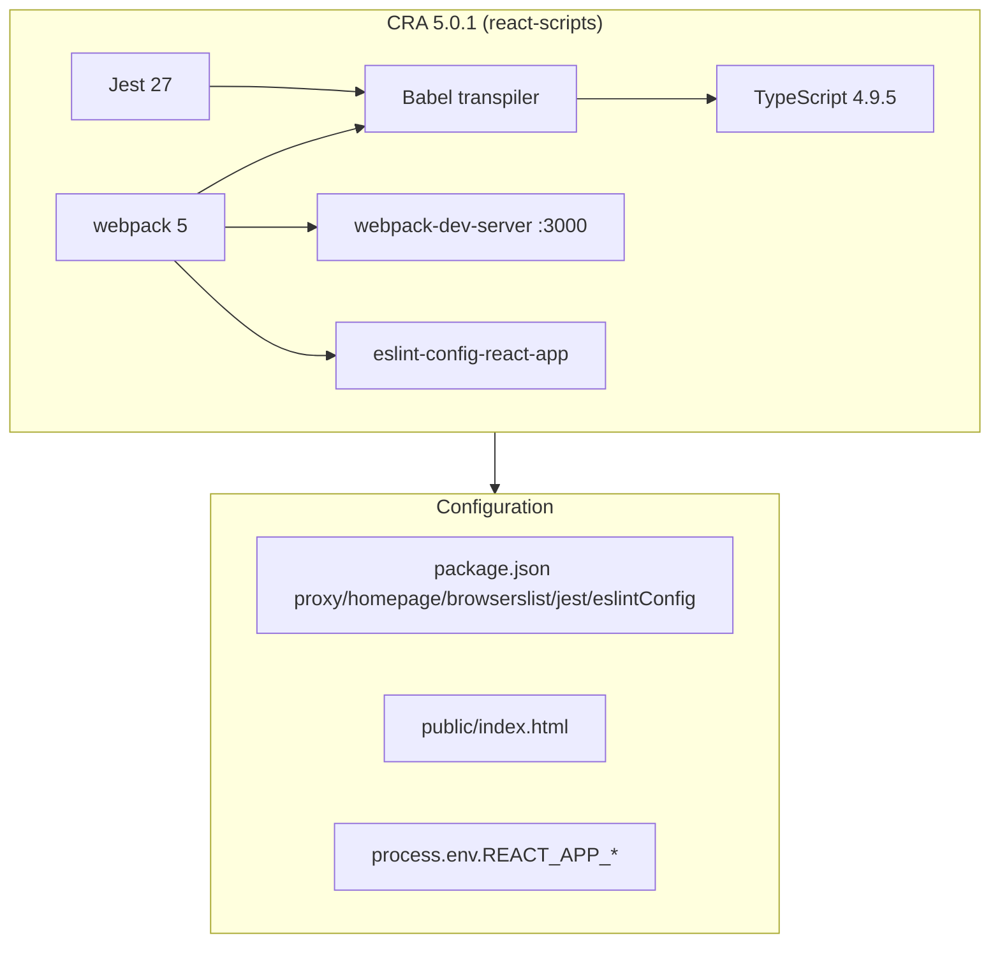
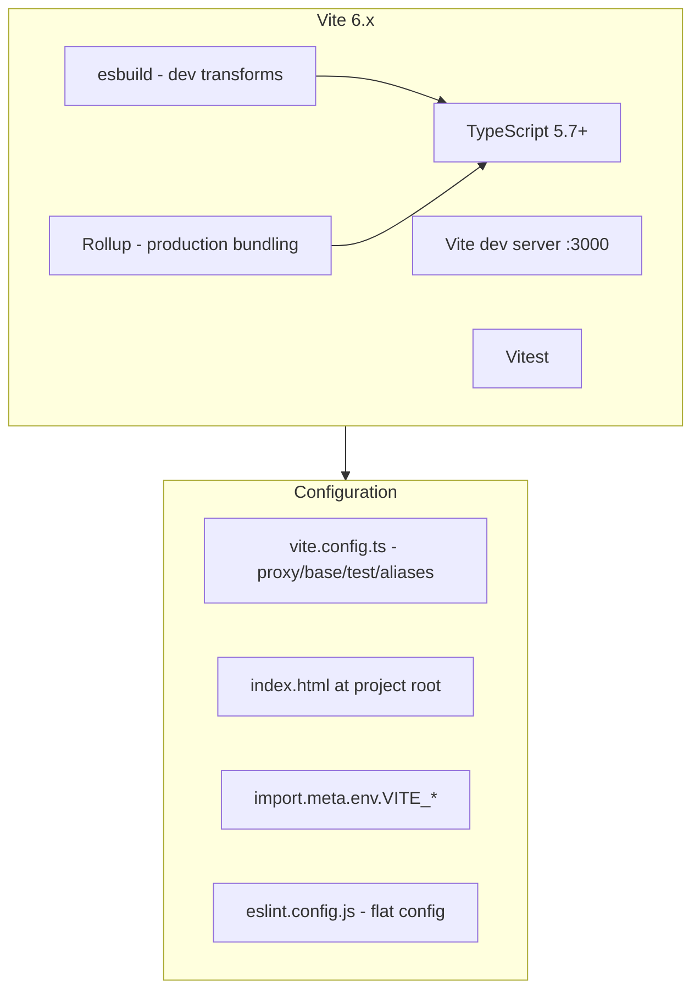

# Design Document: CRA-to-Vite Migration

## Overview

This design describes the migration of the myAdmin frontend build toolchain from Create React App (CRA) 5.0.1 to Vite 6.x. The migration replaces the entire CRA ecosystem — build system (webpack → Rollup/esbuild), test runner (Jest 27 → Vitest), linter configuration (eslint-config-react-app → standalone flat config), and TypeScript version (4.9.5 → 5.7+) — while introducing route-based code splitting and path aliases.

### Motivation

CRA 5.0.1 bundles TypeScript 4.9.5, which cannot parse `const` type parameters (TS 5.0+ syntax) found in `.d.ts` files from fast-check 4.x, i18next 25.x, and react-i18next 16.x. These are parse errors that `skipLibCheck` cannot suppress. CRA is end-of-life (last meaningful release: February 2022) and upgrading TypeScript within CRA is not possible — `react-scripts` hardcodes its TypeScript version and webpack/Babel pipeline.

### Design Decisions

1. **Vite 6.x over alternatives (Next.js, Remix, Parcel)**: Vite is the closest drop-in replacement for CRA — it's a build tool, not a framework. The app uses client-side state management with `useState` (no server-side rendering), so a framework migration would be unnecessary scope.

2. **Vitest over keeping Jest**: Vitest shares Vite's transform pipeline, eliminating the need for `transformIgnorePatterns` and `moduleNameMapper` workarounds currently required for fast-check, date-fns, and Chakra UI. The API is nearly identical (`vi.fn()` vs `jest.fn()`).

3. **ESLint flat config over legacy config**: CRA's `eslint-config-react-app` is tightly coupled to CRA. ESLint flat config (`eslint.config.js`) is the current standard and avoids the deprecated `.eslintrc` format.

4. **Route-based code splitting**: The app has 17+ page components all eagerly imported in `App.tsx`. Plotly.js alone is ~3MB. Lazy loading page components is a natural optimization that Vite's Rollup bundler handles well.

5. **`@/` path alias**: Deep relative imports (`../../services/authService`) are common throughout the codebase. The alias can be adopted incrementally — new code uses it, existing code migrates over time.

### Migration Sequence

The migration follows an 8-phase sequence where each phase builds on the previous. Phases 1–3 are the core migration; phases 4–8 are improvements enabled by the migration.



---

## Architecture

### Before: CRA Architecture



### After: Vite Architecture



### Key Architectural Changes

| Aspect         | CRA (Before)                              | Vite (After)                                    |
| -------------- | ----------------------------------------- | ----------------------------------------------- |
| Bundler        | webpack 5                                 | Rollup (prod) / esbuild (dev)                   |
| Dev server     | webpack-dev-server                        | Vite dev server                                 |
| TypeScript     | 4.9.5 (hardcoded)                         | 5.7+ (independent)                              |
| Test runner    | Jest 27 (via react-scripts)               | Vitest                                          |
| Linter         | eslint-config-react-app                   | Standalone ESLint flat config                   |
| Entry point    | `public/index.html` (CRA injects scripts) | `index.html` at root (`<script type="module">`) |
| Env vars       | `process.env.REACT_APP_*`                 | `import.meta.env.VITE_*`                        |
| Proxy          | `"proxy"` in package.json                 | `server.proxy` in vite.config.ts                |
| Base path      | `"homepage"` in package.json              | `base` in vite.config.ts                        |
| Code splitting | None (single bundle)                      | Route-based via `React.lazy()`                  |
| Path aliases   | None                                      | `@/` → `./src/`                                 |

---

## Components and Interfaces

### 1. Vite Configuration (`vite.config.ts`)

The central configuration file replacing CRA's implicit webpack config, package.json fields, and Jest config.

```typescript
// vite.config.ts
import { defineConfig } from "vite";
import react from "@vitejs/plugin-react";
import path from "path";

export default defineConfig({
  plugins: [react()],

  // Replace package.json "homepage" field
  base: "/myAdmin",

  // Replace package.json "proxy" field
  server: {
    port: 3000,
    proxy: {
      "/api": {
        target: "http://localhost:5000",
        changeOrigin: true,
      },
    },
  },

  // Path alias: @/ → ./src/
  resolve: {
    alias: {
      "@": path.resolve(__dirname, "./src"),
    },
  },

  // Production build settings
  build: {
    outDir: "build", // Match CRA output directory for deployment compatibility
    target: "es2020", // Replace browserslist
    sourcemap: true,
    rollupOptions: {
      output: {
        manualChunks: undefined, // Let Vite handle chunking via dynamic imports
      },
    },
  },

  // Vitest configuration (replaces jest block in package.json)
  test: {
    globals: true,
    environment: "jsdom",
    setupFiles: "./src/setupTests.ts",
    css: true,
    include: ["src/**/*.{test,spec}.{ts,tsx}"],
  },
});
```

**Design rationale**:

- `outDir: 'build'` matches CRA's output directory so `gh-pages -d build` and Railway deployments work without changes.
- `base: '/myAdmin'` replaces the `homepage` field for GitHub Pages.
- `server.port: 3000` matches CRA's default port so existing OAuth redirect URLs work.
- The proxy preserves the original path, headers, and body (Vite's default behavior with `changeOrigin: true`).

### 2. TypeScript Configuration (`tsconfig.json`)

```jsonc
{
  "compilerOptions": {
    "target": "ES2020",
    "lib": ["dom", "dom.iterable", "esnext"],
    "allowJs": true,
    "skipLibCheck": true,
    "esModuleInterop": true,
    "allowSyntheticDefaultImports": true,
    "strict": true,
    "forceConsistentCasingInFileNames": true,
    "noFallthroughCasesInSwitch": true,
    "module": "ESNext",
    "moduleResolution": "bundler",
    "resolveJsonModule": true,
    "isolatedModules": true,
    "noEmit": true,
    "jsx": "react-jsx",
    "paths": {
      "@/*": ["./src/*"],
    },
    "baseUrl": ".",
  },
  "include": ["src"],
}
```

**Changes from current config**:

- `target`: `es5` → `ES2020` (modern browsers, enables optional chaining/nullish coalescing natively)
- `module`: `esnext` → `ESNext` (no functional change, consistent casing)
- `moduleResolution`: `node` → `bundler` (Vite's recommended resolution strategy)
- Added `paths` and `baseUrl` for `@/` alias

### 3. Vite Entry Point (`index.html` at project root)

```html
<!DOCTYPE html>
<html lang="en">
  <head>
    <meta charset="utf-8" />
    <link rel="icon" href="/favicon.ico" />
    <meta name="viewport" content="width=device-width, initial-scale=1" />
    <meta name="theme-color" content="#000000" />
    <meta name="description" content="myAdmin - Financial Administration" />
    <link rel="apple-touch-icon" href="/logo192.png" />
    <link rel="manifest" href="/manifest.json" />
    <script src="/config.js"></script>
    <title>myAdmin</title>
  </head>
  <body>
    <noscript>You need to enable JavaScript to run this app.</noscript>
    <div id="root"></div>
    <script type="module" src="/src/index.tsx"></script>
  </body>
</html>
```

**Key changes from CRA's `public/index.html`**:

- Moved from `public/` to project root (Vite requirement)
- Removed all `%PUBLIC_URL%` references (Vite resolves `/` paths relative to `base` automatically)
- Added `<script type="module" src="/src/index.tsx">` (Vite's entry point mechanism — CRA injected this automatically)
- Updated description meta tag

### 4. Environment Variable Type Declarations (`env.d.ts`)

Replaces `react-app-env.d.ts` (which only contained `/// <reference types="react-scripts" />`).

```typescript
/// <reference types="vite/client" />

interface ImportMetaEnv {
  readonly VITE_COGNITO_USER_POOL_ID: string;
  readonly VITE_COGNITO_CLIENT_ID: string;
  readonly VITE_COGNITO_DOMAIN: string;
  readonly VITE_AWS_REGION: string;
  readonly VITE_API_URL: string;
  readonly VITE_REDIRECT_SIGN_IN: string;
  readonly VITE_REDIRECT_SIGN_OUT: string;
  readonly VITE_DOCS_URL: string;
  readonly BASE_URL: string;
}

interface ImportMeta {
  readonly env: ImportMetaEnv;
}
```

### 5. Environment Variable Mapping

Complete mapping of all environment variables found in the codebase:

| CRA Variable                     | Vite Variable               | Files Using It                                                                                                                                                                     |
| -------------------------------- | --------------------------- | ---------------------------------------------------------------------------------------------------------------------------------------------------------------------------------- |
| `REACT_APP_COGNITO_USER_POOL_ID` | `VITE_COGNITO_USER_POOL_ID` | `aws-exports.ts`                                                                                                                                                                   |
| `REACT_APP_COGNITO_CLIENT_ID`    | `VITE_COGNITO_CLIENT_ID`    | `aws-exports.ts`                                                                                                                                                                   |
| `REACT_APP_COGNITO_DOMAIN`       | `VITE_COGNITO_DOMAIN`       | `aws-exports.ts`                                                                                                                                                                   |
| `REACT_APP_AWS_REGION`           | `VITE_AWS_REGION`           | `aws-exports.ts`                                                                                                                                                                   |
| `REACT_APP_API_URL`              | `VITE_API_URL`              | `authService.ts`, `chartOfAccountsService.ts`, `tenantAdminApi.ts`, `MigrationTool.tsx`, `CredentialsManagement.tsx`, `TenantAdminDashboard.tsx`, `StorageTab.tsx`, `helpLinks.ts` |
| `REACT_APP_REDIRECT_SIGN_IN`     | `VITE_REDIRECT_SIGN_IN`     | `aws-exports.ts`                                                                                                                                                                   |
| `REACT_APP_REDIRECT_SIGN_OUT`    | `VITE_REDIRECT_SIGN_OUT`    | `aws-exports.ts`                                                                                                                                                                   |
| `REACT_APP_DOCS_URL`             | `VITE_DOCS_URL`             | `helpLinks.ts`                                                                                                                                                                     |
| `process.env.PUBLIC_URL`         | `import.meta.env.BASE_URL`  | `Login.tsx`, `apiService.ts`                                                                                                                                                       |

**Access pattern change**: `process.env.REACT_APP_X` → `import.meta.env.VITE_X`

### 6. Vitest Setup (`setupTests.ts`)

The existing `setupTests.ts` migrates with these changes:

```typescript
// setupTests.ts (Vitest version)
import "@testing-library/jest-dom";
import { vi } from "vitest";

// Suppress React 19 "not wrapped in act(...)" warnings (unchanged)
const originalConsoleError = console.error;
console.error = (...args: any[]) => {
  if (
    typeof args[0] === "string" &&
    args[0].includes("was not wrapped in act")
  ) {
    return;
  }
  originalConsoleError(...args);
};

// Polyfills for MSW (unchanged — still needed in jsdom)
if (typeof global.TextEncoder === "undefined") {
  const { TextEncoder, TextDecoder } = require("util");
  global.TextEncoder = TextEncoder;
  global.TextDecoder = TextDecoder;
}

// MockBroadcastChannel (unchanged)
if (typeof global.BroadcastChannel === "undefined") {
  // ... same implementation ...
}

// Mock fetch (jest.fn → vi.fn)
if (typeof global.fetch === "undefined") {
  global.fetch = vi.fn((input: RequestInfo | URL, init?: RequestInit) =>
    Promise.resolve({
      ok: true,
      status: 200,
      // ... same mock response shape ...
      json: () =>
        Promise.resolve({
          mode: "Test",
          database: "testfinance",
          folder: "testFacturen",
        }),
    } as Response),
  );
}

// Global AWS Amplify mock (jest.mock → vi.mock, jest.fn → vi.fn)
vi.mock("aws-amplify/auth", () => ({
  fetchAuthSession: vi.fn(() => Promise.resolve({ tokens: null })),
  getCurrentUser: vi.fn(() => Promise.reject(new Error("Not authenticated"))),
  signOut: vi.fn(() => Promise.resolve()),
  signInWithRedirect: vi.fn(() => Promise.resolve()),
}));
```

**Changes**: Only `jest.fn()` → `vi.fn()` and `jest.mock()` → `vi.mock()`. The polyfills and mock structures remain identical.

### 7. Test File Migration Pattern

Across all 109 test files, the migration is mechanical:

```typescript
// BEFORE (Jest)
import { jest } from "@jest/globals"; // if explicit
jest.mock("./someModule");
const mockFn = jest.fn();
jest.spyOn(obj, "method");

// AFTER (Vitest)
import { vi } from "vitest"; // if explicit
vi.mock("./someModule");
const mockFn = vi.fn();
vi.spyOn(obj, "method");
```

Additional replacements:

- `@fast-check/jest` → `@fast-check/vitest` (import path change)
- `jest-axe` → `vitest-axe` (drop-in replacement for Vitest)
- Remove `@types/jest` from devDependencies (Vitest provides its own types)
- The `transformIgnorePatterns` and `moduleNameMapper` in the Jest config block are **not needed** with Vite — esbuild handles ESM natively.

### 8. Route-Based Code Splitting (`App.tsx`)

Convert eagerly imported page components to lazy-loaded:

```typescript
// BEFORE: Eager imports (all loaded upfront)
import PDFUploadForm from "./components/PDFUploadForm";
import BankingProcessor from "./components/BankingProcessor";
import STRProcessor from "./components/STRProcessor";
// ... 14 more imports

// AFTER: Lazy imports (loaded on demand)
import React, { Suspense, lazy } from "react";

// Critical path — keep eager
import Login from "./pages/Login";

// FIN module pages
const PDFUploadForm = lazy(() => import("./components/PDFUploadForm"));
const BankingProcessor = lazy(() => import("./components/BankingProcessor"));
const FINReports = lazy(() => import("./components/FINReports"));
const AssetList = lazy(() => import("./components/Assets/AssetList"));

// STR module pages
const STRProcessor = lazy(() => import("./components/STRProcessor"));
const STRInvoice = lazy(() => import("./components/STRInvoice"));
const STRPricing = lazy(() => import("./components/STRPricing"));
const STRReports = lazy(() => import("./components/STRReports"));

// ZZP module pages
const ZZPContacts = lazy(() => import("./pages/ZZPContacts"));
const ZZPProducts = lazy(() => import("./pages/ZZPProducts"));
const ZZPInvoices = lazy(() => import("./pages/ZZPInvoices"));
const ZZPTimeTracking = lazy(() => import("./pages/ZZPTimeTracking"));
const ZZPDebtors = lazy(() => import("./pages/ZZPDebtors"));

// Admin pages
const SysAdminDashboard = lazy(() =>
  import("./components/SysAdmin/SysAdminDashboard").then((m) => ({
    default: m.SysAdminDashboard,
  })),
);
const TenantAdminDashboard = lazy(() =>
  import("./components/TenantAdmin/TenantAdminDashboard").then((m) => ({
    default: m.TenantAdminDashboard,
  })),
);
const MigrationTool = lazy(() => import("./pages/MigrationTool"));
const PasskeySettings = lazy(
  () => import("./components/settings/PasskeySettings"),
);
```

**Suspense boundary** wraps the `renderPage()` output:

```tsx
<Suspense
  fallback={
    <Box
      minH="100vh"
      bg="gray.900"
      display="flex"
      alignItems="center"
      justifyContent="center"
    >
      <Spinner size="xl" color="orange.400" thickness="4px" />
    </Box>
  }
>
  {renderPage()}
</Suspense>
```

**Chunk grouping**: Vite's Rollup bundler automatically creates separate chunks for each dynamic import. The module grouping (FIN, STR, ZZP, Admin) is logical — shared dependencies between pages in the same group will be extracted into shared chunks automatically.

**Plotly.js isolation**: `STRReports` is the only component importing Plotly.js (~3MB). Making it lazy means Plotly only loads when the user navigates to STR Reports.

### 9. ESLint Flat Config (`eslint.config.js`)

```javascript
// eslint.config.js
import js from "@eslint/js";
import tseslint from "typescript-eslint";
import reactPlugin from "eslint-plugin-react";
import reactHooksPlugin from "eslint-plugin-react-hooks";
import importPlugin from "eslint-plugin-import";

export default tseslint.config(
  js.configs.recommended,
  ...tseslint.configs.recommended,
  {
    files: ["src/**/*.{ts,tsx,js,jsx}"],
    plugins: {
      react: reactPlugin,
      "react-hooks": reactHooksPlugin,
      import: importPlugin,
    },
    languageOptions: {
      parserOptions: {
        ecmaFeatures: { jsx: true },
      },
    },
    settings: {
      react: { version: "detect" },
    },
    rules: {
      // Match CRA's react-app config baseline
      "react/react-in-jsx-scope": "off",
      "react-hooks/rules-of-hooks": "error",
      "react-hooks/exhaustive-deps": "warn",
      "@typescript-eslint/no-unused-vars": [
        "warn",
        { argsIgnorePattern: "^_" },
      ],
      "@typescript-eslint/no-explicit-any": "warn",
      "import/order": [
        "warn",
        {
          groups: [
            "builtin",
            "external",
            "internal",
            "parent",
            "sibling",
            "index",
          ],
          "newlines-between": "never",
        },
      ],
    },
  },
  {
    ignores: ["build/**", "node_modules/**", "public/**"],
  },
);
```

### 10. Package.json Scripts

```json
{
  "scripts": {
    "start": "vite",
    "build": "tsc -b && vite build",
    "build:ci": "vite build",
    "preview": "vite preview",
    "test": "vitest",
    "test:run": "vitest run",
    "test:e2e": "playwright test",
    "test:e2e:ui": "playwright test --ui",
    "test:e2e:headed": "playwright test --headed",
    "test:e2e:chromium": "playwright test --project=chromium",
    "test:e2e:firefox": "playwright test --project=firefox",
    "test:e2e:webkit": "playwright test --project=webkit",
    "test:e2e:debug": "playwright test --debug",
    "test:e2e:report": "playwright show-report",
    "playwright:install": "playwright install",
    "lint": "eslint src",
    "predeploy": "npm run build",
    "deploy": "gh-pages -d build"
  }
}
```

**Changes**:

- `start`: `react-scripts start` → `vite`
- `build`: `react-scripts build` → `tsc -b && vite build`
- `build:ci`: Drops `DISABLE_ESLINT_PLUGIN` (no longer relevant) → `vite build`
- `preview`: New — `vite preview` for local production testing
- `test`: `react-scripts test` → `vitest` (watch mode)
- `test:run`: New — `vitest run` (single execution for CI)
- `lint`: Drops `--ext .ts,.tsx,.js,.jsx` (flat config handles file matching)
- Removed: `eject` (CRA-specific)

### 11. Bundle Visualizer

```typescript
// In vite.config.ts (conditional)
import { visualizer } from "rollup-plugin-visualizer";

export default defineConfig({
  plugins: [
    react(),
    // Enable with: ANALYZE=true npm run build
    process.env.ANALYZE &&
      visualizer({
        open: true,
        filename: "build/stats.html",
        gzipSize: true,
      }),
  ].filter(Boolean),
  // ...
});
```

---

## Data Models

This migration does not introduce new data models. The changes are entirely in the build toolchain and configuration layer. All existing TypeScript types, API contracts, and database schemas remain unchanged.

### Configuration Data Structures

**Environment files** (`.env`, `.env.production`, `.env.railway`, `.env.example`):

```dotenv
# BEFORE
REACT_APP_COGNITO_USER_POOL_ID=eu-west-1_XXXXXXXXX
REACT_APP_COGNITO_CLIENT_ID=<client-id>
REACT_APP_COGNITO_DOMAIN=<domain>.auth.eu-west-1.amazoncognito.com
REACT_APP_AWS_REGION=eu-west-1
REACT_APP_API_URL=http://localhost:5000
REACT_APP_REDIRECT_SIGN_IN=http://localhost:3000/
REACT_APP_REDIRECT_SIGN_OUT=http://localhost:3000/
REACT_APP_DOCS_URL=/docs

# AFTER
VITE_COGNITO_USER_POOL_ID=eu-west-1_XXXXXXXXX
VITE_COGNITO_CLIENT_ID=<client-id>
VITE_COGNITO_DOMAIN=<domain>.auth.eu-west-1.amazoncognito.com
VITE_AWS_REGION=eu-west-1
VITE_API_URL=http://localhost:5000
VITE_REDIRECT_SIGN_IN=http://localhost:3000/
VITE_REDIRECT_SIGN_OUT=http://localhost:3000/
VITE_DOCS_URL=/docs
```

### Files Created

| File                 | Purpose                                           |
| -------------------- | ------------------------------------------------- |
| `vite.config.ts`     | Vite build, dev server, proxy, test, alias config |
| `tsconfig.node.json` | TypeScript config for vite.config.ts itself       |
| `index.html` (root)  | Vite entry point (moved from `public/`)           |
| `src/env.d.ts`       | ImportMetaEnv type declarations                   |
| `eslint.config.js`   | Standalone ESLint flat config                     |

### Files Deleted

| File                     | Reason                                  |
| ------------------------ | --------------------------------------- |
| `src/react-app-env.d.ts` | Only contains CRA type reference        |
| `src/reportWebVitals.ts` | CRA boilerplate, not wired to analytics |
| `public/index.html`      | Moved to project root                   |

### Files Modified

| File                                                   | Change                                                                                                     |
| ------------------------------------------------------ | ---------------------------------------------------------------------------------------------------------- |
| `package.json`                                         | Remove `proxy`, `homepage`, `browserslist`, `eslintConfig`, `jest` blocks; update scripts and dependencies |
| `tsconfig.json`                                        | Update `target`, `moduleResolution`, add `paths`                                                           |
| `src/index.tsx`                                        | Remove `reportWebVitals` import and call                                                                   |
| `src/aws-exports.ts`                                   | `process.env.REACT_APP_*` → `import.meta.env.VITE_*`                                                       |
| `src/pages/Login.tsx`                                  | `process.env.PUBLIC_URL` → `import.meta.env.BASE_URL`                                                      |
| `src/services/apiService.ts`                           | `process.env.PUBLIC_URL` → `import.meta.env.BASE_URL`                                                      |
| `src/services/authService.ts`                          | `process.env.REACT_APP_API_URL` → `import.meta.env.VITE_API_URL`                                           |
| `src/services/chartOfAccountsService.ts`               | `process.env.REACT_APP_API_URL` → `import.meta.env.VITE_API_URL`                                           |
| `src/services/tenantAdminApi.ts`                       | `process.env.REACT_APP_API_URL` → `import.meta.env.VITE_API_URL`                                           |
| `src/pages/MigrationTool.tsx`                          | `process.env.REACT_APP_API_URL` → `import.meta.env.VITE_API_URL`                                           |
| `src/components/TenantAdmin/CredentialsManagement.tsx` | `process.env.REACT_APP_API_URL` → `import.meta.env.VITE_API_URL`                                           |
| `src/components/TenantAdmin/TenantAdminDashboard.tsx`  | `process.env.REACT_APP_API_URL` → `import.meta.env.VITE_API_URL`                                           |
| `src/components/TenantAdmin/StorageTab.tsx`            | `process.env.REACT_APP_API_URL` → `import.meta.env.VITE_API_URL`                                           |
| `src/components/help/helpLinks.ts`                     | `process.env.REACT_APP_API_URL` → `import.meta.env.VITE_API_URL`                                           |
| `src/setupTests.ts`                                    | `jest.fn()` → `vi.fn()`, `jest.mock()` → `vi.mock()`                                                       |
| `src/App.tsx`                                          | Convert page imports to `React.lazy()`, add `Suspense`                                                     |
| 109 test files                                         | `jest.*` → `vi.*` API calls                                                                                |
| 4 `.env` files                                         | `REACT_APP_` → `VITE_` prefix                                                                              |

---

## Error Handling

### Build-Time Errors

1. **Missing environment variables**: Vite does not error on missing `import.meta.env` variables — they resolve to `undefined`. The `env.d.ts` type declarations provide compile-time safety. Runtime fallbacks (e.g., `import.meta.env.VITE_API_URL || 'http://localhost:5000'`) are preserved from the current codebase.

2. **TypeScript compilation errors**: `tsc -b` runs before `vite build` in the `build` script. Type errors block the build. The `build:ci` script skips `tsc` for faster CI builds where type checking is a separate step.

3. **Import resolution failures**: If a `@/` aliased import points to a non-existent file, both TypeScript (via `paths`) and Vite (via `resolve.alias`) will report errors. The dual configuration ensures IDE and build agree.

### Dev Server Errors

1. **Proxy failures**: If the Flask backend is not running, Vite's proxy returns a 502 Bad Gateway. This matches CRA's current behavior. No additional error handling needed.

2. **HMR failures**: Vite's HMR is more granular than webpack's. If a module update fails, Vite falls back to a full page reload. React Fast Refresh (via `@vitejs/plugin-react`) handles component-level updates.

### Test Migration Errors

1. **Incomplete jest→vi migration**: If a test file still references `jest.fn()` after migration, Vitest will throw `ReferenceError: jest is not defined`. The verification step (grep for `jest.fn`, `jest.mock`, `jest.spyOn`) catches these.

2. **Missing Vitest globals**: With `globals: true` in the Vitest config, `describe`, `it`, `expect`, `vi` are available globally. Tests that explicitly import from `@jest/globals` need those imports updated to `vitest`.

3. **ESM resolution differences**: Vite handles ESM natively, so the `transformIgnorePatterns` for fast-check and date-fns and the `moduleNameMapper` for Chakra UI are no longer needed. If any test fails due to ESM resolution, the fix is to check for CJS-only imports and update them.

### Auth Test Repair Errors

1. **Incomplete Chakra UI mocks**: The current auth test failures stem from `Login.tsx` rendering Chakra components (`InputGroup`, `InputRightElement`, `IconButton`) that aren't mocked. The fix adds these mocks. If future Login.tsx changes add new Chakra components, the mock will need updating — but this is the existing pattern, not a new risk.

2. **API signature mismatches**: If `aws-amplify/auth` or `authService` APIs change, the mocks in the auth test files need updating. The mock signatures should match the actual module exports.

### Deployment Errors

1. **Base path mismatch**: If `base` in `vite.config.ts` doesn't match the deployment path, assets will 404. The `vite preview` script allows local verification before deployment.

2. **Railway environment variables**: Railway must have `VITE_*` variables set (not `REACT_APP_*`). Since Vite embeds env vars at build time, the variables must be available during the Railway build step.

---

## Testing Strategy

### Why Property-Based Testing Does Not Apply

This migration is a **build toolchain replacement** — the work consists of configuration file creation, mechanical find-and-replace operations, and infrastructure setup. There are no pure functions with meaningful input variation, no algorithms to verify, and no data transformations to round-trip test. The acceptance criteria are all verifiable through:

- **Smoke tests**: Does the dev server start? Does the build succeed?
- **Example-based tests**: Do specific env vars resolve correctly? Do specific test files pass?
- **Integration tests**: Does the full auth flow work? Does the proxy forward requests?
- **Grep-based verification**: Are all CRA artifacts removed?

Property-based testing would add no value here — running 100 iterations of "does the build succeed" finds no more bugs than running it once.

### Testing Approach by Phase

#### Phase 1: Vite + TypeScript Setup

- **Smoke**: `vite dev` starts without errors
- **Smoke**: `vite build` produces output in `build/` directory
- **Smoke**: TypeScript 5.7+ is installed (`tsc --version`)
- **Example**: `.d.ts` files from fast-check 4.x, i18next 25.x, react-i18next 16.x parse without errors in IDE
- **Grep verification**: No `react-scripts` references in `package.json`

#### Phase 2: Environment Variables

- **Grep verification**: Zero matches for `REACT_APP_` in source files and `.env` files
- **Grep verification**: Zero matches for `process.env.REACT_APP_` in source files
- **Grep verification**: Zero matches for `%PUBLIC_URL%` in `index.html`
- **Example**: Cognito auth flow completes (login, token refresh, logout)
- **Example**: API requests reach the backend through the proxy

#### Phase 3: Test Migration (Jest → Vitest)

- **Smoke**: `vitest run` executes without configuration errors
- **Comparison**: Pass/fail counts match or exceed Jest baseline
- **Grep verification**: Zero matches for `jest.fn`, `jest.mock`, `jest.spyOn` in test files
- **Grep verification**: Zero matches for `@types/jest` in `package.json`
- **Example**: fast-check property tests run via `@fast-check/vitest`
- **Example**: Accessibility tests run via `vitest-axe`

#### Phase 4: Auth Test Repair

- **Example**: All 13 tests in `authentication-flow.test.tsx` pass
- **Example**: All 20 tests in `authentication.integration.test.tsx` pass
- **Example**: Login component renders with all Chakra UI components mocked

#### Phase 5: Code Splitting

- **Smoke**: Production build produces multiple chunk files
- **Example**: Network tab shows per-page chunk loading on navigation
- **Example**: Plotly.js chunk only loads when STR Reports page is accessed
- **Example**: Login and menu render without lazy loading delay

#### Phase 6: Path Aliases

- **Smoke**: Build succeeds with `@/` imports
- **Example**: `@/services/authService` resolves to `./src/services/authService`

#### Phase 7: ESLint Standalone

- **Smoke**: `npm run lint` executes without configuration errors
- **Comparison**: No new false-positive warnings compared to CRA ESLint baseline

#### Phase 8: Final Verification

- **Grep verification**: Zero matches for `react-scripts`, `react-app`, `REACT_APP_`, `jest.fn`, `jest.mock`, `@types/jest`, `reportWebVitals`, `react-app-env.d.ts`
- **Example**: GitHub Pages deployment serves the app correctly
- **Example**: Railway deployment serves the app correctly
- **Smoke**: `rollup-plugin-visualizer` produces bundle treemap HTML
- **Example**: Bundle treemap shows separate chunks for lazy-loaded route groups
- **Integration**: Playwright e2e tests pass without modification
