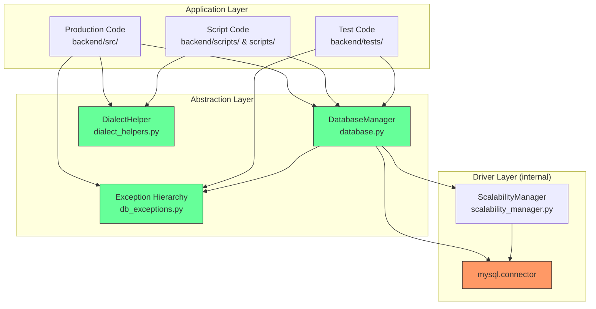
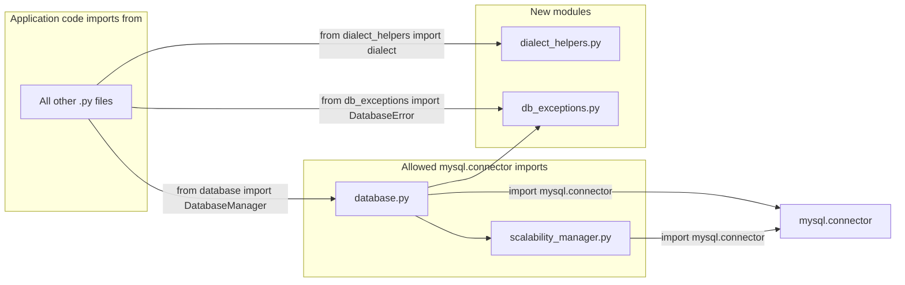
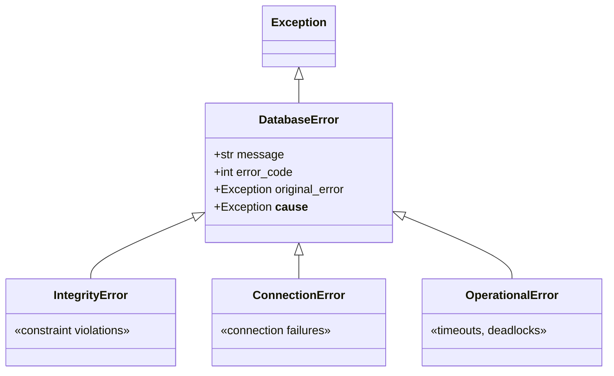
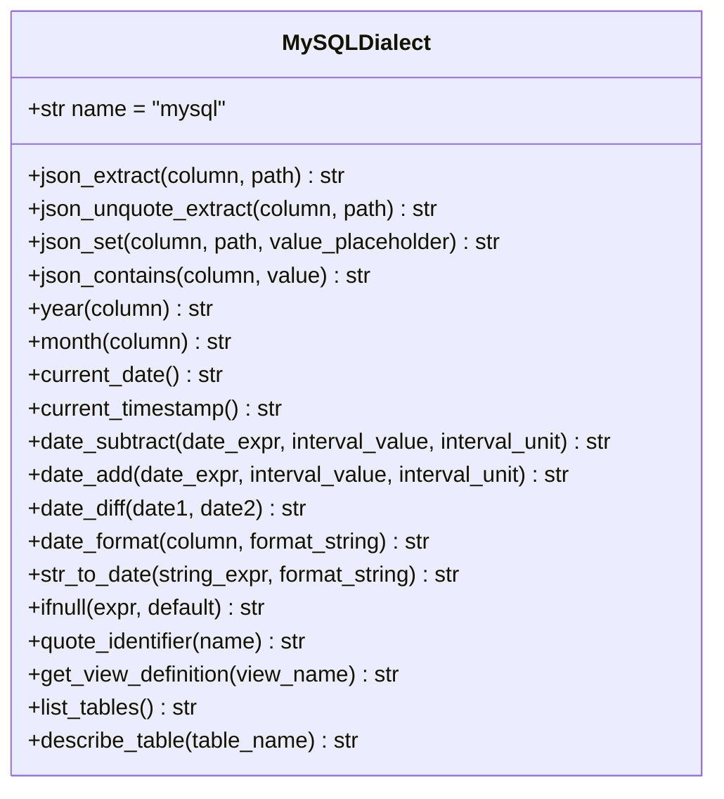

# Design Document: Database Abstraction Layer

## Overview

This design describes the refactoring of the myAdmin codebase to centralize all database access through `DatabaseManager` in `backend/src/database.py`, eliminate direct `mysql.connector` imports from application code, and introduce SQL dialect helpers that make queries database-agnostic.

### Current State

- **Database**: MySQL 8.0 (Docker locally), MySQL 9.4 (Railway production)
- **Driver**: `mysql-connector-python 8.1.0` — no ORM, raw SQL with parameterized queries
- **DatabaseManager** already exists in `backend/src/database.py` with `execute_query()`, `execute_batch_queries()`, `get_connection()`, `get_cursor()`
- **ScalabilityManager** in `backend/src/scalability_manager.py` handles advanced connection pooling (50 connections)
- **~70%** of database calls (857) already go through `DatabaseManager.execute_query()`
- **~30%** of database calls (367) bypass the abstraction via direct `cursor.execute()` or standalone `mysql.connector.connect()`

### Design Goals

1. **Centralize** all `mysql.connector` imports into `database.py` and `scalability_manager.py`
2. **Eliminate** all direct `cursor.execute()` calls and standalone `mysql.connector.connect()` calls outside the abstraction layer
3. **Introduce** SQL dialect helpers for MySQL-specific functions (JSON, date, introspection, identifier quoting)
4. **Wrap** MySQL-specific exceptions in a database-agnostic exception hierarchy
5. **Enforce** the abstraction via CI lint rules
6. **Refactor** every file in the codebase that bypasses the abstraction — production code, scripts, and tests

### Design Principles

- **Backward compatible**: The existing `DatabaseManager` public API remains unchanged
- **Incremental**: Each refactored file is independently deployable
- **Zero regressions**: All existing tests must pass after each refactoring step
- **Minimal surface area**: Only `database.py` and `scalability_manager.py` may import `mysql.connector`

---

## Architecture

### High-Level Architecture



### Module Dependency Flow



````

---

## Components and Interfaces

### Component 1: Database-Agnostic Exception Hierarchy (`backend/src/db_exceptions.py`)

A new module defining exception classes that mirror common database error categories without depending on any specific driver.

```python
"""Database-agnostic exception hierarchy.

All application code should catch these exceptions instead of
mysql.connector.Error or any other driver-specific exception.
"""


class DatabaseError(Exception):
    """Base exception for all database errors."""

    def __init__(self, message: str, error_code: int = None, original_error: Exception = None):
        super().__init__(message)
        self.error_code = error_code
        self.original_error = original_error
        if original_error:
            self.__cause__ = original_error


class IntegrityError(DatabaseError):
    """Raised on constraint violations (unique, foreign key, check)."""
    pass


class ConnectionError(DatabaseError):
    """Raised when a database connection cannot be established or is lost."""
    pass


class OperationalError(DatabaseError):
    """Raised on operational issues (timeout, deadlock, server gone)."""
    pass
````

**Design decisions:**

- Separate file (`db_exceptions.py`) so application code can import exceptions without importing the full DatabaseManager
- `error_code` preserved for cases where application logic branches on specific MySQL error codes (e.g., 1452 for FK violations)
- `__cause__` set automatically so `raise ... from original` chaining works for debugging

### Component 2: SQL Dialect Helpers (`backend/src/dialect_helpers.py`)

A module providing database-agnostic SQL fragment generators. Each function returns a SQL string fragment for the configured dialect. The initial implementation supports MySQL only; adding PostgreSQL later requires implementing the same interface for a different dialect.

```python
"""SQL dialect helpers for database-agnostic query construction.

Usage:
    from dialect_helpers import dialect

    query = f"SELECT {dialect.json_extract('parameters', '$.bank_account')} FROM rekeningschema"
"""


class MySQLDialect:
    """MySQL-specific SQL fragment generators."""

    name = "mysql"

    # --- JSON operations ---

    @staticmethod
    def json_extract(column: str, path: str) -> str:
        """JSON_EXTRACT(column, 'path')"""
        return f"JSON_EXTRACT({column}, '{path}')"

    @staticmethod
    def json_unquote_extract(column: str, path: str) -> str:
        """JSON_UNQUOTE(JSON_EXTRACT(column, 'path'))"""
        return f"JSON_UNQUOTE(JSON_EXTRACT({column}, '{path}'))"

    @staticmethod
    def json_set(column: str, path: str, value_placeholder: str = "%s") -> str:
        """JSON_SET(COALESCE(column, '{}'), 'path', value)"""
        return f"JSON_SET(COALESCE({column}, '{{}}'), '{path}', {value_placeholder})"

    @staticmethod
    def json_contains(column: str, value: str) -> str:
        """JSON_CONTAINS(column, value)"""
        return f"JSON_CONTAINS({column}, {value})"

    # --- Date operations ---

    @staticmethod
    def year(column: str) -> str:
        """YEAR(column)"""
        return f"YEAR({column})"

    @staticmethod
    def month(column: str) -> str:
        """MONTH(column)"""
        return f"MONTH({column})"

    @staticmethod
    def current_date() -> str:
        """CURDATE()"""
        return "CURDATE()"

    @staticmethod
    def current_timestamp() -> str:
        """NOW()"""
        return "NOW()"

    @staticmethod
    def date_subtract(date_expr: str, interval_value: int, interval_unit: str) -> str:
        """DATE_SUB(date_expr, INTERVAL value unit)"""
        return f"DATE_SUB({date_expr}, INTERVAL {interval_value} {interval_unit})"

    @staticmethod
    def date_add(date_expr: str, interval_value: int, interval_unit: str) -> str:
        """DATE_ADD(date_expr, INTERVAL value unit)"""
        return f"DATE_ADD({date_expr}, INTERVAL {interval_value} {interval_unit})"

    @staticmethod
    def date_diff(date1: str, date2: str) -> str:
        """DATEDIFF(date1, date2)"""
        return f"DATEDIFF({date1}, {date2})"

    @staticmethod
    def date_format(column: str, format_string: str) -> str:
        """DATE_FORMAT(column, 'format')"""
        return f"DATE_FORMAT({column}, '{format_string}')"

    @staticmethod
    def str_to_date(string_expr: str, format_string: str) -> str:
        """STR_TO_DATE(string_expr, 'format')"""
        return f"STR_TO_DATE({string_expr}, '{format_string}')"

    # --- Utility functions ---

    @staticmethod
    def ifnull(expr: str, default: str) -> str:
        """IFNULL(expr, default)"""
        return f"IFNULL({expr}, {default})"

    # --- Identifier quoting ---

    @staticmethod
    def quote_identifier(name: str) -> str:
        """Quote an identifier with backticks. Idempotent — already-quoted names are returned as-is."""
        stripped = name.strip('`')
        return f"`{stripped}`"

    # --- Introspection queries ---

    @staticmethod
    def get_view_definition(view_name: str) -> str:
        """Return SQL to get a view's CREATE statement."""
        return f"SHOW CREATE VIEW {view_name}"

    @staticmethod
    def list_tables() -> str:
        """Return SQL to list all tables and views."""
        return "SHOW FULL TABLES"

    @staticmethod
    def describe_table(table_name: str) -> str:
        """Return SQL to describe a table's columns."""
        return f"DESCRIBE {table_name}"


# Module-level singleton — import this in application code
dialect = MySQLDialect()
```

**Design decisions:**

- **Singleton pattern** (`dialect = MySQLDialect()`) — application code imports `dialect` and calls methods directly. Switching to PostgreSQL later means swapping the class behind the singleton.
- **Static methods** — no instance state needed; each method is a pure function from inputs to SQL string.
- **`quote_identifier` is idempotent** — calling it on an already-quoted name strips and re-quotes, producing the same result. This prevents double-quoting bugs.
- **`json_set` uses COALESCE** — matches the existing pattern in `backfill_rekeningschema_flags.py` for NULL-safe JSON updates.
- **No format string validation** — the helpers generate SQL fragments; the database engine validates them at execution time. This keeps the helpers simple and avoids reimplementing SQL parsing.

### Component 3: Enhanced DatabaseManager (`backend/src/database.py`)

The existing `DatabaseManager` is enhanced with:

1. **Transaction context manager** — new `transaction()` method
2. **Exception wrapping** — all `mysql.connector` exceptions caught and re-raised as `db_exceptions` types
3. **DDL execution support** — new `execute_ddl()` method for migration scripts
4. **Re-exported error types** — so application code can `from database import DatabaseError, IntegrityError`

```python
# New additions to database.py

from db_exceptions import (
    DatabaseError, IntegrityError, ConnectionError, OperationalError
)

class DatabaseManager:
    # ... existing code unchanged ...

    @contextmanager
    def transaction(self, pool_type='primary'):
        """Context manager for multi-statement transactions.

        Usage:
            with db.transaction() as (cursor, conn):
                cursor.execute("INSERT ...", params1)
                cursor.execute("UPDATE ...", params2)
            # auto-commits on success, auto-rollbacks on exception
        """
        with self.get_cursor(pool_type=pool_type) as (cursor, conn):
            try:
                yield cursor, conn
                conn.commit()
            except Exception:
                conn.rollback()
                raise

    def execute_ddl(self, statement: str):
        """Execute a DDL statement (CREATE, ALTER, DROP) with auto-commit.

        For migration scripts that need database-specific DDL.
        """
        return self.execute_query(statement, fetch=False, commit=True)

    def execute_query(self, query, params=None, fetch=True, commit=False, pool_type='primary'):
        """Execute query — enhanced with exception wrapping."""
        try:
            # ... existing pool routing logic ...
            with self.get_cursor(pool_type=pool_type) as (cursor, conn):
                cursor.execute(query, params or ())
                if commit:
                    conn.commit()
                    return cursor.lastrowid if cursor.lastrowid else cursor.rowcount
                return cursor.fetchall() if fetch else None
        except mysql.connector.IntegrityError as e:
            raise IntegrityError(
                str(e), error_code=getattr(e, 'errno', None), original_error=e
            ) from e
        except mysql.connector.OperationalError as e:
            raise OperationalError(
                str(e), error_code=getattr(e, 'errno', None), original_error=e
            ) from e
        except mysql.connector.Error as e:
            raise DatabaseError(
                str(e), error_code=getattr(e, 'errno', None), original_error=e
            ) from e
```

**Design decisions:**

- **`transaction()` is separate from `get_cursor()`** — `get_cursor()` remains for single-query operations (backward compatible). `transaction()` adds explicit commit/rollback semantics for multi-statement use.
- **Exception wrapping in `execute_query()`** — the existing FK-violation handling for `IntegrityError` (errno 1452) is preserved inside the new `IntegrityError` wrapper. Application code catching `IntegrityError` still gets the same `ValueError` for FK violations.
- **`execute_ddl()`** is a thin wrapper — it calls `execute_query(fetch=False, commit=True)`. This makes the intent clear in migration scripts.
- **Re-exports** — `from database import DatabaseError, IntegrityError` works so application code doesn't need to know about `db_exceptions.py`.

### Component 4: CI Lint Rule (`backend/scripts/check_db_imports.py`)

A script that scans all Python files and flags any `import mysql.connector` or `from mysql.connector` outside the allowed files.

```python
"""CI lint rule: flag direct mysql.connector imports outside the abstraction layer.

Usage:
    python backend/scripts/check_db_imports.py

Exit code 0 = clean, 1 = violations found.
"""

import ast
import sys
from pathlib import Path

# Configurable allowed files (relative to project root)
ALLOWED_FILES = {
    'backend/src/database.py',
    'backend/src/scalability_manager.py',
}

def check_file(filepath: Path) -> list[str]:
    """Return list of violation messages for a single file."""
    violations = []
    try:
        tree = ast.parse(filepath.read_text(encoding='utf-8'))
    except SyntaxError:
        return violations

    for node in ast.walk(tree):
        if isinstance(node, ast.Import):
            for alias in node.names:
                if alias.name == 'mysql.connector' or alias.name.startswith('mysql.connector.'):
                    violations.append(
                        f"{filepath}:{node.lineno}: direct import '{alias.name}' — "
                        f"use 'from database import DatabaseManager' or "
                        f"'from db_exceptions import DatabaseError' instead"
                    )
        elif isinstance(node, ast.ImportFrom):
            if node.module and (node.module == 'mysql.connector' or node.module.startswith('mysql.connector.')):
                violations.append(
                    f"{filepath}:{node.lineno}: direct import from '{node.module}' — "
                    f"use 'from database import DatabaseManager' or "
                    f"'from db_exceptions import DatabaseError' instead"
                )
    return violations

def main():
    root = Path('.')
    all_violations = []
    for py_file in sorted(root.rglob('*.py')):
        rel = str(py_file.as_posix())
        if rel in ALLOWED_FILES:
            continue
        all_violations.extend(check_file(py_file))

    if all_violations:
        print(f"Found {len(all_violations)} mysql.connector import violation(s):\n")
        for v in all_violations:
            print(f"  ❌ {v}")
        print(f"\nAll database access must go through DatabaseManager (database.py).")
        sys.exit(1)
    else:
        print("✅ No direct mysql.connector imports found outside allowed files.")
        sys.exit(0)

if __name__ == '__main__':
    main()
```

---

## Data Models

No new database tables or schema changes are required. This refactoring is purely at the Python application layer.

### Exception Class Hierarchy



### Dialect Helper Interface



---

## Correctness Properties

_A property is a characteristic or behavior that should hold true across all valid executions of a system — essentially, a formal statement about what the system should do. Properties serve as the bridge between human-readable specifications and machine-verifiable correctness guarantees._

### Property 1: Transaction context manager commits on success and rolls back on failure

_For any_ sequence of valid SQL statements executed within a `transaction()` context manager, if all statements succeed, the transaction SHALL be committed. If any statement raises an exception, the transaction SHALL be rolled back and the exception re-raised.

**Validates: Requirements 2.2**

### Property 2: Error wrapping preserves type, code, and cause

_For any_ `mysql.connector` exception raised during query execution, the DatabaseManager SHALL catch it and re-raise the corresponding database-agnostic exception (`IntegrityError` for `mysql.connector.IntegrityError`, `OperationalError` for `mysql.connector.OperationalError`, `DatabaseError` for all others) with the original error code preserved in `error_code`, the original message preserved in the exception message, and the original exception set as `__cause__`.

**Validates: Requirements 2.5, 7.2, 7.3, 7.5**

### Property 3: JSON dialect helpers produce valid SQL fragments

_For any_ valid SQL column name and valid JSON path string, the dialect helper functions `json_extract`, `json_unquote_extract`, `json_set`, and `json_contains` SHALL each produce a SQL fragment string that contains the input column name and path, and that is structurally valid for the configured dialect.

**Validates: Requirements 4.1, 4.2, 4.3, 4.4, 12.1**

### Property 4: Date and utility dialect helpers produce valid SQL fragments

_For any_ valid column name, interval value (positive integer), interval unit (DAY, MONTH, YEAR), and format string, the dialect helper functions `year`, `month`, `date_subtract`, `date_add`, `date_diff`, `ifnull`, `date_format`, and `str_to_date` SHALL each produce a SQL fragment string that contains the input parameters and is structurally valid for the configured dialect.

**Validates: Requirements 5.1, 5.2, 5.3, 5.4, 5.5, 5.6, 12.2**

### Property 5: Identifier quoting is idempotent

_For any_ valid SQL identifier name, applying `quote_identifier` twice SHALL produce the same result as applying it once: `quote_identifier(quote_identifier(name)) == quote_identifier(name)`.

**Validates: Requirements 6.1, 12.3**

### Property 6: Introspection query generators produce valid SQL containing the target name

_For any_ valid table or view name, the dialect helper functions `get_view_definition`, `describe_table`, and `list_tables` SHALL produce a SQL string that is a valid introspection query for the configured dialect, and (for parameterized functions) the output SHALL contain the input name.

**Validates: Requirements 6.2, 6.3, 6.4**

### Property 7: Connection pool resource management

_For any_ sequence of `get_cursor()` or `transaction()` context manager usages (whether they succeed or raise exceptions), the underlying database connection SHALL be returned to the pool when the context manager exits, preventing connection leaks.

**Validates: Requirements 8.4**

---

## Error Handling

### Exception Mapping Strategy

| MySQL Driver Exception               | Agnostic Exception               | When                                  |
| ------------------------------------ | -------------------------------- | ------------------------------------- |
| `mysql.connector.IntegrityError`     | `db_exceptions.IntegrityError`   | Unique/FK/check constraint violations |
| `mysql.connector.OperationalError`   | `db_exceptions.OperationalError` | Timeouts, deadlocks, server gone      |
| `mysql.connector.InterfaceError`     | `db_exceptions.ConnectionError`  | Connection refused, DNS failure       |
| `mysql.connector.Error` (all others) | `db_exceptions.DatabaseError`    | Catch-all for unclassified errors     |

### Preserving Existing FK Handling

The current `execute_query()` has special handling for `IntegrityError` with errno 1452 (FK constraint violation) that raises `ValueError` with a user-friendly message. This behavior is preserved:

```python
except mysql.connector.IntegrityError as e:
    if e.errno == 1452:
        # Existing FK handling — raise ValueError as before
        msg = str(e)
        if 'fk_mutaties_debet' in msg:
            raise ValueError("Debet account does not exist...") from e
        elif 'fk_mutaties_credit' in msg:
            raise ValueError("Credit account does not exist...") from e
        else:
            raise ValueError(f"Foreign key constraint violation: {msg}") from e
    # All other IntegrityErrors → wrap in agnostic IntegrityError
    raise IntegrityError(str(e), error_code=e.errno, original_error=e) from e
```

### Error Handling in Refactored Files

Files currently catching `mysql.connector.Error` will be updated to catch `DatabaseError`:

```python
# Before (e.g., str_database.py)
except mysql.connector.Error as e:
    return 0

# After
from db_exceptions import DatabaseError
except DatabaseError as e:
    return 0
```

---

## File-by-File Refactoring Inventory

This section provides the complete inventory of every file requiring refactoring, grouped by priority. Each file lists the specific issues found and the refactoring actions needed.

### Priority 1: Production Code (`backend/src/`)

These files serve live application requests and are the highest priority for refactoring.

| #   | File                                                      | Issues                                                                                                                                                                            | Refactoring Actions                                                                                                                                                           |
| --- | --------------------------------------------------------- | --------------------------------------------------------------------------------------------------------------------------------------------------------------------------------- | ----------------------------------------------------------------------------------------------------------------------------------------------------------------------------- |
| 1   | `backend/src/transaction_logic.py`                        | `import mysql.connector`, standalone `mysql.connector.connect()`, own `get_connection()` method                                                                                   | Remove `import mysql.connector`; replace `self.get_connection()` with `DatabaseManager.get_connection()`; use `DatabaseManager` for all queries                               |
| 2   | `backend/src/str_database.py`                             | `import mysql.connector`, 8× `mysql.connector.Error` catches, direct `cursor.execute("DESCRIBE bnb")`                                                                             | Remove `import mysql.connector`; replace all `mysql.connector.Error` with `DatabaseError`; replace `DESCRIBE` with `dialect.describe_table('bnb')`                            |
| 3   | `backend/src/routes/missing_invoices_routes.py`           | `import mysql.connector`, standalone `mysql.connector.connect()` in `get_db_connection()`, direct `cursor.execute()` calls                                                        | Remove `import mysql.connector`; delete `get_db_connection()`; use `DatabaseManager` for all queries                                                                          |
| 4   | `backend/src/business_pricing_model.py`                   | `import mysql.connector` (unused — already uses `DatabaseManager`)                                                                                                                | Remove `import mysql.connector`                                                                                                                                               |
| 5   | `backend/src/services/signup_service.py`                  | `import mysql.connector`, standalone `mysql.connector.connect()` in `_get_connection()`                                                                                           | Remove `import mysql.connector`; replace `_get_connection()` with `DatabaseManager.get_connection()` or a second `DatabaseManager` instance configured for the promo database |
| 6   | `backend/src/validate_pattern/database.py`                | `import mysql.connector`, `from mysql.connector import pooling`, standalone `mysql.connector.connect()`, `mysql.connector.Error` catch — this is a **full copy** of `database.py` | Remove this duplicate file entirely; update all imports in `validate_pattern/` to use the main `DatabaseManager` from `backend/src/database.py`                               |
| 7   | `backend/src/scalability_manager.py`                      | `import mysql.connector`, `from mysql.connector import pooling` — **ALLOWED** (part of abstraction layer)                                                                         | No refactoring needed — this file is part of the abstraction layer                                                                                                            |
| 8   | `backend/src/database.py`                                 | `import mysql.connector`, `from mysql.connector import pooling`, `mysql.connector.IntegrityError`, `mysql.connector.Error` — **ALLOWED** (the abstraction layer itself)           | Enhance with exception wrapping, `transaction()`, `execute_ddl()`, re-exports of `db_exceptions` types. Keep `mysql.connector` imports.                                       |
| 9   | `backend/src/migrate_revolut_ref2.py`                     | `import mysql.connector`, standalone `mysql.connector.connect()`                                                                                                                  | Remove `import mysql.connector`; use `DatabaseManager` for connection                                                                                                         |
| 10  | `backend/src/routes/chart_of_accounts_routes.py`          | `JSON_UNQUOTE(JSON_EXTRACT(...))`, `IFNULL(JSON_EXTRACT(...))` in 3 query locations                                                                                               | Replace with `dialect.json_unquote_extract()`, `dialect.ifnull(dialect.json_extract(...))`                                                                                    |
| 11  | `backend/src/routes/str_routes.py`                        | `DATE_SUB(CURDATE(), ...)`, `YEAR()`, `MONTH()` in multiple queries                                                                                                               | Replace with `dialect.date_subtract(dialect.current_date(), ...)`, `dialect.year()`, `dialect.month()`                                                                        |
| 12  | `backend/src/routes/zzp_routes.py`                        | `JSON_EXTRACT(parameters, ...)`, `DATEDIFF(CURDATE(), ...)`, `CURDATE()`                                                                                                          | Replace with `dialect.json_extract()`, `dialect.date_diff(dialect.current_date(), ...)`                                                                                       |
| 13  | `backend/src/routes/sysadmin_provisioning.py`             | `DATE_ADD(NOW(), INTERVAL ...)`                                                                                                                                                   | Replace with `dialect.date_add(dialect.current_timestamp(), ...)`                                                                                                             |
| 14  | `backend/src/str_channel_routes.py`                       | `JSON_EXTRACT(parameters, '$.str_revenue_account')`                                                                                                                               | Replace with `dialect.json_extract('parameters', '$.str_revenue_account')`                                                                                                    |
| 15  | `backend/src/hybrid_pricing_optimizer.py`                 | `DATE_SUB(CURDATE(), ...)`, `DATE_ADD(...)`, `YEAR()`, `MONTH()` in 6+ queries                                                                                                    | Replace with dialect helper equivalents                                                                                                                                       |
| 16  | `backend/src/services/ai_usage_tracker.py`                | `DATE_SUB(NOW(), INTERVAL ...)` in 2 queries                                                                                                                                      | Replace with `dialect.date_subtract(dialect.current_timestamp(), ...)`                                                                                                        |
| 17  | `backend/src/services/pivot_service.py`                   | `DESCRIBE {data_source}` introspection query                                                                                                                                      | Replace with `dialect.describe_table(data_source)`                                                                                                                            |
| 18  | `backend/src/services/year_end_config.py`                 | `JSON_SET(COALESCE(parameters, '{}'), ...)` in 2 queries                                                                                                                          | Replace with `dialect.json_set('parameters', ...)`                                                                                                                            |
| 19  | `backend/src/services/invoice_service.py`                 | `CURDATE()` in query                                                                                                                                                              | Replace with `dialect.current_date()`                                                                                                                                         |
| 20  | `backend/src/services/zzp_invoice_service.py`             | `CURDATE()` in query                                                                                                                                                              | Replace with `dialect.current_date()`                                                                                                                                         |
| 21  | `backend/src/services/time_tracking_service.py`           | `DATE_FORMAT(entry_date, ...)` in query                                                                                                                                           | Replace with `dialect.date_format('entry_date', ...)`                                                                                                                         |
| 22  | `backend/src/services/pdf_generator_service.py`           | `JSON_UNQUOTE(JSON_EXTRACT(parameters, ...))`                                                                                                                                     | Replace with `dialect.json_unquote_extract('parameters', ...)`                                                                                                                |
| 23  | `backend/src/migrations/backfill_rekeningschema_flags.py` | `JSON_EXTRACT(...)`, `JSON_SET(COALESCE(...))` in 10+ locations                                                                                                                   | Replace with `dialect.json_extract()`, `dialect.json_set()`                                                                                                                   |
| 24  | `backend/src/pattern_analyzer.py`                         | `DATE_SUB(CURDATE(), ...)` in 2 queries                                                                                                                                           | Replace with dialect helper equivalents                                                                                                                                       |
| 25  | `backend/src/validate_pattern/pattern_analyzer_test.py`   | `DATE_SUB(CURDATE(), ...)` in 2 queries                                                                                                                                           | Replace with dialect helper equivalents                                                                                                                                       |
| 26  | `backend/src/duplicate_checker.py`                        | `CURDATE()` in query                                                                                                                                                              | Replace with `dialect.current_date()`                                                                                                                                         |
| 27  | `backend/src/duplicate_query_optimizer.py`                | `CURDATE()` in query                                                                                                                                                              | Replace with `dialect.current_date()`                                                                                                                                         |
| 28  | `backend/src/database_migrations.py`                      | `CURDATE()` in cleanup query                                                                                                                                                      | Replace with `dialect.current_date()`                                                                                                                                         |
| 29  | `backend/src/bnb_cache.py`                                | `YEAR()`, `MONTH()`, `QUARTER()` in query                                                                                                                                         | Replace with dialect helper equivalents                                                                                                                                       |
| 30  | `backend/src/app.py`                                      | `CURDATE()` in query                                                                                                                                                              | Replace with `dialect.current_date()`                                                                                                                                         |
| 31  | `backend/src/error_handlers.py`                           | References `mysql.connector.errors.DatabaseError` and `mysql.connector.errors.InterfaceError` as string keys                                                                      | Update string references to use agnostic exception class names                                                                                                                |
| 32  | `backend/src/reporting_routes.py`                         | `date_format` key in formatting dict (Python-level, not SQL — no change needed)                                                                                                   | No SQL dialect change needed — verify no raw MySQL SQL                                                                                                                        |

### Priority 2: Script Code (`backend/scripts/` and root `scripts/`)

These files are used for migrations, utilities, and maintenance. They run less frequently but still need refactoring for consistency.

| #   | File                                                              | Issues                                                                                                                     | Refactoring Actions                                                                                                                             |
| --- | ----------------------------------------------------------------- | -------------------------------------------------------------------------------------------------------------------------- | ----------------------------------------------------------------------------------------------------------------------------------------------- |
| 33  | `backend/scripts/provision_tenant.py`                             | `import mysql.connector`, 8× standalone `mysql.connector.connect()` calls, direct `cursor.execute()`                       | Remove `import mysql.connector`; create/use `DatabaseManager` instances (one for finance DB, one for promo DB); replace all direct cursor calls |
| 34  | `backend/scripts/migrate_roles_to_db.py`                          | `import mysql.connector`, standalone `mysql.connector.connect()`, direct `cursor.execute()`                                | Remove `import mysql.connector`; use `DatabaseManager`                                                                                          |
| 35  | `backend/scripts/setup_test_database.py`                          | `import mysql.connector`, standalone `mysql.connector.connect()`, `SHOW CREATE VIEW`, `mysql.connector.Error` catch        | Remove `import mysql.connector`; use `DatabaseManager`; replace introspection with dialect helpers                                              |
| 36  | `backend/scripts/run_phase1_migration.py`                         | `import mysql.connector`, `mysql.connector.Error` catch                                                                    | Remove `import mysql.connector`; replace error catch with `DatabaseError`                                                                       |
| 37  | `backend/scripts/migrate_revolut_ref2.py`                         | `import mysql.connector`, standalone `mysql.connector.connect()`, `mysql.connector.Error` catch                            | Remove `import mysql.connector`; use `DatabaseManager`                                                                                          |
| 38  | `backend/scripts/backfill_country.py`                             | `import mysql.connector`, standalone `mysql.connector.connect()`, `executemany`, `mysql.connector.Error` catch             | Remove `import mysql.connector`; use `DatabaseManager`                                                                                          |
| 39  | `backend/scripts/populate_all_countries.py`                       | `import mysql.connector`, standalone `mysql.connector.connect()`, `executemany`, `mysql.connector.Error` catch             | Remove `import mysql.connector`; use `DatabaseManager`                                                                                          |
| 40  | `backend/scripts/create_countries_lookup.py`                      | `import mysql.connector`, standalone `mysql.connector.connect()`, `executemany`, `DESCRIBE`, `mysql.connector.Error` catch | Remove `import mysql.connector`; use `DatabaseManager`; replace `DESCRIBE` with dialect helper                                                  |
| 41  | `backend/scripts/migrate_add_country.py`                          | `import mysql.connector`, standalone `mysql.connector.connect()`, `DESCRIBE`, `mysql.connector.Error` catch                | Remove `import mysql.connector`; use `DatabaseManager`                                                                                          |
| 42  | `backend/scripts/migrate_add_country_name.py`                     | `import mysql.connector`, standalone `mysql.connector.connect()`, `DESCRIBE`, `mysql.connector.Error` catch                | Remove `import mysql.connector`; use `DatabaseManager`                                                                                          |
| 43  | `backend/scripts/generate_country_report.py`                      | `import mysql.connector`, standalone `mysql.connector.connect()`, `mysql.connector.Error` catch                            | Remove `import mysql.connector`; use `DatabaseManager`                                                                                          |
| 44  | `backend/scripts/fix_country_12.py`                               | `import mysql.connector`, standalone `mysql.connector.connect()`, `executemany`                                            | Remove `import mysql.connector`; use `DatabaseManager`                                                                                          |
| 45  | `backend/scripts/debug_country.py`                                | `import mysql.connector`, standalone `mysql.connector.connect()`                                                           | Remove `import mysql.connector`; use `DatabaseManager`                                                                                          |
| 46  | `backend/scripts/verify_country.py`                               | `import mysql.connector`, standalone `mysql.connector.connect()`                                                           | Remove `import mysql.connector`; use `DatabaseManager`                                                                                          |
| 47  | `backend/scripts/test_country_lookup.py`                          | `import mysql.connector`, standalone `mysql.connector.connect()`                                                           | Remove `import mysql.connector`; use `DatabaseManager`                                                                                          |
| 48  | `backend/scripts/maintenance/query_templates.py`                  | `import mysql.connector`, standalone `mysql.connector.connect()` with hardcoded credentials                                | Remove `import mysql.connector`; use `DatabaseManager`; remove hardcoded credentials                                                            |
| 49  | `backend/scripts/database/fix_encoding_duplicate.py`              | `import mysql.connector`, standalone `mysql.connector.connect()`                                                           | Remove `import mysql.connector`; use `DatabaseManager`                                                                                          |
| 50  | `backend/scripts/database/configure_vat_netting.py`               | `JSON_EXTRACT(...)`, `JSON_SET(...)` in queries                                                                            | Replace with dialect helper equivalents                                                                                                         |
| 51  | `backend/scripts/database/test_parameters_column.py`              | `JSON_EXTRACT(...)`, `JSON_CONTAINS(...)`, direct `cursor.execute()`                                                       | Replace with dialect helpers; use `DatabaseManager`                                                                                             |
| 52  | `backend/scripts/database/create_year_closure_tables.py`          | `JSON_EXTRACT(...)` in index creation                                                                                      | Replace with dialect helper equivalent                                                                                                          |
| 53  | `backend/scripts/database/apply_schema_migration.py`              | `JSON_EXTRACT(...)` in index creation                                                                                      | Replace with dialect helper equivalent                                                                                                          |
| 54  | `backend/scripts/database/migrate_opening_balances.py`            | `JSON_CONTAINS(...)` in query                                                                                              | Replace with `dialect.json_contains()`                                                                                                          |
| 55  | `backend/scripts/fix_lookupbankaccounts_view.py`                  | `SHOW CREATE VIEW` in 2 locations                                                                                          | Replace with `dialect.get_view_definition()`                                                                                                    |
| 56  | `backend/scripts/verify_all_views_lowercase.py`                   | `SHOW CREATE VIEW`                                                                                                         | Replace with `dialect.get_view_definition()`                                                                                                    |
| 57  | `backend/scripts/diagnose_mysql_workbench_issue.py`               | `SHOW CREATE VIEW`                                                                                                         | Replace with `dialect.get_view_definition()`                                                                                                    |
| 58  | `backend/scripts/diagnostics/check_account_1022.py`               | `SHOW CREATE VIEW`                                                                                                         | Replace with `dialect.get_view_definition()`                                                                                                    |
| 59  | `backend/scripts/analysis/investigate_account_1022_root_cause.py` | `SHOW CREATE VIEW`                                                                                                         | Replace with `dialect.get_view_definition()`                                                                                                    |
| 60  | `backend/scripts/analysis/analyze_goodwin.py`                     | `import mysql.connector`, standalone `mysql.connector.connect()`                                                           | Remove `import mysql.connector`; use `DatabaseManager`                                                                                          |
| 61  | `backend/scripts/analysis/analyze_mutaties_table.py`              | `import mysql.connector`, standalone `mysql.connector.connect()`                                                           | Remove `import mysql.connector`; use `DatabaseManager`                                                                                          |
| 62  | `backend/scripts/analysis/check_columns.py`                       | `import mysql.connector`, standalone `mysql.connector.connect()`                                                           | Remove `import mysql.connector`; use `DatabaseManager`                                                                                          |
| 63  | `backend/scripts/analysis/debug_account_names.py`                 | `import mysql.connector`, standalone `mysql.connector.connect()`                                                           | Remove `import mysql.connector`; use `DatabaseManager`                                                                                          |
| 64  | `backend/scripts/analysis/debug_check_accounts.py`                | `import mysql.connector`, standalone `mysql.connector.connect()`                                                           | Remove `import mysql.connector`; use `DatabaseManager`                                                                                          |
| 65  | `backend/scripts/analysis/debug_ref4.py`                          | `import mysql.connector`, standalone `mysql.connector.connect()`                                                           | Remove `import mysql.connector`; use `DatabaseManager`                                                                                          |
| 66  | `backend/scripts/analysis/show_duplicates.py`                     | `import mysql.connector`, standalone `mysql.connector.connect()`                                                           | Remove `import mysql.connector`; use `DatabaseManager`                                                                                          |
| 67  | `backend/scripts/data/optimize_pattern_storage.py`                | `DATE_SUB(CURDATE(), ...)` in 4+ queries                                                                                   | Replace with dialect helper equivalents                                                                                                         |
| 68  | `backend/scripts/data/pattern_storage_value_analysis.py`          | `DATE_SUB(CURDATE(), ...)`                                                                                                 | Replace with dialect helper equivalents                                                                                                         |
| 69  | `backend/scripts/data/aggressive_pattern_optimization.py`         | `DATE_SUB(CURDATE(), ...)` in 5+ queries                                                                                   | Replace with dialect helper equivalents                                                                                                         |
| 70  | `backend/scripts/database/consolidate_database_views.py`          | `DATE_SUB(CURDATE(), ...)`                                                                                                 | Replace with dialect helper equivalents                                                                                                         |
| 71  | `backend/scripts/check_str_invoice_tenant_filtering.py`           | `DATE_SUB(CURDATE(), ...)`, `CURDATE()`                                                                                    | Replace with dialect helper equivalents                                                                                                         |
| 72  | `backend/scripts/maintenance/fix_checkout_dates.py`               | `DATE_ADD(checkinDate, INTERVAL ...)`                                                                                      | Replace with `dialect.date_add()`                                                                                                               |
| 73  | `backend/scripts/database/check_view_names.py`                    | `SHOW FULL TABLES WHERE Table_type = "VIEW"`                                                                               | Replace with `dialect.list_tables()`                                                                                                            |
| 74  | `backend/scripts/check_year_end_setup.py`                         | `DESCRIBE year_closure_status`                                                                                             | Replace with `dialect.describe_table()`                                                                                                         |
| 75  | `backend/scripts/verify_ai_usage_log_table.py`                    | `DESCRIBE ai_usage_log`                                                                                                    | Replace with `dialect.describe_table()`                                                                                                         |
| 76  | `backend/scripts/verify_template_validation_log_table.py`         | `DESCRIBE template_validation_log`                                                                                         | Replace with `dialect.describe_table()`                                                                                                         |
| 77  | `backend/scripts/database/apply_pattern_migrations.py`            | `DESCRIBE pattern_analysis_metadata`, `DESCRIBE pattern_verb_patterns`                                                     | Replace with `dialect.describe_table()`                                                                                                         |
| 78  | `backend/scripts/diagnostics/check_myadmin_module.py`             | `DESCRIBE tenant_modules`, direct `cursor.execute()`                                                                       | Replace with `dialect.describe_table()`; use `DatabaseManager`                                                                                  |
| 79  | `backend/scripts/create_ai_usage_log_table.py`                    | References to `SHOW`/`DESCRIBE` in string checks                                                                           | Update string checks if needed                                                                                                                  |
| 80  | `scripts/deployment/update_ref3_from_csv.py`                      | `import mysql.connector`, standalone `mysql.connector.connect()`, direct `cursor.execute()`                                | Remove `import mysql.connector`; use `DatabaseManager`                                                                                          |
| 81  | `scripts/deployment/update_database_with_urls.py`                 | `import mysql.connector`, standalone `mysql.connector.connect()`, direct `cursor.execute()`                                | Remove `import mysql.connector`; use `DatabaseManager`                                                                                          |
| 82  | `scripts/deployment/fix_duplicate_rows.py`                        | `import mysql.connector`, standalone `mysql.connector.connect()`, 7× direct `cursor.execute()`                             | Remove `import mysql.connector`; use `DatabaseManager` with `transaction()`                                                                     |
| 83  | `scripts/templates/migrate_template_versioning.py`                | `DESCRIBE tenant_template_config`                                                                                          | Replace with `dialect.describe_table()`                                                                                                         |
| 84  | `scripts/check_template_schema.py`                                | `DESCRIBE tenant_template_config`                                                                                          | Replace with `dialect.describe_table()`                                                                                                         |

### Priority 3: Test Code (`backend/tests/`)

Test files need to use the abstraction for mocking and error type imports.

| #   | File                                                         | Issues                                                                                | Refactoring Actions                                                                            |
| --- | ------------------------------------------------------------ | ------------------------------------------------------------------------------------- | ---------------------------------------------------------------------------------------------- |
| 85  | `backend/tests/conftest.py`                                  | `import mysql.connector`                                                              | Remove `import mysql.connector`; import error types from `db_exceptions`                       |
| 86  | `backend/tests/unit/test_error_handling_robustness.py`       | `import mysql.connector`, `from mysql.connector import Error as MySQLError`           | Replace with `from db_exceptions import DatabaseError`                                         |
| 87  | `backend/tests/unit/test_transaction_logic.py`               | `import mysql.connector`, `mysql.connector.Error` in assertions and side_effect       | Replace with `DatabaseError` from `db_exceptions`                                              |
| 88  | `backend/tests/database/test_database.py`                    | `import mysql.connector`, `mysql.connector.Error` in assertions and side_effect       | Replace with `DatabaseError` from `db_exceptions`                                              |
| 89  | `backend/tests/database/check_mutaties_structure.py`         | `import mysql.connector`, standalone `mysql.connector.connect()`, `DESCRIBE mutaties` | Remove `import mysql.connector`; use `DatabaseManager`; replace `DESCRIBE` with dialect helper |
| 90  | `backend/tests/database/check_databases.py`                  | `import mysql.connector`, standalone `mysql.connector.connect()`                      | Remove `import mysql.connector`; use `DatabaseManager`                                         |
| 91  | `backend/tests/database/test_vw_bnb_total.py`                | `SHOW FULL TABLES`, `DESCRIBE vw_bnb_total`, direct `cursor.execute()`                | Replace introspection with dialect helpers; use `DatabaseManager`                              |
| 92  | `backend/tests/api/test_payout_api.py`                       | Direct `cursor.execute()` for test setup/teardown                                     | Use `DatabaseManager` for test data management                                                 |
| 93  | `backend/tests/integration/test_migration_integration.py`    | Direct `cursor.execute()` for test setup/teardown (10+ calls)                         | Use `DatabaseManager` with `transaction()` for test data management                            |
| 94  | `backend/tests/integration/test_tenant_credentials_table.py` | `DESCRIBE tenant_credentials`                                                         | Replace with `dialect.describe_table()`                                                        |
| 95  | `backend/tests/patterns/test_pattern_storage_complete.py`    | `DESCRIBE {table}`                                                                    | Replace with `dialect.describe_table()`                                                        |
| 96  | `backend/tests/manual/test_railway_connection.py`            | `SHOW FULL TABLES`                                                                    | Replace with `dialect.list_tables()`                                                           |

### Refactoring Summary

| Category                                      | Files        | Direct Imports | Standalone Connections | Direct Cursor Calls | MySQL-Specific SQL |
| --------------------------------------------- | ------------ | -------------- | ---------------------- | ------------------- | ------------------ |
| Production Code (`backend/src/`)              | 32 files     | 7 files        | 5 files                | ~134 calls          | ~25 files          |
| Script Code (`backend/scripts/` + `scripts/`) | 52 files     | 22 files       | 37 calls               | ~145 calls          | ~20 files          |
| Test Code (`backend/tests/`)                  | 12 files     | 5 files        | 2 files                | ~21 calls           | ~5 files           |
| **Total**                                     | **96 files** | **34 files**   | **44 calls**           | **~300 calls**      | **~50 files**      |

**Note:** Some files appear in multiple issue categories (e.g., a file may have both a direct import AND MySQL-specific SQL). The file count above is deduplicated per category.

---

## Testing Strategy

### Dual Testing Approach

This feature uses both unit tests and property-based tests for comprehensive coverage.

#### Property-Based Tests (Hypothesis)

Property-based testing is appropriate for this feature because the dialect helpers are **pure functions** with clear input/output behavior and a large input space (arbitrary column names, paths, format strings, identifiers). The error wrapping logic also has a clear mapping from any MySQL error type to the corresponding agnostic exception.

**Library**: [Hypothesis](https://hypothesis.readthedocs.io/) (already used in the project)

**Configuration**: Minimum 100 iterations per property test.

**Tag format**: `Feature: database-abstraction-layer, Property {number}: {property_text}`

Each correctness property maps to a single property-based test:

| Property                                        | Test File                      | What It Tests                                                                                            |
| ----------------------------------------------- | ------------------------------ | -------------------------------------------------------------------------------------------------------- |
| Property 1: Transaction commit/rollback         | `test_database_abstraction.py` | Mock-based: verify commit on success, rollback on exception for random query sequences                   |
| Property 2: Error wrapping                      | `test_database_abstraction.py` | Generate random MySQL error types/codes/messages, verify correct agnostic exception with preserved cause |
| Property 3: JSON dialect helpers                | `test_dialect_helpers.py`      | Generate random column names and JSON paths, verify output contains inputs and is structurally valid     |
| Property 4: Date/utility dialect helpers        | `test_dialect_helpers.py`      | Generate random columns, intervals, units, formats, verify output contains inputs                        |
| Property 5: Identifier quoting idempotence      | `test_dialect_helpers.py`      | Generate random identifier names, verify `f(f(x)) == f(x)`                                               |
| Property 6: Introspection query generators      | `test_dialect_helpers.py`      | Generate random table/view names, verify output contains the name                                        |
| Property 7: Connection pool resource management | `test_database_abstraction.py` | Mock-based: verify connection.close() called on both success and exception paths                         |

#### Unit Tests (pytest)

Unit tests cover specific examples, edge cases, and integration points:

- **Exception hierarchy**: Verify class inheritance, `error_code` attribute, `__cause__` chaining
- **DDL execution**: Verify `execute_ddl()` calls `execute_query(fetch=False, commit=True)`
- **Backward compatibility**: Verify `execute_query`, `execute_batch_queries`, `get_connection`, `get_cursor` signatures unchanged
- **CI lint rule**: Verify it catches violations and passes for clean files
- **Dialect helper edge cases**: Empty strings, special characters in identifiers, deeply nested JSON paths

#### Integration Tests

- **Existing test suite**: Run the full `pytest` suite after each refactoring batch to verify zero regressions
- **MySQL 8.0 + 9.4 compatibility**: Run tests against both MySQL versions in CI

#### Refactoring Verification

After each file is refactored:

1. Run `python backend/scripts/check_db_imports.py` to verify no remaining direct imports
2. Run the file's existing tests (if any) to verify behavior preservation
3. Run the full test suite to verify no regressions

### Test File Organization

```
backend/tests/
├── unit/
│   ├── test_dialect_helpers.py          # Property tests for dialect helpers (Properties 3-6)
│   ├── test_database_abstraction.py     # Property tests for DatabaseManager enhancements (Properties 1, 2, 7)
│   └── test_db_exceptions.py            # Unit tests for exception hierarchy
├── integration/
│   └── (existing test files — run for regression verification)
└── ...
```
