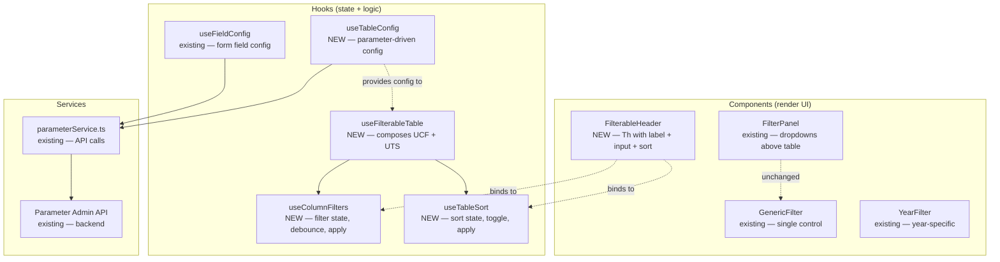
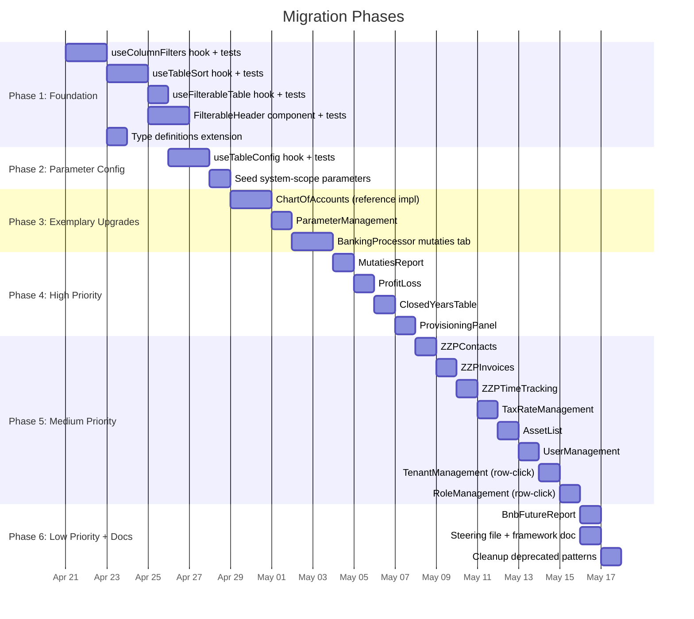

# Design Document: Table Filter Framework v2

## Overview

The Table Filter Framework v2 extends the existing generic filter framework (`FilterPanel`, `GenericFilter`, `YearFilter`) with three new hooks and one new component to eliminate ~590 lines of duplicated boilerplate across 12+ table components. The design follows a **hybrid approach**: text search filters live inside column headers via `FilterableHeader` for direct visual association, while dropdown and multi-select filters remain above the table in `FilterPanel`.

For three complex CRUD tables (ChartOfAccounts, ParameterManagement, BankingProcessor), a parameter-driven `useTableConfig` hook reads column visibility and filter configuration from the existing parameter system — following the same pattern as `useFieldConfig` for form fields.

### Key Design Decisions

| Decision                | Choice                                                            | Rationale                                                                                     |
| ----------------------- | ----------------------------------------------------------------- | --------------------------------------------------------------------------------------------- |
| Filter placement        | Hybrid: text in headers, dropdowns above                          | Text search has direct column association; dropdowns need space and may span multiple columns |
| State management        | Custom hooks (not context)                                        | Filter/sort state is local to each table, not shared globally                                 |
| Debounce strategy       | `setTimeout` in hook with configurable delay                      | Simple, no external dependency; 150ms default matches existing pattern                        |
| Parameter-driven config | Only for 3 complex tables                                         | Simple tables don't benefit from runtime configurability; hardcoded config is simpler         |
| PBT library             | fast-check 4.4.0                                                  | Already in project dependencies per tech stack                                                |
| Hook composition        | `useFilterableTable` composes `useColumnFilters` + `useTableSort` | Single hook call for components that need both; individual hooks available for simpler cases  |

## Architecture

The framework has three layers: utility-level pure functions, hooks for state management, and components for rendering.



````

### Data Flow: Hybrid Filtering in a Typical Component

```mermaid
sequenceDiagram
    participant Page as Page Component
    participant UTC as useTableConfig
    participant UFT as useFilterableTable
    participant FP as FilterPanel
    participant FH as FilterableHeader
    participant Table as Chakra Table

    Page->>UTC: useTableConfig('chart_of_accounts')
    UTC-->>Page: { columns, filterableColumns, defaultSort, pageSize }
    Page->>UFT: useFilterableTable(data, { initialFilters, defaultSort })
    UFT-->>Page: { filters, setFilter, handleSort, processedData, ... }
    Page->>FP: Render dropdown filters above table
    Page->>FH: Render column headers with text filters
    FH->>UFT: setFilter(key, value) on input change
    FH->>UFT: handleSort(field) on sort click
    UFT-->>Page: Updated processedData (filtered + sorted)
    Page->>Table: Render processedData rows
````

## Components and Interfaces

### 1. useColumnFilters Hook

Manages column filter state with debounce and case-insensitive substring matching. Replaces the ~25-line boilerplate pattern found in 6+ components.

Location: `frontend/src/hooks/useColumnFilters.ts`

```typescript
interface UseColumnFiltersOptions {
  /** Debounce delay in milliseconds (default: 150) */
  debounceMs?: number;
}

interface UseColumnFiltersReturn<T> {
  /** Current filter values keyed by column name */
  filters: Record<string, string>;
  /** Set a single filter value */
  setFilter: (key: string, value: string) => void;
  /** Reset all filters to empty strings */
  resetFilters: () => void;
  /** Data array after applying all active filters */
  filteredData: T[];
  /** True if any filter has a non-empty value */
  hasActiveFilters: boolean;
}

function useColumnFilters<T extends Record<string, any>>(
  data: T[],
  initialFilters: Record<string, string>,
  options?: UseColumnFiltersOptions,
): UseColumnFiltersReturn<T>;
```

**Internal behavior:**

1. `filters` state initialized from `initialFilters` keys, all values empty strings
2. On `setFilter(key, value)`, update `filters[key]` immediately (for input binding)
3. Start a `setTimeout` of `debounceMs` (default 150ms) before applying the filter to data
4. `filteredData` is computed by iterating `data` and for each row, checking every non-empty filter: if the filter key exists on the row, the row's field value (converted to string, lowercased) must contain the filter value (lowercased). If the filter key does not exist on the row, the filter passes (row is not excluded).
5. `resetFilters` sets all filter values to `''` and `filteredData` returns to the full `data` array
6. `hasActiveFilters` is `true` when any filter value is non-empty

### 2. useTableSort Hook

Manages sort field, direction toggle, and applies sorting. Replaces the ~15-line sort boilerplate found in 7+ components.

Location: `frontend/src/hooks/useTableSort.ts`

```typescript
type SortDirection = "asc" | "desc";

interface UseTableSortReturn<T> {
  /** Currently active sort field, or null if no sort */
  sortField: string | null;
  /** Current sort direction */
  sortDirection: SortDirection;
  /** Toggle sort on a field (same field = flip direction, new field = asc) */
  handleSort: (field: string) => void;
  /** Data array after applying sort */
  sortedData: T[];
  /** Returns '↑', '↓', or '' for a given field */
  getSortIndicator: (field: string) => string;
}

function useTableSort<T extends Record<string, any>>(
  data: T[],
  defaultField?: string,
  defaultDirection?: SortDirection,
): UseTableSortReturn<T>;
```

**Internal behavior:**

1. `sortField` initialized to `defaultField` or `null`; `sortDirection` to `defaultDirection` or `'asc'`
2. `handleSort(field)`: if `field === sortField`, toggle direction; otherwise set `sortField = field`, `sortDirection = 'asc'`
3. `sortedData` computed via `useMemo`: if no `sortField`, return `data` as-is. Otherwise sort a copy of `data` by comparing `a[sortField]` vs `b[sortField]`:
   - Both values are numbers → numeric comparison
   - Otherwise → `String(a).localeCompare(String(b), undefined, { sensitivity: 'base' })` for case-insensitive string sort
   - Direction applied by multiplying comparator result by `1` (asc) or `-1` (desc)
   - `null`/`undefined` values sort to the end
4. `getSortIndicator(field)`: returns `'↑'` if `field === sortField && direction === 'asc'`, `'↓'` if `field === sortField && direction === 'desc'`, `''` otherwise

### 3. useFilterableTable Hook

Composes `useColumnFilters` and `useTableSort` into a single interface. For components that need both filtering and sorting.

Location: `frontend/src/hooks/useFilterableTable.ts`

```typescript
interface UseFilterableTableConfig {
  /** Initial filter keys and empty values */
  initialFilters: Record<string, string>;
  /** Optional default sort configuration */
  defaultSort?: { field: string; direction: SortDirection };
  /** Optional debounce delay in milliseconds */
  debounceMs?: number;
}

interface UseFilterableTableReturn<T> {
  // From useColumnFilters
  filters: Record<string, string>;
  setFilter: (key: string, value: string) => void;
  resetFilters: () => void;
  hasActiveFilters: boolean;
  // From useTableSort
  sortField: string | null;
  sortDirection: SortDirection;
  handleSort: (field: string) => void;
  getSortIndicator: (field: string) => string;
  // Combined result
  processedData: T[];
}

function useFilterableTable<T extends Record<string, any>>(
  data: T[],
  config: UseFilterableTableConfig,
): UseFilterableTableReturn<T>;
```

**Internal behavior:**

1. Calls `useColumnFilters(data, config.initialFilters, { debounceMs: config.debounceMs })`
2. Calls `useTableSort(filteredData, config.defaultSort?.field, config.defaultSort?.direction)` — note: sort operates on the **filtered** output, not the original data
3. `processedData` is the `sortedData` from `useTableSort` (which received `filteredData` as input)
4. All properties from both hooks are spread into the return object

### 4. FilterableHeader Component

Renders a `<Th>` element with a column label, optional sort indicator, and optional text filter input. Replaces the repeated `<Th><Input .../></Th>` pattern found in 3 files (up to 13 columns each).

Location: `frontend/src/components/filters/FilterableHeader.tsx`

```typescript
interface FilterableHeaderProps {
  /** Column label text */
  label: string;
  /** Current filter value (omit to disable filter input) */
  filterValue?: string;
  /** Callback when filter value changes */
  onFilterChange?: (value: string) => void;
  /** Enable sort indicator (default: false) */
  sortable?: boolean;
  /** Current sort direction for this column (null = not active) */
  sortDirection?: "asc" | "desc" | null;
  /** Callback when sort is toggled */
  onSort?: () => void;
  /** Placeholder text for filter input */
  placeholder?: string;
  /** Right-align for numeric columns */
  isNumeric?: boolean;
}
```

**Rendering structure:**

```tsx
<Th
  bg="gray.700"
  aria-sort={
    sortable
      ? sortDirection === "asc"
        ? "ascending"
        : sortDirection === "desc"
          ? "descending"
          : "none"
      : undefined
  }
  isNumeric={isNumeric}
>
  <VStack spacing={1} align={isNumeric ? "flex-end" : "flex-start"}>
    {/* Label row with optional sort indicator */}
    <HStack
      spacing={1}
      cursor={sortable ? "pointer" : "default"}
      onClick={sortable ? onSort : undefined}
      role={sortable ? "button" : undefined}
      aria-label={sortable ? `Sort by ${label}` : undefined}
    >
      <Text
        fontSize="xs"
        color="gray.300"
        fontWeight="bold"
        textTransform="uppercase"
      >
        {label}
      </Text>
      {sortable && sortDirection && (
        <Text fontSize="xs" color="orange.300">
          {sortDirection === "asc" ? "↑" : "↓"}
        </Text>
      )}
    </HStack>
    {/* Optional filter input */}
    {filterValue !== undefined && (
      <Input
        size="xs"
        value={filterValue}
        onChange={(e) => onFilterChange?.(e.target.value)}
        placeholder={placeholder || "Filter..."}
        bg="gray.600"
        color="white"
        aria-label={`Filter by ${label}`}
        autoComplete="off"
        autoCorrect="off"
        autoCapitalize="off"
        spellCheck={false}
      />
    )}
  </VStack>
</Th>
```

### 5. useTableConfig Hook

Reads table column configuration from the parameter system for complex CRUD tables. Follows the same pattern as `useFieldConfig` for form fields.

Location: `frontend/src/hooks/useTableConfig.ts`

**Scope:** Only for ChartOfAccounts (`chart_of_accounts`), ParameterManagement (`parameters`), and BankingProcessor mutaties tab (`banking_mutaties`).

```typescript
interface TableConfig {
  /** Ordered array of visible column keys */
  columns: string[];
  /** Column keys that get a FilterableHeader filter input */
  filterableColumns: string[];
  /** Default sort configuration */
  defaultSort: { field: string; direction: SortDirection };
  /** Number of rows per page */
  pageSize: number;
  /** Loading state */
  loading: boolean;
  /** Error message, if any */
  error: string | null;
}

type TableEntity = "chart_of_accounts" | "parameters" | "banking_mutaties";

function useTableConfig(entity: TableEntity): TableConfig;
```

**Internal behavior:**

1. Calls `getParameters('ui.tables')` from `parameterService.ts` on mount
2. Looks for keys: `{entity}.columns`, `{entity}.filterable_columns`, `{entity}.default_sort`, `{entity}.page_size`
3. If parameters exist (at any scope — the ParameterService handles scope inheritance), parse JSON values
4. If no parameters exist, fall back to hardcoded defaults:

```typescript
const DEFAULTS: Record<TableEntity, Omit<TableConfig, "loading" | "error">> = {
  chart_of_accounts: {
    columns: [
      "Account",
      "AccountName",
      "AccountLookup",
      "SubParent",
      "Parent",
      "VW",
      "Belastingaangifte",
      "parameters",
    ],
    filterableColumns: [
      "Account",
      "AccountName",
      "AccountLookup",
      "SubParent",
      "Parent",
      "VW",
      "Belastingaangifte",
      "parameters",
    ],
    defaultSort: { field: "Account", direction: "asc" },
    pageSize: 1000,
  },
  parameters: {
    columns: ["namespace", "key", "value", "value_type", "scope_origin"],
    filterableColumns: [
      "namespace",
      "key",
      "value",
      "value_type",
      "scope_origin",
    ],
    defaultSort: { field: "namespace", direction: "asc" },
    pageSize: 100,
  },
  banking_mutaties: {
    columns: [
      "ID",
      "TransactionNumber",
      "TransactionDate",
      "Amount",
      "Account",
      "CounterAccount",
      "CounterName",
      "Description",
      "Reference",
      "Category",
      "Status",
      "FileName",
      "LedgerAccount",
    ],
    filterableColumns: [
      "ID",
      "TransactionNumber",
      "TransactionDate",
      "Amount",
      "Account",
      "CounterAccount",
      "CounterName",
      "Description",
      "Reference",
      "Category",
      "Status",
      "FileName",
      "LedgerAccount",
    ],
    defaultSort: { field: "TransactionDate", direction: "desc" },
    pageSize: 100,
  },
};
```

5. Returns defaults while loading; logs errors without breaking table rendering
6. Integrates with `useFilterableTable` by providing `initialFilters` (derived from `filterableColumns` — each key mapped to `''`) and `defaultSort`

**Parameter format in the database:**

```json
// namespace: "ui.tables", key: "chart_of_accounts.columns", value_type: "json"
["Account", "AccountName", "AccountLookup", "SubParent", "Parent", "VW", "Belastingaangifte", "parameters"]

// namespace: "ui.tables", key: "chart_of_accounts.default_sort", value_type: "json"
{"field": "Account", "direction": "asc"}

// namespace: "ui.tables", key: "chart_of_accounts.page_size", value_type: "number"
1000
```

### 6. Type Definitions Extension

Location: `frontend/src/components/filters/types.ts` (extend existing file)

```typescript
// --- New types for v2 framework ---

/** Column filter state: maps column keys to filter strings */
export type ColumnFilterState = Record<string, string>;

/** Sort direction */
export type SortDirection = "asc" | "desc";

/** Sort configuration */
export interface SortConfig {
  field: string;
  direction: SortDirection;
}

/** Props for the FilterableHeader component */
export interface FilterableHeaderProps {
  label: string;
  filterValue?: string;
  onFilterChange?: (value: string) => void;
  sortable?: boolean;
  sortDirection?: SortDirection | null;
  onSort?: () => void;
  placeholder?: string;
  isNumeric?: boolean;
}

/** Options for useColumnFilters hook */
export interface UseColumnFiltersOptions {
  debounceMs?: number;
}
```

## Data Models

No new database tables are required. The framework uses the existing `parameters` table for `useTableConfig` configuration.

### Parameter Seed Data (Tenant Defaults)

The following tenant-scope parameters are seeded per tenant during deployment for the three target tables. The `@tenant_id` variable must be set before running the seed script (e.g., `SET @tenant_id = 'GoodwinSolutions';`). The `useTableConfig` hook has hardcoded defaults as fallback when no parameters exist at any scope, so the seed is optional but makes the defaults visible and editable in the ParameterManagement UI.

```sql
-- Example for ChartOfAccounts (all 3 tables follow the same pattern)
SET @tenant_id = 'GoodwinSolutions';

INSERT INTO parameters (scope, scope_id, namespace, `key`, value, value_type, is_secret, created_by) VALUES
('tenant', @tenant_id, 'ui.tables', 'chart_of_accounts.columns', '["Account","AccountName","AccountLookup","SubParent","Parent","VW","Belastingaangifte","parameters"]', 'json', FALSE, 'system'),
('tenant', @tenant_id, 'ui.tables', 'chart_of_accounts.filterable_columns', '["Account","AccountName","AccountLookup","SubParent","Parent","VW","Belastingaangifte","parameters"]', 'json', FALSE, 'system'),
('tenant', @tenant_id, 'ui.tables', 'chart_of_accounts.default_sort', '{"field":"Account","direction":"asc"}', 'json', FALSE, 'system'),
('tenant', @tenant_id, 'ui.tables', 'chart_of_accounts.page_size', '1000', 'number', FALSE, 'system')
ON DUPLICATE KEY UPDATE value = VALUES(value);
```

### Tenant Customization

A tenant admin can edit any table config parameter directly via the ParameterManagement UI (row-click opens the edit modal). For example, hiding the "parameters" column from ChartOfAccounts:

```json
// namespace: "ui.tables", key: "chart_of_accounts.columns", scope: "tenant"
[
  "Account",
  "AccountName",
  "AccountLookup",
  "SubParent",
  "Parent",
  "VW",
  "Belastingaangifte"
]
```

The `useTableConfig` hook picks this up on next page load.

## Correctness Properties

_A property is a characteristic or behavior that should hold true across all valid executions of a system — essentially, a formal statement about what the system should do. Properties serve as the bridge between human-readable specifications and machine-verifiable correctness guarantees._

### Property 1: Filter Correctness

_For any_ data array of objects and _for any_ set of column filter strings, the `useColumnFilters` filtered output SHALL contain exactly those rows where every active filter key either (a) does not exist as a field on the row, or (b) the row's field value, converted to a lowercase string, contains the filter value as a lowercase substring. No rows matching these criteria shall be excluded, and no rows failing these criteria shall be included.

**Validates: Requirements 1.4, 1.5**

### Property 2: Filter Reset Round-Trip

_For any_ data array and _for any_ set of active filter values, calling `resetFilters` and then reading `filteredData` SHALL return an array identical to the original unfiltered data array (same elements, same order).

**Validates: Requirements 1.6, 12.6**

### Property 3: Sort State Determinism

_For any_ current sort state (field and direction) and _for any_ field name passed to `handleSort`: if the field matches the current sort field, the direction SHALL toggle (asc→desc, desc→asc); if the field differs, the sort field SHALL change and direction SHALL reset to `'asc'`. The `getSortIndicator` function SHALL return `'↑'` when the queried field is the active field with ascending direction, `'↓'` for descending, and `''` for any non-active field.

**Validates: Requirements 2.3, 2.4, 2.5**

### Property 4: Sort Ordering Correctness

_For any_ data array and _for any_ sort field and direction, the `sortedData` output SHALL be correctly ordered: for every consecutive pair of elements `(a, b)`, the comparison of `a[sortField]` and `b[sortField]` SHALL respect the direction. String comparisons SHALL be case-insensitive. Numeric comparisons SHALL be numeric. Null/undefined values SHALL sort to the end regardless of direction.

**Validates: Requirements 2.6**

### Property 5: Filter-Then-Sort Confluence

_For any_ data array, _for any_ filter configuration, and _for any_ sort configuration, the `processedData` output of `useFilterableTable` SHALL be identical to independently filtering the data with `useColumnFilters` and then sorting that filtered result with `useTableSort`. The order of operations (filter first, then sort) is invariant.

**Validates: Requirements 3.3, 3.4, 12.5**

### Property 6: Accessibility Label Propagation

_For any_ non-empty label string, the `FilterableHeader` component SHALL render an `aria-label` attribute on the filter input containing the label text, and when sorting is enabled, SHALL render a valid `aria-sort` attribute on the `<Th>` element matching the current sort direction.

**Validates: Requirements 4.8**

### Property 7: Default Config Robustness

_For any_ valid entity name in the `TableEntity` union, the `useTableConfig` hook SHALL return a `TableConfig` object with non-empty `columns` array, non-empty `filterableColumns` array, a valid `defaultSort` with non-empty `field` and valid `direction`, and a positive `pageSize` — even when the parameter API returns no data or an error.

**Validates: Requirements 6.4, 6.10**

## Error Handling

### useColumnFilters

| Scenario                          | Behavior                                                         |
| --------------------------------- | ---------------------------------------------------------------- |
| Empty data array                  | Return empty `filteredData`, all filters functional              |
| Filter key not on data objects    | Treat as passing — row not excluded (see Property 1)             |
| Data changes while filters active | Re-apply filters to new data on next debounce cycle              |
| Non-string field values           | Convert to string via `String(value)` before matching            |
| Null/undefined field values       | Convert to `''` — filter won't match unless filter is also empty |

### useTableSort

| Scenario                            | Behavior                                             |
| ----------------------------------- | ---------------------------------------------------- |
| Empty data array                    | Return empty `sortedData`                            |
| No sort field set                   | Return data in original order                        |
| Null/undefined values in sort field | Sort to end of array regardless of direction         |
| Mixed types in sort field           | Treat as strings (fallback to `String()` comparison) |
| Data changes while sort active      | Re-sort new data with current field/direction        |

### useFilterableTable

| Scenario                     | Behavior                                                           |
| ---------------------------- | ------------------------------------------------------------------ |
| Empty config.initialFilters  | No filters applied, sort still works                               |
| Missing defaultSort          | No initial sort, data in original order until user clicks a header |
| Data array reference changes | Both filter and sort recompute                                     |

### useTableConfig

| Scenario                                                     | Behavior                                                                                  |
| ------------------------------------------------------------ | ----------------------------------------------------------------------------------------- |
| Parameter API unreachable                                    | Return hardcoded defaults, set `error` message, `loading: false`                          |
| Invalid JSON in parameter value                              | Log warning, fall back to hardcoded default for that key                                  |
| Unknown entity name                                          | TypeScript prevents this at compile time (union type)                                     |
| Parameter API slow                                           | Return hardcoded defaults immediately while `loading: true`, update when response arrives |
| Partial parameter override (e.g., only `columns` overridden) | Merge with defaults — overridden keys from API, remaining keys from hardcoded defaults    |

### FilterableHeader

| Scenario              | Behavior                                          |
| --------------------- | ------------------------------------------------- |
| No `filterValue` prop | Filter input not rendered (label-only header)     |
| No `onSort` prop      | Sort indicator not rendered, header not clickable |
| Very long label text  | Text truncates with CSS (no wrapping in header)   |
| Empty filter value    | Input shows placeholder text                      |

## Testing Strategy

### Dual Testing Approach

The framework uses both unit tests and property-based tests for comprehensive coverage:

- **Unit tests** (Jest + React Testing Library): Verify specific examples, edge cases, component rendering, event handling, and accessibility attributes
- **Property-based tests** (fast-check 4.4.0): Verify universal properties across randomly generated inputs with minimum 100 iterations per property

### Unit Tests

**useColumnFilters** (`frontend/src/hooks/__tests__/useColumnFilters.test.ts`):

- Filtering by single field returns matching rows
- Filtering by multiple fields simultaneously (AND logic)
- Case-insensitive matching ("ABC" matches "abc")
- Debounce behavior with jest fake timers (150ms default, custom delay)
- `resetFilters` clears all filters
- Missing field keys don't exclude rows
- Empty data array returns empty result
- `hasActiveFilters` reflects filter state

**useTableSort** (`frontend/src/hooks/__tests__/useTableSort.test.ts`):

- Initial sort state matches defaults
- Toggle direction on same field (asc→desc→asc)
- New field resets to ascending
- String sorting is case-insensitive
- Numeric sorting is numeric (not lexicographic)
- Null values sort to end
- `getSortIndicator` returns correct symbols
- No sort field returns original order

**useFilterableTable** (`frontend/src/hooks/__tests__/useFilterableTable.test.ts`):

- Combined filter + sort produces correct output
- All delegated properties from sub-hooks are accessible
- Filter applied before sort (verified with specific example)
- Config with only filters (no sort) works
- Config with only sort (no filters) works

**FilterableHeader** (`frontend/src/components/filters/__tests__/FilterableHeader.test.tsx`):

- Renders label text in `<Th>`
- Renders filter input when `filterValue` provided
- Does not render filter input when `filterValue` omitted
- Renders sort indicator when `sortable` and `sortDirection` set
- Calls `onSort` callback on sort click
- Calls `onFilterChange` on input change
- Sets `aria-label` on filter input
- Sets `aria-sort` on `<Th>` element
- `isNumeric` prop right-aligns content

**useTableConfig** (`frontend/src/hooks/__tests__/useTableConfig.test.ts`):

- Returns correct defaults for each entity
- Merges API response with defaults
- Handles API errors gracefully (returns defaults)
- Loading state transitions correctly
- Partial parameter overrides merge correctly

### Property-Based Tests

All property tests use fast-check 4.4.0 with minimum 100 iterations. Each test references its design property.

**File:** `frontend/src/hooks/__tests__/useColumnFilters.property.test.ts`

```
Feature: table-filter-framework-v2, Property 1: Filter Correctness
Feature: table-filter-framework-v2, Property 2: Filter Reset Round-Trip
```

**File:** `frontend/src/hooks/__tests__/useTableSort.property.test.ts`

```
Feature: table-filter-framework-v2, Property 3: Sort State Determinism
Feature: table-filter-framework-v2, Property 4: Sort Ordering Correctness
```

**File:** `frontend/src/hooks/__tests__/useFilterableTable.property.test.ts`

```
Feature: table-filter-framework-v2, Property 5: Filter-Then-Sort Confluence
```

**File:** `frontend/src/components/filters/__tests__/FilterableHeader.property.test.tsx`

```
Feature: table-filter-framework-v2, Property 6: Accessibility Label Propagation
```

**File:** `frontend/src/hooks/__tests__/useTableConfig.property.test.ts`

```
Feature: table-filter-framework-v2, Property 7: Default Config Robustness
```

### Migration Testing

Each migrated component should be verified with:

1. **Manual smoke test**: Existing functionality preserved (filters work, sort works, row-click opens modal)
2. **Existing E2E tests**: If Playwright tests exist for the component, they should pass without modification
3. **Visual comparison**: Before/after screenshots to confirm UI appearance is unchanged (apart from the intentional pattern change)

## Migration Strategy

### Principles

1. **Incremental on main branch** — each component is migrated in its own commit, independently deployable
2. **No big-bang refactor** — the old patterns continue to work alongside the new framework; no component is forced to migrate before the hooks are stable
3. **Behavior preservation** — every migration must produce identical user-visible behavior (same data, same filters, same sort, same modals) apart from the intentional UI pattern change (e.g., filters moving from above-table to column headers)
4. **Test before migrate** — the hooks and `FilterableHeader` must have passing unit + property-based tests before any component migration begins

### Phases



### Per-Component Migration Checklist

Every component migration follows this checklist:

#### Before (assess)

- [ ] Read the component and identify: current filter approach, sort approach, row-click behavior
- [ ] Classify: does it need `useFilterableTable` (filter + sort), `useColumnFilters` only, `useTableSort` only, or just `FilterPanel` swap?
- [ ] Classify: does it need `useTableConfig` (only ChartOfAccounts, ParameterManagement, BankingProcessor)?
- [ ] Check if existing tests exist (unit, E2E, or integration)

#### During (implement)

- [ ] Replace filter state boilerplate with appropriate hook
- [ ] Replace sort state boilerplate with `useTableSort` (if applicable)
- [ ] Replace `<Th><Input .../>` patterns with `FilterableHeader` (if applicable)
- [ ] Replace standalone `Select`/`Input` filters with `FilterPanel` + `GenericFilter` (if applicable)
- [ ] Change cell-click to full row-click on `<Tr>` (if applicable)
- [ ] Change per-row action buttons to row-click → modal (if applicable)
- [ ] Preserve all existing functionality — same data, same API calls, same modals

#### After (verify)

- [ ] Run existing tests — they must pass without modification
- [ ] Manual smoke test: filters work, sort works, row-click opens correct modal
- [ ] Check responsive behavior: columns hide on mobile, filters remain accessible
- [ ] Verify no console errors or warnings
- [ ] Commit with descriptive message: `refactor(ComponentName): migrate to table-filter-framework-v2`

### Migration Patterns by Component Type

#### Pattern A: FilterPanel swap (simple dropdown/select filters)

**Applies to:** ZZPContacts, ZZPInvoices, ZZPTimeTracking, TaxRateManagement, AssetList, BnbFutureReport

**What changes:**

- Remove standalone `<Select>` / `<Input>` filter elements
- Add `<FilterPanel>` with appropriate `FilterConfig` / `SearchFilterConfig` entries
- Filter state stays in the component (no hook needed — `FilterPanel` handles rendering only)

**What stays the same:**

- Table structure, row-click behavior, modals, data fetching

**Example (ZZPContacts):**

```tsx
// BEFORE
<Select value={filterType} onChange={e => setFilterType(e.target.value)}>
  {contactTypes.map(ct => <option key={ct} value={ct}>{ct}</option>)}
</Select>

// AFTER
<FilterPanel
  layout="horizontal" size="sm"
  filters={[{
    type: 'single',
    label: t('contacts.filterType'),
    options: ['', ...contactTypes],
    value: filterType,
    onChange: setFilterType,
    getOptionLabel: (ct) => ct || t('common.all'),
  } as FilterConfig<string>]}
  labelColor="white" bg="gray.600" color="white"
/>
```

#### Pattern B: Hook replacement (column filters + sort boilerplate)

**Applies to:** MutatiesReport, ProfitLoss

**What changes:**

- Remove `useState` for `searchFilters` / `debouncedFilters` / `sortField` / `sortDirection`
- Remove `useEffect` debounce timer
- Remove `useMemo` filter logic
- Remove `handleSort` function
- Add `useFilterableTable` hook call
- Replace `<Th><Input .../>` with `<FilterableHeader>`

**What stays the same:**

- Table structure, data fetching, above-table `FilterPanel` (if any)

**Example (MutatiesReport):**

```tsx
// BEFORE: ~40 lines of state + effects + memos
const [searchFilters, setSearchFilters] = useState({ TransactionDescription: '', Reknum: '', ... });
const [sortField, setSortField] = useState('');
const [sortDirection, setSortDirection] = useState<'asc' | 'desc'>('desc');
// ... debounce useEffect, filter useMemo, handleSort function ...

// AFTER: 1 hook call
const { filters, setFilter, resetFilters, handleSort, getSortIndicator, processedData } =
  useFilterableTable(mutatiesData, {
    initialFilters: { TransactionDescription: '', Reknum: '', AccountName: '', Amount: '', ReferenceNumber: '' },
    defaultSort: { field: 'TransactionDate', direction: 'desc' },
  });

// BEFORE: repeated <Th><Input .../></Th> per column
<Th><Input size="xs" value={searchFilters.Reknum}
  onChange={e => setSearchFilters(prev => ({...prev, Reknum: e.target.value}))} /></Th>

// AFTER: <FilterableHeader> per column
<FilterableHeader label="Account" filterValue={filters.Reknum}
  onFilterChange={(v) => setFilter('Reknum', v)}
  sortable sortDirection={getSortIndicator('Reknum') === '↑' ? 'asc' : getSortIndicator('Reknum') === '↓' ? 'desc' : null}
  onSort={() => handleSort('Reknum')} />
```

#### Pattern C: Parameter-driven + hooks (complex CRUD tables)

**Applies to:** ChartOfAccounts, ParameterManagement, BankingProcessor mutaties tab

**What changes:**

- Add `useTableConfig(entity)` to load column/filter config from parameters
- Replace filter boilerplate with `useFilterableTable` (config derived from `useTableConfig`)
- Replace `FilterPanel` with `SearchFilterConfig` entries → `FilterableHeader` in column headers
- Column visibility driven by `useTableConfig().columns`

**What stays the same:**

- Row-click behavior, modals, data fetching, above-table action buttons

**Example (ChartOfAccounts):**

```tsx
// BEFORE: hardcoded 8 SearchFilterConfig entries in FilterPanel + manual filter state
const [searchFilters, setSearchFilters] = useState({ Account: '', AccountName: '', ... });
// ... useEffect filter logic ...
<FilterPanel filters={[ { type: 'search', label: 'Account', ... }, /* 7 more */ ]} />

// AFTER: parameter-driven config + hooks
const tableConfig = useTableConfig('chart_of_accounts');
const initialFilters = Object.fromEntries(tableConfig.filterableColumns.map(c => [c, '']));
const { filters, setFilter, resetFilters, handleSort, getSortIndicator, processedData } =
  useFilterableTable(accounts, { initialFilters, defaultSort: tableConfig.defaultSort });

// Render only configured columns
<Thead>
  <Tr>
    {tableConfig.columns.map(col => (
      <FilterableHeader key={col} label={columnLabels[col]}
        filterValue={tableConfig.filterableColumns.includes(col) ? filters[col] : undefined}
        onFilterChange={tableConfig.filterableColumns.includes(col) ? (v) => setFilter(col, v) : undefined}
        sortable sortDirection={...} onSort={() => handleSort(col)} />
    ))}
  </Tr>
</Thead>
```

#### Pattern D: Row-click fix (cell-click → full row-click)

**Applies to:** TenantManagement, RoleManagement, UserManagement

**What changes:**

- Move `onClick` from individual `<Td>` to the parent `<Tr>`
- Add `_hover={{ bg: 'gray.700', cursor: 'pointer' }}` to `<Tr>`
- Remove `cursor="pointer"` and `_hover` from individual `<Td>` cells
- Remove `textDecoration: 'underline'` styling from clickable cells

**What stays the same:**

- Modal behavior, data, filters (TenantManagement already uses `FilterPanel`)

**Example (TenantManagement):**

```tsx
// BEFORE: cell-click on admin name only
<Tr key={tenant.administration}>
  <Td color="orange.400" cursor="pointer"
    _hover={{ textDecoration: 'underline' }}
    onClick={() => openEditModal(tenant)}>
    {tenant.administration}
  </Td>
  <Td>{tenant.display_name}</Td>
  ...
</Tr>

// AFTER: full row-click
<Tr key={tenant.administration}
  _hover={{ bg: 'gray.700', cursor: 'pointer' }}
  onClick={() => openEditModal(tenant)}>
  <Td color="orange.400" fontWeight="bold">{tenant.administration}</Td>
  <Td color="gray.300">{tenant.display_name}</Td>
  ...
</Tr>
```

#### Pattern E: Row-click modal (per-row buttons → row-click)

**Applies to:** ClosedYearsTable, ProvisioningPanel

**What changes:**

- Remove the Actions column with per-row `<IconButton>` / `<Button>`
- Add `onClick` to `<Tr>` that opens a confirmation/action modal
- Add `_hover={{ bg: 'gray.700', cursor: 'pointer' }}` to `<Tr>`
- Create or adapt a modal that shows the record details + action button

**What stays the same:**

- The action itself (reopen year / provision admin), confirmation dialog

**Example (ClosedYearsTable):**

```tsx
// BEFORE: per-row reopen button
<Td><IconButton icon={<DeleteIcon />} onClick={() => handleReopenClick(year.year)} /></Td>

// AFTER: row-click opens confirmation
<Tr key={year.year}
  _hover={{ bg: 'gray.700', cursor: 'pointer' }}
  onClick={() => handleReopenClick(year.year)}>
  <Td>{year.year}</Td>
  <Td>{formatDate(year.closed_date)}</Td>
  ...
  {/* No Actions column */}
</Tr>
```

### Component Migration Matrix

| #   | Component                   | Pattern | Hook(s)            | FilterableHeader | useTableConfig | Row-click change           | Est. effort |
| --- | --------------------------- | ------- | ------------------ | ---------------- | -------------- | -------------------------- | ----------- |
| 1   | ChartOfAccounts             | C       | useFilterableTable | ✅ 8 columns     | ✅             | None (already row-click)   | 2h          |
| 2   | ParameterManagement         | C       | useFilterableTable | ✅ 5 columns     | ✅             | None (already row-click)   | 1.5h        |
| 3   | BankingProcessor (mutaties) | C       | useFilterableTable | ✅ 13 columns    | ✅             | None (already row-click)   | 3h          |
| 4   | MutatiesReport              | B       | useFilterableTable | ✅ 7 columns     | ❌             | None (read-only)           | 1.5h        |
| 5   | ProfitLoss                  | B       | useFilterableTable | ✅ 7+10 columns  | ❌             | None (read-only)           | 2h          |
| 6   | ClosedYearsTable            | E       | None               | ❌               | ❌             | Per-row button → row-click | 1h          |
| 7   | ProvisioningPanel           | E       | None               | ❌               | ❌             | Per-row button → row-click | 1h          |
| 8   | ZZPContacts                 | A       | None               | ❌               | ❌             | None (already row-click)   | 0.5h        |
| 9   | ZZPInvoices                 | A       | None               | ❌               | ❌             | None (already row-click)   | 0.5h        |
| 10  | ZZPTimeTracking             | A       | None               | ❌               | ❌             | None (already row-click)   | 0.5h        |
| 11  | TaxRateManagement           | A       | None               | ❌               | ❌             | None (already row-click)   | 0.5h        |
| 12  | AssetList                   | A+B     | useTableSort       | ❌               | ❌             | None (already row-click)   | 1h          |
| 13  | UserManagement              | A+D     | None               | ❌               | ❌             | Cell-click → row-click     | 1h          |
| 14  | TenantManagement            | D       | None               | ❌               | ❌             | Cell-click → row-click     | 0.5h        |
| 15  | RoleManagement              | D       | None               | ❌               | ❌             | Cell-click → row-click     | 0.5h        |
| 16  | BnbFutureReport             | A       | None               | ❌               | ❌             | None (read-only)           | 0.5h        |
|     | **Total**                   |         |                    |                  |                |                            | **~17.5h**  |

### Rollback Strategy

Each migration is a single commit affecting one component. If a migration causes issues:

1. **Revert the commit** — the old pattern still works, no other components are affected
2. **Investigate** — the hooks and `FilterableHeader` have their own tests; the issue is likely in the migration wiring
3. **Re-apply** with the fix

The hooks and existing `FilterPanel`/`GenericFilter` components coexist — there is no point of no return where old patterns stop working.
