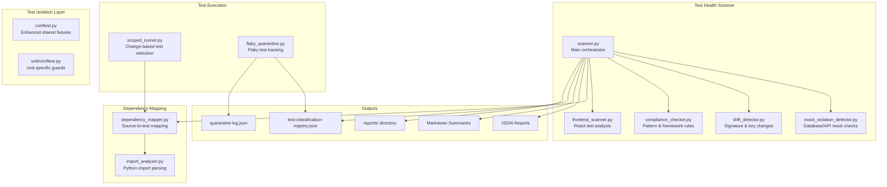

# Design Document: Test Maintenance Framework

## Overview

The Test Maintenance Framework is a suite of Python and TypeScript tooling that systematically detects, classifies, and helps fix broken, flaky, and non-compliant tests across the myAdmin project. It addresses the root causes of the project's 40+ pre-existing test failures: unit tests hitting real databases, mock return values drifting from actual function signatures, missing test markers, inconsistent fixture usage, and no CI pipeline to catch regressions.

The framework consists of five core components:

1. **Test Health Scanner** — Static analysis engine that scans test files for anti-patterns, mock violations, code drift, and compliance issues
2. **Test Dependency Mapper** — Import and naming-convention analyzer that maps source files to their test files
3. **Scoped Test Runner** — Wrapper that uses dependency mappings to run only tests affected by code changes
4. **Test Isolation Layer** — Enhanced conftest.py fixtures that enforce proper mocking of DatabaseManager, Cognito, Google Drive, and environment variables
5. **Flaky Test Quarantine** — Detection and tracking system for intermittently failing tests

All tools produce machine-readable JSON output and human-readable console/markdown summaries. Historical reports are stored in `backend/tests/reports/` for trend tracking.

### Design Decisions

| Decision               | Choice                                                 | Rationale                                                                                                                 |
| ---------------------- | ------------------------------------------------------ | ------------------------------------------------------------------------------------------------------------------------- |
| Scanner implementation | Python AST + regex analysis                            | AST gives accurate import detection; regex handles string patterns like dict keys. No external dependencies needed.       |
| Dependency mapping     | Import analysis + naming conventions                   | Combines `test_{module}.py` naming with actual `import` / `from ... import` statements for accuracy                       |
| Report format          | JSON + Markdown                                        | JSON for tooling consumption (CI, scripts); Markdown for PR descriptions and human review                                 |
| Fixture approach       | Patch `DatabaseManager` methods, not `mysql.connector` | Aligns with the project's database abstraction layer — tests should mock at the abstraction boundary                      |
| Frontend scanning      | TypeScript AST via regex patterns                      | Avoids requiring a Node.js dependency in the Python scanner; pattern matching is sufficient for import/provider detection |
| Compliance rules       | Configurable JSON file                                 | Allows rules to evolve without code changes; different teams can customize                                                |

## Architecture



### File Layout

```
backend/
├── scripts/
│   └── test_maintenance/
│       ├── __init__.py
│       ├── scanner.py                    # Main Test Health Scanner orchestrator
│       ├── mock_violation_detector.py    # Detects real DB/API usage in unit tests
│       ├── drift_detector.py            # Detects source-test signature drift
│       ├── compliance_checker.py        # Framework/pattern compliance rules
│       ├── frontend_scanner.py          # Frontend test analysis
│       ├── dependency_mapper.py         # Source-to-test mapping
│       ├── import_analyzer.py           # Python import parsing via AST
│       ├── scoped_runner.py             # Scoped test execution
│       ├── flaky_quarantine.py          # Flaky test detection & tracking
│       └── report_generator.py          # Report formatting (JSON, Markdown)
├── tests/
│   ├── conftest.py                      # Enhanced with Test Isolation Layer
│   ├── unit/
│   │   └── conftest.py                  # Unit-specific connection guard
│   ├── reports/                         # Historical test health reports
│   │   └── .gitkeep
│   ├── test-classification-registry.json
│   ├── quarantine-log.json
│   └── test-compliance-rules.json
```

## Components and Interfaces

### 1. Test Health Scanner (`scanner.py`)

The main orchestrator that coordinates all analysis components and produces reports.

```python
class TestHealthScanner:
    """Main orchestrator for test health analysis."""

    def __init__(self, config_path: str = None):
        """
        Args:
            config_path: Path to test-compliance-rules.json.
                         Defaults to backend/tests/test-compliance-rules.json.
        """

    def scan(
        self,
        backend_test_dir: str = "backend/tests",
        frontend_src_dir: str = "frontend/src",
        frontend_test_dir: str = "frontend/tests",
        maintenance_session: bool = False,
    ) -> ScanReport:
        """Run full scan and return structured report."""

    def generate_baseline(self) -> BaselineSnapshot:
        """Create initial snapshot of all currently failing tests."""

    def generate_maintenance_worklist(self) -> MaintenanceWorkList:
        """Generate prioritized fix list grouped by root cause."""

    def generate_session_summary(
        self, before: ScanReport, after: ScanReport
    ) -> SessionSummary:
        """Compare two reports to produce a maintenance session summary."""
```

**CLI interface:**

```bash
# Full scan
python -m backend.scripts.test_maintenance.scanner

# Maintenance session mode
python -m backend.scripts.test_maintenance.scanner --maintenance-session

# Generate baseline
python -m backend.scripts.test_maintenance.scanner --baseline

# Frontend only
python -m backend.scripts.test_maintenance.scanner --frontend-only
```

### 2. Mock Violation Detector (`mock_violation_detector.py`)

Detects unit tests that access real external resources.

```python
class MockViolationDetector:
    """Detects real database/API/env usage in unit tests."""

    def analyze_file(self, file_path: str) -> list[MockViolation]:
        """Analyze a single test file for mock violations."""

    def detect_db_imports(self, ast_tree: ast.Module) -> list[MockViolation]:
        """Flag direct mysql.connector imports without mock context."""

    def detect_env_leaks(self, ast_tree: ast.Module, source: str) -> list[MockViolation]:
        """Flag references to real database names without patch.dict."""

    def detect_real_connections(self, ast_tree: ast.Module) -> list[MockViolation]:
        """Flag DatabaseManager(test_mode=True) without mocking — creates real connections."""

@dataclass
class MockViolation:
    file_path: str
    line_number: int
    violation_type: str          # "db_import", "env_leak", "real_connection"
    severity: str                # "critical", "high", "medium", "low"
    description: str
    suggested_fix: str
```

**Detection rules:**
| Pattern | Severity | Description |
|---------|----------|-------------|
| `import mysql.connector` in unit test | Critical | Direct DB driver import |
| `mysql.connector.connect(` without `@patch` | Critical | Real DB connection attempt |
| `DatabaseManager(test_mode=True)` without mock | Critical | Creates real DB connection |
| `os.environ['DB_NAME']` without `patch.dict` | High | Reads real env variable |
| `'testfinance'` literal in unit test | High | Hardcoded real DB name |
| `setup_test_table` fixture creating real tables | Critical | Real DDL in unit test |

### 3. Drift Detector (`drift_detector.py`)

Detects when source code changes make tests outdated.

```python
class DriftDetector:
    """Detects source-test code drift."""

    def __init__(self, dependency_map: DependencyMap):
        pass

    def detect_signature_drift(
        self, source_file: str, test_files: list[str]
    ) -> list[DriftIssue]:
        """Compare function signatures in source vs mock setup in tests."""

    def detect_key_drift(
        self, source_file: str, test_files: list[str]
    ) -> list[DriftIssue]:
        """Compare dictionary keys/data structures between source and test mocks."""

    def generate_drift_report(self, issues: list[DriftIssue]) -> DriftReport:
        """Generate structured drift report."""

@dataclass
class DriftIssue:
    source_file: str
    test_file: str
    line_number: int
    drift_type: str              # "signature_change", "key_rename", "return_type_change"
    severity: str
    old_value: str
    new_value: str
    description: str
```

### 4. Compliance Checker (`compliance_checker.py`)

Validates tests against project conventions.

```python
class ComplianceChecker:
    """Checks test files against project framework conventions."""

    def __init__(self, rules_path: str):
        """Load rules from test-compliance-rules.json."""

    def check_backend_test(self, file_path: str) -> list[ComplianceViolation]:
        """Check a backend test file against all applicable rules."""

    def check_frontend_test(self, file_path: str) -> list[ComplianceViolation]:
        """Check a frontend test file against all applicable rules."""

@dataclass
class ComplianceViolation:
    file_path: str
    line_number: int
    rule_id: str
    severity: str                # "required", "recommended"
    expected_pattern: str
    actual_pattern: str
    convention_reference: str    # Link to project docs
```

**Backend rules:**

- Unit tests must use shared `mock_db` fixture, not ad-hoc `MagicMock()` for database
- All test files must have pytest markers (auto-marking by directory is acceptable)
- No `sys.path.append` / `sys.path.insert` — use pytest's `conftest.py` path setup
- Route tests must test Blueprint endpoints with `_bp` suffix

**Frontend rules:**

- Component tests must use `test-utils.tsx` `render()`, not bare `@testing-library/react` `render()`
- API interaction tests must use MSW handlers, not manual `vi.fn()` fetch mocks
- No direct `window.fetch` or `axios` mocking — use MSW

### 5. Dependency Mapper (`dependency_mapper.py`)

Maps source files to their corresponding test files.

```python
class DependencyMapper:
    """Maps source files to test files using imports and naming conventions."""

    def build_backend_map(
        self,
        source_dir: str = "backend/src",
        test_dir: str = "backend/tests",
    ) -> DependencyMap:
        """Build source-to-test mapping for backend."""

    def build_frontend_map(
        self,
        source_dir: str = "frontend/src",
        test_dir: str = "frontend/tests",
    ) -> DependencyMap:
        """Build source-to-test mapping for frontend."""

    def get_tests_for_files(
        self, changed_files: list[str]
    ) -> TestSelection:
        """Given changed files, return which tests to run."""

    def get_untested_sources(self) -> list[str]:
        """Return source files with no corresponding test files."""

    def save_map(self, output_path: str) -> None:
        """Persist mapping as JSON for Scoped Test Runner consumption."""

@dataclass
class DependencyMap:
    backend: dict[str, list[str]]    # source_path -> [test_paths]
    frontend: dict[str, list[str]]   # source_path -> [test_paths]
    untested: list[str]              # source files with no tests

@dataclass
class TestSelection:
    backend_tests: list[str]
    frontend_tests: list[str]
    untested_changes: list[str]      # changed files with no test coverage
```

**Mapping strategies (in priority order):**

1. **Naming convention**: `backend/src/banking_processor.py` → `backend/tests/unit/test_banking_processor.py`
2. **Import analysis**: Parse test file AST for `from banking_processor import ...` or `import banking_processor`
3. **Service/route mapping**: `backend/src/services/year_end_service.py` → `backend/tests/unit/test_year_end_service.py`
4. **Frontend co-location**: `frontend/src/components/Foo.tsx` → `frontend/src/components/Foo.test.tsx` or `frontend/src/components/__tests__/Foo.test.tsx`

### 6. Scoped Test Runner (`scoped_runner.py`)

Runs only tests affected by code changes.

```python
class ScopedTestRunner:
    """Executes tests scoped to changed files."""

    def __init__(self, dependency_map_path: str = None):
        pass

    def run(
        self,
        changed_files: list[str],
        full: bool = False,
    ) -> TestRunResult:
        """
        Run tests for changed files.

        Args:
            changed_files: List of changed file paths (relative to project root).
            full: If True, run the complete test suite instead.
        """

    def _run_backend_tests(self, test_files: list[str]) -> subprocess.CompletedProcess:
        """Execute pytest with specific test files."""

    def _run_frontend_tests(self, changed_files: list[str]) -> subprocess.CompletedProcess:
        """Execute vitest --related with changed source files."""

@dataclass
class TestRunResult:
    backend_result: Optional[subprocess.CompletedProcess]
    frontend_result: Optional[subprocess.CompletedProcess]
    tests_executed: int
    tests_passed: int
    tests_failed: int
    untested_changes: list[str]
    duration_seconds: float
```

**CLI interface:**

```bash
# Run tests for specific changed files
python -m backend.scripts.test_maintenance.scoped_runner \
    backend/src/banking_processor.py \
    backend/src/services/year_end_service.py

# Run full suite
python -m backend.scripts.test_maintenance.scoped_runner --full

# Auto-detect changes from git
python -m backend.scripts.test_maintenance.scoped_runner --git-diff
```

### 7. Flaky Test Quarantine (`flaky_quarantine.py`)

Tracks and manages flaky tests.

```python
class FlakyQuarantine:
    """Manages flaky test detection and quarantine lifecycle."""

    def __init__(self, registry_path: str, quarantine_log_path: str):
        pass

    def record_result(self, test_id: str, passed: bool, run_id: str) -> None:
        """Record a test execution result for flakiness tracking."""

    def detect_flaky(self, test_id: str) -> bool:
        """Check if a test has shown flaky behavior (pass+fail in same code state)."""

    def quarantine(self, test_id: str, reason: str) -> None:
        """Mark a test as quarantined."""

    def check_restoration(self, test_id: str, consecutive_passes: int = 3) -> bool:
        """Check if a quarantined test should be restored."""

    def get_quarantine_report(self) -> QuarantineReport:
        """Generate report of all quarantined tests."""

@dataclass
class QuarantineEntry:
    test_id: str
    reason: str
    quarantine_date: str         # ISO 8601
    last_failure_message: str
    consecutive_passes: int
    status: str                  # "quarantined", "restored"
```

### 8. Test Isolation Layer (Enhanced `conftest.py`)

New fixtures that enforce proper mocking at the DatabaseManager abstraction boundary.

```python
# backend/tests/conftest.py — enhanced fixtures

@pytest.fixture
def mock_db():
    """
    Mock DatabaseManager for unit tests.
    Patches all DatabaseManager methods with configurable returns.
    """
    with patch('database.DatabaseManager') as MockDBClass:
        mock_instance = MagicMock()
        MockDBClass.return_value = mock_instance

        # Default return values
        mock_instance.execute_query.return_value = []
        mock_instance.execute_batch_queries.return_value = None

        # Transaction context manager
        mock_cursor = MagicMock()
        mock_conn = MagicMock()
        mock_instance.transaction.return_value.__enter__ = MagicMock(
            return_value=(mock_cursor, mock_conn)
        )
        mock_instance.transaction.return_value.__exit__ = MagicMock(return_value=False)

        # get_cursor context manager
        mock_instance.get_cursor.return_value.__enter__ = MagicMock(
            return_value=(mock_cursor, mock_conn)
        )
        mock_instance.get_cursor.return_value.__exit__ = MagicMock(return_value=False)

        yield mock_instance


@pytest.fixture
def mock_cognito():
    """Mock AWS Cognito authentication calls."""
    with patch('auth.cognito_utils.boto3.client') as mock_client:
        mock_cognito_client = MagicMock()
        mock_client.return_value = mock_cognito_client

        # Default responses
        mock_cognito_client.admin_get_user.return_value = {
            'Username': 'test-user',
            'UserAttributes': [
                {'Name': 'email', 'Value': 'test@example.com'},
                {'Name': 'custom:tenant_id', 'Value': 'test-tenant'},
            ],
        }
        yield mock_cognito_client


@pytest.fixture
def mock_google_drive():
    """Mock Google Drive API calls."""
    with patch('google_drive_service.build') as mock_build:
        mock_service = MagicMock()
        mock_build.return_value = mock_service
        mock_service.files.return_value.list.return_value.execute.return_value = {
            'files': []
        }
        mock_service.files.return_value.get.return_value.execute.return_value = {
            'id': 'test_file_id',
            'name': 'test.pdf',
            'mimeType': 'application/pdf',
        }
        yield mock_service


@pytest.fixture
def mock_env():
    """
    Set standard test environment variables WITHOUT loading .env.
    Replaces the current pattern of load_dotenv() in conftest.py.
    """
    test_env = {
        'TEST_MODE': 'true',
        'DB_HOST': 'localhost',
        'DB_PORT': '3306',
        'DB_USER': 'test',
        'DB_PASSWORD': 'test',
        'DB_NAME': 'testfinance',
        'COGNITO_USER_POOL_ID': 'us-east-1_test',
        'COGNITO_CLIENT_ID': 'test-client-id',
        'GOOGLE_DRIVE_FOLDER_ID': 'test-folder-id',
        'AWS_REGION': 'us-east-1',
        'FLASK_ENV': 'testing',
    }
    with patch.dict(os.environ, test_env, clear=False):
        yield test_env
```

**Unit test connection guard** (`backend/tests/unit/conftest.py`):

```python
import pytest
from unittest.mock import patch

@pytest.fixture(autouse=True)
def block_real_connections():
    """
    Prevent any unit test from making real database connections.
    Raises RuntimeError if mysql.connector.connect is called without a mock.
    """
    def connection_guard(*args, **kwargs):
        raise RuntimeError(
            "Unit tests must not create real database connections. "
            "Use the 'mock_db' fixture from conftest.py instead."
        )

    with patch('mysql.connector.connect', side_effect=connection_guard):
        yield
```

## Data Models

### ScanReport

```python
@dataclass
class ScanReport:
    timestamp: str                          # ISO 8601
    scan_duration_seconds: float
    summary: ScanSummary
    mock_violations: list[MockViolation]
    drift_issues: list[DriftIssue]
    compliance_violations: list[ComplianceViolation]
    untested_sources: list[str]
    stale_failures: list[StaleFailure]      # Failing > 14 days

@dataclass
class ScanSummary:
    total_test_files: int
    total_tests: int
    passing: int
    failing: int
    skipped: int
    flaky: int
    quarantined: int
    by_category: dict[str, CategorySummary]  # "unit", "integration", "api", "e2e"
    issues_by_severity: dict[str, int]       # "critical": 5, "high": 12, ...

@dataclass
class CategorySummary:
    total: int
    passing: int
    failing: int
    skipped: int
    flaky: int
    quarantined: int
```

### Test Classification Registry (`test-classification-registry.json`)

```json
{
  "version": "1.0",
  "last_updated": "2025-01-15T10:30:00Z",
  "tests": {
    "backend/tests/unit/test_audit_logger.py::TestAuditLogging::test_log_decision": {
      "category": "unit",
      "status": "failing",
      "failure_reason": "Real database connection in unit test",
      "triage_decision": "fix",
      "triage_date": "2025-01-15",
      "target_fix_date": "2025-01-30",
      "root_cause": "database_mocking",
      "notes": "Needs mock_db fixture instead of real DatabaseManager"
    }
  },
  "metadata": {
    "total_tests": 450,
    "triaged": 40,
    "untriaged": 0,
    "by_status": {
      "passing": 380,
      "failing": 42,
      "skipped": 15,
      "flaky": 8,
      "quarantined": 5
    }
  }
}
```

### Compliance Rules (`test-compliance-rules.json`)

```json
{
  "version": "1.0",
  "rules": {
    "backend_unit": {
      "required": [
        {
          "id": "BU001",
          "name": "use_shared_mock_db",
          "description": "Unit tests must use shared mock_db fixture",
          "pattern": "mock_db",
          "anti_patterns": [
            "MagicMock.*cursor",
            "mysql.connector",
            "DatabaseManager(test_mode"
          ],
          "reference": ".kiro/steering/database-patterns.md"
        },
        {
          "id": "BU002",
          "name": "pytest_marker_required",
          "description": "All test files must have pytest markers",
          "pattern": "@pytest.mark.(unit|integration|api|e2e)",
          "reference": "backend/pytest.ini"
        },
        {
          "id": "BU003",
          "name": "no_sys_path_manipulation",
          "description": "Tests must not manipulate sys.path",
          "anti_patterns": ["sys.path.append", "sys.path.insert"],
          "reference": "Use conftest.py for path setup"
        }
      ],
      "recommended": [
        {
          "id": "BU004",
          "name": "use_mock_env",
          "description": "Unit tests should use mock_env fixture for environment variables",
          "pattern": "mock_env",
          "anti_patterns": ["load_dotenv", "os.environ\\["],
          "reference": "backend/tests/conftest.py"
        }
      ],
      "forbidden": [
        {
          "id": "BU005",
          "name": "no_real_db_in_unit",
          "description": "Unit tests must not import mysql.connector directly",
          "anti_patterns": ["import mysql.connector", "from mysql.connector"],
          "reference": ".kiro/steering/database-patterns.md"
        }
      ]
    },
    "frontend_unit": {
      "required": [
        {
          "id": "FU001",
          "name": "use_test_utils_render",
          "description": "Component tests must use test-utils.tsx render wrapper",
          "pattern": "from.*test-utils.*import.*render|from.*@/test-utils.*import",
          "anti_patterns": ["from '@testing-library/react' import.*render"],
          "reference": "frontend/src/test-utils.tsx"
        },
        {
          "id": "FU002",
          "name": "use_msw_for_api",
          "description": "API tests must use MSW handlers",
          "pattern": "setupServer|http\\.(get|post|put|delete|patch)",
          "anti_patterns": ["vi.fn.*fetch", "mock.*axios"],
          "reference": "frontend/src/setupTests.ts"
        }
      ]
    },
    "backend_route": {
      "required": [
        {
          "id": "BR001",
          "name": "blueprint_naming",
          "description": "Route files must use Blueprint with _bp suffix",
          "pattern": "_bp\\s*=\\s*Blueprint",
          "reference": ".kiro/steering/structure.md"
        }
      ]
    }
  }
}
```

### Dependency Map (`dependency-map.json`)

```json
{
  "version": "1.0",
  "generated_at": "2025-01-15T10:30:00Z",
  "backend": {
    "backend/src/banking_processor.py": [
      "backend/tests/unit/test_banking_processor.py",
      "backend/tests/integration/test_duplicate_integration_e2e.py"
    ],
    "backend/src/audit_logger.py": ["backend/tests/unit/test_audit_logger.py"],
    "backend/src/services/year_end_service.py": [
      "backend/tests/unit/test_year_end_service.py",
      "backend/tests/integration/test_year_end_integration.py"
    ]
  },
  "frontend": {
    "frontend/src/components/TemplateManagement.tsx": [
      "frontend/tests/unit/TemplateManagement/TemplateManagement.test.tsx"
    ]
  },
  "untested": [
    "backend/src/performance_optimizer.py",
    "backend/src/session_manager.py"
  ]
}
```

### Maintenance Session History

```json
{
  "sessions": [
    {
      "session_id": "2025-01-15-001",
      "started_at": "2025-01-15T09:00:00Z",
      "completed_at": "2025-01-15T11:30:00Z",
      "tests_fixed": 8,
      "tests_quarantined": 3,
      "tests_deleted": 1,
      "remaining_backlog": 28,
      "fixes_by_root_cause": {
        "database_mocking": 5,
        "key_mismatch": 2,
        "signature_change": 1
      }
    }
  ]
}
```

### Quarantine Log (`quarantine-log.json`)

```json
{
  "version": "1.0",
  "entries": [
    {
      "test_id": "backend/tests/unit/test_storage_provider.py::test_upload_file",
      "reason": "Depends on Google Drive credentials in environment",
      "quarantine_date": "2025-01-15",
      "last_failure_message": "google.auth.exceptions.DefaultCredentialsError",
      "consecutive_passes": 0,
      "status": "quarantined"
    }
  ]
}
```

## Correctness Properties

_A property is a characteristic or behavior that should hold true across all valid executions of a system — essentially, a formal statement about what the system should do. Properties serve as the bridge between human-readable specifications and machine-verifiable correctness guarantees._

### Property 1: Mock violation detection accuracy

_For any_ Python test file content containing zero or more mock violations (direct `mysql.connector` imports, unguarded `os.environ` access to database names, ad-hoc `MagicMock()` for database connections instead of shared fixtures), the MockViolationDetector SHALL correctly identify all violations present and produce no false positives for properly mocked code.

**Validates: Requirements 1.2, 1.3, 11.1**

### Property 2: Issue completeness invariant

_For any_ detected issue (MockViolation, DriftIssue, or ComplianceViolation), the issue SHALL have a valid severity from the set {"critical", "high", "medium", "low"} and SHALL contain all required fields (file_path, line_number, description, and type-specific fields: suggested_fix for MockViolation, expected_pattern/actual_pattern/convention_reference for ComplianceViolation).

**Validates: Requirements 1.4, 11.6**

### Property 3: Report serialization round-trip

_For any_ ScanReport or DependencyMap instance, serializing to JSON and deserializing back SHALL produce an equivalent object with all fields preserved.

**Validates: Requirements 1.5, 2.5**

### Property 4: Dependency mapping completeness

_For any_ file system layout containing source files and test files, every source file SHALL appear either in the dependency map (mapped to one or more test files) or in the untested list — never in both, and never in neither.

**Validates: Requirements 2.1, 2.2, 6.5**

### Property 5: Import-based dependency mapping

_For any_ test file that contains an import statement referencing a source module (via `import module` or `from module import ...`), the DependencyMapper SHALL include that test file in the mapping for the corresponding source file, even when the test file name does not follow the `test_{module}.py` naming convention.

**Validates: Requirements 2.3**

### Property 6: Frontend co-location mapping

_For any_ frontend source file with a co-located test file (either `Component.test.tsx` in the same directory or `__tests__/Component.test.tsx`), the DependencyMapper SHALL map the source file to its co-located test file.

**Validates: Requirements 2.4**

### Property 7: Scoped test selection correctness

_For any_ dependency map and any subset of changed source files, the ScopedTestRunner's selected test set SHALL equal the union of all test files mapped to the changed source files, and any changed file not present in the dependency map SHALL appear in the untested_changes list.

**Validates: Requirements 3.1, 3.3, 6.1**

### Property 8: Unit test connection guard

_For any_ call to `mysql.connector.connect` within a unit test context (under `backend/tests/unit/`), the connection guard SHALL raise a `RuntimeError` regardless of the connection parameters provided.

**Validates: Requirements 4.4**

### Property 9: mock_db fixture method coverage

_For any_ sequence of DatabaseManager method calls (`execute_query`, `execute_batch_queries`, `transaction`, `get_cursor`) with arbitrary parameters, the `mock_db` fixture SHALL handle all calls without raising unexpected exceptions and SHALL return configurable mock values.

**Validates: Requirements 4.1**

### Property 10: Flaky test detection

_For any_ sequence of test execution results where a single test has both passing and failing results within the same code state (same git commit), the FlakyQuarantine SHALL mark that test as flaky.

**Validates: Requirements 5.1**

### Property 11: Quarantine lifecycle integrity

_For any_ sequence of quarantine and restore operations, the quarantine report SHALL list exactly the tests currently in quarantined status, each with a non-empty reason, a valid ISO 8601 quarantine_date, and a last_failure_message. A quarantined test SHALL be restored only after recording 3 or more consecutive passes.

**Validates: Requirements 5.3, 5.4, 5.5**

### Property 12: Source-test drift detection

_For any_ source file change that modifies a function signature (parameters added, removed, or renamed) or renames a dictionary key, and for any test file that depends on that source file, the DriftDetector SHALL flag the test file with a DriftIssue containing the source_file, test_file, drift_type, and a description of the specific change.

**Validates: Requirements 6.2, 6.3, 6.4**

### Property 13: Report trend computation

_For any_ two ScanReport instances (before and after), the trend comparison SHALL correctly compute: tests_fixed = (failing in before) ∩ (passing in after), tests_newly_broken = (passing in before) ∩ (failing in after), tests_newly_quarantined = (not quarantined in before) ∩ (quarantined in after).

**Validates: Requirements 7.2, 7.4, 10.3**

### Property 14: Summary category completeness

_For any_ set of test execution results spanning multiple categories (unit, integration, api, e2e), the ScanSummary SHALL contain a CategorySummary for each category with accurate counts where total = passing + failing + skipped + flaky + quarantined.

**Validates: Requirements 7.1**

### Property 15: Markdown report structure

_For any_ ScanReport, the generated markdown summary SHALL contain: a summary table with total/passing/failing/skipped counts, a regressions section (if any), an improvements section (if any), and a quarantine section (if any quarantined tests exist).

**Validates: Requirements 7.5**

### Property 16: Stale failure escalation

_For any_ test entry in the classification registry with a failure date more than 14 days before the current scan date, the scanner SHALL include that test in the stale_failures list of the ScanReport.

**Validates: Requirements 8.2**

### Property 17: Triage enforcement

_For any_ attempt to add a failing test to the Test Classification Registry without a triage_decision field (one of "fix", "quarantine", or "delete"), the registry SHALL reject the addition and return a validation error.

**Validates: Requirements 8.4**

### Property 18: Untriaged warning threshold

_For any_ ScanReport where the count of failing tests without a triage_decision exceeds 10, the report summary SHALL include a warning message indicating the number of untriaged failures.

**Validates: Requirements 8.5**

### Property 19: Frontend MSW detection

_For any_ TypeScript test file that contains `fetch(`, `axios.get(`, or similar HTTP call patterns without a corresponding MSW `setupServer` or `http.get/post/put/delete` handler setup, the frontend scanner SHALL flag the file as having a missing MSW handler violation.

**Validates: Requirements 9.1, 11.4**

### Property 20: Frontend provider detection

_For any_ TypeScript test file that imports `render` directly from `@testing-library/react` instead of from the project's `test-utils` module, the frontend scanner SHALL flag the file as having a missing provider dependency.

**Validates: Requirements 9.2, 11.3**

### Property 21: Frontend stale import detection

_For any_ TypeScript test file that imports a component from a path that does not correspond to an existing file in the frontend source tree, the frontend scanner SHALL flag the test as having a stale import.

**Validates: Requirements 9.4**

### Property 22: Maintenance work list ordering

_For any_ set of detected issues, the maintenance work list SHALL group issues by root cause (database_mocking, key_mismatch, signature_change, environment_dependency) and within each group, issues SHALL be ordered by severity (critical first, then high, medium, low).

**Validates: Requirements 10.1, 10.5**

### Property 23: Effort estimation completeness

_For any_ set of detected issues grouped by fix category (mock violations, code drift, flaky tests, missing tests), the maintenance session output SHALL include a non-negative effort estimate for each category.

**Validates: Requirements 10.2**

### Property 24: Session history ordering

_For any_ sequence of completed maintenance sessions, the session history SHALL contain all sessions in chronological order with no gaps or duplicates.

**Validates: Requirements 10.4**

### Property 25: Pytest marker detection

_For any_ backend test file that lacks an explicit `@pytest.mark.unit`, `@pytest.mark.integration`, `@pytest.mark.api`, or `@pytest.mark.e2e` decorator and is not in a directory that triggers auto-marking via `pytest_collection_modifyitems`, the compliance checker SHALL flag the file as non-compliant.

**Validates: Requirements 11.2**

### Property 26: Blueprint pattern detection

_For any_ backend route file in `backend/src/routes/`, the compliance checker SHALL verify the presence of a Blueprint declaration with `_bp` suffix naming and flag files that do not follow this convention.

**Validates: Requirements 11.5**

### Property 27: Configurable compliance rules

_For any_ valid compliance rules configuration (JSON file with required/recommended/forbidden rule categories), the compliance checker SHALL load and apply all rules, and changing the rules file SHALL change which violations are detected without requiring code changes.

**Validates: Requirements 11.7**

## Error Handling

### Scanner Errors

| Error Scenario                                | Handling Strategy                                          |
| --------------------------------------------- | ---------------------------------------------------------- |
| Test file has syntax errors (unparseable AST) | Log warning, skip file, include in report as "unparseable" |
| Source file not found during drift detection  | Log warning, skip drift check for that file                |
| Compliance rules file missing or invalid JSON | Fall back to built-in default rules, log warning           |
| Permission denied reading test/source files   | Log error, skip file, include in report                    |
| Historical report file corrupted              | Start fresh trend comparison, log warning                  |

### Dependency Mapper Errors

| Error Scenario                                  | Handling Strategy                                 |
| ----------------------------------------------- | ------------------------------------------------- |
| Circular imports in test files                  | Detect and break cycle, log warning               |
| Import of non-existent module                   | Flag as potential stale import                    |
| Ambiguous mapping (multiple source files match) | Include all matches, flag as ambiguous in mapping |

### Scoped Runner Errors

| Error Scenario                     | Handling Strategy                                                    |
| ---------------------------------- | -------------------------------------------------------------------- |
| Dependency map file missing        | Fall back to running all tests in changed file's directory (Req 3.5) |
| Dependency map file corrupted JSON | Same fallback as missing file                                        |
| pytest/vitest not installed        | Return error with installation instructions                          |
| Test execution timeout             | Kill process, report timeout, include partial results                |

### Quarantine Errors

| Error Scenario                          | Handling Strategy                                                   |
| --------------------------------------- | ------------------------------------------------------------------- |
| Quarantine log file corrupted           | Create backup of corrupted file, start fresh log                    |
| Registry file locked by another process | Retry with exponential backoff (3 attempts), then fail with message |
| Test ID not found in registry           | Log warning, create new entry                                       |

### General Principles

- All errors are logged with full context (file path, line number, error message)
- No error in scanning a single file should abort the entire scan
- All output files (reports, registry, quarantine log) use atomic writes (write to temp file, then rename) to prevent corruption
- Exit codes: 0 = clean scan, 1 = issues found, 2 = scanner error

## Testing Strategy

### Testing Approach

This framework uses a dual testing approach:

1. **Property-based tests** (Hypothesis for Python) — verify universal properties across generated inputs
2. **Unit tests** (pytest) — verify specific examples, edge cases, and integration points
3. **Integration tests** — verify end-to-end workflows with real file system operations

### Property-Based Testing Configuration

- **Library**: Hypothesis (already available in the project)
- **Minimum iterations**: 100 per property test
- **Tag format**: `# Feature: test-maintenance-framework, Property {N}: {title}`
- Each correctness property maps to exactly one property-based test

### Test Organization

```
backend/tests/unit/test_maintenance/
├── test_mock_violation_detector_props.py    # Properties 1, 2
├── test_dependency_mapper_props.py          # Properties 4, 5, 6
├── test_scoped_runner_props.py              # Property 7
├── test_isolation_layer_props.py            # Properties 8, 9
├── test_flaky_quarantine_props.py           # Properties 10, 11
├── test_drift_detector_props.py             # Property 12
├── test_report_generator_props.py           # Properties 3, 13, 14, 15
├── test_classification_registry_props.py    # Properties 16, 17, 18
├── test_frontend_scanner_props.py           # Properties 19, 20, 21
├── test_maintenance_session_props.py        # Properties 22, 23, 24
├── test_compliance_checker_props.py         # Properties 25, 26, 27
├── test_mock_violation_detector.py          # Unit tests: specific examples
├── test_dependency_mapper.py                # Unit tests: real file layouts
├── test_scoped_runner.py                    # Unit tests: CLI interface
├── test_isolation_layer.py                  # Unit tests: fixture behavior
├── test_flaky_quarantine.py                 # Unit tests: lifecycle examples
├── test_drift_detector.py                   # Unit tests: real code drift examples
├── test_report_generator.py                 # Unit tests: format validation
├── test_compliance_checker.py               # Unit tests: rule loading
└── test_frontend_scanner.py                 # Unit tests: TypeScript patterns
```

### Property Test Examples

**Property 1 — Mock violation detection:**

```python
from hypothesis import given, strategies as st, settings

# Feature: test-maintenance-framework, Property 1: Mock violation detection accuracy
@settings(max_examples=100)
@given(
    has_mysql_import=st.booleans(),
    has_env_leak=st.booleans(),
    has_adhoc_mock=st.booleans(),
    has_proper_mock=st.booleans(),
)
def test_mock_violation_detection(has_mysql_import, has_env_leak, has_adhoc_mock, has_proper_mock):
    source = generate_test_file(
        mysql_import=has_mysql_import,
        env_leak=has_env_leak,
        adhoc_mock=has_adhoc_mock,
        proper_mock=has_proper_mock,
    )
    violations = MockViolationDetector().analyze_source(source)

    if has_mysql_import:
        assert any(v.violation_type == "db_import" for v in violations)
    if has_env_leak:
        assert any(v.violation_type == "env_leak" for v in violations)
    if has_adhoc_mock:
        assert any(v.violation_type == "adhoc_mock" for v in violations)
    if has_proper_mock and not has_mysql_import and not has_env_leak and not has_adhoc_mock:
        assert len(violations) == 0
```

**Property 4 — Dependency mapping completeness:**

```python
# Feature: test-maintenance-framework, Property 4: Dependency mapping completeness
@settings(max_examples=100)
@given(file_layout=st_file_layout())
def test_dependency_mapping_completeness(file_layout, tmp_path):
    create_file_layout(tmp_path, file_layout)
    mapper = DependencyMapper()
    dep_map = mapper.build_backend_map(
        source_dir=str(tmp_path / "src"),
        test_dir=str(tmp_path / "tests"),
    )

    all_sources = file_layout.source_files
    mapped_sources = set(dep_map.backend.keys())
    untested_sources = set(dep_map.untested)

    # Every source is either mapped or untested
    assert mapped_sources | untested_sources == set(all_sources)
    # No source is both mapped and untested
    assert mapped_sources & untested_sources == set()
```

**Property 13 — Report trend computation:**

```python
# Feature: test-maintenance-framework, Property 13: Report trend computation
@settings(max_examples=100)
@given(
    before_passing=st.sets(st.text(min_size=1, max_size=50), max_size=20),
    before_failing=st.sets(st.text(min_size=1, max_size=50), max_size=20),
    after_passing=st.sets(st.text(min_size=1, max_size=50), max_size=20),
    after_failing=st.sets(st.text(min_size=1, max_size=50), max_size=20),
)
def test_trend_computation(before_passing, before_failing, after_passing, after_failing):
    before = make_report(passing=before_passing, failing=before_failing)
    after = make_report(passing=after_passing, failing=after_failing)
    trend = compute_trend(before, after)

    assert trend.tests_fixed == before_failing & after_passing
    assert trend.tests_newly_broken == before_passing & after_failing
```

### Unit Test Focus Areas

Unit tests complement property tests by covering:

- **Specific anti-pattern examples**: Real code from `test_audit_logger.py`, `test_banking_processor.py`, `test_year_end_service.py` as regression tests
- **CLI interface**: Argument parsing, flag handling, output formatting
- **File I/O**: Report file creation, atomic writes, timestamped filenames
- **Edge cases**: Empty test directories, files with no functions, binary files in test directories
- **Error handling**: Corrupted JSON files, permission errors, missing directories

### Integration Test Focus Areas

- End-to-end scan of the actual `backend/tests/` directory
- Scoped runner with real pytest/vitest invocation (mocked subprocess)
- Report generation and historical comparison with real file system
- Maintenance session workflow from scan to summary
