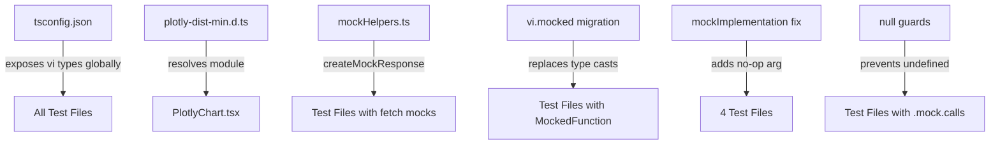

# Design Document: Frontend Test Type Safety

## Overview

This design eliminates all 209 TypeScript compilation errors across 41 frontend test files while preserving the existing 1782 passing runtime tests. The errors stem from five root causes, each addressed by a targeted, non-breaking fix:

1. **`vi.MockedFunction` namespace resolution** (~60 errors) — tsconfig.json already includes `"vitest/globals"` in `types`, but the `vi` namespace types (including `MockedFunction`, `Mock`, `MockInstance`) are not fully resolved by `tsc`. The fix ensures Vitest's type definitions are globally available.
2. **Partial `Response` mock objects** (~50 errors) — Test files cast incomplete object literals `as Response`, missing required properties like `statusText`, `headers`, `redirected`, `type`, `url`, `body`, `bodyUsed`, and methods like `text()`, `blob()`, `bytes()`. A shared factory provides complete objects.
3. **Missing mock method types** (~40 errors) — `mockResolvedValue` / `.mock` not recognized because functions are cast with `as vi.MockedFunction<typeof fn>` instead of using the Vitest-idiomatic `vi.mocked()` helper. Migration to `vi.mocked()` resolves these.
4. **`mockImplementation()` zero-arg calls** (~5 errors) — Vitest 4.x requires at least one argument. Passing an explicit `() => {}` fixes these.
5. **Strict-null `possibly undefined`** (~15 errors) — Accessing `mock.calls[0][1]` without null guards. Adding non-null assertions or preceding `toBeDefined()` checks resolves these.

Plus one production file: `PlotlyChart.tsx` imports `plotly.js-dist-min` which lacks type declarations — a local `.d.ts` file resolves this.

### Design Principles

- **Zero behavioral change**: Every fix is type-level only. No runtime logic changes.
- **Centralized over scattered**: One tsconfig entry, one mock factory, one pattern per category.
- **Idiomatic Vitest**: Use `vi.mocked()` instead of manual type casts — this is the API Vitest provides for this purpose.
- **Incremental migration**: Each file can be updated independently. No big-bang refactor required.

## Architecture

The changes span three layers:

```
┌─────────────────────────────────────────────────────┐
│  Configuration Layer                                 │
│  ┌─────────────┐  ┌──────────────────────────────┐  │
│  │ tsconfig.json│  │ src/types/plotly-dist-min.d.ts│ │
│  │ (types array)│  │ (module declaration)          │ │
│  └─────────────┘  └──────────────────────────────┘  │
├─────────────────────────────────────────────────────┤
│  Shared Utilities Layer                              │
│  ┌───────────────────────────────────────────────┐  │
│  │ src/test-utils/mockHelpers.ts                  │  │
│  │ - createMockResponse()                         │  │
│  │ - Type-safe Response factory                   │  │
│  └───────────────────────────────────────────────┘  │
├─────────────────────────────────────────────────────┤
│  Test Files Layer (41 files)                         │
│  - Replace `as vi.MockedFunction<typeof fn>`         │
│    with `vi.mocked(fn)`                              │
│  - Replace inline `{...} as Response`                │
│    with `createMockResponse({...})`                  │
│  - Add `() => {}` to zero-arg mockImplementation()   │
│  - Add null guards for .mock.calls access            │
└─────────────────────────────────────────────────────┘
```

### Change Flow



## Components and Interfaces

### 1. tsconfig.json — Vitest Type Exposure

**Current state**: `"types": ["vitest/globals", "node"]` — this exposes global test functions (`describe`, `it`, `expect`) but `tsc` does not fully resolve the `vi` namespace types needed for `vi.MockedFunction`, `vi.Mock`, etc.

**Fix**: Add `"vitest"` to the `types` array alongside the existing entries. The `vitest` type package exposes the full `vi` namespace including `MockedFunction`, `MockInstance`, `Mock`, and the `vi.mocked()` helper return types.

```jsonc
{
  "compilerOptions": {
    "types": ["vitest/globals", "vitest", "node"],
  },
}
```

**Rationale**: Adding `"vitest"` to `types` is the Vitest-recommended approach for projects using `globals: true`. The `vitest/globals` entry provides global `describe`/`it`/`expect`, while `vitest` provides the `vi` namespace types. Both are needed.

### 2. mockHelpers.ts — Response Mock Factory

**Location**: `frontend/src/test-utils/mockHelpers.ts`

**Importable as**: `@/test-utils/mockHelpers`

````typescript
/**
 * Shared test mock factories for type-safe test utilities.
 *
 * Provides fully-typed mock factories that satisfy TypeScript's strict
 * type checker, eliminating the need for `as Response` casts or
 * `as unknown as Response` workarounds in test files.
 *
 * @module test-utils/mockHelpers
 */

/**
 * Options for creating a mock Response object.
 * All properties are optional — sensible defaults are provided.
 */
export interface MockResponseOptions {
  /** HTTP status code. @default 200 */
  status?: number;
  /** Whether the response is ok (status 200-299). @default true */
  ok?: boolean;
  /** HTTP status text. @default "OK" */
  statusText?: string;
  /** Response headers. @default new Headers() */
  headers?: Headers;
  /** The body to return from json(). @default {} */
  body?: unknown;
  /** The text to return from text(). @default "" */
  textBody?: string;
  /** Whether the response was redirected. @default false */
  redirected?: boolean;
  /** Response type. @default "basic" */
  type?: ResponseType;
  /** Response URL. @default "" */
  url?: string;
}

/**
 * Creates a fully-typed mock `Response` object with sensible defaults.
 *
 * Eliminates partial `Response` casts (`as Response`) that cause TypeScript
 * errors when required properties are missing.
 *
 * @example
 * ```ts
 * // Simple success response with JSON body
 * vi.mocked(global.fetch).mockResolvedValue(
 *   createMockResponse({ body: { users: [] } })
 * );
 *
 * // Error response
 * vi.mocked(global.fetch).mockResolvedValue(
 *   createMockResponse({ ok: false, status: 404, body: { error: 'Not found' } })
 * );
 * ```
 *
 * @param options - Partial response configuration. All fields optional.
 * @returns A complete `Response` object accepted by TypeScript anywhere
 *          a `Response` type is expected.
 */
export function createMockResponse(
  options: MockResponseOptions = {},
): Response {
  const {
    status = 200,
    ok = true,
    statusText = "OK",
    headers = new Headers(),
    body = {},
    textBody = "",
    redirected = false,
    type = "basic",
    url = "",
  } = options;

  const response: Response = {
    ok,
    status,
    statusText,
    headers,
    redirected,
    type,
    url,
    body: null,
    bodyUsed: false,
    json: async () => body,
    text: async () => textBody,
    blob: async () => new Blob(),
    arrayBuffer: async () => new ArrayBuffer(0),
    formData: async () => new FormData(),
    bytes: async () => new Uint8Array(),
    clone: function () {
      return { ...this } as Response;
    },
  };

  return response;
}
````

**Interface contract**:

- Input: `MockResponseOptions` — all fields optional with documented defaults
- Output: `Response` — fully satisfies the `Response` interface without casts
- The `body` parameter maps to `json()` return value (most common use case)
- The `textBody` parameter maps to `text()` return value (for error responses)

### 3. vi.mocked() Migration Pattern

**Before** (current — causes `vi.MockedFunction` namespace errors):

```typescript
import { fetchAuthSession } from 'aws-amplify/auth';
vi.mock('aws-amplify/auth');
const mockFetchAuthSession = fetchAuthSession as vi.MockedFunction<typeof fetchAuthSession>;

// Usage
mockFetchAuthSession.mockResolvedValue({ tokens: { ... } } as any);
```

**After** (idiomatic Vitest — no namespace errors):

```typescript
import { fetchAuthSession } from 'aws-amplify/auth';
vi.mock('aws-amplify/auth');

// Usage — inline, no intermediate variable needed
vi.mocked(fetchAuthSession).mockResolvedValue({ tokens: { ... } } as any);

// Or with a variable if used repeatedly in a describe block
const mockFetchAuthSession = vi.mocked(fetchAuthSession);
mockFetchAuthSession.mockResolvedValue({ tokens: { ... } } as any);
```

**Key differences**:

- `vi.mocked()` is a runtime function that returns the same reference with correct types
- No `as` cast needed — TypeScript infers mock methods from the original function signature
- Works with `vi.mock()` hoisting — the function is already mocked when `vi.mocked()` wraps it

**Migration rules**:

1. Remove the `as vi.MockedFunction<typeof fn>` cast
2. Replace with `vi.mocked(fn)` at the usage site or in a `const` declaration
3. If the variable was only used once, inline the `vi.mocked()` call
4. If used multiple times, keep the variable: `const mockFn = vi.mocked(fn)`

### 4. mockImplementation() Zero-Arg Fix

**Before** (Vitest 4.x type error — requires 1 argument):

```typescript
const consoleSpy = vi.spyOn(console, "error").mockImplementation();
```

**After** (explicit no-op function):

```typescript
const consoleSpy = vi.spyOn(console, "error").mockImplementation(() => {});
```

This affects ~5 call sites, all following the same pattern of suppressing `console.error` during expected error tests.

### 5. Strict Null Guard Pattern

**Before** (possibly undefined error):

```typescript
const fetchCall = vi.mocked(global.fetch).mock.calls[0];
const headers = fetchCall[1].headers; // TS error: fetchCall[1] is possibly undefined
```

**After** (non-null assertion — preferred for test code):

```typescript
const fetchCall = vi.mocked(global.fetch).mock.calls[0]!;
const headers = fetchCall[1]!.headers;
```

**Alternative** (explicit assertion — for complex cases):

```typescript
const calls = vi.mocked(global.fetch).mock.calls;
expect(calls).toHaveLength(1);
const fetchCall = calls[0]!;
expect(fetchCall[1]).toBeDefined();
const headers = fetchCall[1]!.headers;
```

**Pattern choice rationale**: Non-null assertion (`!`) is preferred in test files because:

- Tests already assert expected state — if the value is undefined, the test should fail
- It's concise and doesn't add noise to test readability
- The `expect().toBeDefined()` pattern is reserved for cases where the undefined check IS the assertion

### 6. PlotlyChart Type Declaration

**Location**: `frontend/src/types/plotly-dist-min.d.ts`

```typescript
/**
 * Type declaration for plotly.js-dist-min.
 *
 * The plotly.js-dist-min package is a minified bundle of plotly.js
 * that doesn't ship its own TypeScript declarations. This declaration
 * re-exports the types from @types/plotly.js which is already installed
 * as a dev dependency.
 */
declare module "plotly.js-dist-min" {
  import Plotly from "plotly.js";
  export default Plotly;
}
```

**Rationale**: The project already has `@types/plotly.js` (v3.0.9) installed as a dev dependency. The `plotly.js-dist-min` package is just a minified build of the same library, so re-exporting the existing types is correct and avoids duplicating type definitions.

## Data Models

No new data models are introduced. The only new type is `MockResponseOptions`, defined in the Components section above. All changes are type-level — no runtime data structures change.

### File Impact Summary

| Category                                | Files Affected | Change Type                   |
| --------------------------------------- | -------------- | ----------------------------- |
| tsconfig.json                           | 1              | Add `"vitest"` to types array |
| plotly-dist-min.d.ts                    | 1 (new)        | Module declaration            |
| mockHelpers.ts                          | 1 (new)        | Response factory              |
| vi.MockedFunction → vi.mocked()         | ~20 files      | Replace type cast pattern     |
| Partial Response → createMockResponse() | ~15 files      | Replace inline mocks          |
| mockImplementation()                    | ~4 files       | Add `() => {}` argument       |
| Null guards                             | ~8 files       | Add `!` assertions            |

## Correctness Properties

_A property is a characteristic or behavior that should hold true across all valid executions of a system — essentially, a formal statement about what the system should do. Properties serve as the bridge between human-readable specifications and machine-verifiable correctness guarantees._

### Property 1: Response factory completeness

_For any_ valid `MockResponseOptions` input (with any combination of status codes 100–599, ok boolean, arbitrary JSON-serializable body, and optional headers), `createMockResponse()` SHALL return an object where every property required by the `Response` interface is defined (not `undefined`) and every required method (`json`, `text`, `blob`, `arrayBuffer`, `formData`, `bytes`, `clone`) is a callable function.

**Validates: Requirements 3.1, 3.3, 3.4**

### Property 2: Response factory json round-trip

_For any_ JSON-serializable value passed as the `body` option to `createMockResponse()`, calling `.json()` on the returned Response SHALL resolve to a value deeply equal to the original input.

**Validates: Requirements 3.1, 3.5**

### Property 3: Response factory defaults preserve override

_For any_ subset of `MockResponseOptions` fields provided, `createMockResponse()` SHALL use the provided values for those fields and sensible defaults for all omitted fields, such that the returned object always satisfies the `Response` interface regardless of which fields were specified.

**Validates: Requirements 3.3, 3.6**

## Error Handling

Error handling is minimal since all changes are type-level fixes to test files:

- **createMockResponse()**: No runtime errors possible — all inputs are optional with defaults. Invalid `status` values (e.g., negative numbers) are accepted since the factory is for testing, not production validation.
- **vi.mocked()**: If called on a non-mocked function, Vitest returns the original function. This is safe — the test will fail at the assertion level, not with a runtime crash.
- **Null assertions (`!`)**: If the asserted value IS undefined at runtime, the test will fail with a clear error at the next property access. This is the desired behavior in tests.
- **PlotlyChart.d.ts**: If `@types/plotly.js` is removed from devDependencies, the declaration file will cause a compile error pointing directly at the issue.

## Testing Strategy

### Property-Based Tests (fast-check via @fast-check/vitest)

The `createMockResponse()` factory is the primary candidate for property-based testing. It's a pure function with clear input/output behavior and a large input space (status codes × ok values × arbitrary JSON bodies × headers).

**Library**: `@fast-check/vitest` (already installed, v0.4.0) with `fast-check` (v4.4.0)

**Configuration**: Minimum 100 iterations per property test.

**Test file**: `frontend/src/test-utils/__tests__/mockHelpers.property.test.ts`

Each property test will be tagged with:

```
// Feature: frontend-test-type-safety, Property N: <property text>
```

**Property tests to implement**:

1. **Property 1 — Response factory completeness**: Generate random `MockResponseOptions` (arbitrary status 100–599, random ok boolean, random JSON body via `fc.jsonValue()`, random headers). Assert all required Response properties are defined and all methods are functions.

2. **Property 2 — Response factory json round-trip**: Generate random JSON-serializable values via `fc.jsonValue()`. Pass as `body`, call `.json()`, assert deep equality with input.

3. **Property 3 — Response factory defaults preserve override**: Generate random subsets of `MockResponseOptions` fields. Assert provided fields match input, omitted fields match documented defaults, and the result is always a valid Response.

### Unit Tests (Vitest)

**Test file**: `frontend/src/test-utils/__tests__/mockHelpers.test.ts`

Example-based tests for specific scenarios:

- Default response (no arguments) has `ok: true`, `status: 200`, `statusText: "OK"`
- Error response with `ok: false`, `status: 404`
- Response with custom headers
- Response with `textBody` for `.text()` method
- `clone()` returns a distinct object with same properties

### Integration / Smoke Tests

These are not new test files but verification commands:

1. **`tsc --noEmit`** from `frontend/` — zero errors (validates Requirements 1.x, 2.x, 4.x, 5.x, 6.x, 7.1)
2. **`vitest --run`** — all 1782+ tests pass (validates Requirement 7.2)
3. **`tsc -b && vite build`** — build succeeds (validates Requirement 7.3)
4. **Grep for `as vi.MockedFunction`** — zero matches (validates Requirement 2.4)
5. **Grep for `mockImplementation()`** with zero args — zero matches (validates Requirement 4.1)

### Why PBT Applies Here

The `createMockResponse()` factory is a pure function that:

- Accepts a wide range of inputs (status codes, booleans, arbitrary JSON, headers)
- Must satisfy a well-defined interface contract (the `Response` type)
- Has a clear round-trip property (body in → json() out)
- Benefits from 100+ iterations to catch edge cases (special characters in JSON, boundary status codes, empty objects vs arrays)

PBT does NOT apply to the other fix categories (tsconfig changes, pattern migrations, null guards) — those are configuration and code pattern changes verified by `tsc --noEmit` and grep checks.
