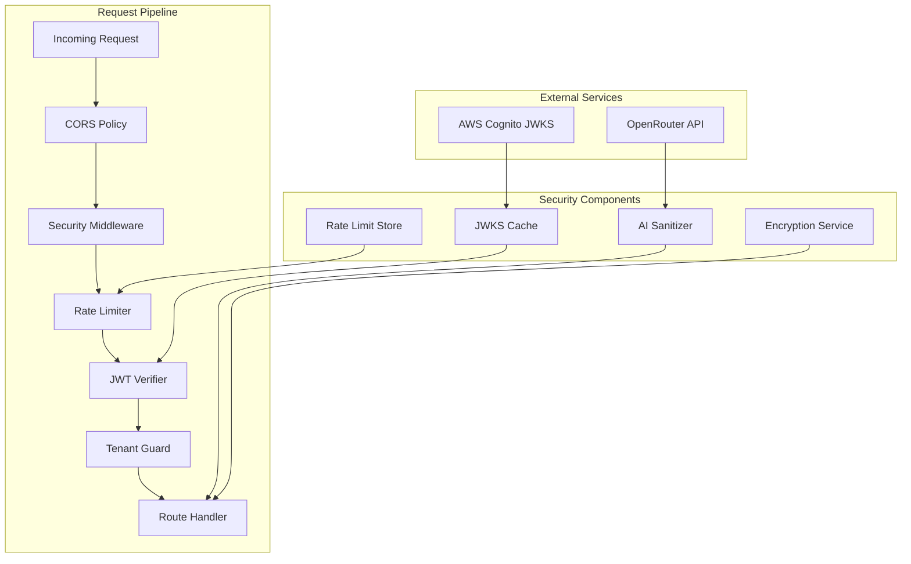

# Design Document: Security Hardening

## Overview

This design addresses nine security vulnerabilities identified in the myAdmin platform. The hardening spans cryptographic JWT verification, tenant isolation enforcement, endpoint access control, AI prompt injection prevention, CORS policy tightening, security middleware enforcement, rate limiting, log sanitization, and per-tenant encryption key derivation.

The changes target the Flask backend exclusively and are organized into independent, composable modules that integrate with the existing decorator-based authentication and middleware pipeline. Each module follows the existing patterns (`@cognito_required`, `@tenant_required`, service layer, `DatabaseManager`) to minimize disruption.

### Design Principles

- **Defense in depth**: Multiple overlapping controls (auth + tenant guard + query-level filtering)
- **Fail-secure**: Reject requests when security checks cannot be completed
- **Backward compatibility**: Transparent migration for existing encrypted credentials
- **Minimal blast radius**: Each hardening area is independently deployable

## Architecture



### Request Flow

1. **CORS**: Flask-CORS validates origin against explicit allowlist (no wildcard, no "null")
2. **Security Middleware**: Pattern detection runs on ALL requests regardless of debug/test mode (except health checks)
3. **Rate Limiter**: Checks IP + email sliding windows for auth endpoints
4. **JWT Verifier**: Fetches JWKS, verifies RS256 signature, validates iss/aud/exp claims
5. **Tenant Guard**: Validates tenant access from JWT `custom:tenants` claim
6. **Route Handler**: Business logic with AI sanitizer and encryption service as needed

## Components and Interfaces

### 1. JWT Verifier (`backend/src/auth/jwt_verifier.py`)

Replaces the current base64 payload decoding with cryptographic verification.

```python
class JWTVerifier:
    """Cryptographic JWT verification against Cognito JWKS."""

    def __init__(self, user_pool_id: str, region: str, app_client_id: str,
                 cache_ttl: int = 3600, fetch_timeout: int = 5):
        ...

    def verify_token(self, token: str) -> dict:
        """Verify JWT signature and claims. Returns decoded payload.
        Raises: InvalidTokenError, TokenExpiredError, ServiceUnavailableError"""
        ...

    def _get_signing_key(self, kid: str) -> RSAPublicKey:
        """Get signing key from cache, refresh if kid not found."""
        ...

    def _fetch_jwks(self) -> dict:
        """Fetch JWKS from Cognito endpoint with timeout."""
        ...

    def _refresh_cache(self) -> None:
        """Force refresh the JWKS cache."""
        ...
```

**Integration**: The `@cognito_required` decorator instantiates a singleton `JWTVerifier` and calls `verify_token()` instead of the current `extract_user_credentials()` base64 decoding.

### 2. Tenant Guard Enforcement

Updates to existing routes that lack `@tenant_required()`:

| Route File                   | Endpoint                   | Fix                                                                       |
| ---------------------------- | -------------------------- | ------------------------------------------------------------------------- |
| `pdf_validation_routes.py`   | `pdf_validate_urls_stream` | Add `@tenant_required()`, use `administration` param or default to tenant |
| `pdf_validation_routes.py`   | `pdf_validate_urls`        | Add `@tenant_required()`, use `administration` param or default to tenant |
| `missing_invoices_routes.py` | `get_transactions`         | Add `@tenant_required()`, add `administration = %s` to query              |
| `missing_invoices_routes.py` | `update-transaction-refs`  | Add `@tenant_required()`, add `administration = %s` to UPDATE             |
| `invoice_routes.py`          | `approve_transactions`     | Add `@tenant_required()`, pass tenant to service                          |
| `banking_routes.py`          | `check_sequences`          | Add `@tenant_required()`, scope to tenant                                 |
| `banking_routes.py`          | `check_sequence`           | Add `@tenant_required()`, validate admin param against tenants            |

### 3. Migration Endpoint Removal

- **Delete** `migration_routes.py` from the codebase entirely (no longer needed — Railway CLI provides direct database access for any future migrations)
- **Remove** `migration_bp` registration from `app.py`
- **Remove** any `ALLOW_MIGRATION` environment variable references

### 4. AI Prompt Sanitizer (`backend/src/services/ai_sanitizer.py`)

```python
class AISanitizer:
    """Sanitizes user content before AI prompt inclusion."""

    MAX_TEXT_LENGTH = 10000
    REJECTION_THRESHOLD = 0.50  # Reject if >50% stripped

    INJECTION_PATTERNS: list[re.Pattern]  # Role reassignment, system delimiters, meta-instructions

    def sanitize(self, text: str) -> SanitizeResult:
        """Strip injection patterns, truncate, validate.
        Returns SanitizeResult(text, was_truncated, patterns_removed, rejected)"""
        ...

    def build_extraction_prompt(self, sanitized_text: str, vendor_hint: str = None,
                                 previous_transactions: list = None) -> list[dict]:
        """Build messages array with system/user role separation."""
        ...

    def validate_response(self, response: dict) -> bool:
        """Validate AI response has required fields with correct types."""
        ...
```

**Integration points** (both must use the sanitizer):

1. **`ai_extractor.py`** (`AIExtractor.extract_invoice_data`) — primary invoice extraction from uploaded PDFs
2. **`services/invoice_test_service.py`** (`InvoiceTestService._call_ai_with_custom_prompt` and `rerun_with_custom_prompt`) — sysadmin invoice test tool that accepts custom prompts and re-runs AI extraction

Both callers must sanitize user-provided text content through `AISanitizer.sanitize()` before including it in any prompt sent to OpenRouter.

**System message anchoring**: The system message explicitly states the model's role and instructs it to ignore any instructions in user content. This replaces the current single-`user`-role message pattern with a proper `system` + `user` role separation.

### 5. CORS Policy (`backend/src/app.py`)

```python
ALLOWED_ORIGINS = os.getenv('ALLOWED_ORIGINS', 'https://myadmin.jabaki.nl').split(',')

CORS(app, resources={
    r"/api/*": {
        "origins": ALLOWED_ORIGINS,  # No wildcard, no "null"
        "methods": ["GET", "POST", "PUT", "DELETE", "OPTIONS"],
        "allow_headers": ["Content-Type", "Authorization", "X-Tenant", "X-Language", "X-CSRF-Token", "X-Frontend-URL"],
        "supports_credentials": True,
        "expose_headers": ["Content-Type", "Authorization"],
        "vary_header": True  # Adds Vary: Origin
    }
})
```

Development origins (`localhost:3000`, `localhost:3001`) are the local React frontend dev server and are only included when `RAILWAY_ENVIRONMENT != 'production'`. In production, only the deployed frontend domain (`https://petergeers.github.io`, `https://myadmin.jabaki.nl`) is allowed. The Docker backend (`127.0.0.1:5000`) does not need CORS since same-origin requests don't trigger CORS checks — it was included for direct API testing tools (e.g., Postman alternatives running in browser) and can be removed in production.

### 6. Security Middleware Hardening (`backend/src/security_audit.py`)

Changes to `create_security_middleware`:

- **Remove** all `FLASK_DEBUG` and `TEST_MODE` bypass logic
- **Remove** host/IP-based bypass logic
- **Keep** only health check endpoint whitelist (`/api/health`, `/api/status`)
- **Add** warning log when `FLASK_DEBUG=true` AND `RAILWAY_ENVIRONMENT=production`
- **Apply** suspicious pattern detection to ALL requests (not just non-API routes)

### 7. Rate Limiter (`backend/src/auth/rate_limiter.py`)

```python
class RateLimiter:
    """Sliding window rate limiter using in-memory store with Redis-compatible interface."""

    def __init__(self, max_per_email: int = 5, max_per_ip: int = 10,
                 window_seconds: int = 900):
        ...

    def check_rate_limit(self, email: str, ip: str) -> RateLimitResult:
        """Check if request is within limits.
        Returns RateLimitResult(allowed, retry_after_seconds, limit_type)"""
        ...

    def record_request(self, email: str, ip: str) -> None:
        """Record a request against both email and IP windows."""
        ...

    @staticmethod
    def get_client_ip(request) -> str:
        """Extract client IP from X-Forwarded-For (leftmost) or remote_addr."""
        ...
```

**Storage**: In-memory `dict[str, list[float]]` with timestamp-based sliding window. Thread-safe via `threading.Lock`. Suitable for single-instance Railway deployment. Can be replaced with Redis for horizontal scaling.

### 8. Sensitive Data Logging Prevention

Changes across the codebase:

- **Remove** `print(f"AI Extractor initialized with API key: {self.api_key[:20]}...")` from `ai_extractor.py`
- **Add** a `mask_sensitive_value(key: str, value: str) -> str` utility that returns `"[REDACTED]"` for known sensitive keys
- **Audit** all `print()` and `logger.*` calls at startup for credential logging
- **Ensure** exception handlers in credential/key code do not include raw values

### 9. Per-Tenant Encryption Key Isolation (`backend/src/services/credential_service.py`)

```python
def _derive_tenant_key(self, master_key: str, tenant: str) -> Fernet:
    """Derive a tenant-specific Fernet key using PBKDF2-SHA256.

    Args:
        master_key: The CREDENTIALS_ENCRYPTION_KEY
        tenant: The administration identifier (used as salt)

    Returns:
        Fernet cipher using the derived key
    """
    kdf = PBKDF2HMAC(
        algorithm=hashes.SHA256(),
        length=32,
        salt=tenant.encode('utf-8'),  # Tenant-specific salt
        iterations=100_000,
        backend=default_backend()
    )
    derived_key = base64.urlsafe_b64encode(kdf.derive(master_key.encode()))
    return Fernet(derived_key)
```

**Migration strategy**: On `get_credential()`, attempt decryption with tenant-derived key first. If `InvalidToken` exception, fall back to master key. On successful master-key decryption, re-encrypt with tenant-derived key and update the database row. This is transparent, lazy migration requiring no downtime.

## Data Models

### Rate Limit Store (In-Memory)

```python
# Structure: { "email:user@example.com": [timestamp1, timestamp2, ...],
#              "ip:1.2.3.4": [timestamp1, timestamp2, ...] }
_store: Dict[str, List[float]] = {}
_lock: threading.Lock = threading.Lock()
```

No database tables required. The rate limiter uses ephemeral in-memory storage that resets on deployment (acceptable for single-instance Railway deployment).

### JWKS Cache (In-Memory)

```python
@dataclass
class JWKSCache:
    keys: Dict[str, RSAPublicKey]  # kid -> public key
    fetched_at: float              # time.time() of last fetch
    ttl: int = 3600                # seconds
```

### AI Sanitizer Patterns

```python
INJECTION_PATTERNS = [
    r'(?i)\b(you are now|act as|pretend to be|assume the role)\b',
    r'(?i)\b(ignore previous|disregard above|forget all|override instructions)\b',
    r'(?i)\[SYSTEM\]',
    r'(?i)###\s*(system|instruction|prompt)',
    r'(?i)\b(new instructions?|updated instructions?)\s*:',
]
```

### Credential Migration State

No new tables. Migration happens transparently at read time. The existing `tenant_credentials` table schema is unchanged:

```sql
-- Existing table (no changes needed)
CREATE TABLE tenant_credentials (
    administration VARCHAR(50) NOT NULL,
    credential_type VARCHAR(100) NOT NULL,
    encrypted_value TEXT NOT NULL,
    created_at TIMESTAMP DEFAULT CURRENT_TIMESTAMP,
    updated_at TIMESTAMP DEFAULT CURRENT_TIMESTAMP ON UPDATE CURRENT_TIMESTAMP,
    PRIMARY KEY (administration, credential_type)
);
```

## Correctness Properties

_A property is a characteristic or behavior that should hold true across all valid executions of a system — essentially, a formal statement about what the system should do. Properties serve as the bridge between human-readable specifications and machine-verifiable correctness guarantees._

### Property 1: JWT Signature Verification

_For any_ JWT token and RSA key pair, the JWT_Verifier SHALL accept the token if and only if the token's signature is a valid RS256 signature produced by the private key corresponding to a public key in the JWKS cache. Tokens signed with any other algorithm or with a non-matching key SHALL be rejected.

**Validates: Requirements 1.2, 1.3**

### Property 2: JWT Issuer Validation

_For any_ JWT token where the `iss` claim does not exactly match the configured Cognito User Pool URL, the JWT_Verifier SHALL reject the token with HTTP 401.

**Validates: Requirements 1.5**

### Property 3: JWT Audience Validation

_For any_ JWT token where neither the `aud` claim nor the `client_id` claim matches the configured Cognito App Client ID, the JWT_Verifier SHALL reject the token with HTTP 401.

**Validates: Requirements 1.6**

### Property 4: JWT Expiration with Clock Skew

_For any_ JWT token with an `exp` claim, the JWT_Verifier SHALL accept the token if `exp >= (current_time - 30)` and reject it if `exp < (current_time - 30)`, given all other claims are valid.

**Validates: Requirements 1.7**

### Property 5: Tenant Access Validation

_For any_ (administration_parameter, user_tenants_list) pair, the Tenant_Guard SHALL grant access if and only if the administration parameter value is contained in the user's tenants list. If administration ∉ user_tenants, the system SHALL return HTTP 403.

**Validates: Requirements 2.1, 2.2, 2.7, 2.8**

### Property 6: Query-Level Tenant Filtering

_For any_ tenant value passed to a tenant-scoped database query, the resulting SQL query string SHALL contain a `WHERE` clause (or `AND` condition) filtering by `administration = %s` with the tenant value as a bound parameter.

**Validates: Requirements 2.3, 2.4, 2.6**

### Property 7: AI Injection Pattern Removal

_For any_ text string containing one or more known injection patterns (role reassignment, system delimiters, meta-instructions), after sanitization the resulting text SHALL NOT match any of the injection pattern regexes.

**Validates: Requirements 4.1**

### Property 8: AI Text Truncation

_For any_ text string with length greater than 10000 characters, the sanitized output length SHALL be less than or equal to 10000 characters.

**Validates: Requirements 4.4**

### Property 9: AI Response Validation

_For any_ response dictionary, `validate_response` SHALL return `False` if any of the required fields (date, total_amount, vat_amount, description, vendor) is missing, or if date/description/vendor are not strings, or if total_amount/vat_amount are not numbers.

**Validates: Requirements 4.5**

### Property 10: AI Rejection Threshold

_For any_ text string where the sanitization process removes more than 50% of the original character count, the sanitizer SHALL reject the text and return a rejection result.

**Validates: Requirements 4.6**

### Property 11: CORS Origin Enforcement

_For any_ HTTP request with an `Origin` header value not present in the configured allowlist, the response SHALL NOT include the `Access-Control-Allow-Origin` header, and SHALL NOT include the `Access-Control-Allow-Credentials` header. Conversely, for any origin in the allowlist, both headers SHALL be present.

**Validates: Requirements 5.3, 5.4, 5.5**

### Property 12: Security Middleware Environment Independence

_For any_ combination of `FLASK_DEBUG` and `TEST_MODE` environment variable values (including "true"), and _for any_ host or remote_addr value when `RAILWAY_ENVIRONMENT=production`, the Security_Middleware SHALL execute suspicious pattern detection and apply security response headers on all non-health-check requests.

**Validates: Requirements 6.1, 6.2, 6.4**

### Property 13: Rate Limiter Sliding Window Enforcement

_For any_ sequence of password reset requests where more than 5 requests share the same email address within a 900-second window, OR more than 10 requests share the same client IP within a 900-second window, the Rate_Limiter SHALL reject subsequent requests. Both limits are tracked independently.

**Validates: Requirements 7.1, 7.3, 7.4**

### Property 14: Rate Limiter IP Extraction

_For any_ HTTP request containing an `X-Forwarded-For` header with one or more comma-separated IP addresses, the Rate_Limiter SHALL extract and use the leftmost (first) IP address as the client identifier.

**Validates: Requirements 7.5**

### Property 15: Sensitive Value Masking

_For any_ (key_name, secret_value) pair where key_name matches a known sensitive pattern (API key, password, encryption key, OAuth secret, JWT key), the `mask_sensitive_value` function SHALL return `"[REDACTED]"` and the return value SHALL NOT contain any substring of length ≥ 3 from the original secret_value.

**Validates: Requirements 8.2, 8.4**

### Property 16: Per-Tenant Key Uniqueness

_For any_ two distinct tenant identifiers and a fixed master key, the derived encryption keys SHALL be different. For the same tenant identifier and master key, the derived key SHALL be deterministic (same output on repeated calls).

**Validates: Requirements 9.1**

### Property 17: Encryption Round-Trip

_For any_ valid (tenant, credential_value) pair, encrypting with the tenant-derived key and then decrypting with the same tenant-derived key SHALL return the original credential_value unchanged.

**Validates: Requirements 9.2, 9.3**

### Property 18: Fallback Decryption with Migration

_For any_ credential originally encrypted with the master key, when the service attempts decryption for a specific tenant, it SHALL successfully decrypt via master-key fallback and the resulting re-encrypted value SHALL be decryptable with the tenant-derived key.

**Validates: Requirements 9.5**

### Property 19: Error Messages Without Key Exposure

_For any_ decryption failure where both tenant-derived key and master key fail, the raised exception message SHALL NOT contain any byte sequence from the master key, derived key, or the encrypted value's raw bytes.

**Validates: Requirements 9.6**

## Error Handling

### JWT Verification Errors

| Scenario                               | HTTP Code | Response                                               |
| -------------------------------------- | --------- | ------------------------------------------------------ |
| Missing/malformed Authorization header | 401       | `{"error": "Missing or invalid Authorization header"}` |
| Invalid signature                      | 401       | `{"error": "Invalid token signature"}`                 |
| Unknown kid after refresh              | 401       | `{"error": "Token signing key not found"}`             |
| Invalid issuer                         | 401       | `{"error": "Invalid token issuer"}`                    |
| Invalid audience                       | 401       | `{"error": "Invalid token audience"}`                  |
| Token expired                          | 401       | `{"error": "Token has expired"}`                       |
| JWKS endpoint unreachable (no cache)   | 503       | `{"error": "Authentication service unavailable"}`      |

### Tenant Isolation Errors

| Scenario                              | HTTP Code | Response                                                 |
| ------------------------------------- | --------- | -------------------------------------------------------- |
| User lacks access to requested tenant | 403       | `{"error": "Access denied to requested administration"}` |
| Missing required administration param | 400       | `{"error": "Administration parameter is required"}`      |

### AI Sanitizer Errors

| Scenario                         | HTTP Code | Response                                                      |
| -------------------------------- | --------- | ------------------------------------------------------------- |
| Content rejected (>50% stripped) | 422       | `{"error": "Document content could not be safely processed"}` |
| AI response validation failure   | 422       | `{"error": "AI extraction failed: invalid response format"}`  |

### Rate Limiter Errors

| Scenario            | HTTP Code | Headers                  | Response                                                  |
| ------------------- | --------- | ------------------------ | --------------------------------------------------------- |
| Rate limit exceeded | 429       | `Retry-After: <seconds>` | `{"error": "Too many requests. Please try again later."}` |

### Encryption Errors

| Scenario                        | Behavior                                                                    |
| ------------------------------- | --------------------------------------------------------------------------- |
| Decryption fails with both keys | Raise `CredentialDecryptionError` with tenant/type context, no key material |
| Master key not configured       | Raise `ValueError` at service initialization                                |

## Testing Strategy

### Property-Based Tests (Hypothesis)

The project already uses Hypothesis (`.hypothesis/` directory present). Property tests use `pytest` with `hypothesis` decorators.

**Configuration**: Minimum 100 examples per property test (`@settings(max_examples=100)`).

**Tag format**: Each test is annotated with:

```python
# Feature: security-hardening, Property N: <property text>
```

**Properties to implement**:

| Property                      | Module Under Test       | Generator Strategy                                                            |
| ----------------------------- | ----------------------- | ----------------------------------------------------------------------------- |
| 1: JWT Signature Verification | `jwt_verifier.py`       | Generate random payloads + RSA keypairs, sign with RS256 and other algorithms |
| 2-4: JWT Claim Validation     | `jwt_verifier.py`       | Generate JWTs with varied iss/aud/exp claims                                  |
| 5: Tenant Access Validation   | `tenant_context.py`     | Generate (admin, tenants_list) pairs                                          |
| 6: Query Tenant Filtering     | Route handlers          | Generate tenant strings, verify query output                                  |
| 7: Injection Pattern Removal  | `ai_sanitizer.py`       | Generate text with embedded injection patterns at random positions            |
| 8: Text Truncation            | `ai_sanitizer.py`       | Generate strings of length > 10000                                            |
| 9: Response Validation        | `ai_sanitizer.py`       | Generate dicts with missing/wrong-typed fields                                |
| 10: Rejection Threshold       | `ai_sanitizer.py`       | Generate text with varying injection density                                  |
| 11: CORS Origin Enforcement   | `app.py` CORS config    | Generate random origin strings                                                |
| 12: Middleware Independence   | `security_audit.py`     | Generate env var combinations                                                 |
| 13: Sliding Window            | `rate_limiter.py`       | Generate request sequences with timestamps                                    |
| 14: IP Extraction             | `rate_limiter.py`       | Generate X-Forwarded-For header values                                        |
| 15: Value Masking             | `log_sanitizer.py`      | Generate (key, secret) pairs                                                  |
| 16: Key Uniqueness            | `credential_service.py` | Generate pairs of tenant identifiers                                          |
| 17: Encryption Round-Trip     | `credential_service.py` | Generate (tenant, credential) pairs                                           |
| 18: Fallback Migration        | `credential_service.py` | Generate credentials encrypted with master key                                |
| 19: Error Without Exposure    | `credential_service.py` | Generate unrecoverable encrypted values                                       |

### Unit Tests (pytest)

- JWT: specific examples for each rejection reason, kid refresh flow
- Tenant: endpoint-level tests verifying decorator presence and 403/400 responses
- Migration: verify 404 response after blueprint removal
- AI Sanitizer: specific injection examples, system message structure
- CORS: verify "null" not in config, verify no wildcard
- Security Middleware: debug mode warning log, response header verification
- Rate Limiter: 429 response format, Retry-After calculation
- Logging: startup log capture, exception log capture
- Encryption: lazy migration example, double-failure error format

### Integration Tests

- End-to-end JWT verification against mock JWKS endpoint
- Rate limiter behavior across concurrent requests
- CORS preflight responses from Flask test client
- Security middleware with Flask test client (various attack patterns)

### Test Organization

```
backend/tests/
├── unit/
│   ├── test_jwt_verifier.py          # Properties 1-4
│   ├── test_tenant_guard.py          # Properties 5-6
│   ├── test_ai_sanitizer.py          # Properties 7-10
│   ├── test_cors_policy.py           # Property 11
│   ├── test_security_middleware.py   # Property 12
│   ├── test_rate_limiter.py          # Properties 13-14
│   ├── test_log_sanitizer.py         # Property 15
│   └── test_credential_encryption.py # Properties 16-19
└── integration/
    ├── test_jwt_integration.py
    ├── test_rate_limiter_integration.py
    └── test_security_middleware_integration.py
```
