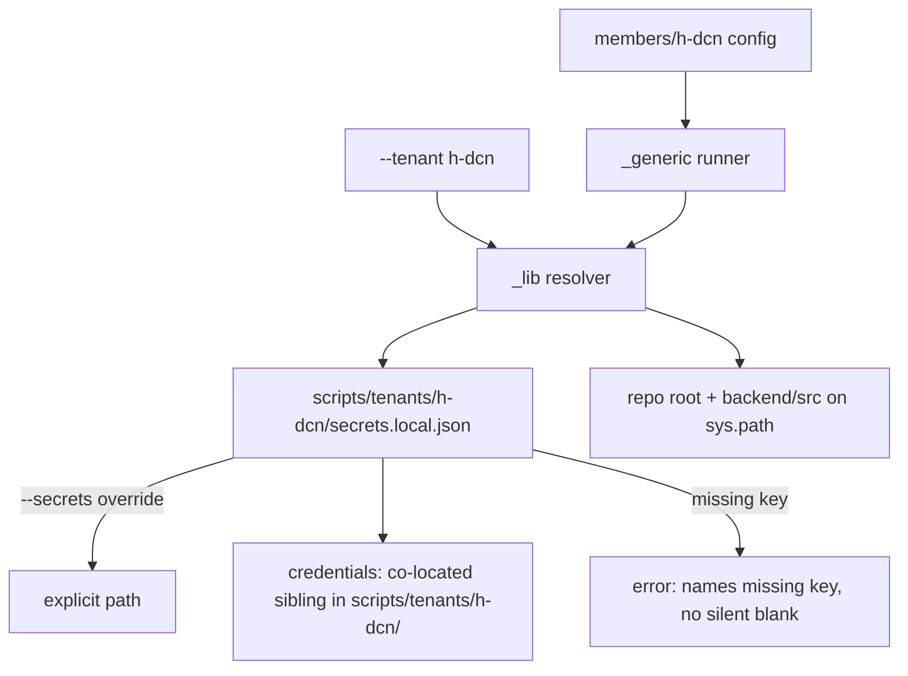

# Tenant-Onboarding Tooling — Design

> Phase 1 design. Companion to `requirements.md`. Documents the module-centric folder layout,
> the tenant-owned secrets layout, the shared `_lib` resolver contract, value precedence, and
> the git/scanner policy. Requirement references point back to the acceptance criteria.

## 1. Target folder structure (R1, R2)

Onboarding is organized **by module**, not by execution plane (R1.1) — so the onboarding root
sits directly under `scripts/`, with no `sam`/plane segment. Tenant-owned onboarding secrets
sit in a separate, tenant-wide tree (R2.1).

```
scripts/
  tenants/                        # tenant-wide, cross-module, cross-plane onboarding material (R2)
    README.md                     # committed — one-dir-per-tenant convention (R7.2)
    <tenant>/                     # e.g. h-dcn/
      secrets.example.json        # committed — non-secret template (R2.4)
      secrets.local.json          # git-ignored — real IDs + sibling credential filename (R2.4)
      <credential>.json           # git-ignored — co-located SA key, ownership self-evident (R2.3)
  onboarding/                     # module-centric onboarding tooling (R1.1)
    README.md                     # committed — the onboarding contract (R7.1)
    _lib/                         # shared resolver: path setup + secrets loader (R4)
      __init__.py
      paths.py
      secrets.py
    <module>/                     # e.g. members/
      _generic/                   # tenant-agnostic runners (R1.2)
        <runner>.py …
      <tenant>/                   # committed, module-specific tenant config (R1.2)
        ONBOARDING.md
        <config/loaders/data> …
```

Concrete Phase-1 instance (members pilot):

```
scripts/tenants/h-dcn/           secrets.example.json, secrets.local.json (ignored),
                                 google-service-account.json (ignored, co-located)
scripts/onboarding/_lib/         paths.py, secrets.py, __init__.py
scripts/onboarding/members/_generic/   provision-members-tables.py, backfill-hdcn-members.py,
                                 seed-hdcn-catalog.py, seed-hdcn-members-config.py,
                                 project-config-to-prod.py, load-cognito-users.py,
                                 cleanup-membernum-guard-rows.py,
                                 verify-member-scope-normalization.py, cognito-users.sample.json
scripts/onboarding/members/h-dcn/   ONBOARDING.md, members_config.json,
                                 members_source_mapping.csv, members_config_loader.py,
                                 members_mapping_loader.py
```

**Two axes, deliberately separated:**

- **`scripts/tenants/<tenant>/`** — per-tenant, **cross-module, cross-plane** onboarding
  material (the co-located credential + non-secret IDs). One tenant → one dir → reused by every
  module and plane (R2.1). Ownership is obvious from the path (R2.3).
- **`scripts/onboarding/<module>/`** — per-module onboarding tooling, split into `_generic/`
  (reusable runners, R1.2) and `<tenant>/` (that tenant's committed config for *this* module).

> **Why no plane in the path (R1.1):** a module implicitly determines the planes it touches —
> `members` spans the SAM/DynamoDB data plane, the Flask/MySQL config plane, and the Cognito
> identity plane. Encoding one plane (`aws`/`sam`) in the path mislabels the work and breaks the
> moment a module spans planes. The module name is the stable organizing key.

## 2. Resolution flow



## 3. `_lib` contract (R4)

Already implemented in Phase-1 Task 2; this records the contract. **Note:** the package was
first created at `scripts/sam/onboarding/_lib/` and will be relocated to
`scripts/onboarding/_lib/` to match R1.1 (import path `scripts.onboarding._lib`).

### 3.1 `paths.py` — robust sys.path setup (R4.1)

- `repo_root()` walks **up** from `__file__` until it finds a repo marker (`.git/`, or
  `backend/` + `sam/` + `.kiro/` together), rather than counting `os.path.dirname()` levels.
  Survives relocation to any depth. Raises a clear error if no marker is found up to `/`.
- `ensure_backend_src_on_path()` idempotently puts repo root + `backend/src` on `sys.path`.
  Replaces the per-script triple-`dirname` block.
- `import_by_path(name, file_path)` imports a module directly from a file path (for modules
  outside an importable package, e.g. the dashed `members/h-dcn/` loaders) (R4.2).

### 3.2 `secrets.py` — tenant secrets loader (R2/R3)

- `tenant_secrets_path(tenant, override=None)` → `--secrets` override wins verbatim; else the
  convention path `repo_root()/scripts/tenants/<tenant>/secrets.local.json`.
- `load_tenant_secrets(tenant, override=None)` → parsed dict; raises a clear error (naming the
  resolved path + the `--secrets` escape hatch) if the file is absent (R3.1).
- `require(secrets, key)` → the value for `key` (dotted keys supported); raises a clear error
  **naming the missing key** when absent or blank (R3.1). Never returns a default.
- Credential resolution (R2.3/R2.6):
  `credential_file(secrets, purpose, tenant, *, override=None, base_dir=None)` looks up
  `credentials.<purpose>.file` and resolves it **relative to the tenant dir** → an absolute path
  to the co-located, git-ignored key file. `override` (the runner's `--credentials`) wins
  verbatim; `base_dir` lets a relative filename resolve beside a `--secrets`-overridden file
  instead of the convention tenant dir; an absolute `file` value is honored as-is. A missing
  purpose/entry raises a clear named error (R3.1). Phase 1 resolves only the file-based `type`;
  the `type` tag is carried through but not branched on until another kind is needed.
- **gsheet key resolution on the backfill live-sheet path (two levels, no third fallback).**
  When `--source` is absent, the runner resolves the gsheet inputs with strict precedence:

  ```
  explicit CLI flag  >  tenant secrets.local.json (via --secrets or convention path)  >  loud named error
  ```

  - `sheet_id` — `--sheet-id`/`--sheet-name`, else `secrets.sheet_id`, else error naming the key.
  - `worksheet` — `--worksheet`, else `secrets.worksheet`; **absent is OK** (optional → first tab).
  - credential — `--credentials`, else `credentials.google_sheets.file` (co-located), else error.
  - The source-selection group is **not** argparse-required (secrets can supply `sheet_id`); the
    `--source` file path never consults secrets. The legacy external
    `DEFAULT_GOOGLE_CREDENTIALS_FILE` default is **removed** from the runner path (R2.3) — there
    is no silent fallback after the secrets file.

### 3.3 Precedence (R3.3)

```
explicit per-value CLI flag  >  secrets.local.json (via --secrets or convention path)  >  (error, never a silent default)
```

## 4. Secrets file shape (R2.3–R2.6)

`scripts/tenants/h-dcn/secrets.example.json` (committed; placeholders only). Credentials are a
**named map keyed by purpose** (R2.3); each file-based entry references its **co-located
sibling filename**, not an external path:

```jsonc
{
  "//": "Non-secret template. Copy to secrets.local.json (git-ignored) and fill real values.",
  "//creds": "Each credential's real file goes in THIS folder (git-ignored); name it in 'file'.",
  "credentials": {
    "google_sheets": {
      "type": "google_service_account",
      "file": "google-service-account.json"
    }
    // Future entries follow the same shape, resolved on demand (R2.6):
    // "source_api": { "type": "api_token", "file": "source-api-token.txt" },
    // "sftp":       { "type": "ssh_key",   "file": "sftp_id_ed25519" }
  },
  "sheet_id": "<SPREADSHEET_ID>",
  "worksheet": "Ledenbestand",
  "folder_ids": { "facturen": "<DRIVE_FOLDER_ID>" }
}
```

- A runner asks for a credential **by purpose** (e.g. `google_sheets`); the loader resolves
  `credentials.<name>.file` **relative to the tenant dir** → e.g. the real
  `scripts/tenants/h-dcn/google-service-account.json` (git-ignored, R2.3a). `--credentials
  <path>` overrides for edge cases.
- Phase 1 wires only the **file-based** type the pilot uses (R2.6); the `type` tag is a
  declarative hint so other kinds (env/token, ssh-key) slot in later without new fields.
- The default filename `google-service-account.json` is just a suggestion — the actual name is
  whatever the entry's `file` declares. The ignore-by-default rule (§5) catches any filename,
  so naming is not security-critical.
- These are **onboarding-only** credentials (R2.2) — never the production secret store.

## 5. Git & scanner policy (R6)

- **Ignore-by-default tenant secrets dir (R6.2/R2.5):** ignore the tenant folder contents, then
  explicitly un-ignore the committed template(s) + README. Sketch:

  ```gitignore
  # Tenant-wide onboarding secrets: ignore everything, keep the committed template + README.
  scripts/tenants/*/*
  !scripts/tenants/*/secrets.example.json
  !scripts/tenants/README.md
  !scripts/tenants/*/README.md
  ```

  This guarantees any credential file (named or not yet anticipated) is ignored by default.
- **Module config carve-out (R6.1):** the existing comment protecting the committed tenant
  config is retargeted from `scripts/aws/h-dcn/` to `scripts/onboarding/members/h-dcn/`.
- **`.gitguardian.yaml` (R6.3):** move the `scripts/aws/backfill-hdcn-members.py` ignore to
  `scripts/onboarding/members/_generic/backfill-hdcn-members.py` (same incident).
- `scripts/scan-secrets-local.sh` must stay clean after the move.

## 6. Migration mechanics (R5)

- Relocate `_lib` from `scripts/sam/onboarding/_lib/` → `scripts/onboarding/_lib/`; update the
  test import to `scripts.onboarding._lib` and re-run (Phase-1 adjustment from Task 2).
- Relocate module runners + config with `git mv` to preserve history (R5.3).
- After moving the loaders, update their internal `DEFAULT_CONFIG_PATH` / `_THIS_DIR` so
  `members_config.json` resolves from the new sibling location.
- Replace each runner's inline triple-`dirname` block with `_lib.paths.ensure_backend_src_on_path`.
- Replace `seed-hdcn-members-config.py`'s by-path loader import and
  `project-config-to-prod.py`'s by-path seed-script import with `_lib`-mediated imports.
- Fix the already-created `secrets.example.json` to the co-located `credentials_file` shape
  (§4) — it currently points at the superseded external path.
- Behavior preserved: dry-run-first defaults, every CLI flag intact (R5.1/R5.2).

## 7. Verification strategy

- `_lib` unit tests (relocated import path): convention path resolution, `--secrets` override
  precedence, missing-file error, missing-key error names the key.
- Loader smoke: `load_members_config()` + mapping CSV parse resolve from the new leaf.
- Each runner: `--help` + a **dry-run** (default; never `--apply`/`--reset` against a real
  table) to confirm imports and config/secrets load.
- `grep` shows no stale `scripts/aws/h-dcn`, `scripts/aws/<runner>`, or `scripts/sam/onboarding`
  references.
- `git check-ignore` confirms the credential + `secrets.local.json` are ignored while
  `secrets.example.json` + READMEs are tracked.
- Local secrets scan clean; `scripts/aws/h-dcn/` removed.

## 8. Deferred (not Phase 1)

- **Additional credential types.** The named-credentials map admits any `type`; wiring for
  env/token, ssh-key, etc. is added only when a tenant needs it (R2.6).
