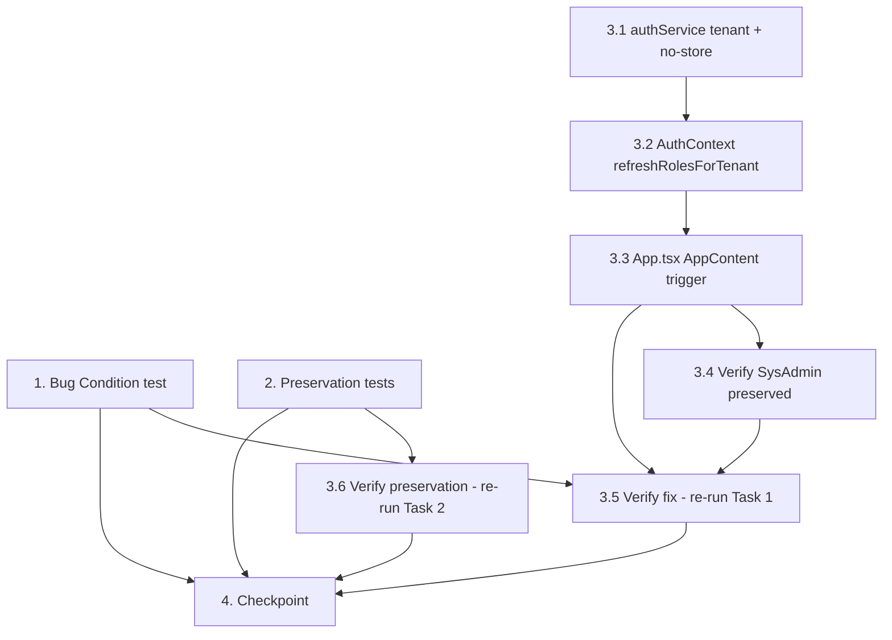

# Implementation Plan

## Overview

Frontend-only fix for stale roles after an in-app tenant switch. Today an in-app
tenant switch (no page reload) does not re-resolve the user's effective roles, so
`MainMenu` shows stale entries — over-showing items the new tenant shouldn't have
(e.g. `Tenantbeheer`/`Tenant_Admin`) and under-showing items it should
(e.g. `Leden Overzicht`/Members). The fix re-resolves roles on every switch by
re-invoking `GET /api/auth/me` with the new `X-Tenant` header (fresh, no-store),
updating only `user.roles` in place, guarding against out-of-order responses, and
preserving the JWT `cognito:groups` fallback and `SysAdmin`. No backend change.

## Task Dependency Graph

- **Task 1** (Bug Condition exploration test) and **Task 2** (Preservation tests) are
  independent pre-fix tests — both authored and run against UNFIXED code before any
  implementation.
- **Implementation chain**: `3.1 → 3.2 → 3.3` (authService support → AuthContext action
  → App.tsx trigger wiring).
- **Task 3.4** runs after `3.3` (SysAdmin preservation verification on the wired fix).
- **Task 3.5** depends on `3.3` and `3.4` and re-runs the Task 1 test (Fix Checking).
- **Task 3.6** re-runs the Task 2 tests (Preservation, no regressions).
- **Task 4** (Checkpoint) depends on all of the above.



```json
{
  "waves": [
    { "wave": 1, "tasks": ["1", "2", "3.1"] },
    { "wave": 2, "tasks": ["3.2"] },
    { "wave": 3, "tasks": ["3.3"] },
    { "wave": 4, "tasks": ["3.4"] },
    { "wave": 5, "tasks": ["3.5", "3.6"] },
    { "wave": 6, "tasks": ["4"] }
  ]
}
```

## Tasks

- [x] 1. Write bug condition exploration test (BEFORE implementing the fix)
  - **Property 1: Bug Condition** - Roles Re-resolved For Active Tenant On Switch
  - **CRITICAL**: This test MUST FAIL on unfixed code — failure confirms the bug exists (roles do not re-resolve on switch)
  - **DO NOT attempt to fix the test or the code when it fails** — the failure is the expected outcome at this step
  - **NOTE**: This test encodes the expected behavior; it will validate the fix once it passes after implementation
  - **GOAL**: Surface counterexamples demonstrating stale roles after an in-app tenant switch
  - **Scoped PBT Approach**: Scope to the concrete deterministic `h-dcn` failing cases for reproducibility (global roles include `Tenant_Admin`; `/api/auth/me` for `h-dcn` omits `Tenant_Admin` and includes a Members role absent from the JWT)
  - Create the test file under `frontend/src/` (e.g. `frontend/src/context/__tests__/tenantSwitchRoles.test.tsx` or alongside `AuthContext`), using Vitest + `@testing-library/react` + `msw`
  - Set up an `msw` handler for `GET /api/auth/me` that returns different effective roles depending on the `X-Tenant` request header (one role set for the origin tenant, a different set for `h-dcn`)
  - Render the provider stack (`AuthProvider` + `TenantProvider`, or the `AppContent` bridge) with `MainMenu`; drive a tenant switch via `setCurrentTenant`/`TenantSelector`
  - Assert (isBugCondition true, no reload, effective roles differ):
    - **Over-show (1.2)**: after switching to `h-dcn`, `Tenantbeheer` (`Tenant_Admin`) is hidden — FAILS on unfixed code (stays visible)
    - **Under-show (1.3)**: after switching to `h-dcn`, `Leden Overzicht` (Members) is shown — FAILS on unfixed code (missing)
    - **No refetch on switch (1.1, 1.4)**: `GET /api/auth/me` is invoked with `X-Tenant: h-dcn` after the switch — FAILS on unfixed code (never called; roles only corrected by reload)
  - Run against UNFIXED code: `cd frontend && npm run test:run`
  - **EXPECTED OUTCOME**: Test FAILS (this is correct — it proves the bug exists)
  - Document counterexamples found (e.g. "after switch to h-dcn, user.roles unchanged; Tenantbeheer still visible; /api/auth/me not called with X-Tenant: h-dcn")
  - Mark task complete when the test is written, run, and the failure is documented
  - _Requirements: 1.1, 1.2, 1.3, 1.4_

- [x] 2. Write preservation property tests (BEFORE implementing the fix)
  - **Property 2: Preservation** - Non-Switch And Unchanged-Role Behavior
  - **IMPORTANT**: Follow the observation-first methodology — record actual UNFIXED-code behavior, then assert it
  - Prefer **fast-check** property-based tests where the design recommends (generate random role sets / tenant sequences with an unchanged effective set and assert menu output equals the unfixed baseline)
  - Add tests (same Vitest + `msw` setup) capturing baseline behavior for non-bug-condition inputs:
    - **Single-tenant unchanged (3.1)**: a one-tenant user renders the same menu as today; no switch trigger fires — observe and assert
    - **Login/mount unchanged (3.2)**: initial `user.roles` populated by `checkAuthState()` on mount/login exactly as today; `refreshUserRoles()` still re-runs `checkAuthState()`
    - **Module-flag freshness + compound gating untouched (3.3)**: `useTenantModules`/`useTenantFunctions` still drive `hasFIN`/`hasSTR`/`hasZZP`/`hasMEMBERS`/`hasFunction`; the compound module-flag-AND-role gating in `MainMenu` is unchanged
    - **localStorage persistence (3.4)**: a switch still writes `selectedTenant` to `localStorage` and updates `currentTenant`
    - **No flicker on unchanged-role switch (3.5)**: switching between tenants with an identical effective role set produces no removal/re-add of still-valid entries (property-based over random unchanged-role sequences)
    - **Module-loss redirect unchanged (3.6)**: the App-level module-loss redirect in `App.tsx` behaves as today
  - Run against UNFIXED code: `cd frontend && npm run test:run`
  - **EXPECTED OUTCOME**: Tests PASS (this confirms the baseline behavior to preserve)
  - Mark task complete when the tests are written, run, and passing on unfixed code
  - _Requirements: 3.1, 3.2, 3.3, 3.4, 3.5, 3.6_

- [x] 3. Fix stale roles on in-app tenant switch (frontend only)

  - [x] 3.1 Add explicit-tenant + no-store support to `getCurrentUserRoles(tenant?)`
    - In `frontend/src/services/authService.ts`, add an optional `tenant?: string` parameter to `getCurrentUserRoles`
    - When `tenant` is provided, set the `X-Tenant` header from the argument; otherwise read from `localStorage` (login/mount path unchanged)
    - Pass `cache: 'no-store'` on the `GET /api/auth/me` fetch so the fresh response body is used (no stale/cached body)
    - Preserve the existing JWT `cognito:groups` fallback verbatim on non-OK response / network error
    - _Bug_Condition: isBugCondition(X) — in-app switch (reloaded=false) where effectiveRolesForToTenant differs from current user.roles_
    - _Expected_Behavior: resolveRolesOnSwitch'(X) = effectiveRolesFor(X.toTenant) via /api/auth/me with X-Tenant, from a fresh (no-store) body; JWT fallback on failure_
    - _Preservation: login/mount resolution via localStorage-derived tenant unchanged; JWT fallback unchanged_
    - _Requirements: 2.4, 2.5, 2.8_

  - [x] 3.2 Add `refreshRolesForTenant(tenant)` to `AuthContext`
    - In `frontend/src/context/AuthContext.tsx`, add a new imperative action `refreshRolesForTenant(tenant: string)` and expose it on `AuthContextValue`
    - Resolve roles for the supplied tenant via `getCurrentUserRoles(tenant)` and update ONLY `user.roles` in place: `setUser(prev => prev ? { ...prev, roles } : prev)` (leave email/name/tenants/sub untouched, no intermediate clear)
    - Add an out-of-order guard: capture `tenantAtStart = tenant`, use a cancelled flag, and apply the result only if the tenant is still current — mirroring the `useTenantModules` cancelled-flag + tenant-at-start pattern
    - On failure, fall back to JWT `cognito:groups` roles (via `getCurrentUserRoles`'s fallback) rather than emptying the set
    - Do NOT change `checkAuthState()`, its mount `useEffect([])`, or `refreshUserRoles()` (still re-runs `checkAuthState()` for login)
    - _Bug_Condition: isBugCondition(X) — in-app switch changing the effective role set_
    - _Expected_Behavior: user.roles set to effectiveRolesFor(X.toTenant); ('SysAdmin' IN globalRoles) IMPLIES ('SysAdmin' IN result); most-recent-tenant wins under rapid switches_
    - _Preservation: checkAuthState/refreshUserRoles/mount path untouched; atomic in-place update avoids flicker_
    - _Requirements: 2.1, 2.2, 2.3, 2.6, 3.2_

  - [x] 3.3 Wire the trigger in `App.tsx` `AppContent`
    - In `frontend/src/App.tsx` `AppContent` (which sits under both providers), read `currentTenant` from `useTenant()`
    - Add an effect keyed on `currentTenant` that calls `refreshRolesForTenant(currentTenant)` when a tenant is present, and skips when `currentTenant` is null
    - Return a cleanup that cancels the in-flight resolution (sets the cancelled flag consumed by the out-of-order guard)
    - Do NOT modify `TenantContext.tsx`, `MainMenu.tsx`, `useTenantModules.ts`, or `useTenantFunctions.ts`
    - _Bug_Condition: isBugCondition(X) — trigger fires on currentTenant change_
    - _Expected_Behavior: on every switch, /api/auth/me is re-invoked with the new X-Tenant and user.roles re-resolved; co-located with existing module/function refreshes_
    - _Preservation: null tenant skipped; login/mount path unaffected_
    - _Requirements: 2.1, 2.4_

  - [x] 3.4 Verify SysAdmin is preserved and roles are not stripped on the frontend
    - Confirm `SysAdmin` present in the global JWT `cognito:groups` remains in the resolved `user.roles` after a switch (no frontend stripping); `Systeembeheer` stays available on every tenant
    - This relies on the backend `/api/auth/me` merge — no backend change; verify only that the frontend does not remove `SysAdmin`
    - _Bug_Condition: isBugCondition(X) where 'SysAdmin' IN globalRoles_
    - _Expected_Behavior: ('SysAdmin' IN globalRoles) IMPLIES ('SysAdmin' IN result) for every active tenant_
    - _Requirements: 2.7_

  - [x] 3.5 Verify bug condition exploration test now passes (Fix Checking)
    - **Property 1: Expected Behavior** - Roles Re-resolved For Active Tenant On Switch
    - **IMPORTANT**: Re-run the SAME test from task 1 — do NOT write a new test
    - The test from task 1 encodes the expected behavior; when it passes, the bug is fixed
    - Extend fix-checking coverage to the full Fix Checking case set:
      - Roles re-resolved with correct `X-Tenant` (2.1, 2.4)
      - Over-show hidden — `Tenantbeheer` hidden on `h-dcn` (2.2)
      - Under-show shown — `Leden Overzicht` shown on `h-dcn` (2.3)
      - Freshness / no-store: applied roles come from the fresh response body (2.5)
      - Out-of-order guard: fire A → B → C with A delayed to arrive last; final `user.roles` equals C's effective roles (2.6)
      - SysAdmin preserved on every tenant (2.7)
      - Graceful JWT fallback on non-OK / network error; menu not cleared, no crash (2.8)
    - Run: `cd frontend && npm run test:run`
    - **EXPECTED OUTCOME**: Test PASSES (confirms the bug is fixed)
    - _Requirements: 2.1, 2.2, 2.3, 2.4, 2.5, 2.6, 2.7, 2.8_

  - [x] 3.6 Verify preservation tests still pass (no regressions)
    - **Property 2: Preservation** - Non-Switch And Unchanged-Role Behavior
    - **IMPORTANT**: Re-run the SAME tests from task 2 — do NOT write new tests
    - Run: `cd frontend && npm run test:run`
    - **EXPECTED OUTCOME**: Tests PASS (single-tenant, login/mount, module-flag freshness + compound gating, localStorage persistence, no-flicker on unchanged roles, and module-loss redirect all unchanged)
    - _Requirements: 3.1, 3.2, 3.3, 3.4, 3.5, 3.6_

- [x] 4. Checkpoint - Ensure all tests pass
  - Run the full frontend suite: `cd frontend && npm run test:run`
  - Confirm all tests are green (both fix-checking and preservation), with no regressions
  - Do NOT use `get_diagnostics` — judge success from the vitest run output only
  - If any test fails, diagnose and resolve before completing; ask the user if questions arise
  - _Requirements: 2.1, 2.2, 2.3, 2.4, 2.5, 2.6, 2.7, 2.8, 3.1, 3.2, 3.3, 3.4, 3.5, 3.6_

## Notes

- **Scope**: Frontend-only. The fix touches `frontend/src/services/authService.ts`,
  `frontend/src/context/AuthContext.tsx`, and `frontend/src/App.tsx` (`AppContent`).
  No backend change — role merge and `SysAdmin` handling stay in the existing
  `GET /api/auth/me` endpoint.
- **Do NOT modify**: `TenantContext.tsx`, `MainMenu.tsx`, `useTenantModules.ts`,
  `useTenantFunctions.ts` (only consumed, not changed).
- **Test runner**: Vitest via `cd frontend && npm run test:run` (single run, not watch),
  with `@testing-library/react` + `msw`, and `fast-check` for property-based cases.
- **Verification**: Judge success from the vitest run output only. Do NOT call
  `get_diagnostics` (blocking approval loop in this environment).
- **Methodology**: Bug Condition exploration test (Task 1) must FAIL on unfixed code;
  Preservation tests (Task 2) must PASS on unfixed code. After the fix, Task 3.5 re-runs
  Task 1 (now passes) and Task 3.6 re-runs Task 2 (still passes).
