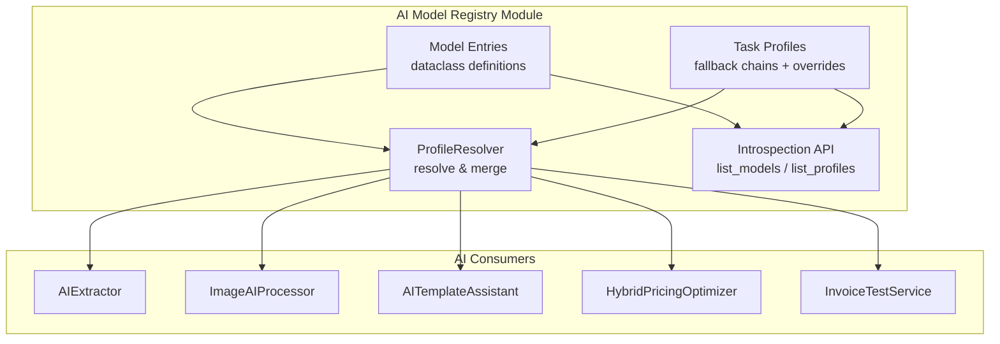
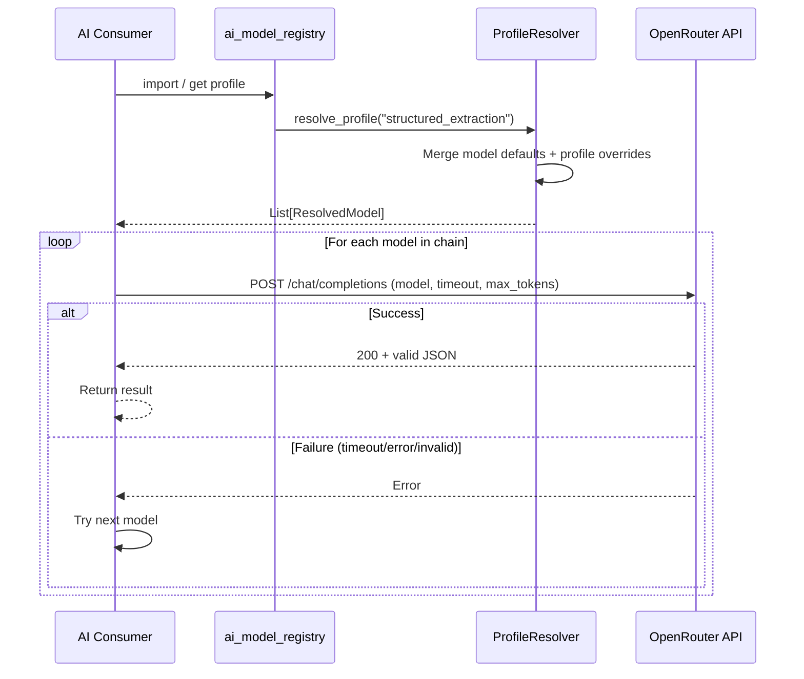

# Design Document: AI Model Registry

## Overview

The AI Model Registry centralizes all OpenRouter model configuration into a single Python module (`backend/src/services/ai_model_registry.py`). It replaces hardcoded model fallback chains scattered across five consumer modules with a structured registry of model entries and task-based profiles.

The registry is a **pure in-memory configuration module** — no database, no external API calls, no I/O at runtime. It loads at import time, validates referential integrity immediately, and exposes a `ProfileResolver` that consumers call to get their resolved fallback chain.

### Design Decisions

| Decision                      | Rationale                                                                                                          |
| ----------------------------- | ------------------------------------------------------------------------------------------------------------------ |
| Single module, no DB storage  | Models change rarely; code-level config enables version control, PR reviews, and import-time validation            |
| Dataclass-based model entries | Type safety, immutability, IDE support                                                                             |
| Profile-level overrides       | Different tasks need different timeouts (vision needs 15s, extraction needs 10s) without polluting global defaults |
| Import-time validation        | Fail fast on startup rather than at request time — broken configs never reach production                           |
| No singleton pattern          | Module-level instances; Python module caching provides natural singleton behavior                                  |

## Architecture



### Data Flow



## Components and Interfaces

### Component 1: ModelEntry (Dataclass)

```python
from dataclasses import dataclass
from typing import Literal

CostTier = Literal["free", "cheap", "paid"]


@dataclass(frozen=True)
class ModelEntry:
    """Immutable definition of a single AI model."""
    model_id: str                    # OpenRouter model identifier
    cost_tier: CostTier              # "free", "cheap", or "paid"
    max_tokens: int                  # 1–16384
    default_timeout: int             # 1–300 seconds
    supports_vision: bool            # Whether model supports image input
```

### Component 2: TaskProfile (Dataclass)

```python
from dataclasses import dataclass, field
from typing import Dict, Optional


@dataclass(frozen=True)
class ModelOverride:
    """Per-model parameter overrides within a profile."""
    timeout: Optional[int] = None    # 1–600 if specified
    max_tokens: Optional[int] = None # 1–16384 if specified


@dataclass(frozen=True)
class TaskProfile:
    """Named profile mapping a task type to an ordered fallback chain."""
    name: str                                           # Unique profile name
    fallback_chain: tuple                               # Ordered tuple of model_id strings (1–10)
    overrides: Dict[str, ModelOverride] = field(default_factory=dict)  # model_id → override
```

### Component 3: ResolvedModel (Dataclass)

```python
@dataclass(frozen=True)
class ResolvedModel:
    """Fully resolved model configuration for a consumer to use."""
    model_id: str
    timeout: int          # Resolved: override if present, else model default
    max_tokens: int       # Resolved: override if present, else model default
    cost_tier: CostTier
    supports_vision: bool
```

### Component 4: ProfileResolver

```python
class ProfileResolver:
    """Resolves task profiles into ordered lists of fully-configured models."""

    def __init__(self, models: Dict[str, ModelEntry], profiles: Dict[str, TaskProfile]):
        self._models = models
        self._profiles = profiles

    def resolve_profile(self, profile_name: str) -> list[ResolvedModel]:
        """Resolve a profile name to its ordered fallback chain.

        Args:
            profile_name: The task profile to resolve (case-sensitive).

        Returns:
            Ordered list of ResolvedModel instances.

        Raises:
            RegistryError: If profile_name is not registered.
        """
        ...

    def list_models(self) -> list[ModelEntry]:
        """Return all registered model entries."""
        ...

    def list_profiles(self) -> list[str]:
        """Return all registered profile names."""
        ...

    def get_profile_detail(self, profile_name: str) -> list[dict]:
        """Return detailed profile info including override indicators.

        Raises:
            RegistryError: If profile_name is not registered.
        """
        ...
```

### Component 5: RegistryError

```python
class RegistryError(Exception):
    """Raised for registry validation or resolution errors."""
    pass
```

### Component 6: Registry Validation (module-level)

```python
def _validate_model_entry(entry: ModelEntry) -> None:
    """Validate a single ModelEntry's attributes.

    Raises RegistryError for:
    - cost_tier not in ("free", "cheap", "paid")
    - max_tokens not in [1, 16384]
    - default_timeout not in [1, 300]
    """
    ...


def _validate_profile(profile: TaskProfile, models: Dict[str, ModelEntry]) -> None:
    """Validate a TaskProfile against registered models.

    Raises RegistryError for:
    - Empty fallback_chain or len > 10
    - Model_Identifier not in models dict
    - Duplicate model_ids in chain
    - Override referencing model not in chain
    - Override values out of range (timeout: 1-600, max_tokens: 1-16384)
    """
    ...
```

### Component 7: Module-Level Registry Instance

```python
# --- Model Definitions ---
MODELS: Dict[str, ModelEntry] = {}

def _register_model(model_id: str, cost_tier: CostTier, max_tokens: int,
                    default_timeout: int, supports_vision: bool) -> None:
    """Register a model entry. Raises RegistryError on duplicate or invalid attributes."""
    ...

# Register all models
_register_model("deepseek/deepseek-chat", "cheap", 4096, 10, False)
_register_model("meta-llama/llama-3.2-3b-instruct:free", "free", 4096, 10, False)
_register_model("moonshotai/kimi-k2:free", "free", 4096, 10, False)
_register_model("google/gemini-flash-1.5", "free", 4096, 10, False)
_register_model("microsoft/phi-3-mini-128k-instruct:free", "free", 4096, 10, False)
_register_model("openai/gpt-3.5-turbo", "paid", 4096, 10, False)
_register_model("openai/gpt-4o-mini", "cheap", 4096, 15, True)
_register_model("google/gemini-2.0-flash-exp:free", "free", 4096, 15, True)
_register_model("anthropic/claude-3-haiku", "cheap", 4096, 15, True)
_register_model("anthropic/claude-3.5-sonnet", "paid", 4096, 15, False)

# --- Profile Definitions ---
PROFILES: Dict[str, TaskProfile] = {}

# Task profiles with overrides
PROFILES["structured_extraction"] = TaskProfile(
    name="structured_extraction",
    fallback_chain=(
        "deepseek/deepseek-chat",
        "meta-llama/llama-3.2-3b-instruct:free",
        "moonshotai/kimi-k2:free",
        "google/gemini-flash-1.5",
        "microsoft/phi-3-mini-128k-instruct:free",
        "openai/gpt-3.5-turbo",
    ),
    overrides={
        "deepseek/deepseek-chat": ModelOverride(max_tokens=500),
        "openai/gpt-3.5-turbo": ModelOverride(max_tokens=500),
    }
)

PROFILES["vision"] = TaskProfile(
    name="vision",
    fallback_chain=(
        "openai/gpt-4o-mini",
        "google/gemini-2.0-flash-exp:free",
        "anthropic/claude-3-haiku",
    ),
    overrides={
        "openai/gpt-4o-mini": ModelOverride(max_tokens=500, timeout=15),
    }
)

PROFILES["text_generation"] = TaskProfile(
    name="text_generation",
    fallback_chain=(
        "deepseek/deepseek-chat",
        "google/gemini-flash-1.5",
        "openai/gpt-3.5-turbo",
    ),
    overrides={}
)

PROFILES["template_assistance"] = TaskProfile(
    name="template_assistance",
    fallback_chain=(
        "google/gemini-flash-1.5",
        "meta-llama/llama-3.2-3b-instruct:free",
        "deepseek/deepseek-chat",
        "anthropic/claude-3.5-sonnet",
    ),
    overrides={
        "deepseek/deepseek-chat": ModelOverride(max_tokens=2000),
        "anthropic/claude-3.5-sonnet": ModelOverride(max_tokens=2000, timeout=20),
    }
)

PROFILES["recommendation"] = TaskProfile(
    name="recommendation",
    fallback_chain=(
        "openai/gpt-3.5-turbo",
        "moonshotai/kimi-k2:free",
    ),
    overrides={
        "openai/gpt-3.5-turbo": ModelOverride(max_tokens=1500, timeout=15),
        "moonshotai/kimi-k2:free": ModelOverride(max_tokens=1500, timeout=15),
    }
)

# --- Validate all at import time ---
for model in MODELS.values():
    _validate_model_entry(model)
for profile in PROFILES.values():
    _validate_profile(profile, MODELS)

# --- Expose resolver instance ---
resolver = ProfileResolver(MODELS, PROFILES)
```

### Consumer Integration Pattern

Each consumer is refactored to import and call the resolver:

```python
# In any consumer (e.g., AIExtractor)
from services.ai_model_registry import resolver, RegistryError, ResolvedModel

class AIExtractor:
    def extract_invoice_data(self, text_content, vendor_hint=None, previous_transactions=None):
        try:
            chain = resolver.resolve_profile("structured_extraction")
        except RegistryError as e:
            return {"error": f"Registry unavailable: {e}"}

        for model in chain:
            try:
                response = requests.post(
                    self.base_url,
                    json={"model": model.model_id, "max_tokens": model.max_tokens, ...},
                    timeout=model.timeout,
                )
                # ... process response ...
            except requests.exceptions.Timeout:
                continue
            except Exception:
                continue

        return {"error": "AI extraction failed: invalid response format"}
```

## Data Models

### ModelEntry Attributes

| Attribute       | Type                           | Constraints                       | Description                          |
| --------------- | ------------------------------ | --------------------------------- | ------------------------------------ |
| model_id        | str                            | Non-empty, unique across registry | OpenRouter model identifier          |
| cost_tier       | Literal["free","cheap","paid"] | Must be one of three values       | Pricing classification               |
| max_tokens      | int                            | 1 ≤ value ≤ 16384                 | Default maximum tokens for responses |
| default_timeout | int                            | 1 ≤ value ≤ 300                   | Default request timeout in seconds   |
| supports_vision | bool                           | True/False                        | Whether model accepts image input    |

### TaskProfile Attributes

| Attribute      | Type                     | Constraints                                      | Description                   |
| -------------- | ------------------------ | ------------------------------------------------ | ----------------------------- |
| name           | str                      | Unique across profiles                           | Profile identifier            |
| fallback_chain | tuple[str, ...]          | 1 ≤ len ≤ 10, all exist in MODELS, no duplicates | Ordered model identifiers     |
| overrides      | Dict[str, ModelOverride] | Keys must be in fallback_chain                   | Per-model parameter overrides |

### ModelOverride Attributes

| Attribute  | Type          | Constraints                    | Description                                 |
| ---------- | ------------- | ------------------------------ | ------------------------------------------- |
| timeout    | Optional[int] | 1 ≤ value ≤ 600 if specified   | Override timeout (wider range than default) |
| max_tokens | Optional[int] | 1 ≤ value ≤ 16384 if specified | Override max tokens                         |

### ResolvedModel Attributes

| Attribute       | Type     | Source                                 | Description          |
| --------------- | -------- | -------------------------------------- | -------------------- |
| model_id        | str      | ModelEntry                             | Model identifier     |
| timeout         | int      | Override or ModelEntry.default_timeout | Effective timeout    |
| max_tokens      | int      | Override or ModelEntry.max_tokens      | Effective max tokens |
| cost_tier       | CostTier | ModelEntry                             | Pricing tier         |
| supports_vision | bool     | ModelEntry                             | Vision support flag  |

## Correctness Properties

_A property is a characteristic or behavior that should hold true across all valid executions of a system — essentially, a formal statement about what the system should do. Properties serve as the bridge between human-readable specifications and machine-verifiable correctness guarantees._

### Property 1: Model_Entry attribute validation

_For any_ combination of cost_tier, max_tokens, and default_timeout values, the registry SHALL accept entries where cost_tier is in {"free", "cheap", "paid"}, max_tokens is in [1, 16384], and default_timeout is in [1, 300], and SHALL reject entries where any attribute is outside these bounds.

**Validates: Requirements 1.1**

### Property 2: Duplicate model rejection

_For any_ Model_Identifier string, registering it once SHALL succeed, and registering it a second time SHALL always raise a RegistryError that names the duplicate identifier.

**Validates: Requirements 1.2**

### Property 3: Model registration round-trip

_For any_ valid ModelEntry (model_id, cost_tier, max_tokens, default_timeout, supports_vision), after registration, retrieving the model by its identifier SHALL return an object with identical attribute values.

**Validates: Requirements 1.3, 3.1, 12.1**

### Property 4: Unknown identifier/profile raises descriptive error

_For any_ string that does not match a registered Model_Identifier or Task_Profile name, attempting retrieval/resolution SHALL raise a RegistryError whose message contains the requested name and lists available alternatives.

**Validates: Requirements 1.4, 3.2, 12.4**

### Property 5: Fallback chain length validation

_For any_ list of valid Model_Identifier references, the registry SHALL accept it as a fallback chain if and only if its length is between 1 and 10 inclusive.

**Validates: Requirements 2.1**

### Property 6: Referential integrity

_For any_ Task_Profile definition, if any Model_Identifier in its fallback_chain does not exist in the model registry, validation SHALL raise a RegistryError naming the invalid identifier and the profile.

**Validates: Requirements 2.3, 2.4, 10.3**

### Property 7: Order preservation in fallback chains

_For any_ Task_Profile with a defined fallback_chain ordering, the resolved chain SHALL return models in the exact same order as defined.

**Validates: Requirements 2.5, 3.3**

### Property 8: No duplicate models within a chain

_For any_ fallback_chain containing duplicate Model_Identifier entries, the registry SHALL reject the profile definition with a validation error.

**Validates: Requirements 2.6**

### Property 9: Override precedence

_For any_ model in a resolved profile, if the profile defines a timeout or max_tokens override for that model, the resolved value SHALL equal the override; if no override is defined, the resolved value SHALL equal the model's default.

**Validates: Requirements 4.1, 4.2**

### Property 10: Override value range validation

_For any_ override timeout value outside [1, 600] or max_tokens value outside [1, 16384], the registry SHALL reject the profile with a RegistryError naming the invalid parameter, model, and acceptable range.

**Validates: Requirements 4.3, 4.5**

### Property 11: Orphaned override rejection

_For any_ profile whose overrides dict contains a Model_Identifier key that is not in the profile's fallback_chain, validation SHALL raise a RegistryError naming the orphaned model identifier.

**Validates: Requirements 4.4**

### Property 12: Fallback iteration — first success wins

_For any_ sequence of model outcomes where model at index N succeeds and all models at indices 0..N-1 fail (timeout, API error, or invalid response), the consumer SHALL return the result from model N and SHALL have attempted all models 0..N-1 in chain order.

**Validates: Requirements 5.2, 11.2**

### Property 13: Vision profile invariant

_For any_ model in the resolved "vision" Task_Profile, the model's supports_vision attribute SHALL be True.

**Validates: Requirements 6.2**

### Property 14: Terminal failure structure

_For any_ consumer where all models in the fallback chain fail, the returned value SHALL match the consumer-specific failure contract: error dict with "error" key for AIExtractor, None for ImageAIProcessor vision path, dict with success=False for AITemplateAssistant, None for HybridPricingOptimizer.

**Validates: Requirements 11.3**

### Property 15: Introspection completeness

_For any_ set of N registered models and M registered profiles, list_models() SHALL return exactly N entries and list_profiles() SHALL return exactly M names, with no omissions.

**Validates: Requirements 12.1, 12.2**

## Error Handling

### Registry-Level Errors (Import Time)

| Error Condition                   | Behavior                                    | Raised By                 |
| --------------------------------- | ------------------------------------------- | ------------------------- |
| Duplicate Model_Identifier        | RegistryError with duplicate id             | `_register_model()`       |
| Invalid model attributes          | RegistryError with attribute name + range   | `_validate_model_entry()` |
| Empty or oversized fallback chain | RegistryError with chain length + limits    | `_validate_profile()`     |
| Unknown model ref in profile      | RegistryError with model_id + profile name  | `_validate_profile()`     |
| Duplicate model in chain          | RegistryError with model_id + profile name  | `_validate_profile()`     |
| Orphaned override                 | RegistryError with model_id + profile name  | `_validate_profile()`     |
| Override value out of range       | RegistryError with param + model_id + range | `_validate_profile()`     |

### Resolution-Level Errors (Runtime)

| Error Condition                  | Behavior                                     | Raised By           |
| -------------------------------- | -------------------------------------------- | ------------------- |
| Unknown profile name             | RegistryError with name + available profiles | `resolve_profile()` |
| Unknown model id (direct lookup) | RegistryError with id + available models     | `get_model()`       |

### Consumer-Level Error Handling

| Consumer               | Registry Error                                                 | All Models Fail                                                     |
| ---------------------- | -------------------------------------------------------------- | ------------------------------------------------------------------- |
| AIExtractor            | Return `{"error": "Registry unavailable: ..."}`                | Return `{"error": "AI extraction failed: invalid response format"}` |
| ImageAIProcessor       | Return None (proceed to Tesseract)                             | Return None (proceed to Tesseract)                                  |
| AITemplateAssistant    | Return `{"success": False, "error": "AI service unavailable"}` | Return `{"success": False, "error": "All models failed"}`           |
| HybridPricingOptimizer | Log error, return None                                         | Return None                                                         |
| InvoiceTestService     | Append error with stage="registry_resolution"                  | Return error from underlying AIExtractor                            |

## Testing Strategy

### Property-Based Tests (Hypothesis)

The registry's pure, deterministic logic is ideal for property-based testing. Each correctness property maps to a Hypothesis test with minimum 100 iterations.

**Library**: `hypothesis` (already installed and used extensively in this project)

**Configuration**:

- Minimum 100 examples per property (`@settings(max_examples=100)`)
- Each test tagged with: `# Feature: ai-model-registry, Property N: <title>`
- Test file: `backend/tests/unit/test_ai_model_registry_props.py`

**Generators (Hypothesis strategies)**:

- `st_model_id()`: Random strings matching OpenRouter model format (`provider/model-name`)
- `st_cost_tier()`: `st.sampled_from(["free", "cheap", "paid"])`
- `st_max_tokens()`: `st.integers(min_value=1, max_value=16384)`
- `st_timeout()`: `st.integers(min_value=1, max_value=300)`
- `st_model_entry()`: Composite strategy building valid ModelEntry instances
- `st_fallback_chain()`: `st.lists(st_model_id(), min_size=1, max_size=10, unique=True)`

**Properties to implement**:

1. Attribute validation (Property 1)
2. Duplicate rejection (Property 2)
3. Registration round-trip (Property 3)
4. Unknown identifier error (Property 4)
5. Chain length validation (Property 5)
6. Referential integrity (Property 6)
7. Order preservation (Property 7)
8. No duplicates in chain (Property 8)
9. Override precedence (Property 9)
10. Override range validation (Property 10)
11. Orphaned override rejection (Property 11)
12. Fallback iteration (Property 12)
13. Vision profile invariant (Property 13)
14. Terminal failure structure (Property 14)
15. Introspection completeness (Property 15)

### Unit Tests (Example-Based)

**File**: `backend/tests/unit/test_ai_model_registry.py`

| Test                                   | What it verifies                                                                                          |
| -------------------------------------- | --------------------------------------------------------------------------------------------------------- |
| Required profiles exist                | "structured_extraction", "vision", "text_generation", "template_assistance", "recommendation" all resolve |
| Vision models all support vision       | Static check on actual profile data                                                                       |
| AIExtractor registry error handling    | Returns error dict when registry raises                                                                   |
| ImageAIProcessor fallback to Tesseract | Returns None on vision chain exhaustion                                                                   |
| AITemplateAssistant registry error     | Returns success=False without API calls                                                                   |
| HybridPricingOptimizer fallback        | Returns None, logs error                                                                                  |
| InvoiceTestService error stage         | Returns errors with "registry_resolution" stage                                                           |
| No hardcoded model strings             | Static analysis of consumer source files                                                                  |

### Integration Tests

**File**: `backend/tests/integration/test_ai_model_registry_integration.py`

- Full pipeline dry-run with registry resolution
- Verify consumers use resolved timeout/max_tokens in HTTP calls (via request mock)
- Verify AIUsageTracker receives correct model_used from resolved chain

### Test Markers

```python
@pytest.mark.unit          # Property and unit tests
@pytest.mark.integration   # Integration tests with mocked HTTP
```
