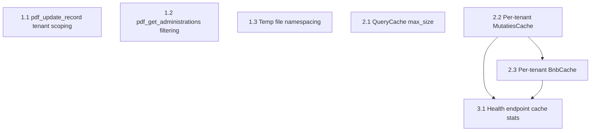

# Tasks

Executor: Kiro (AI) with user review/approval.

## Dependency Graph

**Independent (can start anytime):** 1.1, 1.2, 1.3, 2.1
**Sequential:** 2.2 → 2.3 (same pattern, do MutatiesCache first) → 3.1 (needs per-tenant structure)

---

## Phase 1: Tenant Isolation (Security) — ~2 hours

### Task 1.1 — Fix `pdf_update_record` tenant scoping (~1 hour)

**Files:** `backend/src/routes/pdf_validation_routes.py`, `backend/src/pdf_validation.py`
**Requires:** REQ-1.1

- [x] Add `@tenant_required()` decorator to `pdf_update_record`
- [x] Update function signature to accept `tenant, user_tenants`
- [x] Update `PDFValidator.update_record()` to accept `administration` parameter
- [x] Add `AND administration = %s` to the UPDATE query WHERE clause
- [x] Pass `tenant` from route handler to validator
- [x] Verify: update succeeds for own tenant's records
- [x] Verify: update returns 403 for another tenant's records

### Task 1.2 — Fix `pdf_get_administrations` filtering (~30 min)

**Files:** `backend/src/routes/pdf_validation_routes.py`
**Requires:** REQ-1.2

- [x] Add `@tenant_required()` decorator to `pdf_get_administrations`
- [x] Update function signature to accept `tenant, user_tenants`
- [x] Filter returned list: `[a for a in administrations if a in user_tenants]`
- [x] Verify: only accessible administrations returned
- [x] Verify: multi-tenant user sees all their allowed administrations

### Task 1.3 — Fix temp file collision (~30 min)

**Files:** `backend/src/routes/invoice_routes.py`
**Requires:** REQ-1.3

- [x] Add `import uuid` to invoice_routes.py
- [x] Generate unique temp filename: `f"{tenant}_{uuid.uuid4().hex[:8]}_{filename}"`
- [x] Keep original `filename` for Ref4 metadata and Drive upload name
- [x] Verify `move_file_to_folder` and `cleanup_temp_file` work with new path
- [x] Verify: two concurrent uploads with same filename don't collide

---

## Phase 2: Memory Stability — ~8 hours

### Task 2.1 — Add max_size to QueryCache (~1 hour)

**Files:** `backend/src/duplicate_query_optimizer.py`
**Requires:** REQ-2.1

- [x] Add `max_size` parameter to `QueryCache.__init__()` (default: 500)
- [x] Implement `_evict_oldest()` method (remove entry with earliest expiry)
- [x] Call eviction in `set()` when at capacity
- [x] Add `evictions` counter to stats
- [x] Verify: cache stays within bounds under load
- [x] Verify: duplicate detection accuracy unchanged

### Task 2.2 — Per-tenant MutatiesCache (~4–6 hours)

**Files:** `backend/src/mutaties_cache.py`, callers in route handlers
**Requires:** REQ-2.2
**Depends on:** None (but do before 2.3)

- [x] Define `TenantCacheEntry` dataclass (data, last_accessed, last_loaded, years_loaded)
- [x] Replace `self.data` with `self._tenant_data: Dict[str, TenantCacheEntry]`
- [x] Update `_refresh()` to accept and filter by tenant
- [x] Update `_ensure_years_loaded()` to work per-tenant
- [x] Update `get_data()` signature: add required `tenant` parameter
- [x] Update `get_snapshot()` signature to match
- [x] Add eviction: remove tenants not accessed for 2× TTL
- [x] Update all callers to pass `tenant`:
  - [x] `aangifte_ib_routes.py`
  - [x] `report_routes.py`
  - [x] Other routes using `get_cache().get_data(db)`
- [x] Add `get_stats()` → tenants loaded, total rows, memory MB
- [x] Verify: reports return same results as before
- [x] Verify: inactive tenant evicted after 2× TTL
- [x] Verify: thread safety under concurrent access

### Task 2.3 — Per-tenant BnbCache (~2–3 hours)

**Files:** `backend/src/bnb_cache.py`, callers in STR/BNB routes
**Requires:** REQ-2.3
**Depends on:** Task 2.2 (establishes the pattern)

- [x] Apply same TenantCacheEntry pattern from 2.2
- [x] Replace `self.data` with tenant-keyed dict
- [x] Update `get_data()` and `refresh()` to accept tenant
- [x] Add `WHERE administration = %s` (or equivalent view filter)
- [x] Add eviction for inactive tenants
- [x] Update callers in `str_routes.py` and BNB analytics endpoints
- [x] Add `get_stats()` method
- [x] Verify: BNB analytics return correct per-tenant data
- [x] Verify: inactive tenant eviction works

---

## Phase 3: Observability — ~1 hour

### Task 3.1 — Surface cache stats in health endpoint (~1 hour)

**Files:** `backend/src/routes/system_health_routes.py`
**Requires:** REQ-3.1
**Depends on:** Tasks 2.2, 2.3 (needs per-tenant stats)

- [x] Import cache singletons (get_cache, get_bnb_cache, get_query_cache or equivalent)
- [x] Add `caches` section to health response with stats from each cache
- [x] Add process RSS via `psutil.Process().memory_info().rss`
- [x] Add env var `MEMORY_ALERT_THRESHOLD_MB` (default: 512)
- [x] Include alert flag when RSS exceeds threshold
- [x] Verify: health endpoint returns correct cache stats
- [x] Verify: alert triggers at threshold
