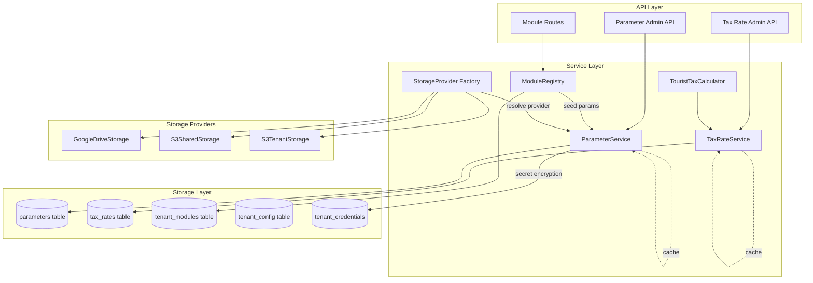
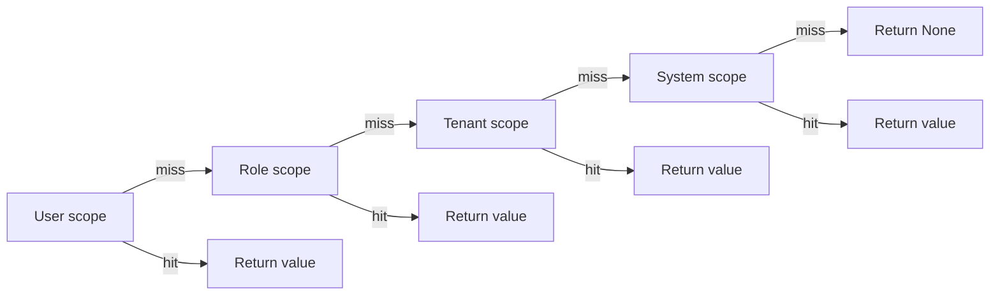
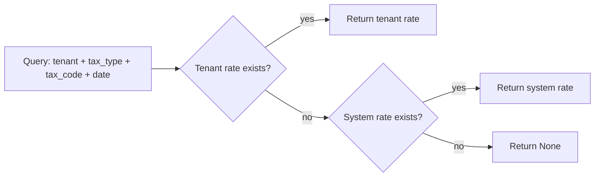

# Design Document: Parameter-Driven Configuration

## Overview

This design introduces a parameter-driven configuration architecture for myAdmin, replacing hardcoded values scattered across the codebase with a structured, database-backed parameter system. The architecture uses three distinct parameter shapes:

1. **Flat parameters** — key-value pairs with scope inheritance (user → role → tenant → system) stored in a new `parameters` table
2. **Time-versioned tax rates** — structured rates with effective date ranges and tenant fallback stored in a new `tax_rates` table
3. **Calculated rates** — extending tax rates with municipality-specific calculation methods (percentage, fixed per guest per night, etc.) via `calc_method` and `calc_params` columns

The system is designed for incremental deployment on the main branch. New tables and services are additive — they do not modify or remove existing tables, services, or API endpoints. Existing mechanisms (`tenant_config`, `tenant_credentials`, `rekeningschema.parameters`, `tenant_modules`) remain operational throughout migration.

### Key Design Decisions

| Decision                | Choice                                          | Rationale                                                                                             |
| ----------------------- | ----------------------------------------------- | ----------------------------------------------------------------------------------------------------- |
| Parameter storage       | New `parameters` table                          | `tenant_config` lacks scope, namespace, and value_type; migration would break existing CRUD routes    |
| Tax rate storage        | New `tax_rates` table                           | Rates need temporal dimension + multiple codes per type; doesn't fit flat key-value model             |
| Module registry         | In-code Python dict                             | Adding a module is always a dev effort (routes, services); registry entry is part of that code change |
| Cache strategy          | In-process dict with write-through invalidation | Sufficient for current scale; no Redis/EventBridge needed                                             |
| Tourist tax rates       | Always tenant-specific                          | Municipality-specific; no meaningful system default                                                   |
| BTW accommodation rates | Tenant-configured, not seeded                   | Rate and change date depend on tenant's STR operations                                                |
| Storage abstraction     | Strategy pattern with factory                   | Allows Google Drive, S3 shared, S3 tenant without code changes                                        |
| Deployment              | Incremental on main branch                      | Each change is small, testable, independently deployable                                              |

## Architecture



### Scope Inheritance Resolution



### Tax Rate Resolution



## Components and Interfaces

### 1. ParameterService

Resolves flat key-value parameters by walking the scope inheritance chain with in-process caching.

Location: `backend/src/services/parameter_service.py`

```python
class ParameterService:
    def __init__(self, db: DatabaseManager, credential_service: CredentialService = None):
        self._cache: Dict[tuple, Any] = {}
        self.db = db
        self.credential_service = credential_service

    def get_param(self, namespace: str, key: str, tenant: str = None,
                  role: str = None, user: str = None) -> Any:
        """
        Resolve parameter value by walking scope chain: user → role → tenant → system.
        Returns None if no value found at any scope.
        """

    def set_param(self, scope: str, scope_id: str, namespace: str, key: str,
                  value: Any, value_type: str = 'string', is_secret: bool = False,
                  created_by: str = None) -> None:
        """
        Write parameter value at specified scope. Invalidates cache for this key.
        Encrypts value via CredentialService if is_secret=True.
        """

    def delete_param(self, scope: str, scope_id: str, namespace: str, key: str) -> bool:
        """
        Delete parameter override at specified scope. Invalidates cache.
        """

    def get_params_by_namespace(self, namespace: str, tenant: str) -> List[dict]:
        """
        Return all parameters in a namespace for a tenant, with scope origin indicator.
        Used by the admin API to show where each value comes from.
        """

    def seed_module_params(self, tenant: str, module_name: str) -> int:
        """
        Seed required parameters for a module from ModuleRegistry defaults.
        Only seeds params that don't already have a tenant-level value.
        Returns count of params seeded.
        """

    def _invalidate_cache(self, namespace: str, key: str) -> None:
        """Remove all cache entries matching this namespace+key across all scopes."""

    def _resolve_from_db(self, scope: str, scope_id: str,
                         namespace: str, key: str) -> Any:
        """Query the parameters table for a specific scope+key combination."""
```

### 2. TaxRateService

Looks up time-versioned tax rates with tenant → `_system_` fallback.

Location: `backend/src/services/tax_rate_service.py`

```python
class TaxRateService:
    def __init__(self, db: DatabaseManager):
        self._cache: Dict[tuple, Any] = {}
        self.db = db

    def get_tax_rate(self, administration: str, tax_type: str, tax_code: str,
                     reference_date: date) -> Optional[dict]:
        """
        Get applicable tax rate for a given date.
        Checks tenant-specific first, falls back to _system_ defaults.
        Returns dict with rate, ledger_account, description, calc_method, calc_params
        or None if no rate found.
        """

    def get_all_vat_codes(self, administration: str, reference_date: date) -> List[dict]:
        """
        Get all active BTW codes for a tenant on a given date.
        Returns list of {code, rate, ledger_account, description}.
        """

    def create_tax_rate(self, administration: str, tax_type: str, tax_code: str,
                        rate: float, effective_from: date, ledger_account: str = None,
                        effective_to: date = None, description: str = None,
                        calc_method: str = 'percentage', calc_params: dict = None,
                        created_by: str = None) -> int:
        """
        Create a new tax rate. Auto-closes any existing rate whose date range
        overlaps with the new rate's effective_from.
        Returns the new rate's ID.
        """

    def delete_tax_rate(self, rate_id: int, administration: str) -> bool:
        """Delete a tenant-specific tax rate override. System defaults cannot be deleted via this method."""
```

### 3. TouristTaxCalculator

Dispatches tourist tax computation to the correct formula based on `calc_method`.

Location: `backend/src/services/tourist_tax_calculator.py`

```python
class TouristTaxCalculator:
    def __init__(self, tax_rate_service: TaxRateService):
        self.tax_rate_service = tax_rate_service

    def calculate(self, tenant: str, reference_date: date,
                  base_amount_excl_vat: float,
                  number_of_nights: int = 1,
                  number_of_guests: int = 1,
                  room_price: float = None) -> dict:
        """
        Calculate tourist tax using the municipality-specific method.

        Returns:
            {
                'amount': float (rounded to 2 decimals),
                'method': str,
                'rate': float,
                'description': str
            }
        """

    def _calc_percentage(self, base_amount_excl_vat: float, rate: float) -> float:
        """(base_amount_excl_vat / (100 + rate)) * rate"""

    def _calc_fixed_per_guest_night(self, rate: float, guests: int, nights: int) -> float:
        """rate * guests * nights"""

    def _calc_fixed_per_night(self, rate: float, nights: int) -> float:
        """rate * nights"""

    def _calc_percentage_of_room_price(self, room_price: float, rate: float) -> float:
        """room_price * (rate / 100)"""
```

### 4. ModuleRegistry

In-code Python dictionary defining required parameters, tax rates, and roles per module.

Location: `backend/src/services/module_registry.py`

```python
MODULE_REGISTRY: Dict[str, dict] = {
    'FIN': {
        'description': 'Financial Administration',
        'required_params': {
            'fin.default_currency': {'type': 'string', 'default': 'EUR'},
            'fin.fiscal_year_start_month': {'type': 'number', 'default': 1},
            'fin.locale': {'type': 'string', 'default': 'nl'},
        },
        'required_tax_rates': ['btw'],
        'required_roles': ['Finance_Read', 'Finance_Write'],
    },
    'STR': {
        'description': 'Short-Term Rental Management',
        'required_params': {
            'str.aantal_kamers': {'type': 'number', 'default': None},
            'str.aantal_slaapplaatsen': {'type': 'number', 'default': None},
            'str.platforms': {'type': 'json', 'default': ['airbnb', 'booking']},
        },
        'required_tax_rates': ['tourist_tax', 'btw_accommodation'],
        'required_roles': ['STR_Read', 'STR_Write'],
    },
    'TENADMIN': {
        'description': 'Tenant Administration',
        'required_params': {},
        'required_roles': ['Tenant_Admin'],
    },
}


def has_module(db: DatabaseManager, tenant: str, module_name: str) -> bool:
    """Check if tenant has a specific module enabled."""


def module_required(module_name: str):
    """
    Decorator that checks whether the current tenant has the specified module enabled.
    Returns HTTP 403 if the module is not active.
    Replaces the duplicated has_fin_module() function.
    """
```

### 5. StorageProvider (Abstract Interface)

Location: `backend/src/storage/storage_provider.py`

```python
from abc import ABC, abstractmethod

class StorageProvider(ABC):
    @abstractmethod
    def upload(self, file_data: bytes, path: str, metadata: dict = None) -> str:
        """Upload file, return reference string."""

    @abstractmethod
    def download(self, reference: str) -> bytes:
        """Download file by reference, return bytes."""

    @abstractmethod
    def delete(self, reference: str) -> bool:
        """Delete file by reference, return success."""

    @abstractmethod
    def list_files(self, path: str) -> List[dict]:
        """List files at path, return list of metadata dicts."""


class GoogleDriveStorage(StorageProvider):
    """Wraps existing GoogleDriveService. Default for current tenants."""

class S3SharedStorage(StorageProvider):
    """
    Shared bucket with tenant-prefixed keys: {tenant}/{referenceNumber}/{uuid}_{filename}.

    The key path is designed to be human-readable without the database:
    - {tenant}/ — browse per tenant in S3 console
    - {referenceNumber}/ — find all files for a specific invoice/transaction
    - {uuid}_{filename} — guarantees uniqueness, original filename still visible

    Unlike Google Drive (where every file gets a globally unique ID regardless of path),
    S3 keys must be unique within the bucket. The UUID prefix handles this.
    The full S3 key is stored as the file reference in mutaties.
    """

class S3TenantStorage(StorageProvider):
    """Tenant's own S3 bucket using cross-account credentials from tenant_credentials."""


def get_storage_provider(tenant: str, parameter_service: ParameterService) -> StorageProvider:
    """
    Factory: resolves tenant's configured storage provider from
    ParameterService (namespace=storage, key=invoice_provider).
    """
```

### 6. Parameter Administration API

Location: `backend/src/routes/parameter_admin_routes.py`

Blueprint: `parameter_admin_bp`, prefix: `/api/tenant-admin/parameters`

| Method | Endpoint                                      | Auth                                      | Description                                                             |
| ------ | --------------------------------------------- | ----------------------------------------- | ----------------------------------------------------------------------- |
| GET    | `/api/tenant-admin/parameters`                | Tenant_Admin                              | List all parameters for tenant, grouped by namespace, with scope origin |
| GET    | `/api/tenant-admin/parameters?namespace={ns}` | Tenant_Admin                              | Filter by namespace                                                     |
| POST   | `/api/tenant-admin/parameters`                | Tenant_Admin (tenant) / SysAdmin (system) | Create parameter with value_type validation                             |
| PUT    | `/api/tenant-admin/parameters/{id}`           | Tenant_Admin (tenant) / SysAdmin (system) | Update parameter value, invalidate cache                                |
| DELETE | `/api/tenant-admin/parameters/{id}`           | Tenant_Admin (tenant) / SysAdmin (system) | Delete override at specified scope                                      |

Request/Response schemas:

```json
// POST /api/tenant-admin/parameters
{
    "scope": "tenant",
    "namespace": "storage",
    "key": "invoice_provider",
    "value": "google_drive",
    "value_type": "string",
    "is_secret": false
}

// GET /api/tenant-admin/parameters response
{
    "success": true,
    "tenant": "GoodwinSolutions",
    "parameters": {
        "storage": [
            {
                "id": 1,
                "namespace": "storage",
                "key": "invoice_provider",
                "value": "google_drive",
                "value_type": "string",
                "scope_origin": "tenant",
                "is_secret": false
            },
            {
                "id": null,
                "namespace": "storage",
                "key": "download_folder",
                "value": "/app/downloads",
                "value_type": "string",
                "scope_origin": "system",
                "is_secret": false
            }
        ],
        "fin": [ ... ]
    }
}
```

### 7. Tax Rate Administration API

Location: `backend/src/routes/tax_rate_admin_routes.py`

Blueprint: `tax_rate_admin_bp`, prefix: `/api/tenant-admin/tax-rates`

| Method | Endpoint                           | Auth                                      | Description                                                                                          |
| ------ | ---------------------------------- | ----------------------------------------- | ---------------------------------------------------------------------------------------------------- |
| GET    | `/api/tenant-admin/tax-rates`      | Tenant_Admin                              | List all rates for tenant + applicable system defaults, sorted by tax_type, tax_code, effective_from |
| POST   | `/api/tenant-admin/tax-rates`      | Tenant_Admin (tenant) / SysAdmin (system) | Create rate with date conflict validation; auto-closes overlapping existing rate                     |
| DELETE | `/api/tenant-admin/tax-rates/{id}` | Tenant_Admin (tenant) / SysAdmin (system) | Delete tenant override; system default applies for that period                                       |

Request/Response schemas:

```json
// POST /api/tenant-admin/tax-rates
{
    "tax_type": "tourist_tax",
    "tax_code": "standard",
    "rate": 6.9,
    "effective_from": "2026-01-01",
    "description": "Toeristenbelasting Haarlemmermeer 2026",
    "calc_method": "percentage",
    "calc_params": {"base": "revenue_excl_vat"}
}

// GET /api/tenant-admin/tax-rates response
{
    "success": true,
    "tenant": "GoodwinSolutions",
    "tax_rates": [
        {
            "id": 1,
            "tax_type": "btw",
            "tax_code": "zero",
            "rate": 0.0,
            "ledger_account": "2010",
            "effective_from": "2000-01-01",
            "effective_to": "9999-12-31",
            "source": "system",
            "description": "BTW 0% - Vrijgesteld"
        },
        {
            "id": 5,
            "tax_type": "tourist_tax",
            "tax_code": "standard",
            "rate": 6.9,
            "effective_from": "2026-01-01",
            "effective_to": "9999-12-31",
            "source": "tenant",
            "calc_method": "percentage",
            "description": "Toeristenbelasting Haarlemmermeer 2026"
        }
    ]
}
```

## Data Models

### parameters Table

```sql
CREATE TABLE parameters (
    id INT AUTO_INCREMENT PRIMARY KEY,
    scope ENUM('system', 'tenant', 'role', 'user') NOT NULL,
    scope_id VARCHAR(100),                          -- NULL for system, tenant name, role name, or user email
    namespace VARCHAR(50) NOT NULL,                  -- e.g. 'storage', 'fin', 'str', 'general'
    `key` VARCHAR(100) NOT NULL,                     -- e.g. 'invoice_provider', 'default_currency'
    value JSON NOT NULL,                             -- JSON-encoded value
    value_type ENUM('string', 'number', 'boolean', 'json') NOT NULL DEFAULT 'string',
    is_secret BOOLEAN NOT NULL DEFAULT FALSE,
    created_at TIMESTAMP DEFAULT CURRENT_TIMESTAMP,
    updated_at TIMESTAMP DEFAULT CURRENT_TIMESTAMP ON UPDATE CURRENT_TIMESTAMP,
    created_by VARCHAR(100),

    UNIQUE KEY uq_param (scope, scope_id, namespace, `key`),
    INDEX idx_tenant_ns (scope, scope_id, namespace)
);
```

### tax_rates Table

```sql
CREATE TABLE tax_rates (
    id INT AUTO_INCREMENT PRIMARY KEY,
    administration VARCHAR(50) NOT NULL,             -- tenant name or '_system_' for defaults
    tax_type VARCHAR(30) NOT NULL,                   -- 'btw', 'tourist_tax', 'btw_accommodation'
    tax_code VARCHAR(20) NOT NULL,                   -- 'zero', 'low', 'high', 'standard'
    rate DECIMAL(6,3) NOT NULL,                      -- e.g. 0.000, 9.000, 21.000
    ledger_account VARCHAR(10),                      -- e.g. '2010', '2020', '2021'
    effective_from DATE NOT NULL,
    effective_to DATE NOT NULL DEFAULT '9999-12-31',
    country_code VARCHAR(2) NOT NULL DEFAULT 'NL',
    description VARCHAR(100),
    calc_method VARCHAR(30) NOT NULL DEFAULT 'percentage',
    calc_params JSON DEFAULT NULL,                   -- method-specific config
    created_at TIMESTAMP DEFAULT CURRENT_TIMESTAMP,
    created_by VARCHAR(100),

    UNIQUE KEY uq_tax_rate (administration, tax_type, tax_code, effective_from),
    INDEX idx_lookup (administration, tax_type, effective_from, effective_to)
);
```

### Seed Data (System Defaults)

```sql
-- NL BTW system defaults
INSERT INTO tax_rates (administration, tax_type, tax_code, rate, ledger_account, effective_from, description) VALUES
('_system_', 'btw', 'zero', 0.000, '2010', '2000-01-01', 'BTW 0% - Vrijgesteld'),
('_system_', 'btw', 'low',  9.000, '2021', '2000-01-01', 'BTW Laag tarief'),
('_system_', 'btw', 'high', 21.000, '2020', '2000-01-01', 'BTW Hoog tarief');

-- NOTE: btw_accommodation rates are NOT seeded as system defaults.
-- They must be configured per tenant via the Tax Rate Admin API,
-- because the applicable rate and change date depend on the tenant's STR operations.

-- NOTE: tourist_tax rates are NOT seeded as system defaults.
-- They are municipality-specific and must be configured per tenant.
```

### Existing Tables (Unchanged)

| Table                       | Purpose                                   | Relationship to new system                                                                           |
| --------------------------- | ----------------------------------------- | ---------------------------------------------------------------------------------------------------- |
| `tenant_config`             | Existing flat key-value config per tenant | Remains operational; new `parameters` table takes precedence when both have a value for the same key |
| `tenant_credentials`        | Encrypted credential storage              | ParameterService delegates secret encryption to CredentialService                                    |
| `tenant_modules`            | Module on/off per tenant                  | ModuleRegistry provides metadata layer on top                                                        |
| `rekeningschema.parameters` | Account-level JSON parameters             | Separate concern (account-level config); not affected                                                |

## Correctness Properties

_A property is a characteristic or behavior that should hold true across all valid executions of a system — essentially, a formal statement about what the system should do. Properties serve as the bridge between human-readable specifications and machine-verifiable correctness guarantees._

### Property 1: Scope Resolution Order

_For any_ parameter configuration where values exist at multiple scope levels (user, role, tenant, system), calling `get_param` SHALL return the value from the most specific scope that has a match, following the order user → role → tenant → system. When no value exists at any scope, the result SHALL be None.

**Validates: Requirements 1.2, 1.3, 1.8**

### Property 2: Secret Parameter Round-Trip

_For any_ parameter value stored with `is_secret=True`, reading the parameter back SHALL return the original plaintext value (i.e., `get_param(set_param(value, is_secret=True)) == value`). The stored database representation SHALL differ from the plaintext (encryption is applied).

**Validates: Requirements 1.4, 1.5**

### Property 3: Write-Through Cache Invalidation

_For any_ parameter, writing a new value via `set_param` and then immediately reading via `get_param` SHALL return the newly written value, never a stale cached value.

**Validates: Requirements 1.7**

### Property 4: Tax Rate Date-Filtered Resolution with Tenant Preference

_For any_ tax rate query with a given administration, tax*type, tax_code, and reference_date: if a tenant-specific rate exists where `effective_from <= reference_date <= effective_to`, the service SHALL return that tenant rate. If no tenant rate matches but a system default (`\_system*`) rate matches the date range, the service SHALL return the system rate. If neither exists, the service SHALL return None.

**Validates: Requirements 2.3, 2.4, 2.5, 2.6**

### Property 5: VAT Code Completeness for Date

_For any_ set of tax rates in the database and a query date, `get_all_vat_codes` SHALL return exactly those BTW tax_code entries whose effective date range includes the query date, preferring tenant-specific rates over system defaults for each code.

**Validates: Requirements 2.7**

### Property 6: Tourist Tax Calculator Method Dispatch

_For any_ valid calc_method (percentage, fixed_per_guest_night, fixed_per_night, percentage_of_room_price), rate, and input values, the TouristTaxCalculator SHALL compute the correct amount according to the method's formula, round it to 2 decimal places, and return a result containing amount, method, rate, and description. For any unknown calc_method, the amount SHALL be zero.

**Validates: Requirements 3.1, 3.2, 3.3, 3.4, 3.5, 3.6, 3.7**

### Property 7: Module Enable Seeds Required Parameters

_For any_ module defined in MODULE_REGISTRY that has required_params with non-None defaults, enabling that module for a tenant SHALL result in all those parameters existing at tenant scope with their default values, without overwriting any parameters that already have a tenant-level value.

**Validates: Requirements 4.2**

### Property 8: Module Disable Preserves Parameters

_For any_ tenant with an enabled module that has parameter values set, disabling the module SHALL not delete or modify any of the tenant's parameter values.

**Validates: Requirements 4.3**

### Property 9: Value Type Validation

_For any_ parameter creation request, if the provided value does not match the declared value_type (e.g., a string value for a number type, or a non-JSON value for a json type), the request SHALL be rejected. If the value matches the declared type, the request SHALL succeed.

**Validates: Requirements 7.2**

### Property 10: Scope-Level Delete Isolation

_For any_ parameter that has values at multiple scope levels, deleting the value at one scope SHALL not affect values at other scopes, and subsequent resolution SHALL fall back to the next scope in the inheritance chain.

**Validates: Requirements 7.4**

### Property 11: Secret Masking by Role

_For any_ parameter with `is_secret=True`, GET responses SHALL mask the value for non-SysAdmin users and show the actual value for SysAdmin users.

**Validates: Requirements 7.6**

### Property 12: Tax Rate Auto-Close on Overlap

_For any_ existing tax rate with an open date range, creating a new rate for the same (administration, tax_type, tax_code) with an `effective_from` that falls within the existing rate's range SHALL set the existing rate's `effective_to` to `new_rate.effective_from - 1 day`.

**Validates: Requirements 8.3**

### Property 13: Parameters Table Precedence Over tenant_config

_For any_ configuration key that exists in both the `tenant_config` table and the new `parameters` table, the ParameterService SHALL return the value from the `parameters` table.

**Validates: Requirements 9.5**

## Error Handling

### ParameterService

| Scenario                                       | Behavior                                                                                   |
| ---------------------------------------------- | ------------------------------------------------------------------------------------------ |
| Parameter not found at any scope               | Return `None` (not an error)                                                               |
| Invalid value_type on write                    | Raise `ValueError` with descriptive message                                                |
| CredentialService unavailable for secret param | Raise `RuntimeError`; do not store unencrypted secrets                                     |
| Database connection failure                    | Raise exception; do not return stale cache (cache is only for performance, not resilience) |
| Invalid scope value                            | Raise `ValueError` listing valid scopes                                                    |

### TaxRateService

| Scenario                                            | Behavior                                          |
| --------------------------------------------------- | ------------------------------------------------- |
| No rate found for date                              | Return `None`                                     |
| Duplicate rate insert (unique constraint violation) | Return HTTP 409 Conflict with descriptive message |
| Invalid date range (effective_from > effective_to)  | Raise `ValueError` before insert                  |
| Attempt to delete system default without SysAdmin   | Return HTTP 403                                   |

### TouristTaxCalculator

| Scenario                       | Behavior                                                                               |
| ------------------------------ | -------------------------------------------------------------------------------------- |
| Unknown calc_method            | Return `{'amount': 0, 'method': method, 'rate': rate, 'description': ''}`, log warning |
| No tourist tax rate configured | Return `{'amount': 0, 'method': 'none', 'rate': 0, 'description': ''}`                 |
| Negative input amounts         | Calculate normally (negative amounts are valid for refunds/corrections)                |
| Zero nights or guests          | Return amount of 0 for fixed-per-night/guest methods                                   |

### StorageProvider

| Scenario                           | Behavior                                                                                                               |
| ---------------------------------- | ---------------------------------------------------------------------------------------------------------------------- |
| Unknown provider type in parameter | Raise `ValueError` with message: "Unknown storage provider: {type}. Valid options: google_drive, s3_shared, s3_tenant" |
| Provider credentials missing       | Raise `ConfigurationError` with message indicating which credentials are needed                                        |
| Upload/download failure            | Raise provider-specific exception with context (provider type, path, original error)                                   |

### API Endpoints

All parameter and tax rate admin endpoints follow the existing pattern:

- `400 Bad Request` — validation failures (missing fields, type mismatch, invalid dates)
- `403 Forbidden` — insufficient role (Tenant_Admin vs SysAdmin)
- `404 Not Found` — parameter/rate ID not found or not owned by tenant
- `409 Conflict` — duplicate key/rate constraint violation
- `500 Internal Server Error` — unexpected errors, logged with full context

## Testing Strategy

### Property-Based Tests (Hypothesis)

The backend uses Python's `hypothesis` library for property-based testing. Each property from the Correctness Properties section maps to a dedicated test with minimum 100 iterations.

| Property                   | Test File                                         | Generator Strategy                                        |
| -------------------------- | ------------------------------------------------- | --------------------------------------------------------- |
| 1: Scope Resolution        | `tests/unit/test_parameter_service_props.py`      | Random scope configurations with 0-4 scopes populated     |
| 2: Secret Round-Trip       | `tests/unit/test_parameter_service_props.py`      | Random string values with mocked CredentialService        |
| 3: Cache Invalidation      | `tests/unit/test_parameter_service_props.py`      | Random param writes followed by reads                     |
| 4: Tax Rate Resolution     | `tests/unit/test_tax_rate_service_props.py`       | Random date ranges, tenant/system rate combinations       |
| 5: VAT Code Completeness   | `tests/unit/test_tax_rate_service_props.py`       | Random sets of VAT codes with overlapping date ranges     |
| 6: Tourist Tax Dispatch    | `tests/unit/test_tourist_tax_calculator_props.py` | Random calc_methods, rates, amounts, nights, guests       |
| 7: Module Seed             | `tests/unit/test_module_registry_props.py`        | Random module selections with pre-existing params         |
| 8: Module Disable Preserve | `tests/unit/test_module_registry_props.py`        | Random param sets, disable module, verify preservation    |
| 9: Value Type Validation   | `tests/unit/test_parameter_service_props.py`      | Random value/type combinations (matching and mismatching) |
| 10: Scope Delete Isolation | `tests/unit/test_parameter_service_props.py`      | Random multi-scope configs, delete at one scope           |
| 11: Secret Masking         | `tests/unit/test_parameter_admin_props.py`        | Random secret params with SysAdmin/non-SysAdmin roles     |
| 12: Tax Rate Auto-Close    | `tests/unit/test_tax_rate_service_props.py`       | Random existing rates with new overlapping rates          |
| 13: Parameters Precedence  | `tests/unit/test_parameter_service_props.py`      | Random params in both tenant_config and parameters tables |

Each test is tagged with: `# Feature: parameter-driven-config, Property {N}: {title}`

### Unit Tests (pytest)

Example-based tests for specific scenarios, edge cases, and error conditions:

- ParameterService: CRUD operations, encryption delegation, cache behavior
- TaxRateService: seed data verification, unique constraint enforcement, date boundary cases
- TouristTaxCalculator: each formula with known inputs/outputs, zero-input edge cases
- ModuleRegistry: registry structure validation, decorator behavior, has_module function
- StorageProvider: factory dispatch for each provider type, error cases
- API endpoints: auth checks (403), validation errors (400), CRUD happy paths

### Integration Tests

- End-to-end parameter resolution with real database
- Tax rate seeding and lookup with real database
- Backward compatibility: existing tenant_config CRUD still works
- Storage provider factory with mocked providers
- Module enable/disable with parameter seeding

### Frontend Tests (fast-check)

Property-based tests for the React admin UI components using fast-check:

- Parameter list grouping by namespace
- Tax rate sorting in the management view
- Value type validation in form inputs
