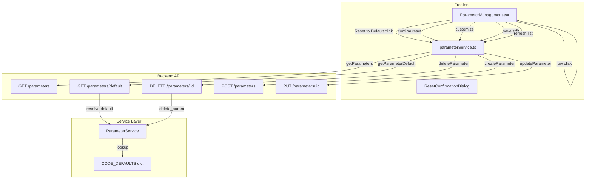
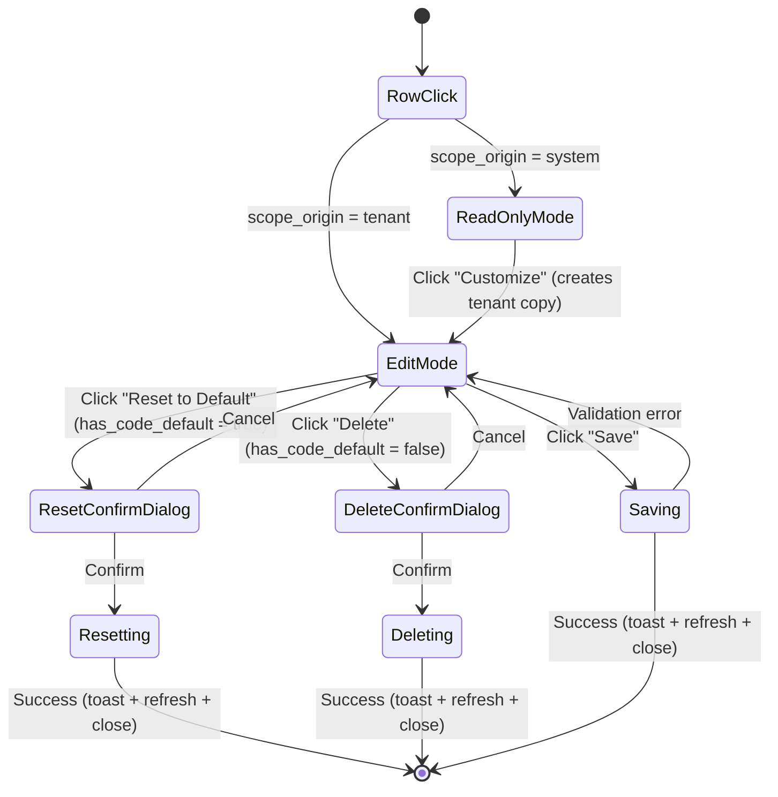

# Design Document: Parameter Reset to Default

## Overview

This design reworks the Parameter Management modal and table to replace the misleading "Delete" action with a clear "Reset to Default" workflow, remove the inconsistent inline Actions column, and add JSON validation/formatting to the edit modal.

The core insight is that deleting a tenant override is not destructive — it reveals the CODE_DEFAULT or system-scope value underneath. The UX should communicate this by showing the user what they're reverting to before they confirm. The actual write operation reuses the existing `DELETE /api/tenant-admin/parameters/{id}` endpoint; the only new backend endpoint is a read-only `GET /api/tenant-admin/parameters/default` that fetches the default value for preview in the confirmation dialog.

### Key Design Decisions

| Decision               | Choice                                       | Rationale                                                                                               |
| ---------------------- | -------------------------------------------- | ------------------------------------------------------------------------------------------------------- |
| New endpoint scope     | Read-only GET for default preview            | The reset operation itself reuses the existing DELETE endpoint; only the preview needs new backend work |
| Default resolution     | CODE_DEFAULTS first, then system-scope DB    | Matches `get_param()` fallback order at system level; CODE_DEFAULTS is the canonical source             |
| Actions column removal | All actions move into modal                  | Consistent with BankingProcessor pattern — row-click opens modal, no inline buttons                     |
| Modal mode             | Read-only for system params, edit for tenant | System params can't be edited by tenant admins; Customize creates a tenant copy                         |
| JSON validation        | Client-side `JSON.parse` on every change     | Immediate feedback; no backend round-trip needed for syntax validation                                  |
| Confirmation dialog    | Chakra AlertDialog with side-by-side values  | Reuses existing AlertDialog pattern already in the component                                            |

## Architecture



### Modal State Flow



## Components and Interfaces

### 1. New Backend Endpoint: Get Parameter Default

**Route:** `GET /api/tenant-admin/parameters/default?namespace={ns}&key={key}`

**Location:** `backend/src/routes/parameter_admin_routes.py` (added to existing blueprint)

**Auth:** `@cognito_required` + `@tenant_required()` (same as other parameter endpoints)

**Logic:**

1. Look up `(namespace, key)` in `CODE_DEFAULTS` — if found, return with `source: "code_default"`
2. If not in CODE_DEFAULTS, query the `parameters` table for a system-scope row — if found, return with `source: "system"`
3. If neither exists, return `{ success: true, has_default: false }`

```python
@parameter_admin_bp.route('/api/tenant-admin/parameters/default', methods=['GET'])
@cognito_required(required_permissions=[])
@tenant_required()
def get_parameter_default(user_email, user_roles, tenant, user_tenants):
    """Return the default value for a parameter (CODE_DEFAULT or system-scope DB row)."""
    namespace = request.args.get('namespace')
    key = request.args.get('key')

    if not namespace or not key:
        return jsonify({'success': False, 'error': 'namespace and key are required'}), 400

    svc = _get_service()
    is_admin = _is_sysadmin(user_roles)

    # 1. Check CODE_DEFAULTS
    from services.parameter_service import CODE_DEFAULTS
    code_default = CODE_DEFAULTS.get((namespace, key))
    if code_default is not None:
        value = code_default['value']
        if code_default.get('is_secret', False) and not is_admin:
            value = '********'
        return jsonify({
            'success': True,
            'has_default': True,
            'value': value,
            'value_type': code_default['value_type'],
            'source': 'code_default',
        })

    # 2. Check system-scope DB row
    db = DatabaseManager(test_mode=flag)
    rows = db.execute_query(
        "SELECT value, value_type, is_secret FROM parameters "
        "WHERE scope = 'system' AND namespace = %s AND `key` = %s LIMIT 1",
        (namespace, key), fetch=True
    )
    if rows:
        row = rows[0]
        parsed = ParameterService._parse_json_value(row['value'])
        if row['is_secret'] and not is_admin:
            parsed = '********'
        return jsonify({
            'success': True,
            'has_default': True,
            'value': parsed,
            'value_type': row['value_type'],
            'source': 'system',
        })

    # 3. No default
    return jsonify({'success': True, 'has_default': False})
```

**Response schemas:**

```json
// Default exists
{
    "success": true,
    "has_default": true,
    "value": {"field": "Account", "direction": "asc"},
    "value_type": "json",
    "source": "code_default"
}

// No default
{
    "success": true,
    "has_default": false
}
```

### 2. Frontend Service Extension

**Location:** `frontend/src/services/parameterService.ts`

New exported function:

```typescript
export interface ParameterDefaultResponse {
  success: boolean;
  has_default: boolean;
  value?: any;
  value_type?: "string" | "number" | "boolean" | "json";
  source?: "code_default" | "system";
}

export async function getParameterDefault(
  namespace: string,
  key: string,
): Promise<ParameterDefaultResponse> {
  const params = new URLSearchParams({ namespace, key });
  const resp = await authenticatedGet(buildEndpoint(`${BASE}/default`, params));
  return resp.json();
}
```

### 3. ParameterManagement Component Changes

**Location:** `frontend/src/components/TenantAdmin/ParameterManagement.tsx`

#### 3a. Remove Actions Column and Add Button

- Remove the `<Th>Actions</Th>` header
- Remove the `<Td>` with inline `IconButton` components (Customize, Reset)
- Remove `handleCustomize` and `handleResetToDefault` functions that operate outside the modal
- Remove the "Add Parameter" `<Button>` and `handleAdd` function — all parameters are defined in CODE_DEFAULTS; tenant admins customize existing parameters through the modal
- Remove the `isNew` state and all create-new-parameter logic from the modal (the modal only edits/views existing parameters or creates tenant copies via Customize)
- The `colSpan` on the empty-state row adjusts to `tableConfig.columns.length` (no +1)

#### 3b. Modal Mode: Read-Only vs Edit

The modal needs to distinguish between two modes based on the clicked parameter:

| Condition                                                         | Mode      | Editable Fields                | Footer Buttons                          |
| ----------------------------------------------------------------- | --------- | ------------------------------ | --------------------------------------- |
| `scope_origin === 'tenant'`                                       | Edit      | value (and value_type for new) | Save, Reset to Default / Delete, Cancel |
| `scope_origin === 'system'` (or code_default, i.e. `id === null`) | Read-only | None                           | Customize, Cancel                       |

New state variable:

```typescript
const [isReadOnly, setIsReadOnly] = useState(false);
```

`handleRowClick` sets `isReadOnly` based on `scope_origin`:

```typescript
const handleRowClick = (p: Parameter) => {
  const readOnly = p.scope_origin === "system";
  setIsReadOnly(readOnly);
  // ... existing form state setup
  onOpen();
};
```

All form inputs get `isDisabled={isReadOnly || !isNew}` for namespace/key (already disabled for edits) and `isDisabled={isReadOnly}` for value fields.

#### 3c. Modal Footer Logic

```
if isReadOnly:
  → [Customize] [Cancel]
else (editing tenant override):
  if has_code_default:
    → [Reset to Default]  ...  [Cancel] [Save]
  else:
    → [Delete]  ...  [Cancel] [Save]
```

The "Customize" button in read-only mode calls the existing `createParameter` with `scope: 'tenant'` to create a tenant copy, then refreshes and reopens in edit mode.

#### 3d. Reset Confirmation Dialog

Replaces the current delete confirmation `AlertDialog` when the parameter has a code default. Uses a new `useDisclosure` for the reset dialog:

```typescript
const {
  isOpen: isResetOpen,
  onOpen: onResetOpen,
  onClose: onResetClose,
} = useDisclosure();
const [defaultValue, setDefaultValue] = useState<any>(null);
const [defaultSource, setDefaultSource] = useState<string>("");
const [loadingDefault, setLoadingDefault] = useState(false);
```

When "Reset to Default" is clicked:

1. Set `loadingDefault = true`
2. Call `getParameterDefault(namespace, key)`
3. Store the result in `defaultValue` and `defaultSource`
4. Open the reset confirmation dialog
5. Set `loadingDefault = false`

The dialog body shows:

```
┌─────────────────────────────────────────┐
│  Reset: {namespace}.{key}               │
│                                         │
│  Current value:                         │
│  ┌─────────────────────────────────┐    │
│  │ {"field":"Account","dir":"asc"} │    │
│  └─────────────────────────────────┘    │
│                                         │
│  Default value (code_default):          │
│  ┌─────────────────────────────────┐    │
│  │ {"field":"Account","dir":"asc"} │    │
│  └─────────────────────────────────┘    │
│                                         │
│           [Cancel]  [Reset to Default]  │
└─────────────────────────────────────────┘
```

For `value_type === 'json'`, both values are displayed with `JSON.stringify(value, null, 2)` in a `<Code>` or `<Box>` with `fontFamily="mono"` and `whiteSpace="pre"`.

For `is_secret === true` (non-SysAdmin), both values show `********`.

On confirm: calls `deleteParameter(editing.id)`, shows success toast, refreshes list, closes both dialogs and modal.

#### 3e. JSON Validation and Format Button

New state for JSON validation:

```typescript
const [jsonError, setJsonError] = useState<string | null>(null);
```

On every `formValue` change when `formType === 'json'`:

```typescript
const handleValueChange = (newValue: string) => {
  setFormValue(newValue);
  if (formType === "json") {
    try {
      JSON.parse(newValue);
      setJsonError(null);
    } catch (e: any) {
      setJsonError(`Invalid JSON: ${e.message}`);
    }
  }
};
```

The Save button is disabled when `jsonError !== null` (and `formType === 'json'`).

The Format button:

```typescript
const handleFormat = () => {
  try {
    const parsed = JSON.parse(formValue);
    setFormValue(JSON.stringify(parsed, null, 2));
    setJsonError(null);
  } catch {
    // Button should be disabled when invalid, but guard anyway
  }
};
```

Rendered next to the textarea label:

```tsx
<FormControl gridColumn="span 2">
  <HStack justify="space-between">
    <FormLabel color="white">{t('tenantAdmin.parameters.value')}</FormLabel>
    {formType === 'json' && (
      <Button size="xs" variant="ghost" colorScheme="blue"
              isDisabled={!!jsonError || isReadOnly}
              onClick={handleFormat}>
        Format
      </Button>
    )}
  </HStack>
  <Textarea ... />
  {jsonError && (
    <Text color="red.300" fontSize="xs" mt={1}>{jsonError}</Text>
  )}
</FormControl>
```

## Data Models

No new database tables or columns are required. The feature operates entirely on existing data structures:

### Existing: `parameters` Table

Used as-is. The `DELETE` operation on a tenant-scope row is the mechanism for "reset to default" — once the tenant row is removed, `get_param()` falls through to CODE_DEFAULTS or system-scope DB rows.

### Existing: `CODE_DEFAULTS` Dictionary

Used as-is. The new `GET /default` endpoint reads from this dictionary to provide the preview value.

### Existing: `Parameter` TypeScript Interface

Used as-is. The `has_code_default` and `scope_origin` fields already provide the information needed to determine modal behavior.

### New: `ParameterDefaultResponse` TypeScript Interface

```typescript
export interface ParameterDefaultResponse {
  success: boolean;
  has_default: boolean;
  value?: any;
  value_type?: "string" | "number" | "boolean" | "json";
  source?: "code_default" | "system";
}
```

## Correctness Properties

_A property is a characteristic or behavior that should hold true across all valid executions of a system — essentially, a formal statement about what the system should do. Properties serve as the bridge between human-readable specifications and machine-verifiable correctness guarantees._

### Property 1: Default Value Resolution Completeness

_For any_ `(namespace, key)` pair, the default resolution function SHALL return the CODE_DEFAULTS value with `source: "code_default"` when a CODE_DEFAULT entry exists, the system-scope DB value with `source: "system"` when only a system-scope DB row exists, and `has_default: false` when neither exists. The returned `value_type` SHALL match the source's declared type.

**Validates: Requirements 1.1, 1.2, 1.3**

### Property 2: Modal Footer Button Determination

_For any_ parameter, the modal footer SHALL show "Reset to Default" when `scope_origin === 'tenant'` AND `has_code_default === true`, "Delete" when `scope_origin === 'tenant'` AND `has_code_default === false`, "Customize" when `scope_origin === 'system'`, and no destructive buttons when creating a new parameter.

**Validates: Requirements 2.1, 2.2, 2.4**

### Property 3: Confirmation Dialog Information Display

_For any_ parameter with a namespace, key, current value, and default value, the Reset Confirmation Dialog SHALL display the namespace and key in the heading, the current value labeled "Current value", and the default value labeled "Default value".

**Validates: Requirements 3.1, 3.2, 3.3**

### Property 4: JSON Values Formatted in Confirmation Dialog

_For any_ parameter with `value_type === 'json'`, the Reset Confirmation Dialog SHALL display both the current and default values as `JSON.stringify(value, null, 2)` — i.e., indented with 2 spaces.

**Validates: Requirements 3.4**

### Property 5: Modal Mode Matches Parameter Scope

_For any_ parameter, clicking its row SHALL open the modal in read-only mode (all value fields disabled, Customize button shown) when `scope_origin === 'system'`, and in edit mode (value fields enabled, Save button shown) when `scope_origin === 'tenant'`.

**Validates: Requirements 4.2, 4.3, 4.4**

### Property 6: JSON Validation Controls Save Button

_For any_ string entered in the JSON textarea when `value_type === 'json'`, the Save button SHALL be enabled if and only if the string is valid JSON (i.e., `JSON.parse` succeeds). When the JSON is invalid, a descriptive error message containing the parse error SHALL be displayed.

**Validates: Requirements 5.1, 5.2, 5.3, 5.4**

### Property 7: JSON Format Button Idempotence

_For any_ valid JSON string, clicking the Format button SHALL produce output equal to `JSON.stringify(JSON.parse(input), null, 2)`. Clicking Format on already-formatted JSON SHALL produce identical output (idempotence). The Format button SHALL be disabled when the JSON is invalid.

**Validates: Requirements 5.5**

## Error Handling

### Backend: Default Value Endpoint

| Scenario                                 | Behavior                                                                        |
| ---------------------------------------- | ------------------------------------------------------------------------------- |
| Missing `namespace` or `key` query param | Return `400` with `{ success: false, error: "namespace and key are required" }` |
| No default exists                        | Return `200` with `{ success: true, has_default: false }` (not an error)        |
| Secret parameter, non-SysAdmin user      | Return masked value `'********'`                                                |
| Database connection failure              | Return `500` with `{ success: false, error: "..." }`                            |

### Frontend: Reset Flow

| Scenario                                   | Behavior                                                                                                                    |
| ------------------------------------------ | --------------------------------------------------------------------------------------------------------------------------- |
| Default fetch fails (network error)        | Show error toast: "Failed to fetch default value", do not open confirmation dialog                                          |
| Default fetch returns `has_default: false` | Should not happen (button only shown when `has_code_default` is true), but if it does: show error toast, do not open dialog |
| Reset (DELETE) fails                       | Show error toast with error message, keep dialog open                                                                       |
| Reset succeeds                             | Show success toast "Parameter reset to default", close dialog + modal, refresh list                                         |

### Frontend: JSON Validation

| Scenario                              | Behavior                                                               |
| ------------------------------------- | ---------------------------------------------------------------------- |
| Empty string in JSON textarea         | Show error: "Invalid JSON: Unexpected end of JSON input", disable Save |
| Valid JSON                            | Clear error, enable Save                                               |
| Invalid JSON                          | Show error with parse position, disable Save                           |
| Format button clicked on invalid JSON | Button is disabled (no-op)                                             |
| Non-JSON value_type                   | No validation applied, Save always enabled (for value field)           |

## Testing Strategy

### Backend Tests (pytest)

**Unit tests** for the default resolution logic:

- `test_get_default_returns_code_default` — parameter exists in CODE_DEFAULTS
- `test_get_default_returns_system_scope_db` — parameter exists as system-scope DB row but not in CODE_DEFAULTS
- `test_get_default_returns_no_default` — parameter exists nowhere
- `test_get_default_code_default_takes_precedence` — parameter exists in both CODE_DEFAULTS and system-scope DB; CODE_DEFAULTS wins
- `test_get_default_masks_secret_for_non_sysadmin` — secret parameter returns `********` for non-SysAdmin
- `test_get_default_shows_secret_for_sysadmin` — secret parameter returns actual value for SysAdmin
- `test_get_default_requires_auth` — endpoint returns 401 without auth token
- `test_get_default_requires_namespace_and_key` — returns 400 when query params missing

**Property-based tests** (Hypothesis):

- Property 1: Default value resolution completeness — generate random `(namespace, key)` pairs against a generated CODE_DEFAULTS dict and system-scope DB rows, verify resolution correctness.

**Test configuration:** Minimum 100 iterations per property test.
**Tag format:** `Feature: parameter-reset-to-default, Property {number}: {property_text}`

### Frontend Tests (Jest + React Testing Library + fast-check)

**Unit tests:**

- `test_actions_column_removed` — verify no Actions column header or inline buttons render (Req 4.1)
- `test_system_param_opens_readonly_modal` — click system-scope row, verify fields disabled + Customize button (Req 4.2)
- `test_tenant_param_opens_edit_modal` — click tenant-scope row, verify fields enabled + Save button (Req 4.3)
- `test_reset_button_fetches_default_and_shows_dialog` — click Reset to Default, verify API call + dialog (Req 2.3)
- `test_reset_confirm_calls_delete_and_refreshes` — confirm reset, verify DELETE call + list refresh (Req 3.6)
- `test_reset_cancel_closes_dialog` — cancel reset, verify no API call + dialog closed (Req 3.7)
- `test_customize_creates_tenant_copy` — click Customize in read-only modal, verify POST call (Req 4.2)
- `test_secret_values_masked_in_dialog` — verify `********` shown for secret params (Req 3.5)
- `test_success_toast_on_reset` — verify success toast after reset (Req 7.1)
- `test_error_toast_on_reset_failure` — verify error toast on failed reset (Req 7.2)
- `test_list_refreshes_after_reset` — verify getParameters called after reset (Req 7.3)
- `test_modal_closes_after_reset` — verify modal + dialog close after reset (Req 7.4)

**Property-based tests** (fast-check):

- Property 2: Modal footer button determination — generate random `Parameter` objects with varying `scope_origin` and `has_code_default`, verify correct buttons render.
- Property 3: Confirmation dialog information display — generate random namespace, key, current value, default value strings, verify all appear in dialog.
- Property 4: JSON values formatted in dialog — generate random JSON objects, verify dialog displays `JSON.stringify(value, null, 2)`.
- Property 5: Modal mode matches parameter scope — generate random parameters, verify read-only vs edit mode.
- Property 6: JSON validation controls Save button — generate random strings (mix of valid/invalid JSON via `fc.oneof(fc.json(), fc.string())`), verify Save button state matches `JSON.parse` success.
- Property 7: JSON Format button idempotence — generate random valid JSON objects, verify Format produces `JSON.stringify(JSON.parse(input), null, 2)` and is idempotent.

**Test configuration:** Minimum 100 iterations per property test.
**Tag format:** `Feature: parameter-reset-to-default, Property {number}: {property_text}`
