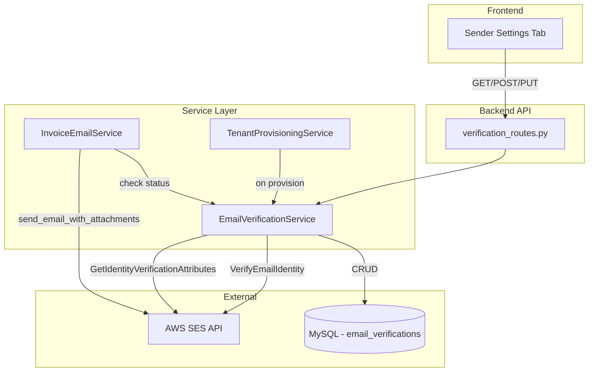
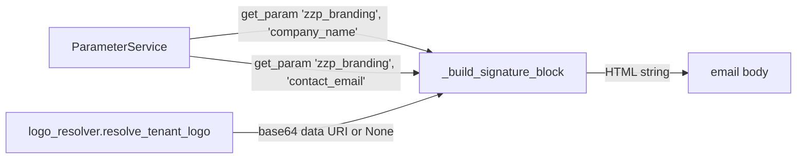

# Design Document: SES Email Verification

## Overview

This feature adds tenant-level email verification via AWS SES so that invoice emails are sent FROM the tenant's own verified email address instead of the generic system sender (`myAdmin <support@jabaki.nl>`). The design integrates into the existing service layer pattern, extends the tenant provisioning flow, modifies the invoice email service's sender resolution, and adds a new tab in the Tenant Admin dashboard.

### Key Design Decisions

1. **Individual email verification (not domain)** — Uses SES `VerifyEmailIdentity` API for simplicity. Tenants verify a single email address without DNS configuration.
2. **Database-backed status with SES as source of truth** — The local database caches verification status for fast lookups during email sends, but the status check endpoint queries SES directly to sync state.
3. **Graceful fallback** — When verification is incomplete or expired, the system silently falls back to the system sender with a Reply-To header pointing to the tenant's email.
4. **Non-blocking onboarding** — Verification failure during provisioning is logged but does not block tenant creation.
5. **Rate limiting at service layer** — Resend requests are rate-limited (1 per 60s per tenant) in the service layer using timestamp comparison.

## Architecture



### Integration Points

- **TenantProvisioningService** — Calls `EmailVerificationService.initiate_verification()` after Step 2b (parameter seeding), as a non-blocking step.
- **InvoiceEmailService** — Calls `EmailVerificationService.get_verified_sender()` before composing emails to determine the From address.
- **SESEmailService** — Existing service remains unchanged; the `send_email_with_attachments` method already accepts `from_name` and uses `self.sender` as the email address. The verification feature will pass a custom `Source` when the tenant is verified.

## Components and Interfaces

### 1. EmailVerificationService (Backend)

**File:** `backend/src/services/email_verification_service.py`

```python
class EmailVerificationService:
    """Manages SES email identity verification per tenant."""

    def __init__(self, db_manager, region: str = None):
        self.db = db_manager
        self.region = region or os.getenv('AWS_REGION', 'eu-west-1')
        self.ses_client = boto3.client('ses', region_name=self.region)

    def initiate_verification(self, administration: str, email: str) -> dict:
        """Call SES VerifyEmailIdentity and store pending record.
        Returns: {'success': bool, 'status': str, 'error': str|None}
        """

    def check_status(self, administration: str) -> dict:
        """Query SES GetIdentityVerificationAttributes, sync DB, return current state.
        Returns: {'success': bool, 'email': str, 'status': str, 'last_checked': str}
        """

    def resend_verification(self, administration: str) -> dict:
        """Re-call VerifyEmailIdentity with rate limiting (60s cooldown).
        Returns: {'success': bool, 'error': str|None}
        """

    def update_email(self, administration: str, new_email: str) -> dict:
        """Validate new email, initiate verification, mark old as 'replaced'.
        Returns: {'success': bool, 'status': str, 'error': str|None}
        """

    def get_verified_sender(self, administration: str) -> dict:
        """Fast DB lookup for invoice sending. No SES call.
        Returns: {'verified': bool, 'email': str|None, 'company_name': str|None}
        """

    def mark_expired(self, administration: str, email: str) -> None:
        """Mark a verification record as expired (called on SES send failure)."""

    def _validate_email(self, email: str) -> bool:
        """RFC 5322 basic email format validation."""
```

### 2. Verification Routes (Backend)

**File:** `backend/src/routes/verification_routes.py`

```python
verification_bp = Blueprint('verification', __name__)

# GET  /api/tenant-admin/sender-verification
# POST /api/tenant-admin/sender-verification/resend
# PUT  /api/tenant-admin/sender-verification/email
```

All endpoints require `@cognito_required(required_permissions=['admin_manage'])` and `@tenant_required()`.

### 3. InvoiceEmailService Modifications

**File:** `backend/src/services/invoice_email_service.py` (modified)

Changes to `send_invoice_email` and `send_reminder_email`:

- Before sending, call `EmailVerificationService.get_verified_sender(tenant)`
- If verified: use tenant email as `Source` and company name as display name
- If not verified: use fallback sender with `Reply-To` set to tenant email
- On `MessageRejected` / `MailFromDomainNotVerified` error: retry with fallback, call `mark_expired()`

### 4. Email Signature Builder (Branding & Logo)

**File:** `backend/src/services/invoice_email_service.py` (extended)

New private method `_build_signature_block(tenant, locale)` appended to email body in `_build_locale_body()` and `_build_body()`:

```python
def _build_signature_block(self, tenant: str, locale: str) -> str:
    """Build branded HTML signature block with logo.

    Data sources:
    - zzp_branding.company_name → company display name
    - zzp_branding.contact_email → contact email in signature
    - Logo via resolve_tenant_logo(tenant, 'zzp_branding', self.parameter_service)
      which returns a base64 data URI or None

    Returns HTML string to append after the email body.
    """
```

#### Data Flow: Branding Parameters



#### Logo Resolution (existing `logo_resolver.py`)

The signature builder reuses the existing `resolve_tenant_logo()` function from `backend/src/services/logo_resolver.py`. This function:

1. Reads `storage.invoice_provider` parameter to determine storage backend
2. Routes to the appropriate resolver:
   - `google_drive` (or `None`/default): Fetches from `lh3.googleusercontent.com/d/{file_id}` using `zzp_branding.company_logo_file_id`
   - `s3_shared` / `s3_tenant`: Fetches from S3 bucket (`S3_SHARED_BUCKET` env var) using `zzp_branding.company_logo_s3_key`
3. Returns a `data:{content_type};base64,{encoded}` string, or `None` if no logo configured or fetch fails

No new logo infrastructure is needed — the signature builder calls the same function already used by `PDFGeneratorService._get_tenant_logo()`.

#### HTML Signature Template

```html
<hr
  style="border: none; border-top: 1px solid #e0e0e0; margin: 24px 0 16px 0;"
/>
<table
  cellpadding="0"
  cellspacing="0"
  style="font-family: Arial, sans-serif; font-size: 14px; color: #333;"
>
  <tr>
    <!-- Logo column (only rendered when logo is available) -->
    <td style="padding-right: 16px; vertical-align: top;">
      
    </td>
    <!-- Text column -->
    <td style="vertical-align: top;">
      <p style="margin: 0 0 4px 0; font-weight: bold;">{greeting}</p>
      <p style="margin: 0 0 4px 0; font-weight: bold; font-size: 15px;">
        {company_name}
      </p>
      <p style="margin: 0; color: #555;">
        <a
          href="mailto:{contact_email}"
          style="color: #0066cc; text-decoration: none;"
          >{contact_email}</a
        >
      </p>
    </td>
  </tr>
</table>
```

When no logo is configured, the `<td>` with the `` tag is omitted entirely (not rendered as a broken image).

#### Locale-Aware Greeting

| Locale    | Greeting text             |
| --------- | ------------------------- |
| `nl_NL`   | "Met vriendelijke groet," |
| Any other | "Kind regards,"           |

#### Integration Points

- **`_build_locale_body()`**: Signature appended after the closing `</p>` of the email body (replaces the current inline "Met vriendelijke groet,\<br/>{sender_company}" pattern)
- **`_build_body()`** (legacy flow): Same — signature appended after the body content
- **`_build_nl_body()` / `_build_en_body()`**: The closing greeting line is removed from these methods and moved into the signature block to avoid duplication

#### Error Handling

- If `ParameterService` is not available: signature block is skipped entirely (graceful degradation)
- If `company_name` is missing: falls back to the `tenant` identifier string
- If `contact_email` is missing: email line is omitted from the signature
- If logo fetch fails (network error, S3 error, missing file): signature renders without logo (no broken image tag)

### 5. Sender Settings UI (Frontend)

**File:** `frontend/src/components/TenantAdmin/SenderSettingsTab.tsx`

New tab in `TenantAdminDashboard` between "Tenant Info" and "Pivot Views":

- Displays current sender email and verification status badge
- Status badge colors: `pending` (yellow), `verified` (green), `failed` (red), `expired` (orange)
- "Resend Verification" button (disabled during 60s cooldown)
- Informational message when pending
- Form to update sender email (Formik + Yup email validation)
- Fallback sender info display when not verified

**File:** `frontend/src/services/verificationApi.ts`

```typescript
export const getVerificationStatus = (): Promise<VerificationStatusResponse> => ...
export const resendVerification = (): Promise<ApiResponse> => ...
export const updateSenderEmail = (email: string): Promise<ApiResponse> => ...
```

## Data Models

### Database Table: `email_verifications`

```sql
CREATE TABLE IF NOT EXISTS email_verifications (
    id INT AUTO_INCREMENT PRIMARY KEY,
    administration VARCHAR(50) NOT NULL,
    email VARCHAR(255) NOT NULL,
    status ENUM('pending', 'verified', 'failed', 'expired', 'replaced') NOT NULL DEFAULT 'pending',
    initiated_at DATETIME NOT NULL DEFAULT CURRENT_TIMESTAMP,
    verified_at DATETIME NULL,
    last_checked_at DATETIME NULL,
    last_resend_at DATETIME NULL,
    created_at DATETIME NOT NULL DEFAULT CURRENT_TIMESTAMP,
    updated_at DATETIME NOT NULL DEFAULT CURRENT_TIMESTAMP ON UPDATE CURRENT_TIMESTAMP,

    INDEX idx_administration (administration),
    INDEX idx_admin_status (administration, status),
    INDEX idx_email (email)
) ENGINE=InnoDB DEFAULT CHARSET=utf8mb4 COLLATE=utf8mb4_unicode_ci;
```

**Design notes:**

- `administration` column for tenant isolation (per database-patterns steering)
- `status` uses ENUM for data integrity
- `last_resend_at` enables rate limiting without additional tables
- Composite index `idx_admin_status` optimizes the common query: "get active verification for tenant"

### TypeScript Types (Frontend)

```typescript
interface VerificationStatus {
  email: string;
  status: "pending" | "verified" | "failed" | "expired";
  lastChecked: string | null;
  fallbackSender: string;
}

interface VerificationStatusResponse {
  success: boolean;
  data: VerificationStatus;
}
```

### API Contracts

**GET /api/tenant-admin/sender-verification**

Response:

```json
{
  "success": true,
  "data": {
    "email": "tenant@example.com",
    "status": "pending",
    "last_checked": "2025-01-15T10:30:00Z",
    "fallback_sender": "myAdmin <support@jabaki.nl>"
  }
}
```

**POST /api/tenant-admin/sender-verification/resend**

Response (success):

```json
{ "success": true, "message": "Verification email resent" }
```

Response (rate limited):

```json
{ "success": false, "error": "Please wait 60 seconds before resending" }
```

**PUT /api/tenant-admin/sender-verification/email**

Request:

```json
{ "email": "new-email@example.com" }
```

Response:

```json
{
  "success": true,
  "data": {
    "email": "new-email@example.com",
    "status": "pending"
  }
}
```

## Correctness Properties

_A property is a characteristic or behavior that should hold true across all valid executions of a system — essentially, a formal statement about what the system should do. Properties serve as the bridge between human-readable specifications and machine-verifiable correctness guarantees._

### Property 1: Successful initiation stores complete pending record

_For any_ valid tenant identifier and well-formed email address, when SES VerifyEmailIdentity succeeds, the service SHALL store a verification record containing the administration identifier, the email address, status `pending`, and a non-null timestamp.

**Validates: Requirements 1.2, 1.4**

### Property 2: Failed initiation stores failed record without raising

_For any_ SES error response during initiation, the service SHALL store a verification record with status `failed` and SHALL NOT raise an exception to the caller.

**Validates: Requirements 1.3**

### Property 3: SES status mapping correctness

_For any_ SES verification state (`Success`, `Pending`, `Failed`), the `check_status` method SHALL map it to the corresponding local status (`verified`, `pending`, `failed`) and persist the mapping to the database.

**Validates: Requirements 2.2, 2.3, 2.4**

### Property 4: Status check response completeness

_For any_ valid tenant with an existing verification record, the `check_status` response SHALL contain the email address, the current status, and a non-null `last_checked` timestamp.

**Validates: Requirements 2.5**

### Property 5: Resend rate limiting

_For any_ tenant, if `last_resend_at` is within 60 seconds of the current time, a resend request SHALL be rejected with an error. If `last_resend_at` is more than 60 seconds ago (or null), the resend SHALL proceed.

**Validates: Requirements 3.4**

### Property 6: Verified sender resolution

_For any_ tenant whose verification status is `verified`, the `get_verified_sender` method SHALL return `verified=True` with the tenant's email address and company name.

**Validates: Requirements 4.1, 4.2**

### Property 7: Fallback sender for non-verified tenants

_For any_ tenant whose verification status is NOT `verified` (pending, failed, expired, or no record), the `get_verified_sender` method SHALL return `verified=False`, causing the invoice service to use the fallback sender address with Reply-To set to the tenant's email.

**Validates: Requirements 4.3, 5.4**

### Property 8: Email update state transitions

_For any_ valid new email address submitted for a tenant, the service SHALL create a new record with status `pending` for the new address AND mark all previous active records for that tenant as `replaced`.

**Validates: Requirements 5.2, 5.3**

### Property 9: Email validation

_For any_ string that is a well-formed email address (contains exactly one `@`, has non-empty local and domain parts, domain contains a dot), validation SHALL pass. _For any_ string that does not meet these criteria, validation SHALL fail and the update SHALL be rejected.

**Validates: Requirements 5.5**

### Property 10: Error recovery with fallback and expiry

_For any_ SES send error of type `MessageRejected` or `MailFromDomainNotVerified` when sending from a tenant's verified email, the service SHALL (a) retry the send using the fallback sender and (b) update the tenant's verification status to `expired`.

**Validates: Requirements 6.1, 6.2**

### Property 11: Tenant isolation in verification queries

_For any_ verification query (read or write), the database operation SHALL include `WHERE administration = %s` with the authenticated tenant's identifier, ensuring no cross-tenant data access.

**Validates: Requirements 8.5**

### Property 12: Signature block contains required branding fields

_For any_ tenant with configured `zzp_branding.company_name` and `zzp_branding.contact_email` parameters, the generated signature block HTML SHALL contain both the company name and the contact email address.

**Validates: Requirements 9.1, 9.2, 9.3**

### Property 13: Conditional logo inclusion in signature

_For any_ tenant with a configured branding logo, the signature block SHALL contain a base64-encoded `` tag. _For any_ tenant without a configured logo, the signature block SHALL NOT contain an `` tag but SHALL still contain the company name and email.

**Validates: Requirements 9.4, 9.5**

### Property 14: Locale-aware signature greeting

_For any_ email composed with locale `nl_NL`, the signature block SHALL contain "Met vriendelijke groet,". _For any_ email composed with any other locale, the signature block SHALL contain "Kind regards,".

**Validates: Requirements 9.7**

## Error Handling

### SES API Errors

| Error                                           | Handling                                                | User Impact                                  |
| ----------------------------------------------- | ------------------------------------------------------- | -------------------------------------------- |
| `VerifyEmailIdentity` fails during provisioning | Log error, store `failed` record, continue provisioning | None — tenant is created normally            |
| `VerifyEmailIdentity` fails during resend       | Return error to UI                                      | User sees error message, can retry after 60s |
| `GetIdentityVerificationAttributes` fails       | Return cached DB status with warning                    | User sees last known status                  |
| `MessageRejected` on send                       | Retry with fallback sender, mark `expired`              | Email still delivered from system address    |
| `MailFromDomainNotVerified` on send             | Retry with fallback sender, mark `expired`              | Email still delivered from system address    |

### Input Validation Errors

| Error                        | Handling                                                  |
| ---------------------------- | --------------------------------------------------------- |
| Invalid email format         | Return 400 with descriptive error before calling SES      |
| Missing email in PUT request | Return 400 with "email is required"                       |
| Rate limit exceeded          | Return 429 with "Please wait 60 seconds before resending" |

### Database Errors

| Error                          | Handling                                                                 |
| ------------------------------ | ------------------------------------------------------------------------ |
| Connection failure             | Return 500, log error with traceback                                     |
| Duplicate record               | Use INSERT ... ON DUPLICATE KEY UPDATE pattern                           |
| Missing record on check_status | Return response with `status: null` indicating no verification initiated |

### Frontend Error Handling

- API errors displayed via Chakra UI toast notifications
- Network errors show retry suggestion
- Rate limit errors show countdown timer
- Form validation errors shown inline (Formik/Yup)

## Testing Strategy

### Unit Tests (pytest)

- **EmailVerificationService**: Test all methods with mocked SES client and mocked DatabaseManager
  - `initiate_verification`: success path, SES failure path
  - `check_status`: each SES state mapping, no-record case
  - `resend_verification`: success, rate limited, SES failure
  - `update_email`: valid email, invalid email, state transitions
  - `get_verified_sender`: verified, pending, failed, expired, no-record
  - `mark_expired`: status update
  - `_validate_email`: valid/invalid email formats

- **InvoiceEmailService (modified)**: Test sender resolution and signature
  - Verified tenant uses tenant email as sender
  - Non-verified tenant uses fallback with Reply-To
  - Error recovery retries with fallback
  - Signature block generation with/without logo
  - Locale-aware greeting in signature

- **Verification Routes**: Test endpoint authorization and request handling
  - Permission checks (admin_manage required)
  - Tenant isolation
  - Request validation

### Property-Based Tests (Hypothesis — Python)

The project uses `pytest` with `hypothesis` for property-based testing (as evidenced by the `.hypothesis/examples` directory).

**Configuration**: Minimum 100 iterations per property test.

Each property test is tagged with:

```python
# Feature: ses-email-verification, Property {N}: {property_text}
```

Properties to implement as PBT:

- **Property 3**: SES status mapping (generate random SES states, verify correct mapping)
- **Property 5**: Rate limiting (generate random timestamps, verify accept/reject logic)
- **Property 6 & 7**: Sender resolution (generate random verification states, verify correct sender)
- **Property 9**: Email validation (generate random strings, verify accept/reject)
- **Property 12**: Signature content (generate random branding params, verify presence in output)
- **Property 13**: Logo inclusion (generate random logo/no-logo configs, verify img tag presence)
- **Property 14**: Locale greeting (generate random locales, verify correct greeting text)

### Frontend Tests (Vitest + React Testing Library)

- **SenderSettingsTab**: Component rendering for each status state
- **verificationApi**: API service function tests with MSW mocks
- **Form validation**: Yup schema validation for email input

### Integration Tests

- Full provisioning flow triggers verification
- End-to-end email send with verified/non-verified tenant
- API endpoint smoke tests with authentication

### Property-Based Tests (Frontend — fast-check)

Per the tech stack, the frontend uses `@fast-check/vitest` for property-based testing:

- **Property 9** (frontend validation): Generate random strings, verify Yup email schema matches backend validation
- **Property 14** (locale greeting): Generate random locale strings, verify correct greeting selection
