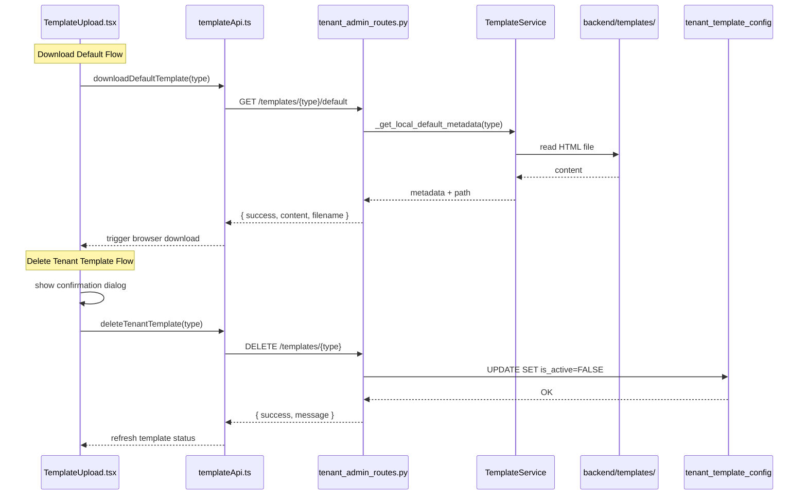

# Design Document: Template Management Defaults

## Overview

This feature adds two missing operations to the existing Template Management module and fixes a `valid_types` inconsistency:

1. **Download Default Template** — A new `GET /api/tenant-admin/templates/<template_type>/default` endpoint that reads the built-in default template from `backend/templates/` via the existing `_LOCAL_DEFAULTS` mapping and returns its HTML content. The frontend triggers a browser download.
2. **Delete Tenant Template** — A new `DELETE /api/tenant-admin/templates/<template_type>` endpoint that soft-deletes the tenant-specific template by setting `is_active = FALSE` in `tenant_template_config`. The frontend shows a confirmation dialog before calling the endpoint.
3. **Fix valid_types** — Extract the inline `valid_types` list into a shared module-level constant that includes `zzp_invoice`, and use it across all template endpoints.

All changes reuse existing patterns: `@cognito_required`, `is_tenant_admin()`, `DatabaseManager`, `TemplateService._LOCAL_DEFAULTS`, Chakra UI components, and `authenticatedRequest()`.

## Architecture

No architectural changes. The feature adds two route handlers to the existing `tenant_admin_routes.py` blueprint and two functions to `templateApi.ts`. The UI changes are confined to the existing `TemplateUpload.tsx` component.



## Components and Interfaces

### Backend: New Shared Constant

```python
# In tenant_admin_routes.py, module level
VALID_TEMPLATE_TYPES = [
    'str_invoice_nl', 'str_invoice_en',
    'btw_aangifte', 'aangifte_ib',
    'toeristenbelasting', 'financial_report',
    'zzp_invoice',
]
```

All existing and new template endpoints will reference `VALID_TEMPLATE_TYPES` instead of inline lists.

### Backend: Download Default Template Endpoint

```
GET /api/tenant-admin/templates/<template_type>/default
```

**Auth:** `@cognito_required(required_permissions=[])` + `is_tenant_admin()` check (same pattern as existing `get_current_template_endpoint`).

**Response 200:**

```json
{
  "success": true,
  "template_type": "str_invoice_nl",
  "template_content": "<html>...</html>",
  "filename": "str_invoice_nl_default.html",
  "field_mappings": { ... },
  "message": "Default template retrieved successfully"
}
```

**Response 404** (no default exists):

```json
{
  "success": false,
  "error": "No default template available for type: {template_type}"
}
```

**Response 400** (invalid type):

```json
{
  "error": "Invalid template type",
  "valid_types": [...]
}
```

**Response 403** (not tenant admin):

```json
{ "error": "Tenant admin access required" }
```

**Implementation:** Uses `TemplateService._get_local_default_metadata()` to get the local path, then reads the file content. Also loads field mappings from the corresponding JSON file.

### Backend: Delete Tenant Template Endpoint

```
DELETE /api/tenant-admin/templates/<template_type>
```

**Auth:** Same pattern as above.

**Response 200:**

```json
{
  "success": true,
  "message": "Template deactivated successfully. System will use default template.",
  "template_type": "str_invoice_nl",
  "deactivated_file_id": "1abc...xyz"
}
```

**Response 404** (no active template):

```json
{
  "success": false,
  "error": "No active tenant template found for type: {template_type}"
}
```

**Response 400/403:** Same pattern as download endpoint.

**Implementation:** Executes a parameterised UPDATE query:

```sql
UPDATE tenant_template_config
SET is_active = FALSE, status = 'archived', updated_at = NOW()
WHERE administration = %s AND template_type = %s AND is_active = TRUE
```

Logs an audit entry with user email, tenant, template type, and deactivated file ID.

### Frontend: templateApi.ts Additions

```typescript
export interface DefaultTemplateResponse {
  success: boolean;
  template_type: TemplateType;
  template_content: string;
  filename: string;
  field_mappings?: FieldMappings;
  message: string;
}

export interface DeleteTemplateResponse {
  success: boolean;
  message: string;
  template_type: TemplateType;
  deactivated_file_id?: string;
}

export async function downloadDefaultTemplate(
  templateType: TemplateType
): Promise<DefaultTemplateResponse> { ... }

export async function deleteTenantTemplate(
  templateType: TemplateType
): Promise<DeleteTemplateResponse> { ... }
```

Both functions follow the existing `authenticatedRequest` + error-throw pattern.

### Frontend: TemplateUpload.tsx Changes

The existing template-status section (the `{templateType && (...)}` block) will be updated:

1. **When a tenant template exists** (`currentTemplate.success && currentTemplate.metadata`):
   - Keep existing "Download" and "Load & Modify" buttons
   - Add a red "Delete Template" button that opens a Chakra `AlertDialog` confirmation
   - On confirm: call `deleteTenantTemplate()`, show toast, reset `currentTemplate` to `null`

2. **When no tenant template exists** (the warning alert):
   - Add a "Download Default Template" button
   - On click: call `downloadDefaultTemplate()`, trigger browser file download using Blob + anchor pattern (same as existing `handleDownloadCurrent`)

No new components or pages are created. All changes are within the existing conditional rendering block.

## Data Models

### Database: No Schema Changes

The `tenant_template_config` table already has all required columns:

| Column           | Type                              | Notes                                     |
| ---------------- | --------------------------------- | ----------------------------------------- |
| id               | INT AUTO_INCREMENT                | PK                                        |
| administration   | VARCHAR(100)                      | Tenant identifier                         |
| template_type    | VARCHAR(50)                       | Template type key                         |
| template_file_id | VARCHAR(255)                      | Google Drive file ID                      |
| field_mappings   | JSON                              | Custom field mappings                     |
| is_active        | BOOLEAN                           | Soft-delete flag — set to FALSE on delete |
| version          | INT                               | Version number                            |
| approved_by      | VARCHAR(255)                      | Who approved                              |
| approved_at      | TIMESTAMP                         | When approved                             |
| status           | ENUM('draft','active','archived') | Set to 'archived' on delete               |
| created_at       | TIMESTAMP                         | Auto                                      |
| updated_at       | TIMESTAMP                         | Auto-updated                              |

The delete operation sets `is_active = FALSE` and `status = 'archived'`, preserving the row for audit history. The existing `UNIQUE KEY unique_tenant_template (administration, template_type)` means only one row per tenant+type exists; after deactivation, a new upload will create a new version.

### TypeScript Types

Two new response interfaces (`DefaultTemplateResponse`, `DeleteTemplateResponse`) are added to `templateApi.ts`. No changes to `template.ts` types file needed.

## Error Handling

### Backend Error Handling

All new endpoints follow the existing try/except pattern in `tenant_admin_routes.py`:

| Scenario                             | HTTP Status | Response                                                                            |
| ------------------------------------ | ----------- | ----------------------------------------------------------------------------------- |
| Invalid template type                | 400         | `{ "error": "Invalid template type", "valid_types": [...] }`                        |
| Not a Tenant_Admin                   | 403         | `{ "error": "Tenant admin access required" }`                                       |
| No default template file on disk     | 404         | `{ "success": false, "error": "No default template available for type: {type}" }`   |
| No active tenant template to delete  | 404         | `{ "success": false, "error": "No active tenant template found for type: {type}" }` |
| File read failure (disk I/O)         | 500         | `{ "error": "Internal server error", "details": "..." }`                            |
| Database update failure              | 500         | `{ "error": "Internal server error", "details": "..." }`                            |
| Missing/invalid Authorization header | 401         | `{ "error": "Invalid authorization" }`                                              |

### Frontend Error Handling

- Both `downloadDefaultTemplate()` and `deleteTenantTemplate()` throw `Error` on non-OK responses, matching the existing pattern.
- The UI catches errors and displays them via Chakra `useToast` with `status: 'error'`, consistent with existing error handling in `TemplateUpload.tsx`.
- The confirmation dialog for delete prevents accidental deletions.

## Testing Strategy

### Why Property-Based Testing Does Not Apply

This feature consists of:

- **Simple CRUD** — a SQL UPDATE setting `is_active = FALSE` (no transformation logic)
- **File I/O** — reading a static file from disk (no input variation)
- **UI conditional rendering** — showing/hiding buttons based on state
- **Fixed validation list** — 7 known template types

There are no pure functions with meaningful input variation, no serialization/parsing, and no algorithmic logic. All acceptance criteria are best covered by example-based unit tests and integration tests.

### Unit Tests (Backend — pytest)

1. **Download default endpoint:**
   - Test each valid template type returns 200 with correct content and `{type}_default.html` filename
   - Test invalid template type returns 400
   - Test template type with no `_LOCAL_DEFAULTS` entry returns 404
   - Test non-Tenant_Admin user returns 403

2. **Delete tenant template endpoint:**
   - Test successful deactivation returns 200, verify `is_active=FALSE` and `status='archived'` in DB
   - Test delete when no active template returns 404
   - Test non-Tenant_Admin user returns 403
   - Test audit log entry is written with correct fields

3. **valid_types fix:**
   - Test `VALID_TEMPLATE_TYPES` constant contains all 7 types including `zzp_invoice`
   - Test GET endpoint accepts `zzp_invoice` (no longer returns 400)

### Unit Tests (Frontend — Jest + React Testing Library)

1. **templateApi.ts:**
   - Test `downloadDefaultTemplate()` calls correct endpoint and returns response
   - Test `deleteTenantTemplate()` calls correct endpoint and returns response
   - Test both functions throw Error on non-OK responses

2. **TemplateUpload.tsx:**
   - Test "Download Default Template" button appears when no tenant template exists
   - Test "Download Default Template" button is hidden when tenant template exists
   - Test "Delete Template" button appears when tenant template exists
   - Test clicking "Delete Template" shows confirmation dialog
   - Test confirming deletion calls API and resets state
   - Test cancelling deletion closes dialog without API call

### Integration Tests

- End-to-end flow: select template type → download default → upload modified → delete → verify fallback to default
- Verify the `tenant_template_config` row is preserved (soft-delete) after deletion
