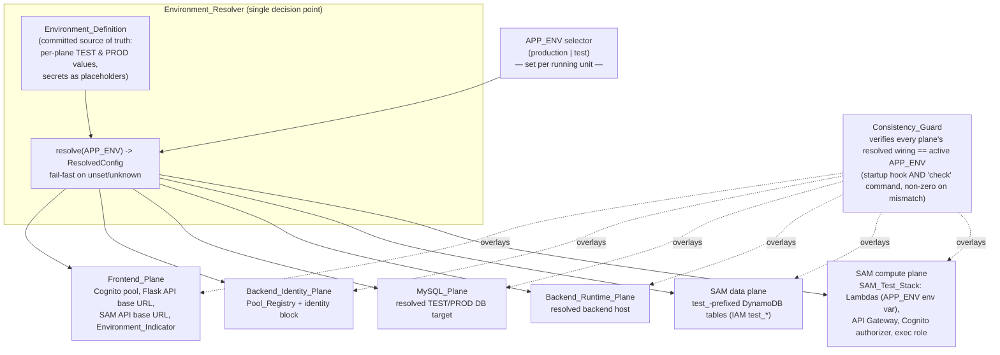

# Design Document

## Overview

This design is the authoritative blueprint for the proper TEST environment across every plane of myAdmin, at target state. It realizes the requirements' guiding principle — **"one decision, many consumers"** — by introducing a single deploy-level selector, `APP_ENV` (`production` | `test`), and a central **Environment_Resolver** that maps it to one coherent per-plane configuration. Every plane consumes that resolved configuration instead of re-deciding TEST vs PRODUCTION from raw signals (notably the browser hostname, which `frontend/src/aws-exports.ts` reads today).

The design is deliberately shaped by three invariants carried from the requirements:

1. **Fail-fast, no dangerous default.** `APP_ENV` unset or unrecognized ⇒ the running unit refuses to start. This mirrors the existing discipline in `backend/src/auth/pool_registry.py` and `backend/src/auth/test_pool_config.py` (missing var ⇒ raise, never a silent fallback). The Environment_Resolver and Consistency_Guard are new siblings of that module and reuse its exception style.
2. **IAM is the real boundary; code resolution is the convenience.** On the data and compute planes, the hard isolation is an IAM policy scoping DynamoDB by table-name pattern (`arn:aws:dynamodb:*:*:table/test_*`) and an environment-scoped Lambda execution role — not the Lambda's resolved prefix. ([DynamoDB: separating environments in one account by table prefix](https://docs.aws.amazon.com/amazondynamodb/latest/developerguide/iam-policy-separate-environments.html))
3. **Every target is a resolved, named value, never a hardcoded physical location.** Where a database or backend process actually runs is an operational mapping; relocating it is a resolver-mapping/config change, not an architecture change. Current locations (local Docker, Railway) appear only as non-normative "current mapping" notes.

**Scope of this design vs. incremental delivery.** The design defines all planes at target state (the user chose option A(i): define all, drive implementation). Some planes are already close to target (the Cognito registry exists; the DynamoDB `test_` prefix exists). The heaviest build is the SAM compute plane (a separate TEST stack, its own API Gateway, per-environment execution roles). The `test_mode` removal is a large, staged refactor. The Rollout section sequences these so the app keeps working at every step.

**What this design guarantees** is the **Environment_Boundary** (the always-TEST structural wiring), enforced by the **Consistency_Guard**. It does **not** fix the **Environment_Contents** (accounts, attributes, MySQL/DynamoDB data), which may be prod-identical, partial, or deliberately different per test. Content parity is an opt-in capability provided by the explicit **Copy_Utility**, never a default.

### Requirements coverage map

| Design section | Requirements |
| --- | --- |
| Architecture, `APP_ENV` selector | 1, 2, 7 |
| Environment_Resolver (3 runtimes) | 1, 2, 8, 21 |
| Environment_Definition (source of truth) | 3, 10.5, 10.6, 15 |
| Consistency_Guard | 4, 7.5, 9.5, 14.4, 14.5, 19.4, 20.2, 21.5, 21.6 |
| Cognito plane + `test_mode` migration | 2.6, 8 |
| MySQL plane | 9 |
| Backend_Runtime + Flask API base URL | 21 |
| SAM data plane | 10 |
| SAM compute plane (stack-per-env) | 11, 12, 13, 14, 15 |
| Environment_Indicator + health report | 5, 6 |
| Copy_Utility + Test_Account provisioning | 11(copy), 12(acct), 16, 17, 20.4 |
| Steering alignment | 18 |
| Safety guardrails / fixed-boundary | 14(safety), 15(boundary), 19, 20 |

## Architecture

### The one-decision model



**Model A — "one running unit = one environment".** A running unit serves exactly one environment for its whole lifetime; there is no per-request switching (Req 1.6). The "running unit" is:

- the **Flask backend process** (its `APP_ENV` env var),
- the **frontend SPA build** (an injected Vite variable baked at build/served at runtime),
- a **deployed SAM stack** on the serverless plane (`APP_ENV` as a deploy-time SAM parameter + per-Lambda env var). The TEST serverless environment is a *separately deployed stack*, not a mode of one stack (Req 11).

`sam local` and the local DynamoDB emulator are **dev**, explicitly out of scope (Req 10.5, 11.4, 19.5).

### Why a central resolver (Req 2, 4)

Today each plane decides independently: the frontend infers "local ⇒ test pool" from `window.location.hostname` (`aws-exports.ts`), the backend reads `COGNITO_POOL_KEYS`/identity-block vars directly, `DatabaseManager` reads `TEST_MODE`, and the SAM stack is parameterized by its own `Stage`. Independent switches disagree by construction — the already-resolved test-pool-vs-prod-pool mismatch was one instance of that class. The resolver makes `APP_ENV` the **single** input and the **single** place that produces per-plane config, so a half-cutover becomes detectable rather than silent.

### Three runtimes, one contract

The Environment_Resolver is one *contract* with three *realizations* (Req 2.5):

| Runtime | Realization | `APP_ENV` source |
| --- | --- | --- |
| Flask (Python) | `backend/src/environment/resolver.py` module, loaded once at app startup | `APP_ENV` env var |
| Frontend (Vite SPA) | `frontend/src/config/appEnv.ts`, reading an injected build/runtime var | `VITE_APP_ENV` (build) or a served runtime config |
| SAM (Lambda) | each Lambda reads its deploy-time `APP_ENV` env var to resolve prefix/identity/authorizer | `Environment` SAM parameter ⇒ Lambda `APP_ENV` env var |

The three realizations read the **same** Environment_Definition values (Cognito ids, prefixes, URLs) so they cannot drift.

## Components and Interfaces

### 1. `APP_ENV` selector (Req 1, 2, 7)

A closed enum, not a boolean. Recognized values: `production`, `test`. Set explicitly per running unit; never inferred (Req 1.4). Unset/unknown ⇒ refuse to start with an error naming the bad value and the recognized set (Req 1.3) — same message shape as `PoolRegistryError`.

```python
# backend/src/environment/app_env.py
class AppEnv(enum.Enum):
    PRODUCTION = "production"
    TEST = "test"

class EnvironmentConfigError(RuntimeError):
    """APP_ENV unset/unrecognized, or a plane's resolved wiring is impossible.
    Fail loudly — never default to an environment (no-dangerous-fallbacks)."""

def parse_app_env(raw: str | None) -> AppEnv:
    if raw is None or raw.strip() == "":
        raise EnvironmentConfigError(
            "APP_ENV is unset. It must be one of: 'production', 'test'. "
            "There is no default (no-dangerous-fallbacks)."
        )
    try:
        return AppEnv(raw.strip())
    except ValueError:
        raise EnvironmentConfigError(
            f"APP_ENV='{raw}' is not recognized. It must be one of: "
            f"'production', 'test'."
        )
```

### 2. Environment_Resolver — Flask realization (Req 2, 8, 9, 21)

Lives in `backend/src/environment/resolver.py`, beside the auth modules it complements. One function `resolve(app_env, definition) -> ResolvedConfig`. It is the single location mapping `APP_ENV` to concrete per-plane config (Req 2.4); it reads values from the Environment_Definition, never hardcodes a physical location, and never consults a hostname.

```python
# backend/src/environment/resolver.py (shape)
@dataclass(frozen=True)
class ResolvedConfig:
    app_env: AppEnv
    cognito: ResolvedCognito          # pool_id, client_id, client_secret(empty for test), pool_label, registry_keys
    mysql: ResolvedDbTarget           # host/port/user/password-ref, schema="finance", target_label (TEST|PROD)
    backend_host: ResolvedHost        # resolved Flask runtime host (named target, not a location)
    flask_api_base_url: str           # the Flask API base URL the frontend calls
    sam_api_base_url: str             # the SAM API Gateway invoke URL clients call
    dynamodb_prefix: str              # "test_" for TEST, "" for PROD
    sam_authorizer_pool_id: str       # pool the SAM authorizer validates against
    sam_stack_label: str              # e.g. "myAdmin-test" / "myAdmin-prod"

def resolve(app_env: AppEnv, definition: EnvironmentDefinition) -> ResolvedConfig: ...
```

Consumers change from reading raw env to reading the resolved config:

- `backend/src/auth/pool_registry.py` keeps its `COGNITO_POOL_KEYS` loader, but the **active identity** (which pool this unit *is*) comes from `ResolvedConfig.cognito`; the guard checks that identity is registered.
- `DatabaseManager` stops taking `test_mode` as the environment selector (see §5).
- Flask/SAM API base URLs come from `ResolvedConfig`, replacing the `localhost:5000` literals scattered across `frontend/src/services/*` and `frontend/src/config.ts`.

### 3. Environment_Resolver — Frontend realization (Req 1.5, 2.3, 5, 13.2, 21.2)

`frontend/src/config/appEnv.ts` reads `import.meta.env.VITE_APP_ENV` (build-time) or a served runtime config object; it **replaces** the `isLocal = window.location.hostname === 'localhost'` switch in `aws-exports.ts`. `aws-exports.ts` then selects the Cognito pool from the resolved `APP_ENV` only. Unset/unknown `VITE_APP_ENV` ⇒ throw at module load (fail-fast parallel to the backend), surfaced as a build/boot error, never a silent prod default.

```ts
// frontend/src/config/appEnv.ts (shape)
export type AppEnv = 'production' | 'test';
export function resolveAppEnv(): AppEnv {
  const raw = import.meta.env.VITE_APP_ENV ?? (window as any).__APP_ENV__;
  if (raw !== 'production' && raw !== 'test') {
    throw new Error(`VITE_APP_ENV must be 'production' or 'test', got: ${String(raw)}`);
  }
  return raw;
}
export const RESOLVED = (() => {
  const env = resolveAppEnv();
  return env === 'test' ? TEST_FRONTEND_CONFIG : PROD_FRONTEND_CONFIG; // from the committed definition
})();
```

`env.d.ts` gains `readonly VITE_APP_ENV: string;`.

### 4. Environment_Resolver — SAM realization (Req 2.5, 11.3, 12, 14)

Each Lambda reads its deploy-time `APP_ENV` env var (supplied by the stack's `Environment` parameter) to resolve its table prefix, identity, and authorizer pool. The members template already proves the mechanism: it threads a `Stage` parameter into resource names and env vars, and declares a Cognito authorizer referencing a pool ARN. Target state renames/augments `Stage` to carry `APP_ENV` semantics and makes the authorizer pool and table prefix flow from it (details in SAM compute plane below).

### 5. Consistency_Guard (Req 4, 7.5, 9.5, 14.4–14.5, 19.4, 20.2, 21.5–21.6)

A verification component in `backend/src/environment/consistency_guard.py` with two entry points:

- a **startup hook** called in app bootstrap: on any inconsistency it raises `EnvironmentConfigError` so the Flask unit refuses to start (fail-loud);
- a **`check` CLI command** (`python -m environment.check`) that prints a per-plane report and exits non-zero on any inconsistency (Req 4.5), zero when all planes agree (Req 4.6).

What it compares against the active `APP_ENV`:

| Check | Requirement | How it is made comparable |
| --- | --- | --- |
| Active Cognito identity pool is registered in Pool_Registry | 4.1, 4.2 | `ResolvedConfig.cognito.pool_id` ∈ registry issuers; else name both the resolved pool and the registered pools |
| Identity block (`COGNITO_USER_POOL_ID`/`CLIENT_ID`) matches resolved pool | 4.3, 7.2 | compare env identity block to `ResolvedConfig.cognito` |
| Test pool ⇒ empty client secret | 7.3, 8.4 | assert `COGNITO_CLIENT_SECRET` empty when resolved pool is test |
| Flask API base URL the frontend calls matches `APP_ENV` | 21.5, 21.6 | frontend's resolved value is reported to the guard (see "cross-runtime comparison") |
| SAM API base URL clients call matches `APP_ENV` | 4.4, 14.4 | compare resolved `sam_api_base_url` to the stack's invoke URL for this env |
| SAM authorizer pool matches `APP_ENV` | 14.4, 14.5 | compare `sam_authorizer_pool_id` to the resolved Cognito pool |
| MySQL resolved TEST target ≠ resolved PRODUCTION target | 9.5 | assert the resolved TEST target's identity/credentials differ from PROD's |
| DynamoDB prefix matches `APP_ENV` | 10.2, 19.4 | `test_` iff TEST |
| Half-cutover: all planes resolve to the *same* env | 4.7, 7.5, 20.2 | collect each plane's resolved env label; fail if the set has >1 member |

**Cross-runtime comparison.** The frontend-selected pool and the Flask/SAM API base URLs live in a different runtime than the backend guard. They are made comparable by surfacing each as a *declared, resolved value*:

- The frontend's resolved `APP_ENV`, Cognito pool, Flask API base URL and SAM API base URL are emitted into the served build (and reflected by the Environment_Indicator). A build-time guard step and the backend `check` command both read the committed Environment_Definition, so a frontend built for `test` and a backend started for `production` surface as a half-cutover (their resolved pools/URLs differ).
- The SAM invoke URL and authorizer pool for each environment are recorded in the Environment_Definition; the `check` command compares the resolved values to those records. (Live verification of the deployed authorizer is an integration test, not the guard's startup job — see Testing Strategy.)

### 6. Cognito identity plane (Req 8) and `test_mode` migration (Req 2.6)

**Cognito (Req 8).** `APP_ENV=test` ⇒ pool `eu-west-1_xyrlzfqbl` (`myAdmin-test`), client `43s15cm8qcgg8an85udt0e087u`, **empty** client secret. `APP_ENV=production` ⇒ Pool A `eu-west-1_Hdp40eWmu` (`myAdmin`). Pool ids/client ids are public identifiers kept in the Environment_Definition; the client secret is a placeholder (Req 8.5, 3.6). The `COGNITO_POOL_KEYS` registry and the identity block both resolve from `APP_ENV` (Req 8.3) — the registry may still contain multiple pools for verification, but the unit's *own* identity is the one `APP_ENV` selects.

**`test_mode` migration (Req 2.6) — the biggest refactor risk.** `grep` shows `test_mode` threaded through `DatabaseManager.__init__`, and taken as a constructor/param/kwarg across many services and routes (`banking_processor`, `pattern_analyzer`, `reporting_routes`, `str_channel_routes`, `bnb_routes`, `str_invoice_routes`, `cognito_utils`, `year_end_service`, `business_pricing_model`, `pdf_validation`, `hybrid_pricing_optimizer`, migration scripts) and in tests/fixtures (`test_environment`/`production_environment` set `TEST_MODE`). Several call sites also pass a *request-driven* `test_mode` (e.g. `reporting_routes` reads `request.args.get("testMode")`, `str_channel_routes` defaults `test_mode=True`) — that is per-request environment switching, which Model A forbids (Req 1.6).

Migration strategy (staged, keeps the app working — see Rollout):

1. **Re-point, don't rip out first.** `DatabaseManager` stops deriving the DB from `TEST_MODE`/`test_mode` and instead takes the resolved MySQL target from `ResolvedConfig.mysql`. For one transition release, `DatabaseManager(test_mode=...)` keeps its signature but **ignores** `test_mode` for environment selection (it no longer switches `TEST_DB_NAME`/`testfinance`); a deprecation warning is logged. This neutralizes the selector (Req 2.6) without touching every call site at once.
2. **Collapse request-driven `test_mode`.** Endpoints that read `testMode`/`test_mode` from the request stop doing so; the environment is the unit's `APP_ENV`. `mutaties_test`/`testfinance` table/schema switches are removed — both environments use schema `finance` on their resolved target (Req 9.2). This is a behavior change, so each touched route updates its paired test in the same change (Change-With-Tests contract).
3. **Remove the parameter.** Once no call site relies on `test_mode` for selection, drop the kwarg from `DatabaseManager` and the services. Test fixtures `test_environment`/`production_environment` are reframed to set `APP_ENV` rather than `TEST_MODE`.

Blast radius is deliberately large; staging it behind step 1's neutralized shim is what makes it incrementally deployable.

### 7. MySQL plane (Req 9)

The resolver maps `APP_ENV` to a **resolved TEST database target** or **resolved PRODUCTION database target**, each defined by resolved target + credentials, schema `finance` for both (Req 9.1, 9.2). Connection values are read from env vars (Req 9.4), never hardcoded. The guard asserts the TEST target ≠ PRODUCTION target (Req 9.5), and isolation is enforced by separate targets with separate credentials so it holds even if both later live on one provider (Req 9.6). `DatabaseManager` reads `ResolvedConfig.mysql` (host/port/user/password-ref/schema) instead of the `TEST_DB_NAME`/`testfinance` branch it has today.

> **Non-normative current mapping:** TEST target ⇒ local Docker MySQL; PRODUCTION target ⇒ Railway. Recorded as config only; relocating a target is a resolver-mapping change (Req 9 note).

### 8. Backend_Runtime plane + Flask API base URL (Req 21)

The Flask backend host is a resolved target (Req 21.1). The **Flask API base URL** the frontend calls is resolved from `APP_ENV` (Req 21.2), parallel to the SAM API base URL, replacing the `http://localhost:5000` literals in `frontend/src/services/{authService,verificationApi,chartOfAccountsService,tenantAdminApi}.ts`, `frontend/src/config.ts`, and components like `ProfitLoss.tsx`/`PDFValidation.tsx`. These are migrated to read `RESOLVED.flaskApiBaseUrl`. The guard verifies this URL matches `APP_ENV` (Req 21.5–21.6).

> **Non-normative current mapping:** TEST backend host ⇒ local; PRODUCTION backend host ⇒ Railway (Req 21 note).

### 9. SAM data plane (Req 10)

TEST data target = `test_`-prefixed DynamoDB tables in the Infra_Account (`506221081911`); PRODUCTION = unprefixed tables in the same account (Req 10.1). A TEST unit targets `test_*` and never the unprefixed tables (Req 10.2). The hard boundary is an IAM policy on the execution role scoping DynamoDB to `arn:aws:dynamodb:*:*:table/test_*` (Req 10.3), independent of the Lambda's resolved prefix. The project already carries this prefix convention (`GOVERNANCE_PROJECTION_TABLE=test_governance_projection` in dev; unprefixed `governance_projection` promoted to prod). The local DynamoDB emulator is recorded as dev-only, out of scope (Req 10.5). AWS Organizations account-per-environment is recorded as a documented further escalation not built here (Req 10.6) — consistent with AWS's own guidance that separate accounts are the best-practice blast-radius control. ([AWS: separating environments / account separation](https://docs.aws.amazon.com/amazondynamodb/latest/developerguide/iam-policy-separate-environments.html))

### 10. SAM compute plane — stack-per-environment (Req 11–15)

This is the heavy build. The members template today is a single stack parameterized by `Stage` with one Cognito authorizer (the myAdmin prod pool) and IAM scoped to exact table ARNs. Target state:

**Stack-per-environment (Req 11).** A separately deployed `myAdmin-test` stack distinct from `myAdmin-prod`, both in the Infra_Account (Req 11.1, 11.5). A template parameter `Environment` (value `test`|`production`) is supplied per environment by a named `samconfig` environment selected with `sam deploy --config-env <name>` and flows into every resource (Req 11.2). This is exactly the SAM config-environment mechanism: named `[test.deploy.parameters]` / `[prod.deploy.parameters]` sections carry `parameter_overrides`, and `--config-env` picks one. ([AWS SAM CLI configuration file](https://docs.aws.amazon.com/serverless-application-model/latest/developerguide/serverless-sam-cli-config.html)) Each Lambda receives `APP_ENV` as a deploy-time env var and resolves prefix/identity from it (Req 11.3). `sam local` stays dev-only, out of scope (Req 11.4).

```toml
# sam/<module>/samconfig.toml (target shape)
[test.deploy.parameters]
stack_name = "myAdmin-test"
parameter_overrides = [ "Environment=test", "TablePrefix=test_", ... ]

[prod.deploy.parameters]
stack_name = "myAdmin-prod"
parameter_overrides = [ "Environment=production", "TablePrefix=", ... ]
```

**Environment-scoped execution roles (Req 12).** Each stack provisions the execution role matching its `APP_ENV` (Req 12.4). The TEST role's DynamoDB policy is scoped to `arn:aws:dynamodb:*:*:table/test_*`; the PROD role to the unprefixed tables (Req 12.1, 12.2). A TEST Lambda hitting an unprefixed table is denied at the IAM layer regardless of its resolved prefix (Req 12.3) — the design's "IAM is the real boundary" principle, matching AWS's prefix-scoping pattern. ([DynamoDB IAM environment separation](https://docs.aws.amazon.com/amazondynamodb/latest/developerguide/iam-policy-separate-environments.html))

**Separate TEST API Gateway (Req 13).** The TEST stack exposes its own REST API (or at minimum a dedicated stage) with its own invoke URL distinct from PROD (Req 13.1). The resolved SAM API base URL comes from the Environment_Resolver via `APP_ENV` on both the frontend and backend (Req 13.2); it is never hardcoded or hostname-inferred (Req 13.3). TEST ⇒ TEST invoke URL; PROD ⇒ PROD invoke URL (Req 13.4). Because each stack has its own `AWS::Serverless::Api`/`RestApiId`, the two invoke URLs are structurally distinct.

**Authorizer pool consistency (Req 14).** The API's `COGNITO_USER_POOLS` authorizer validates tokens against the Cognito pool resolved from the stack's `APP_ENV` (Req 14.1). The CloudFormation shape is a per-stack `AWS::ApiGateway::Authorizer` of type `COGNITO_USER_POOLS` whose `ProviderARNs` point at the environment's pool (the SAM `AWS::Serverless::Api` `CognitoAuthorizer` the members template already uses, with the pool ARN supplied per environment). ([API Gateway Cognito authorizer via CloudFormation](https://docs.aws.amazon.com/apigateway/latest/developerguide/apigateway-cognito-authorizer-cfn.html)) So the TEST stack's authorizer references `eu-west-1_xyrlzfqbl` and accepts test-pool tokens / rejects Pool A tokens; the PROD stack references `eu-west-1_Hdp40eWmu` and does the reverse (Req 14.2, 14.3). The guard verifies the active authorizer pool and the client-called SAM API base URL both match `APP_ENV` (Req 14.4, 14.5).

```yaml
# per-stack authorizer (parameterized by Environment -> pool ARN)
Parameters:
  Environment: { Type: String, AllowedValues: [test, production] }
  AuthorizerPoolArn: { Type: String }   # test pool ARN for test cfg-env; Pool A ARN for prod
Resources:
  Api:
    Type: AWS::Serverless::Api
    Properties:
      StageName: !Ref Environment
      Auth:
        DefaultAuthorizer: CognitoAuthorizer
        Authorizers:
          CognitoAuthorizer:
            UserPoolArn: !Ref AuthorizerPoolArn
```

**Current-state delta (Req 15).** Recorded honestly in the Environment_Definition: today the SAM plane's *only* TEST isolation is the `test_` table prefix — there is no separate TEST stack, no separate TEST API Gateway, and no per-environment execution role (Req 15.1). Reaching target state requires building the `myAdmin-test` stack, its API Gateway, and the per-environment roles (Req 15.2). This delta is framed as the implementation this spec drives, not a permanent limitation or a deferral (Req 15.3).

### 11. Environment_Indicator (Req 5) and backend health report (Req 6)

**Indicator (Req 5).** A derived on-screen label computed from the frontend's resolved `APP_ENV`/config, shown on the login screen (Req 5.1) and while authenticated with the active pool/identity label (Req 5.2). It derives from the same resolver that selects the pool, so it cannot drift (Req 5.3). Where the SAM API endpoint is observable it is shown alongside (Req 5.4). TEST is visually distinct from PROD (Req 5.5) — e.g. a colored "TEST" badge.

**Health report (Req 6).** A backend endpoint/command (`GET /api/environment` and/or the `check` command) returns the active `APP_ENV` (6.1), the Pool_Registry pool label and identity-block pool label (6.2), the resolved MySQL target named by resolved identity (6.3), and the DynamoDB prefix plus observable SAM API base URL and stack label (6.4). All values derive from the resolver (6.5). Secrets are omitted — only non-secret labels/identifiers are returned (6.6).

### 12. Copy_Utility (Req 11-copy, 16) and Test_Account provisioning (Req 17)

**Copy_Utility (Req 16).** A separately-invoked admin utility (not part of any running unit — Req 16.6) that copies PROD→TEST only: Cognito account-attribute parity and a DynamoDB production→`test_` table copy. It runs only on explicit human request (Req 16.2), never automatically/on a schedule/as a startup side effect (Req 16.3), copies only PROD→TEST (Req 16.4), and never writes TEST→PROD (Req 16.5). It is the supported capability when a test needs prod-identical contents (Req 16.1, 20.4) — a capability, not a default.

**Test_Account provisioning (Req 17).** A documented, repeatable script/command (e.g. `scripts/provision-test-account.py`) run against the Identity_Account (`personal`, `344561557829`, `eu-west-1` — Req 17.5). It creates the user in the test pool if absent (Req 17.1), sets a permanent password so there is **no forced-change trap** (`admin-set-user-password --permanent`, clearing `FORCE_CHANGE_PASSWORD` — Req 17.2), and sets `custom:tenants`/`custom:role` to any specified realistic shape, including one that does not exist in production (Req 17.3). Mirroring a production reference account's attributes is an optional mode performed through an explicit Copy_Utility invocation, not the default (Req 17.4). No real credentials/secrets live in the repo or spec (Req 17.6) — placeholders only.

### 13. Steering alignment (Req 18)

| Steering artifact | Change |
| --- | --- |
| `31-backend-database-flask-mysql.md` | Replace the `finance`/`testfinance` + `test_mode` schema-switch description with the `APP_ENV` + resolved-DB-target model (schema `finance` for both; TEST⇒local Docker, PROD⇒Railway as current mapping) (Req 18.1, 18.2) |
| `41-shell-environment.md` | Align the DB-connection notes with the resolved-target model (18.2) |
| `#database` skill (`.kiro/skills/database.md`) | Same realignment; distinguish environments by resolved target+credentials using schema `finance` (18.2) |
| `35-sam-module-architecture-sam.md` | Align with `test_`-prefix + IAM-scoping data model and the stack-per-environment compute model (18.3) |
| `42-local-dynamodb-testing.md` | Mark local emulator / `sam local` as dev-only, out of scope for TEST; align with the stack-per-env model (18.3) |

All steering edits use placeholders, no real secrets (Req 18.4).

### 14. Safety guardrails and fixed-boundary (Req 19, 20)

Woven across the planes: no real secrets in committed artifacts (19.1) — the Environment_Definition uses placeholders for the client secret, DB passwords, etc.; PROD never depends on a test resource (19.2); under `APP_ENV=test` planes operate against test resources only (19.3), and a plane resolving to a production resource makes the guard refuse to proceed (19.4). The boundary — test pool, resolved TEST DB target, resolved TEST backend host + Flask API base URL, `test_` DynamoDB tables, SAM_Test_Stack — is fixed and guard-enforced (20.1, 20.2); contents may be identical/partial/different (20.3), with prod-parity as an opt-in Copy_Utility capability (20.4). The guardrails constrain the boundary, not the contents (19.6, 20.5).

## Data Models

### EnvironmentDefinition (committed source of truth — Req 3)

One committed location (`backend/src/environment/environment_definition.py` with a parallel `frontend/src/config/environmentDefinition.ts` generated-from or mirroring the same values) declaring, per plane, the TEST and PRODUCTION values. Secrets are placeholders (Req 3.6).

```python
@dataclass(frozen=True)
class CognitoDef:
    pool_id: str          # public
    client_id: str        # public
    client_secret_ref: str  # placeholder/secret-ref, never the value
    pool_label: str

@dataclass(frozen=True)
class MysqlDef:
    target_label: str     # "TEST" | "PRODUCTION"
    schema: str           # always "finance"
    host_ref: str; port_ref: str; user_ref: str; password_ref: str  # env-var refs

@dataclass(frozen=True)
class SamDef:
    stack_name: str       # "myAdmin-test" | "myAdmin-prod"
    api_base_url: str     # invoke URL (per env)
    table_prefix: str     # "test_" | ""
    exec_role_scope: str  # "arn:aws:dynamodb:*:*:table/test_*" | unprefixed
    authorizer_pool_id: str

@dataclass(frozen=True)
class PlaneDef:
    cognito: CognitoDef
    mysql: MysqlDef
    backend_host_ref: str
    flask_api_base_url: str
    sam: SamDef

@dataclass(frozen=True)
class EnvironmentDefinition:
    test: PlaneDef
    production: PlaneDef
    # Non-normative current-mapping notes + SAM current-state delta live as docstring/comments.
```

### Concrete values (public identifiers; secrets as placeholders)

| Plane | TEST | PRODUCTION |
| --- | --- | --- |
| Cognito pool / client | `eu-west-1_xyrlzfqbl` / `43s15cm8qcgg8an85udt0e087u` | `eu-west-1_Hdp40eWmu` / (Pool A client) |
| Cognito client secret | *(empty)* | `<placeholder>` |
| MySQL | schema `finance`, resolved TEST target (cur: local Docker) | schema `finance`, resolved PROD target (cur: Railway) |
| Backend host | resolved TEST host (cur: local) | resolved PROD host (cur: Railway) |
| Flask API base URL | resolved TEST URL | resolved PROD URL |
| DynamoDB prefix | `test_` | *(none)* |
| SAM stack | `myAdmin-test` | `myAdmin-prod` |
| SAM API base URL | TEST invoke URL | PROD invoke URL |
| SAM exec-role scope | `table/test_*` | unprefixed tables |
| SAM authorizer pool | `eu-west-1_xyrlzfqbl` | `eu-west-1_Hdp40eWmu` |

### ConsistencyReport

```python
@dataclass(frozen=True)
class PlaneCheck:
    plane: str
    resolved_env: AppEnv | None   # the env this plane's wiring names
    ok: bool
    detail: str                   # names mismatched surface(s) on failure

@dataclass(frozen=True)
class ConsistencyReport:
    active_app_env: AppEnv
    checks: list[PlaneCheck]
    consistent: bool              # True iff every check ok AND all resolved_env == active_app_env
```

## Correctness Properties

*A property is a characteristic or behavior that should hold true across all valid executions of a system — essentially, a formal statement about what the system should do. Properties serve as the bridge between human-readable specifications and machine-verifiable correctness guarantees.*

Scope: these properties cover the **pure-logic core** — the Environment_Resolver (`parse_app_env`, `resolve`), the Consistency_Guard, and the health report. These are deterministic functions over a large structured input space (an `APP_ENV` value plus a generated `EnvironmentDefinition`), which is exactly where property-based testing earns its keep. The SAM/CloudFormation synthesis, the IAM cross-prefix denial, and the API Gateway authorizer accept/reject behavior test external AWS/IaC behavior and are covered by integration and snapshot tests in the Testing Strategy, not by these properties.

### Property 1: APP_ENV is a closed two-value set

*For any* string value, `parse_app_env` succeeds and returns the matching `AppEnv` if and only if the value (trimmed) is exactly `"production"` or `"test"`; every other value raises `EnvironmentConfigError`.

**Validates: Requirements 1.1, 1.2, 1.5**

### Property 2: Unset/unrecognized APP_ENV fails fast and names the recognized set

*For any* value that is `None`, empty/whitespace, or not a recognized value, `parse_app_env` raises `EnvironmentConfigError` and the error message names the recognized values (`production`, `test`) — the running unit never defaults to an environment.

**Validates: Requirements 1.3, 1.5**

### Property 3: Resolution ignores incidental signals

*For any* `EnvironmentDefinition` and any pair of incidental contexts (hostname, request origin, port, or any other ambient signal), `resolve(app_env, definition)` produces the identical `ResolvedConfig` — the output is a function of `APP_ENV` and the definition only.

**Validates: Requirements 1.1, 1.4, 2.3, 13.3, 21.3**

### Property 4: Resolution is atomic and faithful to the definition

*For any* `AppEnv` value `e` and any `EnvironmentDefinition`, `resolve(e, definition)` returns a fully-populated `ResolvedConfig` in which **every** per-plane field (Cognito identity and registry keys, MySQL target and schema, backend host, Flask API base URL, SAM API base URL, DynamoDB prefix, SAM authorizer pool, SAM stack label) equals the corresponding field of `definition[e]`, and every field resolves to the **same** environment `e` (no field is left naming the other environment).

**Validates: Requirements 2.1, 2.2, 7.1, 8.1, 8.2, 8.3, 9.1, 9.2, 10.1, 10.2, 13.4, 21.1, 21.2, 21.4**

### Property 5: Test environment consequences — empty client secret and test_ prefix

*For any* `EnvironmentDefinition`, `resolve(test, definition)` yields an empty resolved Cognito client secret and a DynamoDB prefix equal to `"test_"`, while `resolve(production, definition)` yields a non-test prefix (empty) — the test-pool-has-no-secret and test-tables-are-prefixed guarantees hold for all definitions.

**Validates: Requirements 7.3, 8.4, 10.2**

### Property 6: test_mode no longer selects the environment

*For any* `AppEnv` value and *for any* legacy `test_mode` argument value, the resolved MySQL target is a function of `APP_ENV` alone — the resolved target is unchanged when only `test_mode` changes.

**Validates: Requirements 2.6**

### Property 7: The guard is consistent iff every resolved surface matches the active APP_ENV

*For any* active `APP_ENV` and any assembled wiring (Cognito identity + Pool_Registry membership, MySQL resolved target, backend host, Flask API base URL, SAM API base URL, SAM authorizer pool, DynamoDB prefix), the Consistency_Guard reports `consistent = True` if and only if every one of those surfaces resolves to the active `APP_ENV` and the active pool is registered; whenever any single surface disagrees, the guard reports inconsistent and its detail names the mismatched surface.

**Validates: Requirements 4.1, 4.2, 4.3, 4.4, 4.6, 14.4, 14.5, 21.5, 21.6**

### Property 8: Half-cutover is always detected

*For any* assignment of a per-plane resolved environment to each plane, the guard reports a consistent state if and only if all planes resolve to the single active `APP_ENV`; if any subset resolves to one environment while another subset resolves to the other, the guard reports the half-cutover as an inconsistency.

**Validates: Requirements 4.7, 7.5**

### Property 9: The health report cannot drift and never leaks secrets

*For any* `APP_ENV` and `EnvironmentDefinition`, every value in the backend health report equals the corresponding field of the same `ResolvedConfig` the planes use (the report is derived, not independently read), and no secret-shaped value (client secret, DB password) appears in the report payload — only non-secret labels/identifiers.

**Validates: Requirements 5.3, 6.1, 6.2, 6.3, 6.4, 6.5, 6.6**

### Property 10: The guard verdict depends on the boundary, not the contents

*For any* two sets of Environment_Contents (Cognito accounts/attributes, MySQL data, DynamoDB data) that share identical boundary wiring under `APP_ENV=test`, the Consistency_Guard produces the identical verdict — guardrails constrain the Environment_Boundary and are invariant to the Environment_Contents.

**Validates: Requirements 19.3, 19.4, 19.6, 20.1, 20.2, 20.3, 20.5**

### Property 11: TEST and PRODUCTION database targets are isolated by distinct targets and credentials

*For any* `EnvironmentDefinition` — including definitions in which the TEST and PRODUCTION hosts physically coincide — the guard reports consistent only when the resolved TEST database target differs from the resolved PRODUCTION database target in identity and credentials; if a TEST-resolved connection names the PRODUCTION target, the guard reports the inconsistency.

**Validates: Requirements 9.3, 9.5, 9.6**

## Error Handling

- **Unset/unknown `APP_ENV`** → `EnvironmentConfigError` at resolver load; the Flask process and the frontend module both refuse to start. Message names the bad value and the recognized set (`production`, `test`). Mirrors `PoolRegistryError`/`TestPoolConfigError`. (Req 1.3)
- **Missing Environment_Definition value for the active plane** → `EnvironmentConfigError` (fail-fast, no default), consistent with the existing `_require_env` pattern. (Req 3, 8.5, 9.4)
- **Consistency_Guard failure at startup** → raise `EnvironmentConfigError` so the unit refuses to serve traffic; the message names the mismatched surface(s) and both the resolved and expected values. As a `check` command → print the per-plane `ConsistencyReport` and exit non-zero. (Req 4.2, 4.4, 4.5, 7.5)
- **Half-cutover** → reported as an inconsistency enumerating which planes resolved to which environment. (Req 4.7)
- **Unknown issuer at token verification** → unchanged existing behavior: `UnknownIssuerError` → 401 (`pool_registry.py` / `sam/shared/auth_utils.py`). The SAM authorizer rejects foreign-pool tokens before the handler runs. (Req 14.2, 14.3)
- **SAM IAM denial** → a TEST Lambda touching an unprefixed table receives `AccessDenied` from the environment-scoped role; the handler surfaces it as a 5xx and logs the denied ARN. This is the enforcement boundary, not a code check. (Req 12.3)
- **Health report with a secret field** → the value is omitted and a non-secret label returned; never partially masked in a way that leaks length/shape. (Req 6.6)
- **Copy_Utility / provisioning misuse** → a TEST→PROD write is refused by construction (the utility exposes no PROD-write path); provisioning never embeds real credentials. (Req 16.5, 17.6)

## Testing Strategy

Dual approach: property-based tests for the pure-logic core; unit/integration/snapshot/smoke tests for everything the properties intentionally exclude. Respect the project rule that the full ~30-minute suite is **not** run during task execution — tasks run **scoped** tests (`backend/scripts/test_maintenance/scoped_runner.py`) for the files they touch; the SAM plane runs via `sam/pytest.ini`.

**Property-based tests (resolver + guard core).**
- Library: **Hypothesis** (already present — `sam/.hypothesis` exists). Backend tests under `backend/tests/unit/` (auto-marked `unit`); the connection guard in `tests/unit/conftest.py` keeps them off real MySQL.
- Each property above = **one** property-based test, **≥100 iterations**, tagged: **Feature: test-environment, Property {N}: {property text}**.
- Generators: an `EnvironmentDefinition` strategy producing arbitrary-but-well-formed per-plane values (random pool ids, URLs, hosts, prefixes), plus an `AppEnv` strategy; a wiring strategy that independently assigns a resolved environment per plane (to exercise Properties 7 and 8); and a `test_mode`/incidental-signal strategy for Properties 3 and 6.
- Do **not** reimplement the resolver inside the test oracle — assert against the committed definition directly.

**Unit / example tests.**
- `parse_app_env` concrete cases; one-resolve-per-process (Req 1.6); consumers read resolved config — `DatabaseManager` selects the DB from `ResolvedConfig.mysql` (mocked via `mock_db`/`mock_env`), `aws-exports.ts` selects the pool from resolved `APP_ENV` (frontend vitest + MSW).
- Guard message content (names both surfaces) and the `check` command exit codes.
- `test_mode` migration regression tests: the transition shim ignores `test_mode` for selection; touched routes that previously read `testMode`/`test_mode` from the request now ignore it. Each behavior change updates its paired test in the same change (Change-With-Tests contract).

**Integration tests (external AWS / IaC — 1–3 examples each, not PBT).**
- **SAM synth snapshot** (`sam/tests`): synthesize both `--config-env test` and `--config-env prod`; assert distinct stack names, the `Environment` parameter propagated into resources, `APP_ENV` present on each Lambda, distinct API invoke URLs, and the execution-role DynamoDB `Resource` ARNs (`test/test_*` vs unprefixed). (Req 11, 12, 13.1)
- **IAM cross-prefix denial**: under the TEST role, a call against an unprefixed table expects `AccessDenied` (live against the test stack or a mocked IAM policy evaluation). (Req 12.3)
- **Authorizer accept/reject**: call the TEST API with a test-pool token (authorized) and a Pool A token (401); PROD API the reverse. (Req 14.1–14.3)
- **Copy_Utility / provisioning**: mock `cognito-idp`/DynamoDB — assert the utility only writes TEST targets and never issues a PROD write (Req 16.4, 16.5); assert provisioning calls `admin-set-user-password --permanent` and sets `custom:tenants`/`custom:role` against the Identity_Account (Req 17.1–17.5).
- **TEST DB dataset load** (Req 9.7): load a known dataset into the resolved TEST target and assert rows.

**Smoke / scan tests.**
- Secret scan over the Environment_Definition, steering edits, and committed artifacts — no real secret-shaped values (Req 3.6, 18.4, 19.1). The repo already runs GitGuardian (`.gitguardian.yaml`).
- Account-boundary assertions: definition records Infra_Account `506221081911` and Identity_Account `344561557829` (Req 10.4, 17.5); documentation-content checks for the out-of-scope notes and the SAM current-state delta (Req 10.5, 10.6, 15, 19.5).

## Rollout / Phased Delivery

The design is one blueprint; delivery is incremental so the app works at every step. Planes already close to target ship first; the SAM test-stack build and the `test_mode` removal are the long poles.

**Phase 0 — Resolver + Definition + Guard (no behavior change).** Add `backend/src/environment/` (`app_env.py`, `environment_definition.py`, `resolver.py`, `consistency_guard.py`, `check` command) and the frontend `config/appEnv.ts` + `environmentDefinition.ts`. Wire `APP_ENV`/`VITE_APP_ENV` with fail-fast. Guard runs in **report-only** mode first (logs, does not block) to surface existing drift. Properties 1–11 land here.

**Phase 1 — Identity + indicator + health report.** Point `aws-exports.ts` pool selection and the backend identity resolution at the resolver (remove the hostname switch). Add the Environment_Indicator and `GET /api/environment`. Flip the guard to **fail-fast** at startup once report-only is clean. (Req 5, 6, 8, 1.5)

**Phase 2 — Flask API base URL + MySQL target.** Replace the `localhost:5000` literals with `RESOLVED.flaskApiBaseUrl`; `DatabaseManager` reads `ResolvedConfig.mysql`. Guard extends to the Flask URL and MySQL target. (Req 9, 21)

**Phase 3 — `test_mode` removal (staged).** Step 1 neutralize the selector (shim), step 2 collapse request-driven `test_mode` + remove `testfinance`/`mutaties_test` switches, step 3 drop the kwarg and reframe fixtures to `APP_ENV`. Each step is independently deployable; each touched route updates its paired test. (Req 2.6)

**Phase 4 — SAM test stack (the heavy build).** Add `test`/`prod` `samconfig` config-envs and the `Environment` parameter flowing into every resource; deploy `myAdmin-test` distinct from `myAdmin-prod`; add per-environment execution roles (`test_*` IAM boundary), the separate TEST API Gateway, and the per-environment `COGNITO_USER_POOLS` authorizer. Extend the guard to the SAM authorizer pool and SAM API base URL. Integration tests (synth snapshot, IAM denial, authorizer accept/reject) gate the phase. (Req 10, 11, 12, 13, 14, 15)

**Phase 5 — Operational tooling + steering.** Copy_Utility (PROD→TEST only), repeatable Test_Account provisioning, and the steering realignments. (Req 16, 17, 18)

Multi-account isolation (Org account-per-environment) is recorded as a documented further escalation beyond this spec. (Req 10.6)
