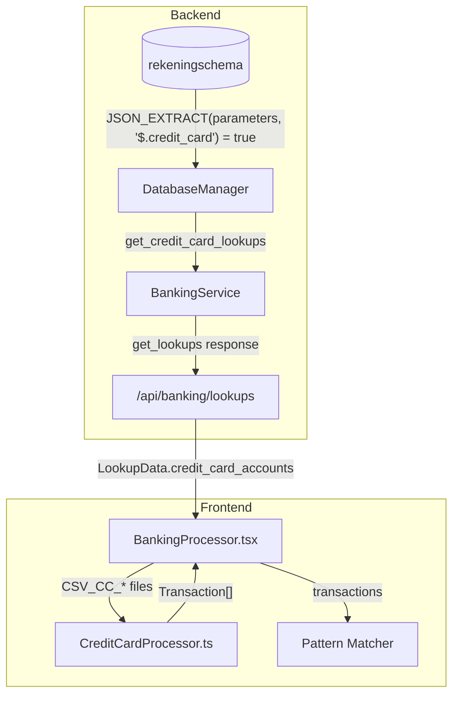

# Design Document — Credit Card Processing

## Overview

This feature replaces the hardcoded `processCreditCardTransaction` function in `BankingProcessor.tsx` with a parameter-driven, modular credit card processor. The new module resolves credit card accounts dynamically via `$.credit_card` flags in the `rekeningschema` table, calculates exchange rate differences for foreign currency transactions, and integrates with the existing pattern matching system.

The architecture follows the same patterns established by `processRabobankTransaction` and `processRevolutTransaction`:

- Backend provides lookup data via the existing `/api/banking/lookups` endpoint
- Frontend module processes CSV rows into `Transaction[]` objects
- Pattern matcher assigns debit accounts post-processing

### Key Design Decisions

| Decision                    | Choice                                                   | Rationale                                                                                   |
| --------------------------- | -------------------------------------------------------- | ------------------------------------------------------------------------------------------- |
| Module location             | `frontend/src/components/banking/CreditCardProcessor.ts` | Consistent with `BankingMutatiesTab` location; keeps BankingProcessor.tsx manageable        |
| Return type                 | `Transaction[]` (not `Transaction \| null`)              | Foreign transactions generate 2 transactions (main + exchange rate difference)              |
| Lookup key                  | cc_bank_iban + card_number (columns 0 + 2)               | Two-field composite key ensures uniqueness even with same last-4 digits                     |
| Exchange rate calc location | Frontend (during CSV parse)                              | Consistent with existing pattern; no new backend endpoints needed                           |
| Duplicate detection field   | `Ref2` = Transactiereferentie (column 6)                 | Unique per transaction in Rabo BusinessCard CSV; same pattern as Rabobank's sequence number |

## Architecture



### Data Flow

1. **Startup**: `BankingProcessor` calls `/api/banking/lookups` → receives `LookupData` including `credit_card_accounts`
2. **File Detection**: `processFiles()` detects `CSV_CC_*` filename prefix → delegates to `CreditCardProcessor`
3. **Row Processing**: For each CSV row, `processCreditCardTransactions()` returns `Transaction[]` (1 or 2 items)
4. **Duplicate Check**: Backend `save_approved_transactions` checks for duplicates (see Duplicate Detection section below)
5. **Pattern Matching**: Pattern matcher assigns `Debet` accounts based on description patterns

## Components and Interfaces

### Backend: `DatabaseManager.get_credit_card_lookups()`

```python
def get_credit_card_lookups(self, administration=None):
    """Get credit card lookup data from rekeningschema using parameters $.credit_card flag.

    Args:
        administration: Optional tenant filter

    Returns:
        List of dicts with keys: iban, Account, card_number, administration
    """
    base_query = """
        SELECT
            JSON_UNQUOTE(JSON_EXTRACT(parameters, '$.cc_bank_iban')) AS cc_bank_iban,
            Account,
            JSON_UNQUOTE(JSON_EXTRACT(parameters, '$.card_number')) AS card_number,
            administration
        FROM rekeningschema
        WHERE JSON_EXTRACT(parameters, '$.credit_card') = true
    """
    if administration:
        return self.execute_query(
            base_query + " AND administration = %s ORDER BY administration, Account",
            (administration,)
        )
    return self.execute_query(base_query + " ORDER BY administration, Account")
```

### Backend: `DatabaseManager.get_exchange_rate_account()`

```python
def get_exchange_rate_account(self, administration=None):
    """Get the exchange rate difference account from rekeningschema.

    Args:
        administration: Optional tenant filter

    Returns:
        List of dicts with keys: Account, administration
    """
    base_query = """
        SELECT Account, administration
        FROM rekeningschema
        WHERE JSON_EXTRACT(parameters, '$.exchange_rate_account') = true
    """
    if administration:
        return self.execute_query(
            base_query + " AND administration = %s",
            (administration,)
        )
    return self.execute_query(base_query)
```

### Backend: `BankingService.get_lookups()` Extension

The existing `get_lookups` method is extended to include credit card accounts and exchange rate account:

```python
def get_lookups(self, tenant):
    # ... existing code ...
    credit_card_accounts = db.get_credit_card_lookups(administration=tenant)
    exchange_rate_accounts = db.get_exchange_rate_account(administration=tenant)

    return {
        'success': True,
        'accounts': sorted(list(accounts)),
        'descriptions': sorted(list(descriptions)),
        'bank_accounts': bank_accounts,
        'credit_card_accounts': credit_card_accounts,
        'exchange_rate_account': exchange_rate_accounts[0]['Account'] if exchange_rate_accounts else None
    }
```

### Frontend: Extended `LookupData` Interface

```typescript
export interface CreditCardAccount {
  iban: string;
  Account: string;
  card_number: string;
  administration: string;
}

export interface LookupData {
  accounts: string[];
  descriptions: string[];
  bank_accounts: Array<{
    rekeningNummer: string;
    Account: string;
    administration: string;
  }>;
  credit_card_accounts: CreditCardAccount[];
  exchange_rate_account: string | null;
}
```

### Frontend: `CreditCardProcessor.ts`

```typescript
// frontend/src/components/banking/CreditCardProcessor.ts

import {
  Transaction,
  LookupData,
  CreditCardAccount,
} from "../BankingProcessor";

export interface CreditCardProcessorResult {
  transactions: Transaction[];
  warnings: string[];
}

/**
 * Process a single credit card CSV row into Transaction(s).
 * Returns 1 transaction for EUR payments, 2 for foreign currency (main + exchange rate diff).
 */
export function processCreditCardTransactions(
  columns: string[],
  index: number,
  lookupData: LookupData,
  fileName: string,
): CreditCardProcessorResult;
```

### Function Signature & Behavior

```typescript
export function processCreditCardTransactions(
  columns: string[],
  index: number,
  lookupData: LookupData,
  fileName: string,
): CreditCardProcessorResult {
  const result: CreditCardProcessorResult = { transactions: [], warnings: [] };

  // 1. Validate: minimum 13 columns
  if (columns.length < 13) return result;

  // 2. Parse amount (comma decimal, round to 2 decimals)
  const amountStr = columns[8] || "0";
  const amount =
    Math.round(parseFloat(amountStr.replace(",", ".")) * 100) / 100;
  if (amount === 0) return result;

  // 3. Resolve credit card account via composite key lookup
  const iban = columns[0] || "";
  const cardNumber = columns[2] || "";
  const lookupKey = `${iban}_${cardNumber}`;
  const ccLookup = lookupData.credit_card_accounts.find(
    (cc) => cc.iban === lookupKey,
  );
  if (!ccLookup) {
    throw new Error(
      `Credit card rekening ${iban} is niet geconfigureerd voor deze tenant. ` +
        `Voeg deze toe in het Rekeningschema met de credit_card vlag.`,
    );
  }

  // 4. Build main transaction
  const isExpense = amount < 0;
  const absAmount = Math.abs(amount); // Already rounded to 2 decimals in step 2
  const currentDate = new Date().toISOString().split("T")[0];

  const mainTransaction: Transaction = {
    row_id: index,
    TransactionNumber: `Visa ${currentDate}`,
    TransactionDate: columns[7] || "",
    TransactionDescription: buildDescription(columns),
    TransactionAmount: absAmount,
    Debet: isExpense ? "" : ccLookup.Account, // Credit (positive) → debit bank
    Credit: isExpense ? ccLookup.Account : "", // Expense (negative) → credit bank
    ReferenceNumber: "", // Empty for pattern matcher
    Ref1: columns[3] || "", // Productnaam
    Ref2: columns[6] || "", // Transactiereferentie (duplicate key)
    Ref3: iban, // Tegenrekening IBAN
    Ref4: fileName,
    Administration: ccLookup.administration,
  };
  result.transactions.push(mainTransaction);

  // 5. Check for foreign currency → exchange rate difference
  const originalAmount = columns[10]
    ? parseFloat(columns[10].replace(",", "."))
    : 0;
  const exchangeRate = columns[12]
    ? parseFloat(columns[12].replace(",", "."))
    : 0;

  if (originalAmount !== 0 && exchangeRate > 0 && columns[11]?.trim()) {
    const calculatedEurAmount =
      Math.round((originalAmount / exchangeRate) * 100) / 100;
    const exchangeRateDiff =
      Math.round((absAmount - Math.abs(calculatedEurAmount)) * 100) / 100;

    if (Math.abs(exchangeRateDiff) > 0.005) {
      // Threshold to avoid floating point noise
      if (!lookupData.exchange_rate_account) {
        result.warnings.push(
          `Koersverschillenrekening niet geconfigureerd. Koersverschil van €${exchangeRateDiff.toFixed(2)} ` +
            `voor transactie ${columns[6]} wordt overgeslagen.`,
        );
      } else {
        const isGain = exchangeRateDiff > 0; // Positive = exchange rate gain
        const absExchangeDiff = Math.abs(exchangeRateDiff);

        const exchangeTransaction: Transaction = {
          row_id: index + 5000, // Offset to avoid row_id collision
          TransactionNumber: `Visa Koers ${currentDate}`,
          TransactionDate: columns[7] || "",
          TransactionDescription: `Koersverschil ${columns[11]} ${columns[10]} @ ${columns[12]}`,
          TransactionAmount: absExchangeDiff,
          Debet: isGain ? "" : lookupData.exchange_rate_account,
          Credit: isGain ? lookupData.exchange_rate_account : "",
          ReferenceNumber: "",
          Ref1: columns[3] || "",
          Ref2: `${columns[6]}_FX`, // Link to main transaction
          Ref3: iban,
          Ref4: fileName,
          Administration: ccLookup.administration,
        };
        result.transactions.push(exchangeTransaction);
      }
    }
  }

  return result;
}

function buildDescription(columns: string[]): string {
  const description = columns[9] || "";
  const originalCurrency = columns[11]?.trim();
  const originalAmount = columns[10]?.trim();

  if (originalCurrency && originalAmount) {
    return `${description} [${originalCurrency} ${originalAmount}]`.trim();
  }
  return description.trim();
}
```

## Data Models

### Database: `rekeningschema.parameters` JSON Extensions

Credit card account configuration:

```json
{
  "credit_card": true,
  "cc_bank_iban": "NL80RABO0107936917",
  "card_number": "6416"
}
```

Exchange rate account configuration:

```json
{
  "exchange_rate_account": true
}
```

### CSV Column Mapping (Rabo BusinessCard Visa — 13 columns)

| Index | Column Name          | Maps To                                 | Notes                                  |
| ----- | -------------------- | --------------------------------------- | -------------------------------------- |
| 0     | Tegenrekening IBAN   | Lookup key → `Administration`, `Credit` | Resolves via `credit_card_accounts`    |
| 1     | Munt                 | —                                       | Always "EUR" (settlement currency)     |
| 2     | Creditcard Nummer    | —                                       | Last 4 digits, matches `$.card_number` |
| 3     | Productnaam          | `Ref1`                                  | e.g., "Rabo BusinessCard Visa"         |
| 4     | Creditcard Regel1    | —                                       | Cardholder name                        |
| 5     | Creditcard Regel2    | —                                       | Company name                           |
| 6     | Transactiereferentie | `Ref2`                                  | Unique ID for duplicate detection      |
| 7     | Datum                | `TransactionDate`                       | Format: YYYY-MM-DD                     |
| 8     | Bedrag               | `TransactionAmount`                     | Comma decimal, signed (+/-)            |
| 9     | Omschrijving         | `TransactionDescription`                | Main description text                  |
| 10    | Oorspr bedrag        | Exchange rate calc                      | Empty for EUR transactions             |
| 11    | Oorspr munt          | Description suffix                      | e.g., "USD", "GBP"                     |
| 12    | Koers                | Exchange rate calc                      | Empty for EUR transactions             |

### Transaction Field Mapping

| Transaction Field        | Source                                       | Notes                                  |
| ------------------------ | -------------------------------------------- | -------------------------------------- |
| `row_id`                 | Sequential index                             | From processFiles loop                 |
| `TransactionNumber`      | `"Visa {currentDate}"`                       | Batch identifier                       |
| `TransactionDate`        | Column 7                                     | YYYY-MM-DD                             |
| `TransactionDescription` | Column 9 + optional FX info                  | Appends `[USD 25.00]` for foreign      |
| `TransactionAmount`      | round(abs(Column 8), 2)                      | Always positive, rounded to 2 decimals |
| `Debet`                  | Empty (expense) or ccLookup.Account (credit) | Pattern matcher fills expense account  |
| `Credit`                 | ccLookup.Account (expense) or empty (credit) | From lookup resolution                 |
| `ReferenceNumber`        | Empty string                                 | Pattern matcher fills this             |
| `Ref1`                   | Column 3 (Productnaam)                       | "Rabo BusinessCard Visa"               |
| `Ref2`                   | Column 6 (Transactiereferentie)              | Duplicate detection key                |
| `Ref3`                   | Column 0 (Tegenrekening IBAN)                | Source account identifier              |
| `Ref4`                   | fileName                                     | Source file tracking                   |
| `Administration`         | ccLookup.administration                      | From lookup resolution                 |

## Correctness Properties

_A property is a characteristic or behavior that should hold true across all valid executions of a system — essentially, a formal statement about what the system should do. Properties serve as the bridge between human-readable specifications and machine-verifiable correctness guarantees._

### Property 1: CSV Parsing Validity

_For any_ valid credit card CSV row with 13+ columns and a non-zero amount (column 8), parsing with a configured IBAN SHALL always produce at least one Transaction where `TransactionAmount > 0`, `TransactionDate` equals column 7, and `Ref2` equals column 6.

**Validates: Requirements 7.2, 7.3, 7.4, 7.7**

### Property 2: Lookup Resolution Determines Account Fields

_For any_ credit card CSV row where the IBAN (column 0) exists in `lookupData.credit_card_accounts`, the resulting Transaction's `Administration` SHALL equal the lookup's `administration` field, and the `Credit` (for expenses) or `Debet` (for credits) SHALL equal the lookup's `Account` field — never a hardcoded value.

**Validates: Requirements 2.1, 2.3, 2.4, 2.5**

### Property 3: Missing IBAN Throws Descriptive Error

_For any_ IBAN string that does not exist in `lookupData.credit_card_accounts`, calling `processCreditCardTransactions` SHALL throw an Error whose message contains the missing IBAN string.

**Validates: Requirements 2.2**

### Property 4: Exchange Rate Difference Calculation

_For any_ foreign currency transaction (columns 10, 11, 12 populated with valid values), the exchange rate difference SHALL equal `abs(settlement_amount) - abs(original_amount / exchange_rate)`. The sum of the main transaction amount and the exchange rate difference amount SHALL equal the absolute settlement amount (column 8).

**Validates: Requirements 3.2, 3.3**

### Property 5: Exchange Rate Transaction Debit/Credit Direction

_For any_ non-zero exchange rate difference with a configured exchange rate account: if the difference is positive (gain), the exchange rate transaction SHALL have `Credit = exchange_rate_account`; if negative (loss), it SHALL have `Debet = exchange_rate_account`.

**Validates: Requirements 3.5, 3.6, 3.7**

### Property 6: Reference Field Mapping

_For any_ credit card CSV row that produces a transaction, `Ref1` SHALL equal column 3 (Productnaam), `Ref2` SHALL equal column 6 (Transactiereferentie), `Ref3` SHALL equal column 0 (Tegenrekening IBAN), `ReferenceNumber` SHALL be empty, and `Debet` SHALL be empty for expense transactions (before pattern matching).

**Validates: Requirements 4.1, 4.4, 5.3, 5.4, 7.5, 7.6**

## Duplicate Detection

### Current Mechanism (Rabobank/Revolut)

The existing `save_approved_transactions` in `banking_processor.py` checks duplicates using `TransactionAmount + TransactionDate + administration + normalized TransactionDescription`. This is a fuzzy match — it does **not** use `Ref2`.

### Credit Card Enhancement: Ref2-Based Check

For credit card transactions, `Ref2` contains the Transactiereferentie (column 6) — a unique ID assigned by the bank per transaction. This is a much stronger duplicate key than the fuzzy description match.

The `save_approved_transactions` method must be extended with a `Ref2`-based check that takes priority when `Ref2` is populated and non-empty:

```python
# In save_approved_transactions, BEFORE the existing fuzzy check:
ref2 = transaction.get('Ref2', '').strip()
if ref2:
    cursor.execute(f"""
        SELECT ID FROM {table_name}
        WHERE Ref2 = %s
        AND administration = %s
        LIMIT 1
    """, (ref2, transaction.get('administration')))

    if cursor.fetchone():
        print(f"Skipping duplicate (Ref2 match): {ref2}")
        continue
```

This approach:

- **Does not break existing behavior**: Rabobank uses sequential numbers in `Ref2` (e.g., "12345") which are also unique; Revolut uses composite strings. Both benefit from this check.
- **Is deterministic**: No fuzzy matching needed — exact `Ref2 + administration` match.
- **Handles FX transactions**: The exchange rate difference transaction uses `{Ref2}_FX` as its `Ref2`, so it won't collide with the main transaction but will still be deduplicated on re-import.

## Error Handling

| Scenario                             | Behavior                                      | User Feedback                                                                    |
| ------------------------------------ | --------------------------------------------- | -------------------------------------------------------------------------------- |
| IBAN not in `credit_card_accounts`   | Throw Error                                   | Error message with IBAN: "Credit card rekening [IBAN] is niet geconfigureerd..." |
| Row has < 13 columns                 | Return empty result                           | Silent skip (logged in console)                                                  |
| Amount is zero                       | Return empty result                           | Silent skip                                                                      |
| Exchange rate account not configured | Process main transaction, skip FX transaction | Warning in `CreditCardProcessorResult.warnings`                                  |
| Exchange rate is zero or negative    | Treat as EUR transaction                      | No FX transaction generated                                                      |
| Duplicate Transactiereferentie       | Skip transaction                              | Counted in duplicate summary (existing mechanism)                                |

### Error Propagation

- **Fatal errors** (missing IBAN lookup): Thrown as `Error`, caught by `processFiles()` in BankingProcessor, displayed to user via `setMessage()`
- **Warnings** (missing exchange rate account): Collected in `result.warnings`, displayed as non-blocking notifications
- **Silent skips** (invalid rows): Logged to console, not shown to user

## Testing Strategy

### Property-Based Tests (fast-check 4.4.0)

**File**: `frontend/src/components/banking/__tests__/CreditCardProcessor.property.test.ts`

- Library: `fast-check` via `import fc from 'fast-check'`
- Minimum 100 iterations per property
- Each test tagged with: `Feature: credit-card-processing, Property {N}: {title}`

**Generators needed**:

- `arbitraryCsvRow()`: Generates valid 13-column CSV rows with realistic data (Dutch comma decimals, YYYY-MM-DD dates, non-zero amounts)
- `arbitraryForeignCsvRow()`: Extends `arbitraryCsvRow` with populated columns 10-12
- `arbitraryLookupData()`: Generates `LookupData` with random credit card accounts and exchange rate account
- `arbitraryIban()`: Generates realistic IBAN strings (NL format)

### Unit Tests (Vitest)

**File**: `frontend/src/components/banking/__tests__/CreditCardProcessor.test.ts`

- Example-based tests for specific scenarios from the CSV test data
- Edge cases: empty columns, boundary amounts, header detection
- Integration with `test-utils` render wrapper (for any component tests)

### Backend Unit Tests (pytest)

**File**: `backend/tests/unit/test_credit_card_lookups.py`

- Test `get_credit_card_lookups()` SQL query construction
- Test all returned keys (iban, Account, card_number, administration) — lesson from bank_account key drift
- Test `get_exchange_rate_account()` query
- Test `get_lookups()` includes credit_card_accounts in response

### Integration Tests

- Duplicate detection via existing `check-sequences` endpoint with Ref2 values
- Pattern matcher applying patterns to credit card transactions
- End-to-end: CSV upload → transaction creation → save

### Test Configuration

```typescript
// Property test example structure
import fc from "fast-check";
import { processCreditCardTransactions } from "../CreditCardProcessor";

describe("CreditCardProcessor Properties", () => {
  it("Property 1: CSV parsing validity", () => {
    // Feature: credit-card-processing, Property 1: CSV Parsing Validity
    fc.assert(
      fc.property(
        arbitraryCsvRow(),
        arbitraryLookupData(),
        (csvRow, lookupData) => {
          const result = processCreditCardTransactions(
            csvRow,
            0,
            lookupData,
            "CSV_CC_test.csv",
          );
          expect(result.transactions.length).toBeGreaterThanOrEqual(1);
          expect(result.transactions[0].TransactionAmount).toBeGreaterThan(0);
          // ... additional assertions
        },
      ),
      { numRuns: 100 },
    );
  });
});
```
