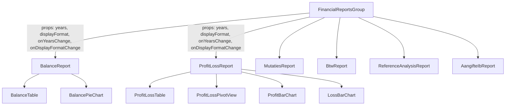
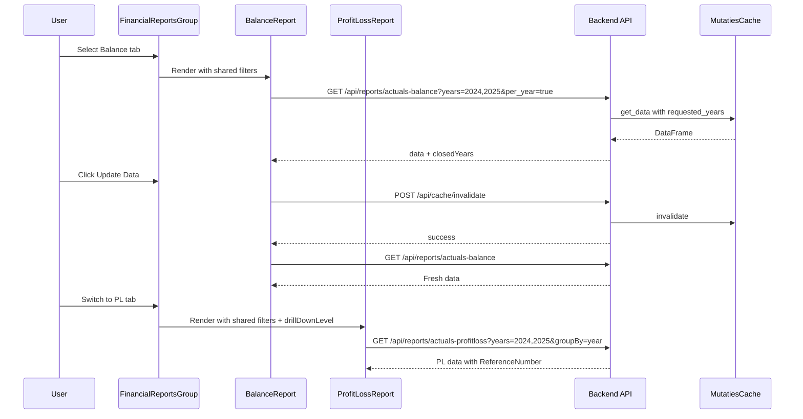

# Design Document — fin-reports-balance-pl-split

## Overview

This design splits the monolithic `ActualsReport.tsx` (814 lines) into two focused report components — `BalanceReport` and `ProfitLossReport` — each rendered as a separate tab within `FinancialReportsGroup`. Shared state (selected years, display format) is lifted to the parent and synced across both tabs. The P&L tab gains a drill-down level filter, reference number expansion, an alternative pivot view, and split profit/loss histograms. The Balance tab gains year-column layout with year-end closure awareness. Both tabs fix the cache invalidation bug and adopt consistent responsive breakpoints.

### Key Design Decisions

| Decision               | Choice                                                            | Rationale                                                                                             |
| ---------------------- | ----------------------------------------------------------------- | ----------------------------------------------------------------------------------------------------- |
| State management       | Lift shared filters to `FinancialReportsGroup` via props          | Keeps both tabs in sync without global state library                                                  |
| Year-end closure data  | Fetch via existing `/api/year-end/closed-years` service           | Reuses existing `yearEndClosureService.ts`; no new endpoint needed                                    |
| Balance API change     | New `per_year=true` query param on `/api/reports/actuals-balance` | Returns year-bucketed data instead of cumulative sum; backward compatible                             |
| Cache invalidation fix | Frontend calls `POST /api/cache/invalidate` before re-fetching    | Uses existing endpoint; requires relaxing role restriction from SysAdmin to `actuals_read` permission |
| Pivot view             | Client-side data transformation, not a new API                    | Same data, different rendering — no backend change needed                                             |
| Chart library          | Recharts 3.3 (already in use)                                     | Consistent with existing codebase                                                                     |

## Architecture

### Component Hierarchy



### Data Flow



### Responsive Layout

Both Balance and PL pages use `Grid templateColumns={{ base: "1fr", lg: "1fr <chart-width>" }}` so the chart reflows below the table at the Chakra `lg` breakpoint (~62em / 992px) for all screen sizes, not just mobile.

## Components and Interfaces

### FinancialReportsGroup (modified)

Lifts shared filter state and passes it down to both report tabs.

```typescript
interface SharedFilterState {
  selectedYears: string[];
  displayFormat: "2dec" | "0dec" | "k" | "m";
  availableYears: string[];
}
// FinancialReportsGroup manages selectedYears, displayFormat, availableYears
// and passes these + setters as props to BalanceReport and ProfitLossReport
```

### BalanceReport

```typescript
interface BalanceReportProps {
  selectedYears: string[];
  displayFormat: string;
  availableYears: string[];
  onYearsChange: (years: string[]) => void;
  onDisplayFormatChange: (format: string) => void;
}
// Internal state: balanceData, closedYears (from yearEndClosureService),
// expandedParents, loading, error
```

```typescript
interface BalanceYearRecord {
  Parent: string;
  Reknum: string;
  AccountName: string;
  jaar: number;
  Amount: number;
}
```

### ProfitLossReport

```typescript
interface ProfitLossReportProps {
  selectedYears: string[];
  displayFormat: string;
  availableYears: string[];
  onYearsChange: (years: string[]) => void;
  onDisplayFormatChange: (format: string) => void;
}
// Internal state: profitLossData, drillDownLevel ('year'|'quarter'|'month'),
// viewMode ('standard'|'pivot'), expandedParents, expandedLedgers, loading, error
```

```typescript
interface PLRecord {
  Parent: string;
  Reknum: string;
  AccountName: string;
  jaar: number;
  kwartaal?: number;
  maand?: number;
  Amount: number;
  ReferenceNumber?: string;
}
```

### Cache Invalidation Helper

```typescript
// Shared utility used by both BalanceReport and ProfitLossReport
async function invalidateAndFetch(fetchFn: () => Promise<void>): Promise<void> {
  await authenticatedPost("/api/cache/invalidate", {});
  await fetchFn();
}
```

### Backend API Changes

#### `GET /api/reports/actuals-balance` — new `per_year` parameter

When `per_year=true`:

- Returns rows grouped by `(Parent, Reknum, AccountName, jaar)` instead of summing across all years
- Includes `closedYears` array in response from `year_closure_status` table
- For closed years: filters to only that year's transactions (no cumulative)
- For open years: cumulative from start through that year

Response shape:

```json
{
  "success": true,
  "data": [
    {
      "Parent": "1000 Assets",
      "Reknum": "1010",
      "AccountName": "Bank",
      "jaar": 2024,
      "Amount": 50000
    },
    {
      "Parent": "1000 Assets",
      "Reknum": "1010",
      "AccountName": "Bank",
      "jaar": 2025,
      "Amount": 55000
    }
  ],
  "closedYears": [2023, 2024]
}
```

#### `GET /api/reports/actuals-profitloss` — new `includeRef` parameter

When `includeRef=true`:

- Includes `ReferenceNumber` in the grouping columns so individual transactions are returned for ledger-level drill-down

#### `POST /api/cache/invalidate` — permission change

Current: requires `SysAdmin` role.
Change: requires `actuals_read` permission (available to both `Finance_CRUD` and `Finance_Read` roles — anyone who can view the reports can refresh the data).

## Data Models

### Database (no schema changes)

The `vw_mutaties` view already contains all needed columns:

- `VW` — 'N' for balance, 'Y' for P&L
- `jaar`, `kwartaal`, `maand` — time dimensions
- `Parent`, `Reknum`, `AccountName` — account hierarchy
- `ReferenceNumber` — transaction reference for drill-down
- `Amount` — transaction amount

The `year_closure_status` table tracks closed years:

- `administration` — tenant identifier
- `year` — closed fiscal year
- `closed_date` — when the year was closed
- `closure_transaction_number`, `opening_balance_transaction_number` — reference transactions

### Frontend Data Transformations

#### Balance: Year-Column Grouping

```
Raw API data (per_year=true):
  [{ Parent, Reknum, AccountName, jaar, Amount }, ...]

Grouped structure:
  { [Parent]: { ledgers: { [ledgerKey]: { [year]: amount } }, totals: { [year]: amount } } }
```

#### P&L: Pivot View Transformation

Standard view: rows = accounts, columns = time periods.
Pivot view: rows = accounts (Parent then Ledger), columns = years with expandable sub-periods.
The pivot is a client-side transformation of the same data — no additional API call.

#### P&L: Chart Data Split

```
profitLossData
  -> filter Parent starts with "8" -> profitChartData (revenue)
  -> filter Parent starts with "4" -> lossChartData (costs)
```

Each chart gets its own Y-axis scale, eliminating the blank space from the combined chart.

## Correctness Properties

_A property is a characteristic or behavior that should hold true across all valid executions of a system — essentially, a formal statement about what the system should do. Properties serve as the bridge between human-readable specifications and machine-verifiable correctness guarantees._

### Property 1: VW flag filtering preserves only matching records

_For any_ array of financial records with mixed VW values ('N' and 'Y'), filtering for balance (VW='N') should produce a result where every record has VW='N' and no VW='Y' records remain, and vice versa for P&L filtering. The union of both filtered sets should equal the original set (no records lost or duplicated).

**Validates: Requirements 1.2, 1.3**

### Property 2: Year-end closure aware balance calculation

_For any_ set of balance transactions spanning multiple years and any partition of those years into "closed" and "open" sets: the balance for a closed year must equal the sum of only that year's transactions, while the balance for an open year must equal the cumulative sum of all transactions from the earliest year through that open year.

**Validates: Requirements 2.2, 2.3**

### Property 3: Grand total equals sum of column values

_For any_ set of financial records grouped by time period (year, quarter, or month), the grand total for each period column must equal the sum of all individual account amounts for that period. This holds for both Balance year-columns and P&L period-columns.

**Validates: Requirements 2.6, 3.5**

### Property 4: Drill-down column key generation

_For any_ non-empty set of selected years and any drill-down level (year, quarter, month), the generated column keys must: (a) be sorted chronologically, (b) contain exactly |years| keys for year level, |years| _ 4 for quarter level, and |years| _ 12 for month level, and (c) each key must reference one of the selected years.

**Validates: Requirements 3.4**

### Property 5: Chart data split partitions by Parent prefix

_For any_ set of P&L records, splitting into revenue (Parent starts with "8") and cost (Parent starts with "4") charts must produce two disjoint sets where every record in the revenue set has a Parent starting with "8" and every record in the cost set has a Parent starting with "4". No records from other Parent ranges appear in either chart.

**Validates: Requirements 5.1**

## Error Handling

| Scenario                              | Handling                                                          |
| ------------------------------------- | ----------------------------------------------------------------- |
| API fetch failure                     | Show Alert with error message; retain previously loaded data      |
| Cache invalidation failure            | Log warning, proceed with fetch (stale data is acceptable)        |
| No tenant selected                    | Show warning Alert; disable data fetching                         |
| Tenant switch mid-load                | Cancel in-flight requests, clear data, re-fetch for new tenant    |
| Empty data for selected years         | Show empty table with headers; valid state, no error              |
| Year-end closure status fetch failure | Fall back to treating all years as open (cumulative); log warning |

## Testing Strategy

### Property-Based Tests (fast-check, min 100 iterations each)

- Property 1: Generate arrays of records with random VW flags, apply filter, assert invariant.
  Tag: `Feature: fin-reports-balance-pl-split, Property 1: VW flag filtering preserves only matching records`

- Property 2: Generate transactions with random years/amounts, random closed-year sets, apply balance calculation, verify closed vs open year logic.
  Tag: `Feature: fin-reports-balance-pl-split, Property 2: Year-end closure aware balance calculation`

- Property 3: Generate grouped financial records, compute grand totals, verify sum equality.
  Tag: `Feature: fin-reports-balance-pl-split, Property 3: Grand total equals sum of column values`

- Property 4: Generate random year arrays (1-5 years) and drill-down levels, verify column key count and format.
  Tag: `Feature: fin-reports-balance-pl-split, Property 4: Drill-down column key generation`

- Property 5: Generate PL records with random Parent prefixes, apply split, verify partition correctness.
  Tag: `Feature: fin-reports-balance-pl-split, Property 5: Chart data split partitions by Parent prefix`

### Unit Tests (Jest + React Testing Library)

- FinancialReportsGroup renders Balance and P&L tabs (not Actuals)
- Shared filter state syncs between tabs
- BalanceReport renders year columns with closed/open indicators
- ProfitLossReport expand/collapse for Parent, Ledger, and ReferenceNumber levels
- Pivot view toggle preserves filters
- Update Data button calls invalidate before fetch (mock API)
- Loading indicator shown during cache refresh
- formatAmount produces correct output for each display format

### Integration Tests

- Cache invalidation flow: POST /api/cache/invalidate then GET data endpoint
- Backend per_year=true returns year-bucketed balance data with closedYears
- Backend includeRef=true returns transaction-level P&L data

### E2E Tests (Playwright)

- Navigate to FIN Reports, verify Balance and P&L tabs exist
- Switch between tabs, verify shared filters persist
- Responsive layout: resize below lg breakpoint, verify chart reflows below table
