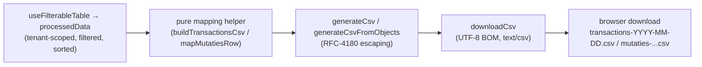

# Design Document

## Overview

This feature delivers a tight, frontend-only CSV export fix in two parts, both converging on the shared CSV utility `frontend/src/utils/csvExport.ts`:

- **Part (a) — Table export** adds an "Export to CSV" control to `BankingMutatiesTab.tsx` that exports the **full** filtered-and-sorted dataset (`processedData`), not the display-limited slice (`displayedData`) used for rendering.
- **Part (b) — Report export** standardizes the existing hand-rolled `exportMutatiesCsv` in `MutatiesReport.tsx` onto the shared utility while **preserving the exact headers, column order, and UTF-8 BOM**, and extracts the row→cells mapping into a pure, testable helper that pins the Debit=`Reknum` (account code) / Credit=`AccountName` (account name) contract.

Both exports emit **raw** underlying field values (not locale-formatted display strings), produce RFC-4180-compliant output, and rely on the existing server-enforced tenant isolation. **No backend schema or route changes are required** — the `/api/reports/mutaties-table` SELECT already returns `Reknum` and `AccountName` from `vw_mutaties`.

### Verified codebase facts grounding this design

- `csvExport.ts` exports `generateCsv(headers, rows, options)`, `generateCsvFromObjects(columns, data, options)`, and `downloadCsv(csvContent, filename)`. `downloadCsv` already prepends a UTF-8 BOM (`\uFEFF`) and uses `type: 'text/csv;charset=utf-8;'`. `generateCsv` already performs RFC-4180 escaping (quotes a field containing the delimiter, `"`, `\n`, or `\r`; doubles internal quotes).
- `BankingMutatiesTab.tsx` destructures `processedData` from `useFilterableTable<Transaction>(mutaties, { initialFilters, defaultSort })` and derives `displayedData = processedData.slice(0, displayLimit)` purely for rendering. The "Add new record" button lives in an `HStack`, is `colorScheme="green" size="sm"`, and calls `openInsertModal`. The component already uses `const { t } = useTypedTranslation('banking')`.
- `Transaction` fields: `ID?`, `row_id`, `TransactionNumber`, `TransactionDate`, `TransactionDescription`, `TransactionAmount`, `Debet`, `Credit`, `ReferenceNumber`, `Ref1..Ref4`, `Administration`.
- `MutatiesReport.tsx` `exportMutatiesCsv` currently builds a CSV by hand (header `[date, reference, description, amount, debit, credit, administration]` → `[row.TransactionDate, row.ReferenceNumber, row.TransactionDescription, row.Amount, row.Reknum, row.AccountName, row.Administration]`) joined with `row.join(',')` and downloaded via a hand-rolled `Blob` (`text/csv;charset=utf-8;`, **no BOM**, **no escaping**).
- `MutatiesRecord` fields: `TransactionDate`, `TransactionDescription`, `Amount`, `Reknum`, `AccountName`, `Administration`, `ReferenceNumber`.
- `reports` namespace already contains `tables.date/reference/description/amount/debit/credit`, `filters.administration`, and `export.exportToCsv`. The `banking` namespace does **not** yet contain export-specific keys; new keys must be added.

## Architecture

Both exports follow the same minimal pipeline. A pure mapping helper transforms already-scoped rows into cells, the shared util escapes/encodes, and the shared `downloadCsv` triggers the browser download with BOM.



Key architectural decisions:

- **Single escaping/encoding implementation.** Both parts route through `csvExport.ts`. The report's current hand-rolled `row.join(',')` does **not** escape commas, quotes, or newlines — any description containing a comma silently corrupts the CSV columns. Moving to `generateCsv` is a genuine correctness improvement, not a cosmetic refactor. This is called out explicitly because it changes output for pathological rows (correctly).
- **Pure, co-located mapping helpers.** The row→cells logic for each export is extracted into a pure function so it can be unit-tested without rendering a React tree. These helpers are the single source of the column contract.
- **Export the full dataset.** The table export reads `processedData` directly; it must **never** read `displayedData`. This is the central bug the feature fixes.
- **Raw values only.** Mapping helpers read raw record fields. They do not call `formatCurrency`, `formatDate`, `toLocaleDateString`, or `toLocaleString`. The on-screen formatting in the table/report cells is unchanged and independent of export.
- **Tenant scope untouched.** Exports consume rows already loaded under `@tenant_required` server-side isolation and the active filters. No new data source, no backend/route change.

## Components and Interfaces

### Part (a): `BankingMutatiesTab.tsx`

#### Pure mapping helper (co-located)

**Decision:** place the helper in a tiny co-located util `frontend/src/components/banking/transactionsCsv.ts` (not inline in the component), so the unit test imports a pure function without touching Chakra/React. This keeps the component lean and gives the test a stable import surface.

```typescript
// frontend/src/components/banking/transactionsCsv.ts
import { generateCsvFromObjects } from '../../utils/csvExport';

/** Ordered column config for the transactions table export. */
export interface CsvColumn {
  key: string;
  header: string;
}

/**
 * Build the ordered column config. Headers are resolved by the caller via i18n
 * and passed in, so the pure builder stays translation-agnostic and testable.
 */
export function transactionsCsvColumns(headers: {
  trxNumber: string;
  date: string;
  description: string;
  amount: string;
  debit: string;
  credit: string;
  reference: string;
  administration: string;
}): CsvColumn[] {
  return [
    { key: 'TransactionNumber', header: headers.trxNumber },
    { key: 'TransactionDate', header: headers.date },
    { key: 'TransactionDescription', header: headers.description },
    { key: 'TransactionAmount', header: headers.amount },
    { key: 'Debet', header: headers.debit },
    { key: 'Credit', header: headers.credit },
    { key: 'ReferenceNumber', header: headers.reference },
    { key: 'Administration', header: headers.administration },
  ];
}

/**
 * Pure CSV builder. Reads RAW field values (no locale formatting) in input
 * order, for EVERY row (no display-limit slice). RFC-4180 escaping is handled
 * by generateCsvFromObjects.
 */
export function buildTransactionsCsv(
  columns: CsvColumn[],
  rows: Record<string, any>[],
): string {
  return generateCsvFromObjects(columns, rows);
}

/** `transactions-YYYY-MM-DD.csv` using the current date. */
export function transactionsCsvFilename(now: Date = new Date()): string {
  const yyyy = now.getFullYear();
  const mm = String(now.getMonth() + 1).padStart(2, '0');
  const dd = String(now.getDate()).padStart(2, '0');
  return `transactions-${yyyy}-${mm}-${dd}.csv`;
}
```

#### Component wiring

- Add an `onExportCsv` handler built with `useCallback` that reads `processedData` (the full set) and the i18n headers:

```typescript
import { downloadCsv } from '../../utils/csvExport';
import {
  transactionsCsvColumns,
  buildTransactionsCsv,
  transactionsCsvFilename,
} from './transactionsCsv';

const handleExportCsv = React.useCallback(() => {
  if (processedData.length === 0) return;
  const columns = transactionsCsvColumns({
    trxNumber: t('mutaties.export.trxNumber'),
    date: t('mutaties.export.date'),
    description: t('mutaties.export.description'),
    amount: t('mutaties.export.amount'),
    debit: t('mutaties.export.debit'),
    credit: t('mutaties.export.credit'),
    reference: t('mutaties.export.reference'),
    administration: t('mutaties.export.administration'),
  });
  const csv = buildTransactionsCsv(columns, processedData); // FULL dataset
  downloadCsv(csv, transactionsCsvFilename());
}, [processedData, t]);
```

- Add the button into the **existing `HStack`** that holds the "Add new record" button, matching `size="sm"` with a distinct `colorScheme` (`blue`) so it reads as a sibling action, and disabled when the dataset is empty:

```tsx
<Button
  colorScheme="blue"
  size="sm"
  onClick={handleExportCsv}
  isDisabled={processedData.length === 0}
  data-testid="export-transactions-csv-button"
>
  {t('mutaties.export.exportToCsv')}
</Button>
```

- No row-selection checkboxes are added; the table markup is otherwise unchanged. On-screen cell formatting (`MutatieCell`) is untouched.

#### New i18n keys — `frontend/src/locales/{en,nl}/banking.json`

Add a `mutaties.export` block (the `mutaties` object already exists; add the nested `export` object). Reuse existing table-column wording for consistency.

`en/banking.json` → under `"mutaties"`:

```json
"export": {
  "exportToCsv": "Export to CSV",
  "trxNumber": "Trx Number",
  "date": "Date",
  "description": "Description",
  "amount": "Amount",
  "debit": "Debit",
  "credit": "Credit",
  "reference": "Reference",
  "administration": "Administration"
}
```

`nl/banking.json` → under `"mutaties"`:

```json
"export": {
  "exportToCsv": "Exporteren naar CSV",
  "trxNumber": "Trx Nummer",
  "date": "Datum",
  "description": "Omschrijving",
  "amount": "Bedrag",
  "debit": "Debet",
  "credit": "Credit",
  "reference": "Referentie",
  "administration": "Administratie"
}
```

### Part (b): `MutatiesReport.tsx`

#### Pure mapping helper (co-located)

Extract the row→cells mapping and the ordered headers into `frontend/src/components/reports/mutatiesCsv.ts` so a unit test can assert `Debit === Reknum` and `Credit === AccountName` and the column order, without rendering.

```typescript
// frontend/src/components/reports/mutatiesCsv.ts

export interface MutatiesCsvRow {
  TransactionDate: string;
  ReferenceNumber: string;
  TransactionDescription: string;
  Amount: number;
  Reknum: string;       // Account code  -> Debit
  AccountName: string;  // Account name  -> Credit
  Administration: string;
}

/** Fixed header order: Date, Reference, Description, Amount, Debit, Credit, Administration. */
export function mutatiesCsvHeaders(labels: {
  date: string;
  reference: string;
  description: string;
  amount: string;
  debit: string;
  credit: string;
  administration: string;
}): string[] {
  return [
    labels.date,
    labels.reference,
    labels.description,
    labels.amount,
    labels.debit,
    labels.credit,
    labels.administration,
  ];
}

/**
 * Pure row -> cells mapping. RAW values only. Column order matches the headers.
 * Debit = Reknum (account code); Credit = AccountName (account name).
 */
export function mapMutatiesRow(row: MutatiesCsvRow): (string | number)[] {
  return [
    row.TransactionDate,
    row.ReferenceNumber,
    row.TransactionDescription,
    row.Amount,
    row.Reknum,       // Debit  = account code
    row.AccountName,  // Credit = account name
    row.Administration,
  ];
}
```

#### Component wiring

Rewrite `exportMutatiesCsv` to use the extracted helper plus the shared util, preserving the existing filename pattern:

```typescript
import { generateCsv, downloadCsv } from '../../utils/csvExport';
import { mutatiesCsvHeaders, mapMutatiesRow } from './mutatiesCsv';

const exportMutatiesCsv = useCallback(() => {
  const headers = mutatiesCsvHeaders({
    date: t('tables.date'),
    reference: t('tables.reference'),
    description: t('tables.description'),
    amount: t('tables.amount'),
    debit: t('tables.debit'),
    credit: t('tables.credit'),
    administration: t('filters.administration'),
  });
  const rows = processedData.map(mapMutatiesRow);
  const csv = generateCsv(headers, rows);
  const { dateFrom, dateTo } = filtersRef.current;
  downloadCsv(csv, `mutaties-${dateFrom}-${dateTo}.csv`);
}, [processedData, t]);
```

- **Preserved:** identical header labels and order (`tables.date`, `tables.reference`, `tables.description`, `tables.amount`, `tables.debit`, `tables.credit`, `filters.administration`), identical raw-value column order, and the filename `mutaties-{dateFrom}-{dateTo}.csv`.
- **Improved:** escaping is now RFC-4180-correct (the old `row.join(',')` corrupted any field containing a comma/quote), and the BOM is now present via `downloadCsv` (the old hand-rolled `Blob` omitted it). These are the two behavior changes, both strictly corrective, satisfying Requirements 4.2, 8.1, and 8.2.
- No new i18n keys are required for the report export; all referenced keys already exist in the `reports` namespace.

### Backend

**No change required.** `reporting_routes.py` `get_mutaties_table` already SELECTs `Reknum` and `AccountName` from `vw_mutaties` (which joins `Reknum = rekeningschema.Account`), so the response already carries both fields and the Debit=code / Credit=name contract holds end-to-end from view → API → CSV. Correcting the backend mapping is a **contingency only**, invoked solely if investigation per Requirement 6.3 shows the deployed Debit/Credit does not equal code/name. The report mapping unit test (below) is the regression guard for that contract.

## Data Models

No new persisted data models. The export operates on in-memory, already-tenant-scoped arrays:

- **Table export input:** `Transaction[]` as `processedData` from `useFilterableTable`.
- **Report export input:** `MutatiesRecord[]` as `processedData` from `useFilterableTable`.

Column contracts:

| Table export (banking) | Field | | Report export (reports) | Field |
|---|---|---|---|---|
| Trx Number | `TransactionNumber` | | Date | `TransactionDate` |
| Date | `TransactionDate` | | Reference | `ReferenceNumber` |
| Description | `TransactionDescription` | | Description | `TransactionDescription` |
| Amount | `TransactionAmount` | | Amount | `Amount` |
| Debit | `Debet` | | Debit | `Reknum` (account code) |
| Credit | `Credit` | | Credit | `AccountName` (account name) |
| Reference | `ReferenceNumber` | | Administration | `Administration` |
| Administration | `Administration` | | | |

## Error Handling

- **Empty dataset (table export):** the button is disabled when `processedData.length === 0`, and `handleExportCsv` additionally guards with an early return, so no empty-but-header-only file is produced by accident.
- **Null/undefined cell values:** `csvExport.ts` `defaultFormat` already maps `null`/`undefined` to an empty string, so sparse records export as empty cells rather than the literal strings `"null"`/`"undefined"`.
- **Special characters:** commas, double quotes, and newlines in any field are escaped per RFC 4180 by `generateCsv`. UTF-8 content renders correctly in spreadsheet applications because `downloadCsv` prepends the BOM.
- **Tenant safety:** exports read only rows already fetched under the server-enforced tenant scope; there is no client path to widen that scope.

## Correctness Properties

*A property is a characteristic or behavior that should hold true across all valid executions of a system — essentially, a formal statement about what the system should do. Properties serve as the bridge between human-readable specifications and machine-verifiable correctness guarantees.*

### Property 1: Table export mapping completeness and raw values

*For any* list of transaction rows and the configured column set, `buildTransactionsCsv` produces one data line per input row in which every configured column (Trx Number, Date, Description, Amount, Debit, Credit, Reference, Administration) appears in order and each cell equals the **raw** underlying field value (e.g. the raw `TransactionDate` string and the raw numeric `TransactionAmount`), never a locale-formatted display string.

**Validates: Requirements 2.1, 2.4, 3.3**

### Property 2: Full-dataset export independent of display limit

*For any* transaction list of length N — including N greater than the on-screen `displayLimit` — the generated CSV contains exactly N data lines (plus one header line), because the export reads `processedData` rather than the display-limited `displayedData`.

**Validates: Requirements 2.2**

### Property 3: Export preserves sort/order of the processed data

*For any* ordered list of transaction rows, the sequence of a key column (e.g. `TransactionNumber`) in the exported CSV data lines equals the sequence of that field in the input order, so the CSV reflects the current filter-and-sort order.

**Validates: Requirements 2.3**

### Property 4: RFC-4180 escaping of special characters

*For any* row whose text field contains a comma, a double quote, or a newline, the corresponding CSV cell is wrapped in double quotes with internal double quotes doubled, so the field parses back to its original value and does not break column alignment.

**Validates: Requirements 4.1, 4.2**

### Property 5: Report export Debit/Credit mapping to code/name with raw values

*For any* `MutatiesRecord`, `mapMutatiesRow` sets the Debit cell to the Account_Code (`row.Reknum`) and the Credit cell to the Account_Name (`row.AccountName`), emits cells in the order Date, Reference, Description, Amount, Debit, Credit, Administration, and uses raw underlying field values (raw numeric `Amount`, raw `TransactionDate` string) rather than locale-formatted strings.

**Validates: Requirements 5.1, 5.2, 5.4, 6.2**

## Testing Strategy

The repo uses **Vitest + React Testing Library** (see `MutatiesReport.test.tsx`, which mocks `FilterableHeader`/`YearFilter` and uses `@/test-utils`). Tests target the two **pure** mapping helpers so no rendering is needed for the core contract; a couple of lightweight render assertions cover the UI-presence criteria.

Property tests follow the repo's dual approach: minimum 100 iterations per property, tagged **Feature: transactions-export, Property {n}: {text}**. Given the ASAP scope, property-based testing is kept minimal — a small hand-rolled generator (random strings including commas/quotes/newlines, random numbers, variable-length arrays) is sufficient; adopting a PBT library is optional.

### Unit tests — table export helper (`frontend/src/components/banking/transactionsCsv.test.ts`)

- **Mapping completeness (Property 1):** for a sample set of rows, the header line equals the configured headers in order, and every data line contains all eight configured columns reading the correct field. Assert `TransactionAmount` and `TransactionDate` cells equal `String(raw)` with no `€`, no thousands separators, and no `toLocaleDateString` output.
- **Full dataset, not display limit (Property 2):** build with an array longer than any display limit (e.g. 250 rows) and assert the CSV has exactly 250 data lines + 1 header line. This is the explicit guard that the export uses `processedData`, not `displayedData`.
- **Order preservation (Property 3):** for a shuffled input, assert the `TransactionNumber` column sequence in the CSV equals the input sequence.
- **RFC-4180 escaping (Property 4):** include a description containing a comma and one containing an embedded double quote (and a newline); assert the emitted cell is quoted and internal quotes are doubled. Reference the shared `csvExport.ts` util as the escaping implementation under test.
- **Filename:** `transactionsCsvFilename(new Date('2026-02-03'))` returns `transactions-2026-02-03.csv`.

### Unit tests — report export helper (`frontend/src/components/reports/mutatiesCsv.test.ts`)

- **Debit/Credit contract (Property 5, satisfies Req 6.2):** for any `MutatiesRecord`, assert `mapMutatiesRow(row)[4] === row.Reknum` (Debit = account code) and `mapMutatiesRow(row)[5] === row.AccountName` (Credit = account name).
- **Column order (Req 5.3, 8.1):** assert `mutatiesCsvHeaders(labels)` returns `[date, reference, description, amount, debit, credit, administration]` in that order, and that `mapMutatiesRow` returns cells in the matching order.
- **Raw values (Req 5.4):** assert the Amount cell equals the raw number and the Date cell equals the raw `TransactionDate` string (no `formatCurrency`/`formatDate`).

### Render assertions (lightweight)

- **Table export button present and disabled when empty (Req 1.1–1.4):** render `BankingMutatiesTab` with sample data and assert `data-testid="export-transactions-csv-button"` is present and labelled from the `banking` namespace; render with empty `mutaties` and assert the button is disabled. Assert no checkbox inputs were added to the table.
- **Report export button (existing):** `MutatiesReport.test.tsx` already asserts `data-testid="export-csv-button"` is present; the refactor keeps that test green since the button and handler wiring are preserved.

### Out of scope for automated tests

- Backend SELECT contents (Req 6.1) — unchanged and verified; integration-level, not unit.
- UTF-8 BOM / `text/csv` content type (Req 4.3, 8.2) — provided by `downloadCsv` and already covered by the shared util's behavior; optionally spot-checked with a `Blob` spy, but low value to iterate.
- Tenant isolation (Req 7.1, 7.2) — server-enforced; the helpers only read their input rows.
