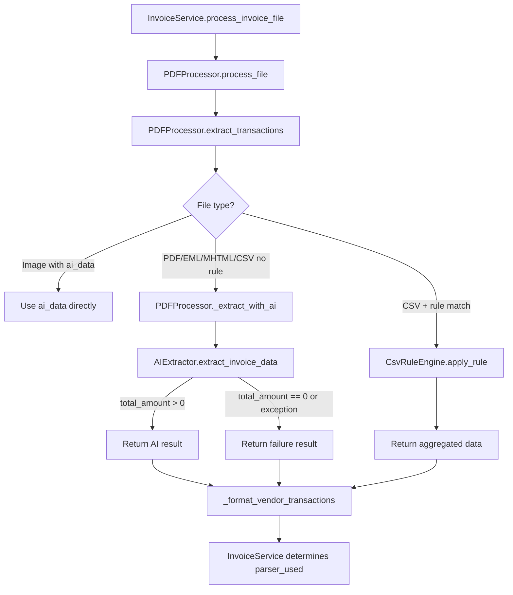

# Design Document: Vendor Parser Cleanup

## Overview

This design removes all 22 legacy vendor-specific regex parsers from the invoice processing pipeline, making AI extraction (via OpenRouter API) the sole extraction method for PDF/image/EML/MHTML files. CSV files with known column layouts are handled by a declarative business rules engine instead of AI, preserving the existing Airbnb aggregation logic in a maintainable, extensible format.

The cleanup simplifies the `PDFProcessor` class by eliminating the `_parse_vendor_specific()` fallback chain, removing the `VendorParsers` dependency, and introducing a clear `parser_used` reporting contract (`"ai"`, `"ai_failed"`, `"csv_rule"`).

### Design Decisions

| Decision                                              | Rationale                                                                              |
| ----------------------------------------------------- | -------------------------------------------------------------------------------------- |
| Delete `vendor_parsers.py` entirely                   | All 22 parsers are dead code once AI is sole extractor; no gradual deprecation needed  |
| Introduce `csv_rules.py` module                       | Declarative rules are testable, extensible, and avoid AI costs for structured CSV data |
| Extend `AIExtractor` return value with token metadata | Enables accurate cost tracking from actual OpenRouter API response usage data          |
| Rename `_parse_vendor_specific` → `_extract_with_ai`  | Clearer intent; method only calls AI now                                               |
| Return failure result instead of `None`               | Explicit failure signaling replaces silent fallthrough to `_generic_parse()`           |

## Architecture



### Data Flow

1. `InvoiceService.process_invoice_file()` calls `PDFProcessor.process_file()` to extract raw text
2. `PDFProcessor.extract_transactions()` routes based on file type:
   - Images with `ai_data` key → use pre-extracted data directly
   - CSV files → check `CsvRuleEngine` for matching rule → apply rule or fall through to AI
   - All other files → call `_extract_with_ai()`
3. `_extract_with_ai()` calls `AIExtractor.extract_invoice_data()` with text + folder name
4. `InvoiceService` determines `parser_used` based on the extraction outcome

## Components and Interfaces

### Modified: `PDFProcessor` (backend/src/pdf_processor.py)

**Removed:**

- `from vendor_parsers import VendorParsers` import
- `self.vendor_parsers = VendorParsers()` in `__init__`
- `_parse_vendor_specific()` method (entire if/elif chain)

**Added:**

- `from csv_rules import CsvRuleEngine` import
- `self.csv_rule_engine = CsvRuleEngine()` in `__init__`
- `_extract_with_ai(lines, folder_name)` method — calls AIExtractor only
- `_apply_csv_rule(lines, folder_name)` method — applies declarative CSV rules

```python
class PDFProcessor:
    def __init__(self, test_mode: bool = False, tenant: str = None):
        self.config = Config(test_mode=test_mode)
        self.csv_rule_engine = CsvRuleEngine()
        self._current_tenant = tenant

    def extract_transactions(self, file_data):
        lines = file_data['txt'].split('\n')
        folder_name = file_data['folder'].lower()

        # Image with pre-extracted AI data
        if 'ai_data' in file_data:
            return self._format_vendor_transactions(file_data['ai_data'], file_data)

        # CSV rule match
        csv_result = self._apply_csv_rule(lines, folder_name)
        if csv_result:
            return self._format_vendor_transactions(csv_result, file_data)

        # AI extraction (sole path for PDF/EML/MHTML/unmatched CSV)
        ai_result = self._extract_with_ai(lines, folder_name)
        if ai_result and ai_result.get('total_amount', 0) > 0:
            return self._format_vendor_transactions(ai_result, file_data)

        # AI failed — return empty transactions with failure marker
        failure_data = ai_result if ai_result else {
            'date': datetime.now().strftime('%Y-%m-%d'),
            'total_amount': 0.0,
            'vat_amount': 0.0,
            'description': f'{folder_name} invoice',
            'vendor': folder_name
        }
        return self._format_vendor_transactions(failure_data, file_data)

    def _extract_with_ai(self, lines, folder_name):
        """Extract invoice data using AI only. No vendor-specific fallback."""
        try:
            from ai_extractor import AIExtractor
            ai_extractor = AIExtractor()

            previous_transactions = []
            try:
                from database import DatabaseManager
                db = DatabaseManager()
                previous_transactions = db.get_previous_transactions(folder_name, limit=3)
            except Exception as e:
                print(f"Could not get previous transactions: {e}")

            text_content = '\n'.join(lines)
            print(f"Starting AI extraction for {folder_name}...", flush=True)
            ai_result = ai_extractor.extract_invoice_data(
                text_content, folder_name, previous_transactions
            )

            # Log AI usage with actual token counts from the API response
            self._log_ai_usage(folder_name, ai_result)

            if ai_result and ai_result.get('total_amount', 0) > 0:
                print(f"AI extraction successful for {folder_name}: €{ai_result['total_amount']}", flush=True)
                return ai_result
            else:
                print(f"AI extraction returned no valid amount for {folder_name}", flush=True)
                return ai_result  # Return the zero-amount result

        except Exception as e:
            print(f"AI extraction error for {folder_name}: {e}", flush=True)
            return None

    def _log_ai_usage(self, folder_name, ai_result):
        """Log AI extraction usage to ai_usage_log with actual token counts."""
        try:
            from database import DatabaseManager
            from services.ai_usage_tracker import AIUsageTracker

            db = DatabaseManager()
            tracker = AIUsageTracker(db)

            # Use actual token counts from the API response metadata
            usage_meta = ai_result.get('_usage', {}) if ai_result else {}
            tokens_used = usage_meta.get('total_tokens', 0)
            model_used = usage_meta.get('model', 'deepseek/deepseek-chat')

            # Skip logging if no token data available (e.g., fallback result)
            if tokens_used == 0:
                return

            tracker.log_ai_request(
                administration=self._current_tenant or 'unknown',
                template_type=f"invoice_extraction_{folder_name}",
                tokens_used=tokens_used,
                model_used=model_used
            )
        except Exception as e:
            # Never fail the extraction because of logging
            print(f"Could not log AI usage: {e}")

    def _apply_csv_rule(self, lines, folder_name):
        """Apply CSV aggregation rule if folder matches a configured rule."""
        rule = self.csv_rule_engine.get_rule(folder_name)
        if not rule:
            return None
        return self.csv_rule_engine.apply(rule, lines, folder_name)
```

### New: `CsvRuleEngine` (backend/src/csv_rules.py)

A declarative engine for processing CSV files with known column layouts.

```python
from dataclasses import dataclass
from typing import Optional
import json
import pandas as pd
import re
from datetime import datetime


@dataclass
class CsvAggregationRule:
    """Declarative CSV aggregation rule."""
    folder_pattern: str          # substring match on folder_name
    amount_column: str           # column to aggregate
    amount_operation: str        # "sum"
    date_column: str             # column for date extraction
    date_operation: str          # "max"
    description_template: str    # e.g. "Hosting Fee; {filename}"
    vat_amount: float            # fixed VAT amount


# Rule registry — add new rules here without modifying extraction logic
CSV_RULES: list[CsvAggregationRule] = [
    CsvAggregationRule(
        folder_pattern="airbnb",
        amount_column="Nettobedag",
        amount_operation="sum",
        date_column="Datum van dienst",
        date_operation="max",
        description_template="Hosting Fee; {filename}",
        vat_amount=0.0,
    ),
]


class CsvRuleEngine:
    """Applies declarative CSV aggregation rules."""

    def __init__(self, rules: Optional[list[CsvAggregationRule]] = None):
        self.rules = rules if rules is not None else CSV_RULES

    def get_rule(self, folder_name: str) -> Optional[CsvAggregationRule]:
        """Find matching rule for folder name (substring match)."""
        folder_lower = folder_name.lower()
        for rule in self.rules:
            if rule.folder_pattern in folder_lower:
                return rule
        return None

    def apply(self, rule: CsvAggregationRule, lines: list[str], folder_name: str) -> Optional[dict]:
        """Apply a CSV aggregation rule to extracted lines."""
        csv_data = self._extract_csv_data(lines)
        if csv_data is None:
            return None

        df = pd.DataFrame(csv_data)
        filename = self._extract_filename(lines)

        try:
            # Aggregate amount
            total_amount = 0.0
            if rule.amount_column in df.columns:
                if rule.amount_operation == "sum":
                    total_amount = float(df[rule.amount_column].dropna().sum())

            # Extract date
            date = datetime.now().strftime('%Y-%m-%d')
            if rule.date_column in df.columns:
                if rule.date_operation == "max":
                    max_date = df[rule.date_column].max()
                    if pd.notna(max_date):
                        parsed = pd.to_datetime(max_date)
                        date = parsed.strftime('%Y-%m-%d')

            # Build description
            description = rule.description_template.format(filename=filename)

            return {
                'date': date,
                'total_amount': round(total_amount, 2),
                'vat_amount': rule.vat_amount,
                'description': description,
                'vendor': folder_name,
                'parser_used_hint': 'csv_rule',
            }

        except Exception as e:
            print(f"Error applying CSV rule for {folder_name}: {e}")
            return None

    def _extract_csv_data(self, lines: list[str]) -> Optional[list[dict]]:
        """Extract JSON CSV data from processed lines."""
        for i, line in enumerate(lines):
            if line == '[CSV_DATA_START]' and i + 1 < len(lines):
                try:
                    return json.loads(lines[i + 1])
                except (json.JSONDecodeError, IndexError):
                    pass
        return None

    def _extract_filename(self, lines: list[str]) -> str:
        """Extract filename from CSV info lines."""
        for line in lines:
            if line.startswith('[CSV File:'):
                match = re.search(r'\[CSV File: (.+)\]', line)
                if match:
                    return match.group(1)
        return ''
```

### Modified: `InvoiceService` (backend/src/services/invoice_service.py)

**Changes:**

- Remove all calls to `_parse_vendor_specific()`
- Remove `vendor_data` from return dictionaries
- Determine `parser_used` from extraction result metadata

```python
def process_invoice_file(self, temp_path, drive_result, folder_name, tenant):
    result = self.processor.process_file(temp_path, drive_result, folder_name)
    transactions = self.processor.extract_transactions(result)

    # Determine parser_used from extraction result
    parser_used = self._determine_parser_used(transactions, result)

    # Get last transactions for smart defaults
    last_transactions = self.transaction_logic.get_last_transactions(folder_name, tenant)

    if isinstance(last_transactions, dict) and last_transactions.get('error'):
        return {
            'success': True,
            'folder': result['folder'],
            'extracted_text': result['txt'],
            'transactions': transactions,
            'prepared_transactions': [],
            'template_transactions': [],
            'parser_used': parser_used,
            'template_error': last_transactions['message']
        }

    prepared_transactions = []
    if last_transactions:
        new_data = {
            'folder_name': folder_name,
            'description': f"PDF processed from {drive_result.get('url', 'unknown')}",
            'amount': 0,
            'drive_url': drive_result['url'],
            'filename': os.path.basename(temp_path),
            'administration': tenant
        }
        prepared_transactions = self.transaction_logic.prepare_new_transactions(
            last_transactions, new_data
        )

    return {
        'success': True,
        'folder': result['folder'],
        'extracted_text': result['txt'],
        'transactions': transactions,
        'prepared_transactions': prepared_transactions,
        'template_transactions': last_transactions if last_transactions else [],
        'parser_used': parser_used
    }

def _determine_parser_used(self, transactions, result):
    """Determine which parser was used based on extraction outcome."""
    if not transactions:
        return 'ai_failed'

    # Check if CSV rule was used (marker in transaction data)
    first_tx = transactions[0] if transactions else {}
    if hasattr(first_tx, 'get') and first_tx.get('_csv_rule'):
        return 'csv_rule'

    # Check if image AI was used
    if 'ai_data' in result:
        return 'ai'

    # Check if extraction produced a valid amount
    amount = first_tx.get('amount', 0) if isinstance(first_tx, dict) else 0
    if float(amount) > 0:
        return 'ai'
    else:
        return 'ai_failed'
```

### Deleted: `vendor_parsers.py` (backend/src/vendor_parsers.py)

The entire 979-line file is deleted. No migration or deprecation period.

### Modified: `AIExtractor` (backend/src/ai_extractor.py)

**Change**: Capture actual token usage from the OpenRouter API response and include it in the return value.

```python
# Inside the model loop, after a successful response:
if response.status_code == 200:
    result = response.json()
    content = result['choices'][0]['message']['content'].strip()

    # Capture actual token usage from API response
    usage = result.get('usage', {})

    # ... existing JSON parsing logic ...

    return {
        'date': self._validate_date(data.get('date')),
        'total_amount': round(float(data.get('total_amount', 0)), 2),
        'vat_amount': round(float(data.get('vat_amount', 0)), 2),
        'description': str(data.get('description', '')),
        'vendor': str(data.get('vendor', vendor_hint or 'Unknown')),
        '_usage': {
            'prompt_tokens': usage.get('prompt_tokens', 0),
            'completion_tokens': usage.get('completion_tokens', 0),
            'total_tokens': usage.get('total_tokens', 0),
            'model': model
        }
    }
```

The `_fallback_data()` method returns `_usage` with all zeros (no API call was made).

### Integration: AI Usage Logging

Every AI extraction call is logged to the existing `ai_usage_log` table via `AIUsageTracker`, using **actual token counts** from the OpenRouter API response.

**Table schema** (existing):

```sql
ai_usage_log (
    id INT AUTO_INCREMENT PRIMARY KEY,
    administration VARCHAR(100) NOT NULL,
    feature VARCHAR(255) NOT NULL,
    tokens_used INT NOT NULL,
    cost_estimate DECIMAL(10,6) NOT NULL,
    created_at TIMESTAMP DEFAULT CURRENT_TIMESTAMP
)
```

**Feature naming convention**: `invoice_extraction_{folder_name}` (e.g., `invoice_extraction_kuwait`, `invoice_extraction_booking`)

**Token tracking**: The `AIExtractor` is modified to include a `_usage` metadata key in its return value containing `prompt_tokens`, `completion_tokens`, `total_tokens`, and `model` — extracted directly from the OpenRouter API response `usage` field. This gives precise cost calculation rather than heuristic estimates.

**Modified `AIExtractor.extract_invoice_data()` return value**:

```python
# On successful extraction, the result includes usage metadata:
{
    'date': '2025-01-15',
    'total_amount': 150.50,
    'vat_amount': 31.61,
    'description': 'Factuurnummer: 123456',
    'vendor': 'Kuwait',
    '_usage': {
        'prompt_tokens': 842,
        'completion_tokens': 67,
        'total_tokens': 909,
        'model': 'deepseek/deepseek-chat'
    }
}
```

The `_usage` key is prefixed with underscore to signal it's metadata (not invoice data). It's stripped before passing to `_format_vendor_transactions`.

**Failure handling**: If the API response doesn't include usage data (e.g., all models failed and fallback was used), `tokens_used` will be 0 and logging is skipped. Logging failures never block the main workflow.

## Data Models

### CSV Aggregation Rule Schema

```python
@dataclass
class CsvAggregationRule:
    folder_pattern: str          # Substring to match in folder_name (lowercase)
    amount_column: str           # CSV column name for amount aggregation
    amount_operation: str        # Aggregation operation: "sum"
    date_column: str             # CSV column name for date extraction
    date_operation: str          # Date operation: "max"
    description_template: str    # Template with {filename} placeholder
    vat_amount: float            # Fixed VAT amount for this rule
```

### Extraction Result (returned by `_extract_with_ai` and `CsvRuleEngine.apply`)

```python
{
    'date': str,            # YYYY-MM-DD format
    'total_amount': float,  # >= 0.0
    'vat_amount': float,    # >= 0.0
    'description': str,     # Human-readable description
    'vendor': str,          # Vendor/folder name
}
```

### InvoiceService Response (parser_used field)

| Value         | Meaning                                                |
| ------------- | ------------------------------------------------------ |
| `"ai"`        | AI extraction succeeded (total_amount > 0)             |
| `"ai_failed"` | AI extraction returned zero amount or raised exception |
| `"csv_rule"`  | Declarative CSV aggregation rule was applied           |

## Correctness Properties

_A property is a characteristic or behavior that should hold true across all valid executions of a system — essentially, a formal statement about what the system should do. Properties serve as the bridge between human-readable specifications and machine-verifiable correctness guarantees._

### Property 1: AI-only extraction path

_For any_ folder name and text content (not matching a CSV rule), the extraction method SHALL call `AIExtractor.extract_invoice_data` with the text content and folder name as arguments, and SHALL NOT invoke any vendor-specific parser method.

**Validates: Requirements 1.6, 2.1, 3.3**

### Property 2: Valid AI result passthrough

_For any_ AI extraction result where `total_amount > 0`, the output of `_extract_with_ai` SHALL contain at minimum the fields `date`, `total_amount`, `vat_amount`, `description`, and `vendor`, with values matching the AI result.

**Validates: Requirements 2.2, 2.5**

### Property 3: AI failure produces correct fallback structure

_For any_ folder name, when the AI extractor returns a result with `total_amount == 0` or raises any exception, the extraction SHALL return a data structure with `total_amount` set to `0.0`, `vat_amount` set to `0.0`, and `description` containing the folder name. If an exception occurred, the folder name and exception message SHALL be logged to standard output.

**Validates: Requirements 2.3, 2.4, 5.1, 5.2**

### Property 4: parser_used field correctness

_For any_ invoice processing result, the `parser_used` field SHALL be one of exactly three values: `"ai"` (when AI extraction succeeds with amount > 0), `"ai_failed"` (when AI returns zero amount or raises exception), or `"csv_rule"` (when a CSV aggregation rule is applied). No other value SHALL ever appear.

**Validates: Requirements 4.1, 4.2, 4.3, 4.4, 5.5, 6.6**

### Property 5: CSV rule routing

_For any_ folder name and CSV file content, if the folder name matches a configured CSV aggregation rule then the `CsvRuleEngine` SHALL be applied and `AIExtractor` SHALL NOT be called. If the folder name does NOT match any rule, then `AIExtractor` SHALL be called with the CSV text content.

**Validates: Requirements 6.1, 6.4**

### Property 6: CSV aggregation correctness

_For any_ CSV data containing a `Nettobedag` column (with numeric values) and a `Datum van dienst` column (with date values), when the Airbnb CSV rule is applied, the resulting `total_amount` SHALL equal the sum of all non-null `Nettobedag` values, the `date` SHALL equal the maximum `Datum van dienst` value formatted as YYYY-MM-DD, `vat_amount` SHALL be `0.0`, and `description` SHALL start with "Hosting Fee".

**Validates: Requirements 6.3**

## Error Handling

| Scenario                                                | Behavior                                                                                                                                                            |
| ------------------------------------------------------- | ------------------------------------------------------------------------------------------------------------------------------------------------------------------- |
| AIExtractor returns `total_amount == 0`                 | `_extract_with_ai` returns the zero-amount result; `InvoiceService` sets `parser_used = "ai_failed"`; HTTP 200 with `success: true` so user can manually enter data |
| AIExtractor raises exception                            | Exception logged with folder name + message; `_extract_with_ai` returns `None`; fallback structure used; `parser_used = "ai_failed"`                                |
| All OpenRouter models timeout (10s each)                | `AIExtractor._fallback_data()` returns `total_amount=0.0`; treated as zero-amount case above                                                                        |
| CSV rule engine fails (bad data)                        | Returns `None`; falls through to AI extraction path                                                                                                                 |
| CSV data missing expected columns                       | Rule returns `None`; falls through to AI extraction                                                                                                                 |
| `DatabaseManager` unavailable for previous transactions | Logged; extraction proceeds without context (graceful degradation)                                                                                                  |

## Testing Strategy

### Property-Based Tests (Hypothesis)

The project already uses Hypothesis (`.hypothesis/` directory exists). Each correctness property maps to a property-based test with minimum 100 iterations.

**Library:** `hypothesis` (Python, already installed)
**Configuration:** `@settings(max_examples=100)`
**Tag format:** `# Feature: vendor-parser-cleanup, Property {N}: {title}`

Tests to implement:

1. **Property 1** — Generate random folder names + text; mock AIExtractor; verify it's called with correct args and no vendor parser is invoked
2. **Property 2** — Generate random valid AI results (amount > 0); verify output contains all required fields
3. **Property 3** — Generate random folder names + exceptions; verify fallback structure and logging
4. **Property 4** — Generate random extraction scenarios; verify parser_used is always in allowed set
5. **Property 5** — Generate random folder names; verify CSV rule routing vs AI routing
6. **Property 6** — Generate random DataFrames with Nettobedag/Datum van dienst columns; verify aggregation math

### Unit Tests (pytest)

- `test_pdf_processor_no_vendor_imports` — verify no VendorParsers reference
- `test_extract_with_ai_success` — mock AI returning valid data
- `test_extract_with_ai_zero_amount` — mock AI returning 0
- `test_extract_with_ai_exception` — mock AI raising exception
- `test_csv_rule_engine_match` — verify rule matching logic
- `test_csv_rule_engine_no_match` — verify fallthrough to AI
- `test_invoice_service_parser_used_ai` — verify "ai" reporting
- `test_invoice_service_parser_used_ai_failed` — verify "ai_failed" reporting
- `test_invoice_service_parser_used_csv_rule` — verify "csv_rule" reporting
- `test_invoice_service_no_vendor_data_field` — verify response has no `vendor_data` key

### Integration Tests

- Run `pytest` and verify zero `ImportError`/`AttributeError` for VendorParsers
- Verify `vendor_parsers.py` does not exist in `backend/src/`

### Test Cleanup

Remove or update:

- `test_pdf_processor.py`: Remove `test_vendor_parsers_integration`, remove `hasattr(processor, 'vendor_parsers')` assertions
- `test_duplicate_integration_e2e.py`: Remove `from vendor_parsers import VendorParsers` and related test code
