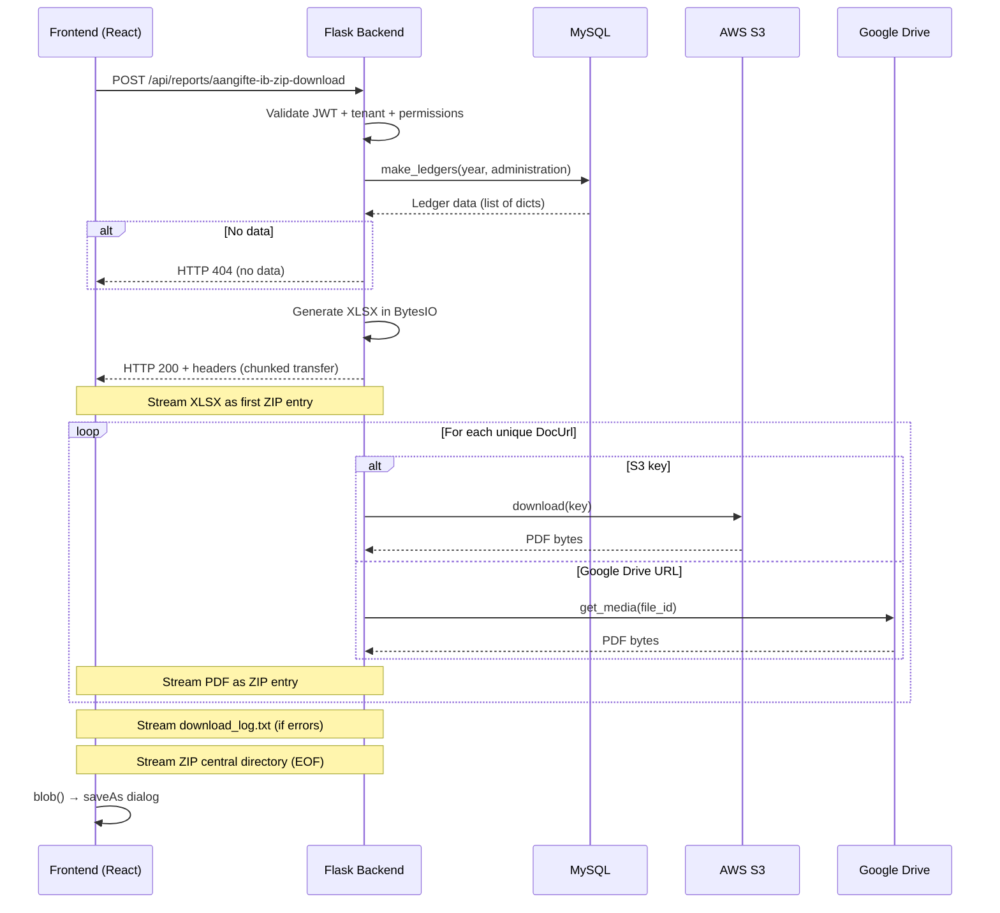
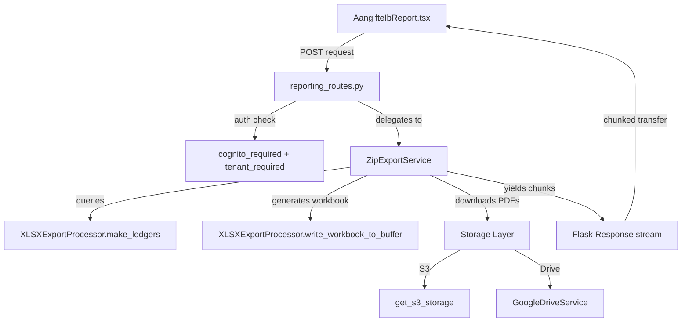

# Design Document: XLSX Export ZIP Download

## Overview

This design replaces the existing filesystem-based Aangifte IB export with a streaming ZIP download that works on Railway's ephemeral storage. The backend generates a ZIP archive containing one XLSX workbook and associated PDF documents, streaming it directly to the browser via chunked transfer encoding. This eliminates filesystem dependency and avoids Railway's 60-second keep-alive timeout by continuously writing ZIP data chunks.

### Key Design Decisions

1. **`zipstream-ng` for streaming ZIP** — A well-maintained Python library that generates ZIP content on-the-fly as a generator, yielding chunks without buffering the entire archive in memory.
2. **XLSX generated in-memory via `io.BytesIO`** — openpyxl already supports writing to a BytesIO buffer, so we write the workbook to memory first (it's small, typically <5MB) and stream it as the first ZIP entry.
3. **PDFs downloaded to memory and immediately streamed** — Each PDF is downloaded into a `BytesIO` buffer, then written as a ZIP entry. This keeps memory bounded to one PDF at a time.
4. **Single new endpoint** — `POST /api/reports/aangifte-ib-zip-download` replaces the SSE-based export. The existing XLSX-only download endpoint remains for quick workbook-only exports.
5. **Deduplication via DocUrl set** — Track processed DocUrls in a set; skip duplicates. Place deduplicated file in the first ReferenceNumber folder it appears in.

## Architecture



### Component Interaction



## Components and Interfaces

### Backend: `ZipExportService` (new file: `backend/src/services/zip_export_service.py`)

Orchestrates the ZIP streaming pipeline. Responsible for:

- Coordinating data retrieval, XLSX generation, and PDF downloads
- Managing deduplication
- Writing the error log
- Keep-alive chunk management

```python
class ZipExportService:
    """Service that generates a streaming ZIP containing XLSX + PDFs."""

    def __init__(self, test_mode: bool = False):
        self.test_mode = test_mode
        self.xlsx_processor = XLSXExportProcessor(test_mode=test_mode)

    def generate_zip_stream(
        self,
        administration: str,
        year: int
    ) -> Generator[bytes, None, None]:
        """
        Generate a ZIP archive as a byte stream.

        Yields chunks of ZIP data. First entry is the XLSX workbook,
        followed by PDF files organized in ReferenceNumber folders.

        Raises:
            NoDataError: if make_ledgers returns empty
            WorkbookError: if XLSX generation fails
        """
        ...

    def get_total_file_count(self, ledger_data: list[dict]) -> int:
        """Count unique DocUrls for progress header."""
        ...
```

### Backend: Route Handler (in `reporting_routes.py`)

```python
@reporting_bp.route('/aangifte-ib-zip-download', methods=['POST'])
@cognito_required(required_permissions=['reports_export'])
@tenant_required()
def aangifte_ib_zip_download(user_email, user_roles, tenant, user_tenants):
    """Stream a ZIP containing XLSX workbook + PDFs."""
    ...
```

**Request:**

```json
{
  "administration": "AcmeBV",
  "year": 2024
}
```

**Response Headers (success):**

```http
HTTP/1.1 200 OK
Content-Type: application/zip
Content-Disposition: attachment; filename="AcmeBV2024.zip"
Transfer-Encoding: chunked
X-Total-Files: 42
Access-Control-Expose-Headers: X-Total-Files, Content-Disposition
```

**Error Responses (before stream starts):**

- `401` — Invalid/expired JWT
- `403` — Administration not in user's tenant list
- `404` — No ledger data for the requested year/administration
- `500` — XLSX workbook generation failure

### Backend: `XLSXExportProcessor` Extensions

Add a new method to write the workbook to a `BytesIO` buffer instead of a file:

```python
def write_workbook_to_buffer(
    self,
    ledger_data: list[dict],
    sheet_name: str = 'data',
    administration: str = None
) -> io.BytesIO:
    """Write XLSX workbook to an in-memory buffer.

    Same logic as write_workbook() but returns BytesIO instead
    of writing to disk.
    """
    ...
```

### Frontend: Updated `handleGenerateXlsx` in `AangifteIbReport.tsx`

Replace the current XLSX-only download with a ZIP download that tracks progress via bytes received:

```typescript
const handleExportZip = async () => {
  const tenant = requireTenant();
  setXlsxExportLoading(true);

  try {
    const response = await tenantAwarePost(
      "/api/reports/aangifte-ib-zip-download",
      { administration: tenant, year: selectedYear },
    );

    if (!response.ok) {
      const errorData = await response.json().catch(() => null);
      throw new Error(errorData?.error || `Export failed (${response.status})`);
    }

    const totalFiles = parseInt(response.headers.get("X-Total-Files") || "0");
    // Read stream and track bytes received for progress
    const reader = response.body!.getReader();
    const chunks: Uint8Array[] = [];
    let receivedBytes = 0;

    while (true) {
      const { done, value } = await reader.read();
      if (done) break;
      chunks.push(value);
      receivedBytes += value.length;
      // Update progress UI
    }

    const blob = new Blob(chunks, { type: "application/zip" });
    // Trigger save dialog
    const url = URL.createObjectURL(blob);
    const a = document.createElement("a");
    a.href = url;
    a.download = `${tenant}${selectedYear}.zip`;
    document.body.appendChild(a);
    a.click();
    document.body.removeChild(a);
    URL.revokeObjectURL(url);
  } catch (err) {
    // Show error to user
  } finally {
    setXlsxExportLoading(false);
  }
};
```

### CORS Configuration Update (in `app.py`)

Add `X-Total-Files` and `Content-Disposition` to `expose_headers`:

```python
"expose_headers": ["Content-Type", "Authorization", "X-Total-Files", "Content-Disposition"]
```

## Data Models

### ZIP Archive Structure

```
{administration}{year}.zip
├── {administration}{year}.xlsx          # Workbook (always present)
├── {ReferenceNumber}/                   # One folder per unique reference
│   ├── document1.pdf
│   └── document2.pdf
├── {ReferenceNumber2}/
│   └── document3.pdf
└── download_log.txt                     # Only if errors occurred
```

### Ledger Data Record (from `make_ledgers`)

```python
{
    'TransactionNumber': str,
    'TransactionDate': str,        # 'YYYY-MM-DD'
    'TransactionDescription': str,
    'Amount': float,
    'Reknum': str,
    'AccountName': str,
    'Parent': str,
    'Administration': str,
    'VW': str,
    'jaar': int,
    'kwartaal': int,
    'maand': int,
    'week': int,
    'ReferenceNumber': str,
    'DocUrl': str,                 # S3 key or Google Drive URL
    'Document': str                # Original filename/description
}
```

### Deduplication Map

```python
# Key: DocUrl (normalized), Value: (bytes_content, filename)
downloaded_files: dict[str, tuple[bytes, str]] = {}
```

### Download Error Record (for `download_log.txt`)

```python
{
    'ReferenceNumber': str,
    'DocUrl': str,
    'Document': str,
    'error': str
}
```

### Keep-Alive Strategy

The ZIP format naturally sends data for each file entry (local header + content + data descriptor). The keep-alive strategy works as follows:

1. **XLSX entry** is written first — immediately sends several hundred KB of data
2. **Each PDF download** produces ZIP entry bytes upon completion — most PDFs download in <10 seconds
3. **If a PDF download exceeds 30 seconds**: the service has already moved past the previous entry's data. The ZIP format allows us to start writing the next file's local header (if we have one queued) or rely on the chunked encoding to send a TCP-level keepalive. In practice, Railway's 60s timeout is per-idle-period, so as long as _any_ bytes flow within 60s, the connection stays open.
4. **Fallback**: if all remaining downloads are slow, the `zipstream-ng` library emits ZIP structure bytes (local file headers) which satisfy the keep-alive requirement.

The architecture ensures that with typical export sizes (10-100 PDFs, each 50KB-2MB), data flows continuously. For edge cases with very large or slow downloads, the 50-second safety margin (vs 60-second timeout) provides buffer.

## Correctness Properties

_A property is a characteristic or behavior that should hold true across all valid executions of a system — essentially, a formal statement about what the system should do. Properties serve as the bridge between human-readable specifications and machine-verifiable correctness guarantees._

### Property 1: ZIP Output Round-Trip Validity

_For any_ valid ledger data set (with or without DocUrls), the byte stream produced by `generate_zip_stream()` SHALL form a valid ZIP archive that can be opened and extracted by Python's standard `zipfile` module without errors.

**Validates: Requirements 1.1**

### Property 2: ZIP Structure Matches Ledger Data

_For any_ administration name, year, and set of ledger records with associated PDF files, the resulting ZIP SHALL contain exactly one XLSX file named `{administration}{year}.xlsx` at the root, and each successfully downloaded PDF SHALL appear under a folder named by its ReferenceNumber.

**Validates: Requirements 1.2, 1.3, 4.4**

### Property 3: Deduplication Minimizes Downloads

_For any_ set of ledger records where N unique DocUrls exist (possibly referenced by M > N records), the download function SHALL be invoked exactly N times (once per unique DocUrl).

**Validates: Requirements 3.1**

### Property 4: Deduplicated File Appears in All Referencing Folders

_For any_ DocUrl that appears in ledger records with K distinct ReferenceNumbers, the resulting ZIP SHALL contain that file in all K ReferenceNumber folders.

**Validates: Requirements 3.2**

### Property 5: XLSX Contains All Ledger Records

_For any_ ledger data set, the XLSX workbook in the ZIP SHALL contain a row for every record in the input data, regardless of whether DocUrl deduplication was applied.

**Validates: Requirements 3.3**

### Property 6: X-Total-Files Header Accuracy

_For any_ ledger data set, the `X-Total-Files` response header value SHALL equal the count of unique, non-empty DocUrl values in the ledger data.

**Validates: Requirements 5.1**

### Property 7: Tenant Authorization Gate

_For any_ requested administration and user tenant list, the endpoint SHALL return HTTP 200 (streaming) if and only if the administration is contained in the user's tenant list; otherwise it SHALL return HTTP 403.

**Validates: Requirements 6.2, 6.3**

### Property 8: Error Resilience — Partial Failures Produce Valid Output

_For any_ set of PDF downloads where a subset fails, the resulting ZIP SHALL contain all successfully downloaded PDFs in their correct folders AND a `download_log.txt` file listing exactly the failed downloads with their DocUrl and ReferenceNumber.

**Validates: Requirements 7.1, 7.2, 7.4**

### Property 9: No-DocUrl Data Produces XLSX-Only ZIP

_For any_ ledger data set where all DocUrl fields are empty or null, the resulting ZIP SHALL contain only the XLSX workbook file (no PDF folders, no download_log.txt).

**Validates: Requirements 8.2**

## Error Handling

### Pre-Stream Errors (HTTP error responses before streaming begins)

| Condition                                      | HTTP Status | Response Body                                                         |
| ---------------------------------------------- | ----------- | --------------------------------------------------------------------- |
| Missing/invalid JWT                            | 401         | `{"success": false, "error": "Authentication required"}`              |
| Administration not in user's tenant list       | 403         | `{"success": false, "error": "Access denied to administration: X"}`   |
| Missing required fields (administration, year) | 400         | `{"success": false, "error": "Administration and year are required"}` |
| No ledger data for year/administration         | 404         | `{"success": false, "error": "No data found for X YYYY"}`             |
| XLSX workbook generation failure               | 500         | `{"success": false, "error": "Failed to generate workbook: ..."}`     |

### Mid-Stream Errors (during ZIP streaming)

Once streaming has begun (HTTP 200 sent), errors cannot change the status code. The strategy:

1. **Individual PDF download failure**: Skip the file, record it in `failed_downloads` list, continue processing remaining files.
2. **All PDFs fail**: ZIP still completes with XLSX + `download_log.txt`.
3. **Network error to storage provider**: Treat as download failure for that file, apply skip logic.
4. **Memory pressure**: The design streams one PDF at a time; memory usage stays bounded to ~max(single PDF size) + XLSX buffer size.

### download_log.txt Format

```text
Download Log - {administration} {year}
==================================================

FAILED DOWNLOADS:
--------------------
Reference Number: {ReferenceNumber}
Document: {Document}
URL: {DocUrl}
Error: {error_message}
------------------------------
[repeated for each failure]

SUMMARY:
Total files attempted: {total}
Successful: {success_count}
Failed: {fail_count}
```

### Frontend Error Handling

- **Non-2xx response**: Parse JSON error body, display in toast/alert
- **Network failure during stream**: `reader.read()` throws → catch, show "Connection lost" message with retry button
- **Partial download (stream interrupted)**: Blob will be incomplete/corrupt → user sees download but file won't open. Mitigation: only trigger save dialog after stream completes (all chunks received).

## Testing Strategy

### Property-Based Tests (Backend - Python with Hypothesis)

Library: **Hypothesis** (already used in the project — `.hypothesis/` folder exists at root)

Configuration: minimum 100 examples per property test.

Each property test is tagged with:

```python
# Feature: xlsx-export-zip-download, Property {N}: {property_text}
```

**Test structure:**

- Mock external dependencies (S3, Google Drive, database)
- Generate random ledger data with Hypothesis strategies
- Run `ZipExportService.generate_zip_stream()` or related methods
- Assert properties on the collected output

**Hypothesis strategies needed:**

- `ledger_record()` — generates a single ledger data dict with realistic field values
- `ledger_data_set()` — generates a list of ledger records with controlled DocUrl distribution
- `administration_name()` — generates valid administration identifiers
- `year()` — generates valid year integers (2000-2030)

### Unit Tests (Backend - pytest)

- Template resolution via TemplateService mock
- `write_workbook_to_buffer()` produces valid XLSX
- Deduplication logic edge cases (empty DocUrl, whitespace, case sensitivity)
- Error responses for auth/validation failures
- `download_log.txt` content formatting

### Unit Tests (Frontend - Vitest with fast-check)

- `handleExportZip` triggers correct POST request
- Progress tracking updates bytes received
- Error states render correctly
- Save dialog triggers with correct filename
- Button disabled during download

### Integration Tests (Backend - pytest)

- Full endpoint test with mocked storage providers
- CORS headers verification (expose_headers includes X-Total-Files)
- Timing test: mocked slow downloads still produce chunks within timeout
- Template application produces correctly structured XLSX

### Test File Organization

```
backend/tests/unit/test_zip_export_service.py        # Unit tests
backend/tests/unit/test_zip_export_properties.py     # Property-based tests
backend/tests/integration/test_zip_export_endpoint.py # Integration tests
frontend/src/components/reports/__tests__/AangifteIbReport.test.tsx  # Frontend tests
```
