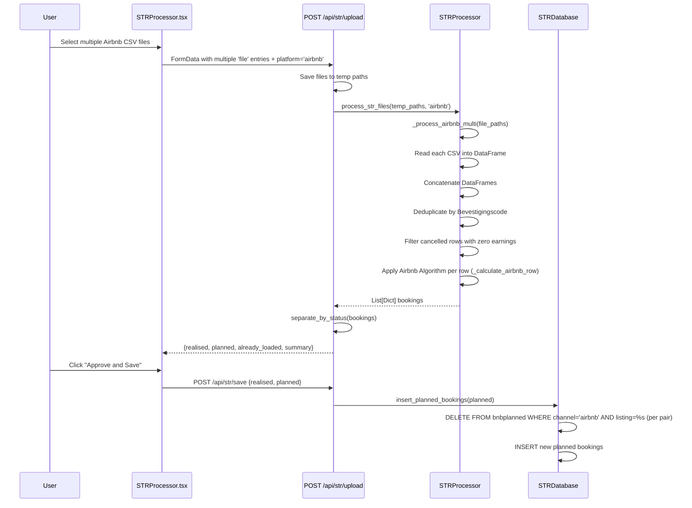
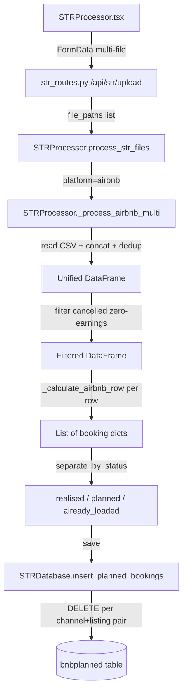

# Design Document: Airbnb Multi-File Import

## Overview

This feature enhances the existing Airbnb import workflow to accept multiple CSV files in a single upload. Currently, each Airbnb listing export must be uploaded one file at a time, and sequential uploads for the same channel overwrite each other's planned bookings. The multi-file import concatenates all files into a unified DataFrame, deduplicates by `Bevestigingscode` (reservation code), processes through the existing Airbnb algorithm, and replaces planned bookings only for the channel/listing pairs found in the combined data.

### Key Design Decisions

1. **New `_process_airbnb_multi()` method**: Follows the same pattern established by `_process_booking_multi()`. File reading, concatenation, and deduplication happen inside `STRProcessor._process_airbnb_multi()` rather than in the route layer, keeping business logic in the service layer.
2. **CSV-only file reading**: Unlike Booking.com (which supports CSV/TSV/Excel), Airbnb exports are always CSV with Dutch column headers. The reader uses `pd.read_csv()` only — no Excel/TSV fallback needed.
3. **Deduplication by `Bevestigingscode`**: When the same reservation appears in multiple files, the last occurrence wins (`drop_duplicates(subset='Bevestigingscode', keep='last')`). This matches the Booking.com pattern using `Book number`.
4. **15% channel fee factor**: Airbnb's `Inkomsten` (earnings) is the paid-out amount. The gross is derived as `paidOut + (paidOut × 0.15)`, fundamentally different from Booking.com's uplift-factor approach. This requires a dedicated per-row calculation method `_calculate_airbnb_row()` rather than reusing `_calculate_booking_row()`.
5. **European currency parsing**: Airbnb earnings use `€ 1.841,18` format (dot as thousands separator, comma as decimal). The existing inline parsing logic in `_process_airbnb()` is extracted into the shared row calculator.
6. **Cancelled row filtering**: Rows with status `Geannuleerd` and zero earnings are skipped, matching the existing single-file behavior.
7. **Delete-by-channel/listing-pair preserved**: The existing `insert_planned_bookings()` already deletes by `(channel, listing)` pairs found in the incoming data. No database changes needed — the combined dataset naturally contains all listings, so the delete scope is correct.
8. **Single code path — no duplicate logic**: A single-file upload is just a multi-file upload with one file. The `_process_airbnb_multi()` method handles both cases uniformly. The old `_process_airbnb()` method is removed entirely and replaced by `_process_airbnb_multi()` + `_calculate_airbnb_row()`, eliminating code duplication.
9. **Frontend multi-select for `airbnb` platform**: The `multiple` attribute on the file input is enabled when `airbnb` is selected, extending the existing pattern for `vrbo` and `booking`. The `accept` attribute is `.csv` only (not `.tsv/.xlsx/.xls`).

## Architecture

### Data Flow



### Component Interaction



## Components and Interfaces

### Backend Changes

#### 1. `STRProcessor._process_airbnb_multi(file_paths: List[str]) -> List[Dict]`

New method that handles multi-file Airbnb imports. Follows the same structure as `_process_booking_multi()`.

```python
def _process_airbnb_multi(self, file_paths: List[str]) -> List[Dict]:
    """
    Process multiple Airbnb CSV files: read, concatenate, deduplicate, calculate.

    Args:
        file_paths: List of paths to Airbnb CSV files

    Returns:
        List of booking dicts with financial calculations applied

    Raises:
        ValueError: If all files fail to parse
    """
```

**Logic:**

1. For each file path, attempt `pd.read_csv()` into a DataFrame.
2. Collect successful DataFrames and track failed filenames.
3. If all files fail, raise `ValueError` with the list of failed filenames.
4. Concatenate all DataFrames with `pd.concat(dfs, ignore_index=True)`.
5. Deduplicate by `Bevestigingscode`, keeping the last occurrence.
6. Set `sourceFile` to `"{date} multi-import ({n} files)"` when multiple files provided, or `"{date} {filename}"` for single file.
7. Process each row through `_calculate_airbnb_row()` (which handles European currency parsing, cancelled row filtering, 15% channel fee, tax calculation, listing normalization, country detection).
8. Return list of booking dicts.

#### 2. `STRProcessor._calculate_airbnb_row(row, df_columns, source_file: str) -> Optional[Dict]`

New method that extracts the per-row Airbnb calculation logic from `_process_airbnb()` into a reusable helper. This mirrors the pattern of `_calculate_booking_row()` for Booking.com.

```python
def _calculate_airbnb_row(self, row, df_columns, source_file: str) -> Optional[Dict]:
    """
    Calculate financial amounts for a single Airbnb booking row.

    Args:
        row: pandas Series representing one booking row
        df_columns: DataFrame columns for addInfo generation
        source_file: sourceFile label for this import

    Returns:
        Booking dict or None if row should be skipped (cancelled with zero earnings)
    """
```

**Logic (extracted from existing `_process_airbnb()`):**

1. Map Dutch column names: `Begindatum`, `Einddatum`, `Naam van de gast`, `Advertentie`, `# nachten`, `Inkomsten`, `Bevestigingscode`, `Status`, `Contact`, `# volwassenen`, `# kinderen`, `# baby's`, `Gereserveerd`.
2. Parse `Inkomsten` using European currency format (`€ 1.841,18` → `1841.18`).
3. Skip if status contains `Geannuleerd` and earnings == 0.
4. Determine booking status: `cancelled` / `planned` / `realised` based on check-in date vs today.
5. Calculate financials: `amountChannelFee = paidOut × 0.15`, `amountGross = paidOut + amountChannelFee`, then `calculate_str_taxes()`.
6. Normalize listing name via `_normalize_listing_name()`.
7. Detect country via `detect_country('airbnb', phone=phone, addinfo=add_info)`.
8. Return booking dict (same structure as existing `_process_airbnb()` output).

#### 3. `STRProcessor.process_str_files(file_paths, platform)` — Modified

Add an `airbnb` branch that delegates to `_process_airbnb_multi(file_paths)`, similar to the existing `booking` branch.

```python
def process_str_files(self, file_paths: List[str], platform: str) -> List[Dict]:
    if platform.lower() == 'vrbo':
        return self._process_vrbo(file_paths)
    elif platform.lower() in ['booking', 'booking.com']:
        return self._process_booking_multi(file_paths)
    elif platform.lower() == 'airbnb':
        return self._process_airbnb_multi(file_paths)
    # ... existing single-file loop for other platforms
```

#### 4. `STRProcessor._process_airbnb(file_path)` — Removed

The old single-file method is removed entirely. `_process_airbnb_multi()` handles both single and multi-file uploads uniformly — a single file is simply a list of one. The per-row calculation logic lives in `_calculate_airbnb_row()`, eliminating all code duplication.

#### 5. `str_routes.py` — No changes needed

The upload route already handles `request.files.getlist('file')`, saves all files to temp paths, and passes the list to `process_str_files()`. The response structure is unchanged.

#### 6. `STRDatabase.insert_planned_bookings()` — No changes needed

Already deletes by `(channel, listing)` pairs found in the incoming bookings before inserting. When the combined dataset contains multiple listings, all relevant pairs are cleaned. This works identically for `airbnb` as it does for `booking.com`.

### Frontend Changes

#### 1. `STRProcessor.tsx` — File Input Enhancement

**Changes to `handleFileUpload`:**

- When `selectedPlatform === 'airbnb'`, accept multiple files (same as `vrbo` and `booking`).
- Store all files in `selectedFiles` state.

**Changes to JSX:**

- Add `airbnb` to the `multiple` condition: `multiple={selectedPlatform === 'vrbo' || selectedPlatform === 'booking' || selectedPlatform === 'airbnb'}`.
- Change `accept` attribute to `.csv` only when platform is `airbnb` (Airbnb exports are CSV-only, unlike Booking.com which also uses Excel/TSV).
- Add informational hint `<Alert>` for `airbnb` platform explaining multi-file support.
- Display file count in success message for multi-file Airbnb imports.
- Display warning for any files that failed to parse (from backend error response).

### API Contract

#### `POST /api/str/upload`

**Request** (unchanged):

```
Content-Type: multipart/form-data

file: [File1, File2, ...File_n]  (multiple 'file' fields)
platform: "airbnb"
```

**Response** (unchanged structure):

```json
{
  "success": true,
  "realised": [...],
  "planned": [...],
  "already_loaded": [...],
  "summary": {
    "total_bookings": 45,
    "total_nights": 120,
    "total_gross": 15234.50,
    "channels": {"airbnb": 45},
    "listings": {"Green Studio": 15, "Red Studio": 18, "Child Friendly": 12}
  },
  "platform": "airbnb",
  "administration": "tenant_name"
}
```

**Error Response** (unchanged structure):

```json
{
  "success": false,
  "error": "All files failed to parse: file1.csv, file2.csv"
}
```

## Data Models

### Booking Record (unchanged)

The booking dict structure produced by `_process_airbnb_multi` is identical to the existing `_process_airbnb` output:

| Field                   | Type    | Description                                                                    |
| ----------------------- | ------- | ------------------------------------------------------------------------------ |
| `sourceFile`            | `str`   | `"{date} multi-import ({n} files)"` or `"{date} {filename}"`                   |
| `channel`               | `str`   | Always `"airbnb"`                                                              |
| `listing`               | `str`   | Normalized listing name via `_normalize_listing_name()` (e.g., "Green Studio") |
| `checkinDate`           | `str`   | ISO date `YYYY-MM-DD` (parsed from `Begindatum` DD-MM-YYYY)                    |
| `checkoutDate`          | `str`   | ISO date `YYYY-MM-DD` (parsed from `Einddatum` DD-MM-YYYY)                     |
| `nights`                | `int`   | From `# nachten` column                                                        |
| `guests`                | `int`   | Sum of `# volwassenen` + `# kinderen` + `# baby's`                             |
| `amountGross`           | `float` | `paidOut + (paidOut × 0.15)` where paidOut = parsed `Inkomsten`                |
| `amountChannelFee`      | `float` | `paidOut × 0.15`                                                               |
| `amountVat`             | `float` | VAT on gross (9% pre-2026, 21% post-2026) via `calculate_str_taxes()`          |
| `amountTouristTax`      | `float` | Tourist tax on VAT-exclusive amount via `calculate_str_taxes()`                |
| `amountNett`            | `float` | `gross - VAT - touristTax - channelFee` via `calculate_str_taxes()`            |
| `pricePerNight`         | `float` | `amountNett / nights`                                                          |
| `guestName`             | `str`   | From `Naam van de gast` column                                                 |
| `phone`                 | `str`   | From `Contact` column                                                          |
| `reservationCode`       | `str`   | From `Bevestigingscode` column                                                 |
| `reservationDate`       | `str`   | ISO date from `Gereserveerd` field                                             |
| `status`                | `str`   | `"realised"`, `"planned"`, or `"cancelled"`                                    |
| `country`               | `str`   | Detected via `detect_country('airbnb', phone, addinfo)`                        |
| `year`                  | `int`   | Check-in year                                                                  |
| `q`                     | `int`   | Check-in quarter (1-4)                                                         |
| `m`                     | `int`   | Check-in month (1-12)                                                          |
| `daysBeforeReservation` | `int`   | Days between reservation and check-in                                          |
| `addInfo`               | `str`   | Pipe-delimited raw row data                                                    |

### Database Tables (unchanged)

**`bnbplanned`** — No schema changes. The delete-and-replace strategy scoped by `(channel, listing)` already handles multi-listing imports correctly.

### Deduplication Key

`Bevestigingscode` (mapped to `reservationCode`) is the unique identifier for Airbnb reservations. When the same booking appears in multiple files (e.g., overlapping date ranges), the last file's data takes precedence.

### Airbnb vs Booking.com Financial Calculation Comparison

| Aspect              | Airbnb                                      | Booking.com                                        |
| ------------------- | ------------------------------------------- | -------------------------------------------------- |
| Input amount        | `Inkomsten` (paid-out amount)               | `basePrice` + `commission`                         |
| Channel fee         | `paidOut × 0.15` (15% factor)               | Derived from uplift factor `× 1.047826`            |
| Gross calculation   | `paidOut + channelFee`                      | `(basePrice + commission) × 1.047826`              |
| Currency format     | European: `€ 1.841,18`                      | Standard or European depending on export           |
| File format         | CSV only                                    | CSV, TSV, or Excel                                 |
| Dedup key           | `Bevestigingscode`                          | `Book number`                                      |
| Cancelled filtering | `Geannuleerd` status + zero earnings → skip | Status-based filtering in `_calculate_booking_row` |

## Correctness Properties

_A property is a characteristic or behavior that should hold true across all valid executions of a system — essentially, a formal statement about what the system should do. Properties serve as the bridge between human-readable specifications and machine-verifiable correctness guarantees._

### Property 1: Concatenation preserves all rows

_For any_ list of valid Airbnb CSV DataFrames, the concatenated DataFrame SHALL have a row count equal to the sum of the row counts of the individual DataFrames (before deduplication).

**Validates: Requirements 2.1**

### Property 2: Partial failure resilience

_For any_ mix of valid and invalid file paths where at least one file is valid, `_process_airbnb_multi` SHALL produce a result containing all rows from the valid files and an error list containing exactly the filenames of the invalid files.

**Validates: Requirements 2.2**

### Property 3: Deduplication keeps exactly one record per Bevestigingscode

_For any_ concatenated DataFrame containing duplicate `Bevestigingscode` values, after deduplication there SHALL be exactly one row per unique `Bevestigingscode`, and the retained row's values SHALL match the last occurrence in the concatenated order.

**Validates: Requirements 2.3**

### Property 4: Financial calculation correctness

_For any_ valid Airbnb booking row with a non-negative `Inkomsten` value, `_calculate_airbnb_row` SHALL produce `amountChannelFee == paidOut × 0.15`, `amountGross == paidOut + amountChannelFee`, and the tax amounts SHALL match the output of `calculate_str_taxes()` for the same gross and check-in date. Listing normalization SHALL be applied consistently.

**Validates: Requirements 3.1, 3.2**

### Property 5: sourceFile format reflects file count

_For any_ multi-file import with N > 1 files, every booking record's `sourceFile` field SHALL match the pattern `"YYYY-MM-DD multi-import (N files)"`. _For any_ single-file import, the `sourceFile` field SHALL match `"YYYY-MM-DD {filename}"`.

**Validates: Requirements 3.4**

### Property 6: European currency parsing round-trip

_For any_ valid non-negative monetary amount, formatting it as a European currency string (`€ X.XXX,XX`) and then parsing it back through the Airbnb earnings parser SHALL produce a value equal to the original amount (within floating-point rounding tolerance of 0.01).

**Validates: Requirements 3.5**

### Property 7: Scoped overwrite invariant

_For any_ set of planned bookings being saved, the `insert_planned_bookings` method SHALL delete and replace records only for `(channel, listing)` pairs present in the input, and SHALL leave all records for `(channel, listing)` pairs not present in the input completely unchanged.

**Validates: Requirements 4.1, 4.2**

### Property 8: All selected filenames are displayed

_For any_ list of selected files, the frontend SHALL render a text element containing every filename from the list.

**Validates: Requirements 1.2**

## Error Handling

### Backend Error Scenarios

| Scenario                            | Handling                                             | Response                                                           |
| ----------------------------------- | ---------------------------------------------------- | ------------------------------------------------------------------ |
| All files fail to parse             | Raise `ValueError` with list of failed filenames     | HTTP 500 with `"All files failed to parse: file1.csv, file2.csv"`  |
| Some files fail to parse            | Skip invalid files, process valid ones, log warnings | HTTP 200 with successful results (failed files logged server-side) |
| Empty DataFrame after concatenation | Return empty bookings list                           | HTTP 200 with empty `realised`, `planned`, `already_loaded`        |
| File I/O error during temp save     | Caught by route-level try/except                     | HTTP 500 with error message                                        |
| Non-CSV file submitted              | `pd.read_csv()` fails, file added to error list      | Handled by partial failure resilience                              |
| Malformed European currency value   | Parsing falls back to `earnings = 0`                 | Row processed with zero amounts                                    |
| Invalid date format in row          | Falls back to current year/quarter defaults          | Row processed with fallback date values                            |

### Frontend Error Scenarios

| Scenario                         | Handling                                                           |
| -------------------------------- | ------------------------------------------------------------------ |
| Upload request fails (network)   | Display error alert: "Failed to upload"                            |
| Backend returns `success: false` | Display `error` field from response                                |
| Backend returns partial failures | Display warning with failed filenames alongside successful results |
| No files selected                | Process button disabled                                            |

### Temp File Cleanup

The existing route already cleans up temp files in a `for` loop after processing. This works for multi-file uploads since `temp_paths` is already a list. The cleanup runs regardless of success or failure because it's outside the processing try/except (it has its own try/except with `OSError` suppression).

## Testing Strategy

### Property-Based Tests (Backend — pytest + Hypothesis)

Property-based tests validate the core concatenation, deduplication, currency parsing, and algorithm logic. Each test runs a minimum of 100 iterations.

| Property                                      | Test                                                                                             | Library    |
| --------------------------------------------- | ------------------------------------------------------------------------------------------------ | ---------- |
| Property 1: Concatenation row count           | Generate N random DataFrames with valid Airbnb columns, verify `len(concat) == sum(len(df))`     | Hypothesis |
| Property 2: Partial failure resilience        | Generate mix of valid/invalid paths, verify valid rows processed and invalid filenames collected | Hypothesis |
| Property 3: Deduplication                     | Generate DataFrames with overlapping `Bevestigingscode`, verify uniqueness and last-wins         | Hypothesis |
| Property 4: Financial calculation correctness | Generate random booking rows, verify channel fee, gross, and tax calculations match formulas     | Hypothesis |
| Property 5: sourceFile format                 | Generate random file counts, verify format pattern                                               | Hypothesis |
| Property 6: European currency round-trip      | Generate random monetary amounts, format as `€ X.XXX,XX`, parse back, verify equivalence         | Hypothesis |
| Property 7: Scoped overwrite                  | Generate random channel/listing pairs, verify only imported pairs are affected                   | Hypothesis |

**Configuration:**

- Minimum 100 iterations per property (`@settings(max_examples=100)`)
- Tag format: `# Feature: str-airbnb-multi-file-import, Property {N}: {title}`

### Property-Based Tests (Frontend — Vitest + fast-check)

| Property                     | Test                                                                 |
| ---------------------------- | -------------------------------------------------------------------- |
| Property 8: Filename display | Generate random filename lists, verify all appear in rendered output |

**Configuration:**

- Minimum 100 iterations per property (`fc.assert(..., { numRuns: 100 })`)
- Tag format: `// Feature: str-airbnb-multi-file-import, Property 8: All selected filenames displayed`

### Unit Tests (Example-Based)

| Test                                                                      | Validates |
| ------------------------------------------------------------------------- | --------- |
| Airbnb platform enables multi-select on file input                        | Req 1.1   |
| File input accepts `.csv` only for airbnb                                 | Req 1.3   |
| Process button disabled when no files selected                            | Req 1.4   |
| All files fail → `ValueError` raised with filenames                       | Req 2.4   |
| Cancelled rows with zero earnings are skipped                             | Req 3.6   |
| Multiple listings in combined data all appear in output                   | Req 3.3   |
| Specific Green Studio + Red Studio import leaves Child Friendly untouched | Req 4.3   |
| Response structure has expected keys                                      | Req 5.2   |
| Error response returns 500 with message                                   | Req 5.3   |
| Multi-file success shows file count                                       | Req 6.1   |
| Summary shows realised/planned/already-loaded counts                      | Req 6.2   |
| Failed files warning displayed                                            | Req 6.3   |
| Airbnb platform shows multi-file hint                                     | Req 6.4   |
| Single airbnb file processed through same \_process_airbnb_multi path     | Req 5.1   |

### Integration Tests

| Test                                            | Validates |
| ----------------------------------------------- | --------- |
| Route passes all file paths to processor        | Req 5.1   |
| Temp files cleaned up after success and failure | Req 5.4   |
