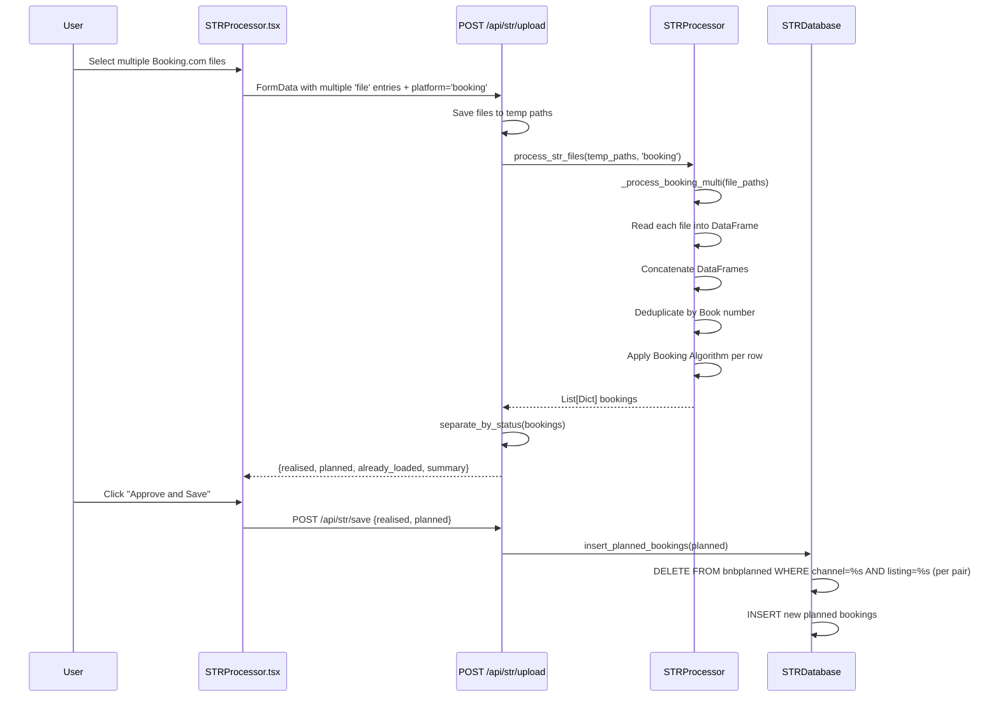
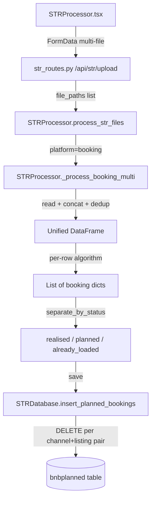

# Design Document: Booking.com Multi-File Import

## Overview

This feature enhances the existing Booking.com import workflow to accept multiple CSV/Excel files in a single upload. Currently, each Booking.com listing export must be uploaded one at a time, and sequential uploads for the same channel overwrite each other's planned bookings. The multi-file import concatenates all files into a unified DataFrame, deduplicates by `Book number`, processes through the existing Booking.com algorithm, and replaces planned bookings only for the channel/listing pairs found in the combined data.

### Key Design Decisions

1. **Concatenation in `STRProcessor`**: File reading and concatenation happen inside `STRProcessor._process_booking()` (renamed to accept multiple paths) rather than in the route layer. This keeps business logic in the service layer.
2. **Deduplication by Book number**: When the same booking appears in multiple files, the last occurrence wins (`drop_duplicates(subset='Book number', keep='last')`). This matches pandas default behavior and ensures the most recent export data is used.
3. **Delete-by-channel/listing-pair preserved**: The existing `insert_planned_bookings()` already deletes by `(channel, listing)` pairs found in the incoming data. No database changes are needed — the combined dataset naturally contains all listings, so the delete scope is correct.
4. **Backward compatibility**: A single-file upload is just a multi-file upload with one file. The same code path handles both.
5. **Frontend multi-select only for `booking` platform**: The `multiple` attribute on the file input is enabled when `booking` is selected, matching the existing pattern for `vrbo`.

## Architecture

### Data Flow



### Component Interaction



## Components and Interfaces

### Backend Changes

#### 1. `STRProcessor._process_booking_multi(file_paths: List[str]) -> List[Dict]`

New method that replaces the single-file `_process_booking()` for multi-file scenarios.

```python
def _process_booking_multi(self, file_paths: List[str]) -> List[Dict]:
    """
    Process multiple Booking.com files: read, concatenate, deduplicate, calculate.

    Args:
        file_paths: List of paths to Booking.com CSV/Excel files

    Returns:
        List of booking dicts with financial calculations applied

    Raises:
        ValueError: If all files fail to parse
    """
```

**Logic:**

1. For each file path, attempt to read into a DataFrame (Excel or CSV or TSV).
2. Collect successful DataFrames and track failed filenames.
3. If all files fail, raise `ValueError` with the list of failed filenames.
4. Concatenate all DataFrames with `pd.concat(dfs, ignore_index=True)`.
5. Deduplicate by `Book number`, keeping the last occurrence.
6. Set `sourceFile` to `"{date} multi-import ({n} files)"` when multiple files provided, or `"{date} {filename}"` for single file.
7. Process each row through the existing Booking.com algorithm (uplift factor, tax calculation, normalization).
8. Return list of booking dicts.

#### 2. `STRProcessor.process_str_files(file_paths, platform)` — Modified

For `platform='booking'`, delegate to `_process_booking_multi(file_paths)` instead of iterating and calling `_process_single_file()` per file.

```python
def process_str_files(self, file_paths: List[str], platform: str) -> List[Dict]:
    if platform.lower() == 'vrbo':
        return self._process_vrbo(file_paths)
    elif platform.lower() in ['booking', 'booking.com']:
        return self._process_booking_multi(file_paths)
    # ... existing single-file loop for other platforms
```

#### 3. `STRProcessor._process_booking(file_path)` — Preserved

The existing single-file method remains unchanged for internal use and backward compatibility. `_process_booking_multi` reuses the same per-row calculation logic.

#### 4. `str_routes.py` — No changes needed

The upload route already handles `request.files.getlist('file')`, saves all files to temp paths, and passes the list to `process_str_files()`. The response structure is unchanged.

#### 5. `STRDatabase.insert_planned_bookings()` — No changes needed

Already deletes by `(channel, listing)` pairs found in the incoming bookings before inserting. When the combined dataset contains multiple listings, all relevant pairs are cleaned.

### Frontend Changes

#### 1. `STRProcessor.tsx` — File Input Enhancement

**Changes to `handleFileUpload`:**

- When `selectedPlatform === 'booking'`, accept multiple files (same as `vrbo`).
- Store all files in `selectedFiles` state.

**Changes to JSX:**

- Add `multiple` attribute to file input when platform is `booking` or `vrbo`.
- Display all selected filenames.
- Add informational hint for `booking` platform explaining multi-file support.
- Display file count in success message for multi-file imports.
- Display warning for any files that failed to parse (from backend error response).

### API Contract

#### `POST /api/str/upload`

**Request** (unchanged):

```
Content-Type: multipart/form-data

file: [File1, File2, ...File_n]  (multiple 'file' fields)
platform: "booking"
```

**Response** (unchanged structure):

```json
{
  "success": true,
  "realised": [...],
  "planned": [...],
  "already_loaded": [...],
  "summary": {
    "total_bookings": 45,
    "total_nights": 120,
    "total_gross": 15234.50,
    "channels": {"booking.com": 45},
    "listings": {"Green Studio": 15, "Red Studio": 18, "Child Friendly": 12}
  },
  "platform": "booking",
  "administration": "tenant_name"
}
```

**Error Response** (unchanged structure):

```json
{
  "success": false,
  "error": "All files failed to parse: file1.csv, file2.xlsx"
}
```

## Data Models

### Booking Record (unchanged)

The booking dict structure produced by `_process_booking_multi` is identical to the existing `_process_booking` output:

| Field                   | Type    | Description                                                  |
| ----------------------- | ------- | ------------------------------------------------------------ |
| `sourceFile`            | `str`   | `"{date} multi-import ({n} files)"` or `"{date} {filename}"` |
| `channel`               | `str`   | Always `"booking.com"`                                       |
| `listing`               | `str`   | Normalized listing name (e.g., "Green Studio")               |
| `checkinDate`           | `str`   | ISO date `YYYY-MM-DD`                                        |
| `checkoutDate`          | `str`   | ISO date `YYYY-MM-DD`                                        |
| `nights`                | `int`   | Duration in nights                                           |
| `guests`                | `int`   | Total guest count                                            |
| `amountGross`           | `float` | `(basePrice + commission) × 1.047826`                        |
| `amountChannelFee`      | `float` | `amountGross - basePrice`                                    |
| `amountVat`             | `float` | VAT on gross (9% pre-2026, 21% post-2026)                    |
| `amountTouristTax`      | `float` | Tourist tax on VAT-exclusive amount                          |
| `amountNett`            | `float` | `gross - VAT - touristTax - channelFee`                      |
| `pricePerNight`         | `float` | `amountNett / nights`                                        |
| `guestName`             | `str`   | Guest name from file                                         |
| `reservationCode`       | `str`   | Booking.com Book number                                      |
| `reservationDate`       | `str`   | ISO date from "Booked on" field                              |
| `status`                | `str`   | `"realised"`, `"planned"`, or `"cancelled"`                  |
| `country`               | `str`   | Detected country code                                        |
| `year`                  | `int`   | Check-in year                                                |
| `q`                     | `int`   | Check-in quarter (1-4)                                       |
| `m`                     | `int`   | Check-in month (1-12)                                        |
| `daysBeforeReservation` | `int`   | Days between reservation and check-in                        |
| `addInfo`               | `str`   | Pipe-delimited raw row data                                  |

### Database Tables (unchanged)

**`bnbplanned`** — No schema changes. The delete-and-replace strategy scoped by `(channel, listing)` already handles multi-listing imports correctly.

### Deduplication Key

`Book number` (mapped to `reservationCode`) is the unique identifier for Booking.com reservations. When the same booking appears in multiple files (e.g., overlapping date ranges), the last file's data takes precedence.

## Correctness Properties

_A property is a characteristic or behavior that should hold true across all valid executions of a system — essentially, a formal statement about what the system should do. Properties serve as the bridge between human-readable specifications and machine-verifiable correctness guarantees._

### Property 1: Concatenation preserves all rows

_For any_ list of valid Booking.com DataFrames, the concatenated DataFrame SHALL have a row count equal to the sum of the row counts of the individual DataFrames (before deduplication).

**Validates: Requirements 2.1**

### Property 2: Partial failure resilience

_For any_ mix of valid and invalid file paths where at least one file is valid, the File_Concatenator SHALL produce a result containing all rows from the valid files and an error list containing exactly the filenames of the invalid files.

**Validates: Requirements 2.2**

### Property 3: Deduplication keeps exactly one record per Book number

_For any_ concatenated DataFrame containing duplicate `Book number` values, after deduplication there SHALL be exactly one row per unique `Book number`, and the retained row's values SHALL match the last occurrence in the concatenated order.

**Validates: Requirements 2.3**

### Property 4: Multi-file algorithm equivalence

_For any_ set of Booking.com booking rows, processing them as a single concatenated DataFrame through `_process_booking_multi` SHALL produce identical financial calculations (`amountGross`, `amountChannelFee`, `amountVat`, `amountTouristTax`, `amountNett`) as processing each row individually through the existing `_process_booking` algorithm.

**Validates: Requirements 3.1, 7.1**

### Property 5: sourceFile format reflects file count

_For any_ multi-file import with N > 1 files, every booking record's `sourceFile` field SHALL match the pattern `"YYYY-MM-DD multi-import (N files)"`. _For any_ single-file import, the `sourceFile` field SHALL match `"YYYY-MM-DD {filename}"`.

**Validates: Requirements 3.4**

### Property 6: Scoped overwrite invariant

_For any_ set of planned bookings being saved, the `insert_planned_bookings` method SHALL delete and replace records only for `(channel, listing)` pairs present in the input, and SHALL leave all records for `(channel, listing)` pairs not present in the input completely unchanged.

**Validates: Requirements 4.1, 4.2**

### Property 7: All selected filenames are displayed

_For any_ list of selected files, the frontend SHALL render a text element containing every filename from the list.

**Validates: Requirements 1.2**

## Error Handling

### Backend Error Scenarios

| Scenario                            | Handling                                             | Response                                                           |
| ----------------------------------- | ---------------------------------------------------- | ------------------------------------------------------------------ |
| All files fail to parse             | Raise `ValueError` with list of failed filenames     | HTTP 500 with `"All files failed to parse: file1.csv, file2.xlsx"` |
| Some files fail to parse            | Skip invalid files, process valid ones, log warnings | HTTP 200 with successful results (failed files logged server-side) |
| Empty DataFrame after concatenation | Return empty bookings list                           | HTTP 200 with empty `realised`, `planned`, `already_loaded`        |
| File I/O error during temp save     | Caught by route-level try/except                     | HTTP 500 with error message                                        |
| Unsupported file extension          | pandas read fails, file added to error list          | Handled by partial failure resilience                              |

### Frontend Error Scenarios

| Scenario                         | Handling                                                           |
| -------------------------------- | ------------------------------------------------------------------ |
| Upload request fails (network)   | Display error alert: "Failed to upload"                            |
| Backend returns `success: false` | Display `error` field from response                                |
| Backend returns partial failures | Display warning with failed filenames alongside successful results |
| No files selected                | Process button disabled                                            |

### Temp File Cleanup

The existing route already cleans up temp files in a `for` loop after processing. This works for multi-file uploads since `temp_paths` is already a list. The cleanup runs regardless of success or failure because it's outside the processing try/except (it has its own try/except with `OSError` suppression).

## Testing Strategy

### Property-Based Tests (Backend — pytest + Hypothesis)

Property-based tests validate the core concatenation, deduplication, and algorithm logic. Each test runs a minimum of 100 iterations.

| Property                               | Test                                                                                             | Library    |
| -------------------------------------- | ------------------------------------------------------------------------------------------------ | ---------- |
| Property 1: Concatenation row count    | Generate N random DataFrames, verify `len(concat) == sum(len(df) for df in dfs)`                 | Hypothesis |
| Property 2: Partial failure resilience | Generate mix of valid/invalid paths, verify valid rows processed and invalid filenames collected | Hypothesis |
| Property 3: Deduplication              | Generate DataFrames with overlapping Book numbers, verify uniqueness and last-wins               | Hypothesis |
| Property 4: Algorithm equivalence      | Generate random booking rows, compare multi-file vs single-file output                           | Hypothesis |
| Property 5: sourceFile format          | Generate random file counts, verify format pattern                                               | Hypothesis |
| Property 6: Scoped overwrite           | Generate random channel/listing pairs, verify only imported pairs are affected                   | Hypothesis |

**Configuration:**

- Minimum 100 iterations per property (`@settings(max_examples=100)`)
- Tag format: `# Feature: str-bookingcom-multi-file-import, Property {N}: {title}`

### Property-Based Tests (Frontend — Vitest + fast-check)

| Property                     | Test                                                                 |
| ---------------------------- | -------------------------------------------------------------------- |
| Property 7: Filename display | Generate random filename lists, verify all appear in rendered output |

**Configuration:**

- Minimum 100 iterations per property (`fc.assert(..., { numRuns: 100 })`)
- Tag format: `// Feature: str-bookingcom-multi-file-import, Property 7: All selected filenames displayed`

### Unit Tests (Example-Based)

| Test                                                                      | Validates |
| ------------------------------------------------------------------------- | --------- |
| Booking platform enables multi-select on file input                       | Req 1.1   |
| File input accepts .csv, .tsv, .xls, .xlsx for booking                    | Req 1.3   |
| Process button disabled when no files selected                            | Req 1.4   |
| All files fail → error with filenames                                     | Req 2.5   |
| Specific Green Studio + Red Studio import leaves Child Friendly untouched | Req 4.3   |
| Response structure has expected keys                                      | Req 5.2   |
| Error response returns 500 with message                                   | Req 5.3   |
| Multi-file success shows file count                                       | Req 6.1   |
| Summary shows realised/planned/already-loaded counts                      | Req 6.2   |
| Failed files warning displayed                                            | Req 6.3   |
| Booking platform shows multi-file hint                                    | Req 6.4   |
| Single file upload works for all platforms                                | Req 7.2   |
| Single booking file uses same delete strategy                             | Req 7.3   |

### Integration Tests

| Test                                                 | Validates |
| ---------------------------------------------------- | --------- |
| Mixed .csv/.tsv/.xls/.xlsx files processed together  | Req 2.4   |
| Route passes all file paths to processor             | Req 5.1   |
| Temp files cleaned up after success and failure      | Req 5.4   |
| Single-file upload backward compat for all platforms | Req 7.2   |
