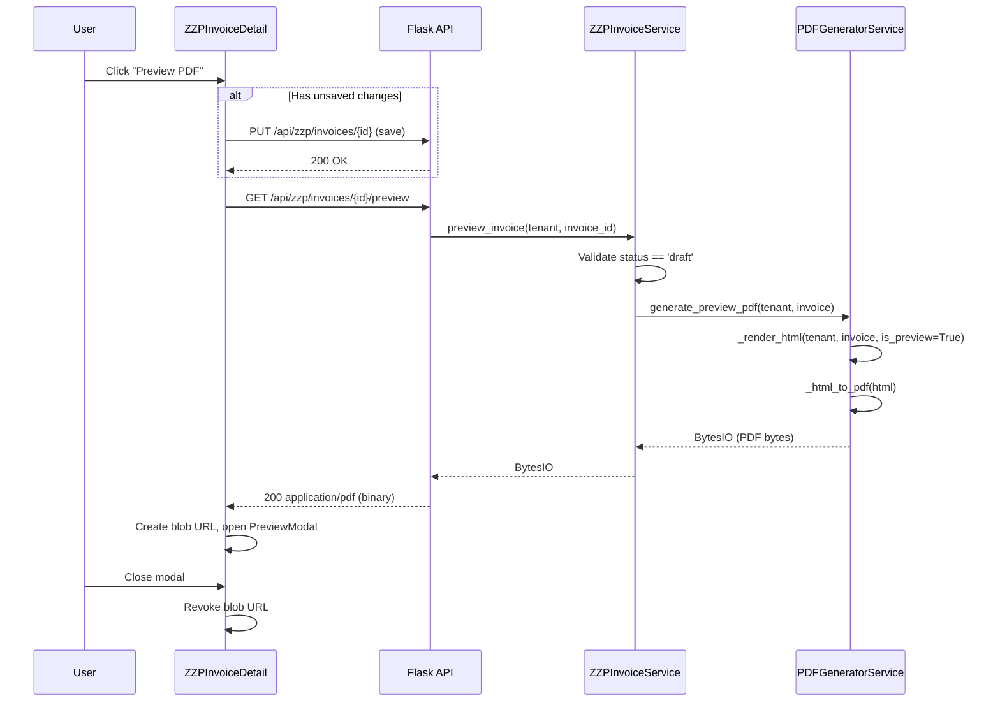
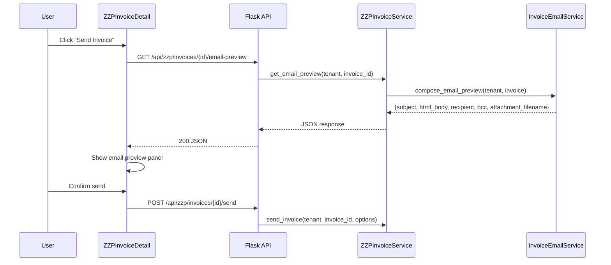

# Design Document: ZZP Invoice PDF Preview

## Overview

This feature adds a PDF preview capability to the ZZP Invoices module, allowing users to generate and view a temporary PDF of their draft invoice before committing to the send flow. The preview uses the same `PDFGeneratorService` and template pipeline as the final send, but adds a locale-aware watermark ("CONCEPT" for NL, "DRAFT" for EN) and returns the PDF directly without any persistent storage or financial side effects.

Additionally, this feature introduces a locale-aware HTML email template for the invoice send flow, with an email preview step before confirmation.

### Key Design Decisions

1. **Reuse existing `PDFGeneratorService`** — The preview calls `_render_html` with a new `is_preview=True` flag to inject the watermark, then `_html_to_pdf`. No new PDF engine is introduced.
2. **No persistent storage** — Preview PDFs are generated in-memory and streamed directly to the client. No Google Drive upload, no database record.
3. **Auto-save before preview** — If the frontend detects unsaved changes, it saves first, then requests the preview. This keeps the backend stateless (it always reads from the database).
4. **Browser-native PDF rendering** — The frontend displays the PDF in an `<iframe>` using a blob URL, leveraging the browser's built-in PDF viewer. No third-party PDF.js dependency.
5. **Locale-aware email templates** — Email composition uses the same `COUNTRY_LOCALE_MAP` resolution as the PDF generator, with structured HTML templates for NL and EN.

## Architecture



### Email Send Flow



## Components and Interfaces

### Backend Components

#### 1. Preview Route (`zzp_routes.py`)

```python
@zzp_bp.route('/api/zzp/invoices/<int:invoice_id>/preview', methods=['GET'])
@cognito_required(required_permissions=['zzp_read'])
@tenant_required()
def preview_invoice_pdf(user_email, user_roles, tenant, user_tenants, invoice_id):
    """Generate and return a preview PDF for a draft invoice."""
```

**Response (success):** HTTP 200, `Content-Type: application/pdf`, `Content-Disposition: inline; filename="INV-2024-001_PREVIEW.pdf"`

**Response (not draft):** HTTP 400, `{"success": false, "error": "Only draft invoices can be previewed"}`

**Response (not found):** HTTP 404, `{"success": false, "error": "Invoice not found"}`

**Response (generation failure):** HTTP 500, `{"success": false, "error": "PDF generation failed"}`

#### 2. Email Preview Route (`zzp_routes.py`)

```python
@zzp_bp.route('/api/zzp/invoices/<int:invoice_id>/email-preview', methods=['GET'])
@cognito_required(required_permissions=['zzp_read'])
@tenant_required()
def preview_invoice_email(user_email, user_roles, tenant, user_tenants, invoice_id):
    """Return a preview of the email that will be sent with the invoice."""
```

**Response (success):** HTTP 200

```json
{
  "success": true,
  "data": {
    "subject": "Factuur INV-2024-001 van Company BV",
    "html_body": "<p>Geachte Client BV,</p>...",
    "recipient": "client@example.com",
    "bcc": "admin@freelancer.nl",
    "attachment_filename": "INV-2024-001.pdf"
  }
}
```

#### 3. ZZPInvoiceService — New Methods

```python
def preview_invoice(self, tenant: str, invoice_id: int) -> BytesIO:
    """Generate a preview PDF for a draft invoice.

    Raises:
        ValueError: If invoice not found or not in draft status.
        RuntimeError: If PDF generation fails.
    """

def get_email_preview(self, tenant: str, invoice_id: int) -> dict:
    """Compose an email preview without sending.

    Returns:
        dict with subject, html_body, recipient, attachment_filename
    Raises:
        ValueError: If invoice not found, not draft, or contact has no email.
    """
```

#### 4. PDFGeneratorService — Extended Method

```python
def generate_preview_pdf(self, tenant: str, invoice: dict) -> BytesIO:
    """Generate a PDF with a locale-aware watermark (CONCEPT/DRAFT)."""
    html = self._render_html(tenant, invoice, is_preview=True)
    return self._html_to_pdf(html)
```

The `_render_html` method gains an `is_preview` parameter. When `True`, it injects a watermark div based on the resolved locale:

- `nl_NL` → `<div class="watermark">CONCEPT</div>`
- All other locales → `<div class="watermark">DRAFT</div>`

#### 5. InvoiceEmailService — Enhanced Email Composition

```python
def compose_email_preview(self, tenant: str, invoice: dict) -> dict:
    """Build email subject, body, recipient, BCC without sending.

    Returns:
        dict with 'subject', 'html_body', 'recipient', 'bcc', 'attachment_filename'
    Raises:
        ValueError: If contact has no email address.
    """

def _resolve_tenant_admin_email(self, tenant: str) -> str:
    """Resolve the tenant administrator's email address for BCC.

    Looks up the tenant profile to retrieve the admin email.
    Returns the admin email address string.
    """

def _build_locale_subject(self, tenant: str, invoice: dict, locale: str) -> str:
    """Build locale-aware subject line."""

def _build_locale_body(self, tenant: str, invoice: dict, locale: str) -> str:
    """Build locale-aware HTML email body."""
```

### Frontend Components

#### 1. Preview Button (in `ZZPInvoiceDetail.tsx`)

Added to the action area when `invoice.status === 'draft'`:

```tsx
<Button
  leftIcon={<ViewIcon />}
  onClick={handlePreview}
  isLoading={previewing}
  loadingText={t("invoices.preview.loading")}
  isDisabled={previewing || saving}
>
  {t("invoices.preview.button")}
</Button>
```

#### 2. PreviewModal Component (`frontend/src/components/zzp/InvoicePreviewModal.tsx`)

```tsx
interface InvoicePreviewModalProps {
  isOpen: boolean;
  onClose: () => void;
  pdfBlobUrl: string | null;
  invoiceNumber: string;
}
```

Features:

- Modal overlay with 80% viewport width, 85% viewport height
- `<iframe>` displaying the PDF blob URL
- Close button + Escape key support
- Download button triggering `<a download>` with filename `{invoice_number}_PREVIEW.pdf`
- Error fallback if iframe fails to render

#### 3. EmailPreviewPanel Component (`frontend/src/components/zzp/EmailPreviewPanel.tsx`)

```tsx
interface EmailPreviewPanelProps {
  isOpen: boolean;
  onClose: () => void;
  onConfirmSend: () => void;
  emailPreview: {
    subject: string;
    html_body: string;
    recipient: string;
    bcc: string;
    attachment_filename: string;
  } | null;
  isSending: boolean;
}
```

The panel displays the BCC field (labeled via translation key `invoices.email.bcc_label`) showing the tenant administrator's email address, so the freelancer can see that they will receive a copy of the sent email.

#### 4. Service Function (`zzpInvoiceService.ts`)

```typescript
export async function getInvoicePreview(id: number): Promise<Blob> {
  const resp = await authenticatedGet(buildEndpoint(`${BASE}/${id}/preview`));
  if (!resp.ok) {
    const err = await resp.json();
    throw new Error(err.error || "Preview failed");
  }
  return resp.blob();
}

export async function getEmailPreview(
  id: number,
): Promise<EmailPreviewResponse> {
  const resp = await authenticatedGet(
    buildEndpoint(`${BASE}/${id}/email-preview`),
  );
  return resp.json();
}
```

## Data Models

### No New Database Tables

This feature does not introduce any new database tables or columns. The preview is entirely stateless — it reads the existing `zzp_invoices` and `contacts` tables and generates a transient PDF in memory.

### Existing Models Used

**zzp_invoices** (read-only for preview):

- `id`, `administration`, `invoice_number`, `status`, `contact_id`
- `invoice_date`, `due_date`, `payment_terms_days`, `currency`
- `subtotal`, `vat_total`, `grand_total`, `notes`

**contacts** (read-only for locale resolution and email):

- `id`, `administration`, `company_name`, `contact_person`, `country`
- `email` (with `email_type` and `is_primary` fields)

### TypeScript Types (Frontend)

```typescript
interface EmailPreviewResponse {
  success: boolean;
  data?: {
    subject: string;
    html_body: string;
    recipient: string;
    bcc: string;
    attachment_filename: string;
  };
  error?: string;
}
```

## Correctness Properties

_A property is a characteristic or behavior that should hold true across all valid executions of a system — essentially, a formal statement about what the system should do. Properties serve as the bridge between human-readable specifications and machine-verifiable correctness guarantees._

### Property 1: Non-draft invoices are rejected for preview

_For any_ invoice with a status other than `draft` (sent, paid, overdue, credited, cancelled), calling `preview_invoice` SHALL raise a ValueError indicating that only draft invoices can be previewed, and no PDF generation SHALL occur.

**Validates: Requirements 1.3**

### Property 2: Tenant isolation on preview

_For any_ invoice_id that does not exist in the database or does not belong to the requesting tenant, calling `preview_invoice` SHALL raise a ValueError (resulting in HTTP 404), regardless of whether the invoice exists for another tenant.

**Validates: Requirements 1.4, 2.3**

### Property 3: Watermark text is locale-dependent

_For any_ contact country string, the preview watermark text SHALL be "CONCEPT" when the resolved locale is `nl_NL`, and "DRAFT" for all other resolved locales (including the default when country is empty or unmapped).

**Validates: Requirements 1.5**

### Property 4: Content-Disposition filename format

_For any_ valid invoice_number string, the preview endpoint response SHALL include a `Content-Disposition` header with value `inline; filename="{invoice_number}_PREVIEW.pdf"`.

**Validates: Requirements 2.4**

### Property 5: Preview button visibility matches draft status

_For any_ invoice status value, the "Preview PDF" button SHALL be rendered if and only if the status equals `draft`.

**Validates: Requirements 3.1, 3.2**

### Property 6: Save-before-preview iff form is dirty

_For any_ form state, when the user triggers a preview: if the form has unsaved changes (isDirty === true), the save API SHALL be called before the preview API; if the form has no unsaved changes (isDirty === false), the save API SHALL NOT be called.

**Validates: Requirements 5.1, 5.2**

### Property 7: Locale resolution from contact country

_For any_ contact country string, `_resolve_locale` SHALL return the corresponding locale from `COUNTRY_LOCALE_MAP` if a match exists (case-insensitive), or `nl_NL` as the default when the country is empty, null, or unmapped.

**Validates: Requirements 7.3, 8.2**

### Property 8: Email subject format by locale category

_For any_ invoice_number and tenant_company_name, the email subject SHALL be:

- `"Factuur {invoice_number} van {tenant_company_name}"` when the resolved locale is `nl_NL`
- `"Invoice {invoice_number} from {tenant_company_name}"` when the resolved locale is any English variant or any non-Dutch, non-English locale (fallback to English)

**Validates: Requirements 8.3, 8.4, 8.5**

### Property 9: Email body contains all required fields

_For any_ valid invoice with a contact, the composed email body SHALL contain: a greeting addressing the contact by company_name (or contact_person if company_name is empty), the invoice number, the total amount with currency symbol, the due date, and the sender's company name.

**Validates: Requirements 8.6, 8.7**

### Property 10: Missing contact email blocks email composition

_For any_ contact that has no email address configured (no email with `email_type` of `invoice`, no `is_primary` email, and no other email), calling `compose_email_preview` SHALL raise a ValueError indicating the email address is missing.

**Validates: Requirements 8.9**

### Property 11: Download filename format

_For any_ invoice_number string, the download button in the Preview_Viewer SHALL use the filename `"{invoice_number}_PREVIEW.pdf"`.

**Validates: Requirements 4.4**

### Property 12: BCC includes tenant admin email

_For any_ valid invoice send operation, the composed email SHALL include the tenant administrator's email address as a BCC recipient, so that the freelancer receives a copy of the sent email in their own inbox.

**Validates: Requirements 8.12**

## Error Handling

### Backend Error Handling

| Scenario                            | HTTP Status        | Response                                                              | Recovery                         |
| ----------------------------------- | ------------------ | --------------------------------------------------------------------- | -------------------------------- |
| Invoice not found / wrong tenant    | 404                | `{"success": false, "error": "Invoice not found"}`                    | User sees toast, can retry       |
| Invoice not in draft status         | 400                | `{"success": false, "error": "Only draft invoices can be previewed"}` | Button hidden for non-draft      |
| PDF generation failure (weasyprint) | 500                | `{"success": false, "error": "PDF generation failed"}`                | User sees toast, can retry       |
| Backend timeout (>30s)              | 500                | `{"success": false, "error": "Preview generation timed out"}`         | User sees toast, can retry       |
| Contact has no email                | 400                | `{"success": false, "error": "Contact email address is missing"}`     | User adds email to contact       |
| Email delivery failure              | 200 (with warning) | `{"success": true, "warning": "...email failed..."}`                  | Invoice stays sent, user resends |

### Frontend Error Handling

| Scenario                           | Behavior                                                            |
| ---------------------------------- | ------------------------------------------------------------------- |
| API returns error JSON             | Parse error message, show in toast                                  |
| Request timeout (30s)              | AbortController aborts, show timeout toast                          |
| Network failure                    | Show generic "Preview could not be generated" toast                 |
| Save fails before preview          | Show save error toast, abort preview                                |
| PDF blob fails to render in iframe | Show error message in modal, offer download fallback                |
| Component unmounts during request  | AbortController cancels pending request                             |
| Blob URL cleanup                   | `URL.revokeObjectURL()` called on modal close and component unmount |

### Error Message Strategy

- Backend never exposes internal stack traces or library errors to the client
- Frontend uses translation keys for all user-facing error messages
- API error messages are used as fallback when translation key doesn't cover the specific case
- All errors are logged server-side with full context for debugging

## Testing Strategy

### Unit Tests (Backend — pytest)

| Test Area                                  | Approach                                             | Count |
| ------------------------------------------ | ---------------------------------------------------- | ----- |
| `preview_invoice` status validation        | Mock DB, test all statuses                           | 6     |
| `preview_invoice` tenant isolation         | Mock DB, test cross-tenant                           | 3     |
| `generate_preview_pdf` watermark injection | Mock `_html_to_pdf`, verify HTML contains watermark  | 4     |
| `compose_email_preview` locale subject     | Mock dependencies, test NL/EN/other                  | 5     |
| `compose_email_preview` body content       | Mock dependencies, verify all fields present         | 3     |
| `compose_email_preview` missing email      | Mock contact without email                           | 2     |
| `compose_email_preview` BCC resolution     | Mock tenant profile, verify BCC contains admin email | 2     |
| Preview route response headers             | Flask test client                                    | 3     |
| Email preview route                        | Flask test client                                    | 3     |

### Property-Based Tests (Backend — Hypothesis)

Property-based tests use the `hypothesis` library (already in use in this project) with minimum 100 iterations per property.

| Property                 | Generator Strategy                                                                | Iterations |
| ------------------------ | --------------------------------------------------------------------------------- | ---------- |
| P1: Non-draft rejection  | `st.sampled_from(['sent', 'paid', 'overdue', 'credited', 'cancelled'])`           | 100        |
| P2: Tenant isolation     | `st.tuples(st.text(min_size=1), st.text(min_size=1))` for tenant pairs            | 100        |
| P3: Watermark locale     | `st.text()` for country strings + known COUNTRY_LOCALE_MAP keys                   | 100        |
| P7: Locale resolution    | `st.text()` for country strings                                                   | 100        |
| P8: Email subject format | `st.tuples(st.text(min_size=1), st.text(min_size=1))` for invoice_number, company | 100        |
| P9: Email body fields    | Strategy generating valid invoice dicts with random data                          | 100        |
| P10: Missing email       | Strategy generating contacts without email fields                                 | 100        |
| P12: BCC admin email     | Strategy generating valid invoices with tenant profiles containing admin emails   | 100        |

**Tag format:** `Feature: zzp-invoice-pdf-preview, Property {N}: {title}`

### Property-Based Tests (Frontend — fast-check via @fast-check/vitest)

| Property                         | Generator Strategy                                                             | Iterations |
| -------------------------------- | ------------------------------------------------------------------------------ | ---------- |
| P4: Content-Disposition filename | `fc.string()` for invoice_number                                               | 100        |
| P5: Button visibility            | `fc.constantFrom('draft', 'sent', 'paid', 'overdue', 'credited', 'cancelled')` | 100        |
| P6: Save-before-preview          | `fc.boolean()` for isDirty state                                               | 100        |
| P11: Download filename           | `fc.string()` for invoice_number                                               | 100        |

### Unit Tests (Frontend — Vitest + React Testing Library)

| Test Area                   | Approach                                          | Count |
| --------------------------- | ------------------------------------------------- | ----- |
| Preview button click flow   | Mock API, verify loading states                   | 3     |
| PreviewModal rendering      | Render with blob URL, verify iframe               | 3     |
| PreviewModal close/escape   | Simulate interactions                             | 2     |
| PreviewModal download       | Verify anchor element attributes                  | 2     |
| PreviewModal error fallback | Simulate iframe error                             | 1     |
| EmailPreviewPanel rendering | Render with mock data, verify BCC field displayed | 3     |
| Timeout handling            | Fake timers, verify abort                         | 1     |
| Unmount cleanup             | Verify abort + revokeObjectURL                    | 1     |
| Translation key usage       | Verify t() calls                                  | 2     |

### Integration Tests

| Test Area                         | Approach                                                |
| --------------------------------- | ------------------------------------------------------- |
| Full preview flow (draft invoice) | Flask test client, mock weasyprint, verify PDF response |
| Full preview flow (non-draft)     | Flask test client, verify 400                           |
| Full email preview flow           | Flask test client, verify JSON response                 |
| Performance: 50 line items < 5s   | Timed test with real weasyprint                         |
| Performance: 100 line items < 10s | Timed test with real weasyprint                         |

### Test File Locations

- `backend/tests/unit/test_zzp_preview_service.py` — Service layer unit + property tests
- `backend/tests/unit/test_zzp_email_composition.py` — Email template property tests
- `backend/tests/api/test_zzp_preview_routes.py` — API route tests
- `frontend/src/__tests__/InvoicePreviewModal.test.ts` — Modal component tests
- `frontend/src/__tests__/ZZPInvoiceDetail.preview.test.ts` — Preview flow tests
- `frontend/src/__tests__/EmailPreviewPanel.test.ts` — Email preview panel tests
