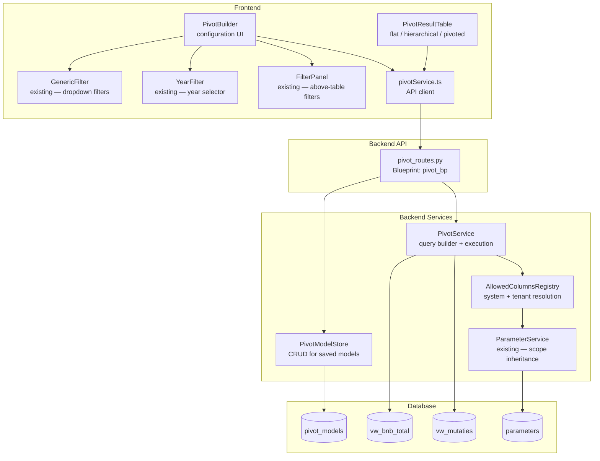
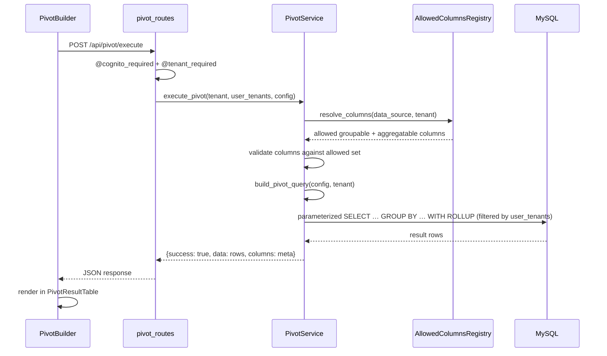

# Design Document: Dynamic Pivot Views

## Overview

Dynamic Pivot Views adds a user-driven GROUP BY query builder and result renderer to myAdmin. Users select a data source (`vw_mutaties` or `vw_bnb_total`), pick grouping columns and aggregation functions, apply filters, and execute the query — all through a Pivot Builder UI. Results render in a Pivot Result Table that supports flat, hierarchical (nested rows), and column-pivoted layouts. Configurations can be saved as named Pivot Models for later recall.

The feature builds on existing infrastructure:

- **Frontend**: reuses `FilterPanel`, `YearFilter`, `GenericFilter`, `FilterableHeader`, and `useFilterableTable` for filter rendering and column sorting.
- **Backend**: extends `ReportingService` patterns — `build_where_clause()`, parameterized queries, `@cognito_required` / `@tenant_required` decorators.
- **Parameter system**: uses `ParameterService` with namespace `ui.pivot` for tenant-level column restrictions, inheriting from system-level defaults.
- **Database**: new `pivot_models` table for persistence; queries target existing views `vw_mutaties` and `vw_bnb_total`.

### Key Design Decisions

| Decision                 | Choice                                                                        | Rationale                                                                       |
| ------------------------ | ----------------------------------------------------------------------------- | ------------------------------------------------------------------------------- |
| Column pivoting strategy | Conditional aggregation in SQL (`SUM(CASE WHEN …)`)                           | MySQL 8.0 supports it natively; avoids post-processing large datasets in Python |
| Hierarchical rows        | Client-side tree construction from flat GROUP BY result with `WITH ROLLUP`    | Keeps SQL simple; tree building is fast on aggregated (small) result sets       |
| Allowed columns registry | Hardcoded system max in Python dict + tenant overrides via `parameters` table | Matches existing parameter-driven config pattern; no new infrastructure         |
| Pivot model storage      | JSON column in `pivot_models` table                                           | Flexible schema for evolving model definitions; matches existing patterns       |
| Number formatting        | Client-side toggle (decimal / whole / k-notation)                             | No backend changes needed; reuses `Intl.NumberFormat`                           |
| CSV export               | Client-side generation from in-memory data                                    | Avoids extra backend round-trip; data is already loaded                         |
| PBT library              | Hypothesis (Python) + fast-check (TypeScript)                                 | Already in project dependencies                                                 |

## Architecture



### Request Flow: Execute Pivot Query



## Components and Interfaces

### 1. PivotService (Backend)

Constructs and executes dynamic GROUP BY queries with tenant isolation, column validation, and optional column pivoting via conditional aggregation.

Location: `backend/src/services/pivot_service.py`

```python
class PivotService:
    """Builds and executes dynamic pivot queries with tenant isolation."""

    SYSTEM_ALLOWED_COLUMNS: dict  # per data_source → {groupable: [...], aggregatable: [...]}

    def __init__(self, db: DatabaseManager, parameter_service: ParameterService):
        self.db = db
        self.parameter_service = parameter_service

    def execute_pivot(self, tenant: str, user_tenants: list[str], config: dict) -> dict:
        """
        Execute a pivot query.

        Args:
            tenant: current tenant identifier (from @tenant_required)
            user_tenants: list of all tenants the user has access to (from @tenant_required)
            config: {
                data_source: str,
                group_columns: list[str],
                aggregate_measures: list[{function: str, column: str}],
                filters: dict,
                column_pivot: str | None,
                column_nest_levels: list[str],
            }
        Returns:
            {success: bool, data: list[dict], columns: list[dict]}
        """

    def get_available_columns(self, data_source: str, tenant: str) -> dict:
        """
        Resolve allowed columns for a data source + tenant.
        Starts with SYSTEM_ALLOWED_COLUMNS, then applies tenant restrictions
        from parameters table (namespace: ui.pivot).

        Returns:
            {groupable: list[{name, type, label}], aggregatable: list[{name, type, label}]}
        """

    def build_pivot_query(self, config: dict, tenant: str) -> tuple[str, list]:
        """
        Build parameterized SQL query from pivot config.
        Returns (query_string, params_list).

        For column pivoting: uses conditional aggregation
            SUM(CASE WHEN pivot_col = %s THEN agg_col ELSE 0 END) AS `label`
        For hierarchical rows: appends WITH ROLLUP to GROUP BY.
        """

    def build_underlying_query(self, config: dict, tenant: str) -> tuple[str, list]:
        """
        Build query for underlying (non-aggregated) dataset export.
        Applies same filters + tenant isolation but no GROUP BY.
        """

    def _validate_columns(self, data_source: str, tenant: str,
                          group_columns: list, aggregate_measures: list,
                          column_pivot: str | None,
                          column_nest_levels: list) -> None:
        """Validate all requested columns against resolved allowed set. Raises ValueError."""

    def _build_where_clause(self, data_source: str, filters: dict,
                            user_tenants: list[str]) -> tuple[str, list]:
        """
        Build WHERE clause with tenant isolation + user filters.
        Uses administration IN (%s, %s, ...) with user_tenants list,
        matching the existing ReportingService pattern.
        Returns (clause, params).
        """
```

### 2. PivotModelStore (Backend)

CRUD operations for saved pivot model definitions. Handles JSON serialization/deserialization with validation.

Location: `backend/src/services/pivot_model_store.py`

```python
class PivotModelStore:
    """Persistence layer for pivot model definitions."""

    def __init__(self, db: DatabaseManager):
        self.db = db

    def save_model(self, tenant: str, user_email: str, name: str, definition: dict) -> dict:
        """
        Save or create a pivot model.
        Returns {success: bool, id: int, ...} or raises ValueError on duplicate name.
        """

    def update_model(self, tenant: str, user_email: str, model_id: int, definition: dict) -> dict:
        """Update an existing model's definition. Records updated_at timestamp."""

    def load_model(self, tenant: str, model_id: int) -> dict:
        """Load a single model by ID. Deserializes JSON definition. Validates required fields."""

    def list_models(self, tenant: str) -> list[dict]:
        """List all models for a tenant. Returns summary (id, name, data_source, created_at, created_by)."""

    def delete_model(self, tenant: str, model_id: int) -> bool:
        """Delete a model. Returns True if deleted."""

    @staticmethod
    def serialize(definition: dict) -> str:
        """Serialize pivot model definition to JSON string."""

    @staticmethod
    def deserialize(json_str: str) -> dict:
        """
        Deserialize JSON string to pivot model definition.
        Raises ValueError if malformed or missing required fields.
        """

    @staticmethod
    def validate_definition(definition: dict) -> None:
        """
        Validate a pivot model definition has all required fields:
        data_source, group_columns, aggregate_measures.
        Raises ValueError with descriptive message if invalid.
        """
```

### 3. Pivot API Routes (Backend)

Location: `backend/src/routes/pivot_routes.py`

```python
pivot_bp = Blueprint('pivot', __name__)

# POST /api/pivot/execute          — execute a pivot query
# GET  /api/pivot/columns/<source> — get available columns for a data source
# GET  /api/pivot/models           — list saved models for tenant
# POST /api/pivot/models           — save a new model
# PUT  /api/pivot/models/<id>      — update an existing model
# GET  /api/pivot/models/<id>      — load a specific model
# DELETE /api/pivot/models/<id>    — delete a model
# POST /api/pivot/export           — export underlying dataset as CSV
```

All routes use `@cognito_required(required_permissions=['reports_read'])` and `@tenant_required()`.
Save/update/delete routes additionally require `reports_export` permission.

**Execute Pivot Request:**

```json
{
  "data_source": "vw_mutaties",
  "group_columns": ["Aangifte", "jaar"],
  "aggregate_measures": [
    { "function": "SUM", "column": "Amount" },
    { "function": "COUNT", "column": "*" }
  ],
  "filters": {
    "years": [2024, 2025],
    "administration": "GoodwinSolutions"
  },
  "column_pivot": null,
  "column_nest_levels": [],
  "include_rollup": true
}
```

**Execute Pivot Response:**

```json
{
  "success": true,
  "data": [
    { "Aangifte": "BTW", "jaar": 2024, "SUM_Amount": 12345.67, "COUNT": 42 },
    { "Aangifte": "BTW", "jaar": 2025, "SUM_Amount": 15678.9, "COUNT": 55 }
  ],
  "columns": [
    { "name": "Aangifte", "type": "group", "dataType": "varchar" },
    { "name": "jaar", "type": "group", "dataType": "int" },
    {
      "name": "SUM_Amount",
      "type": "aggregate",
      "function": "SUM",
      "sourceColumn": "Amount",
      "dataType": "decimal"
    },
    {
      "name": "COUNT",
      "type": "aggregate",
      "function": "COUNT",
      "sourceColumn": "*",
      "dataType": "int"
    }
  ],
  "row_count": 2
}
```

**Save Model Request:**

```json
{
  "name": "BTW per year",
  "definition": {
    "data_source": "vw_mutaties",
    "group_columns": ["Aangifte", "jaar"],
    "aggregate_measures": [{ "function": "SUM", "column": "Amount" }],
    "filters": { "years": [2024, 2025] },
    "column_pivot": null,
    "column_nest_levels": [],
    "display_mode": "hierarchical"
  }
}
```

### 4. PivotBuilder (Frontend)

The main configuration UI. Composed of data source selector, column pickers, filter panel, and action buttons.

Location: `frontend/src/components/pivot/PivotBuilder.tsx`

```typescript
interface PivotConfig {
  dataSource: "vw_mutaties" | "vw_bnb_total";
  groupColumns: string[];
  aggregateMeasures: AggregateMeasure[];
  filters: Record<string, any>;
  columnPivot: string | null;
  columnNestLevels: string[];
  displayMode: "flat" | "hierarchical";
}

interface AggregateMeasure {
  function: "SUM" | "COUNT" | "AVG" | "MIN" | "MAX";
  column: string;
}

interface AvailableColumns {
  groupable: ColumnDef[];
  aggregatable: ColumnDef[];
}

interface ColumnDef {
  name: string;
  type: string;
  label: string;
}
```

The PivotBuilder:

- Fetches available columns from `GET /api/pivot/columns/<source>` on data source change.
- Renders filter controls matching the source table's existing filters (reusing `FilterPanel`, `YearFilter`, `GenericFilter`).
- Validates: at least 1 group column + 1 aggregate measure before execute.
- Limits: max 5 group columns, max 10 aggregate measures, max 5 column nest levels.
- Prevents the same column from being used as row group, column pivot, and column nest level simultaneously.

### 5. PivotResultTable (Frontend)

Renders pivot query results in flat, hierarchical, or column-pivoted layouts.

Location: `frontend/src/components/pivot/PivotResultTable.tsx`

```typescript
interface PivotResultTableProps {
  data: Record<string, any>[];
  columns: PivotColumnMeta[];
  config: PivotConfig;
  isLoading: boolean;
}

type NumberFormat = "decimal" | "whole" | "k-notation";
```

Features:

- **Flat mode**: standard Chakra `Table` with `FilterableHeader` for sorting.
- **Hierarchical mode**: tree structure built client-side from `WITH ROLLUP` rows. First group column = top-level, subsequent = nested. Expand/collapse via row click. Parent rows show rolled-up aggregates.
- **Column-pivoted mode**: nested column headers rendered via `<colgroup>` + multi-row `<thead>`. Grand total column appended per pivot group.
- **Number format toggle**: three-way switch (decimal €12,345.67 / whole €12,346 / k-notation €12.3k). Uses `Intl.NumberFormat` with locale from `i18n.language`.
- **Sorting**: all columns sortable via `useTableSort`.
- **Empty state**: message when zero rows returned.

### 6. pivotService.ts (Frontend API Client)

Location: `frontend/src/services/pivotService.ts`

```typescript
export async function executePivot(config: PivotConfig): Promise<PivotResult>;
export async function getAvailableColumns(
  dataSource: string,
): Promise<AvailableColumns>;
export async function listPivotModels(): Promise<PivotModelSummary[]>;
export async function savePivotModel(
  name: string,
  definition: PivotConfig,
): Promise<{ id: number }>;
export async function updatePivotModel(
  id: number,
  definition: PivotConfig,
): Promise<void>;
export async function loadPivotModel(id: number): Promise<PivotModel>;
export async function deletePivotModel(id: number): Promise<void>;
export async function exportUnderlying(config: PivotConfig): Promise<Blob>;
```

All functions use `authenticatedGet` / `authenticatedPost` / `authenticatedPut` / `authenticatedDelete` from `apiService.ts`.

### 7. CSV Export

Client-side CSV generation for both export modes:

- **Pivot result export**: iterates `data` array, formats numbers per current display mode (decimal/whole/k-notation), generates CSV string, triggers download.
- **Underlying dataset export**: calls `POST /api/pivot/export` which returns raw filtered rows as JSON, then generates CSV client-side with full-precision numbers.

Both use the existing pattern from `MutatiesReport.tsx` (`Blob` + `URL.createObjectURL` + anchor click).

### 8. AllowedColumnsRegistry

Two-tier column access control integrated into `PivotService`.

**System-level** (hardcoded in `pivot_service.py`):

```python
SYSTEM_ALLOWED_COLUMNS = {
    'vw_mutaties': {
        'groupable': ['Aangifte', 'TransactionDate', 'Reknum', 'AccountName',
                       'Parent', 'VW', 'jaar', 'kwartaal', 'maand', 'week',
                       'ReferenceNumber', 'administration'],
        'aggregatable': ['Amount'],
    },
    'vw_bnb_total': {
        'groupable': ['channel', 'listing', 'checkinDate', 'year', 'q', 'm',
                       'country', 'countryName', 'countryRegion', 'source_type', 'status'],
        'aggregatable': ['nights', 'guests', 'amountGross', 'amountNett',
                          'amountChannelFee', 'amountTouristTax', 'amountVat',
                          'pricePerNight', 'daysBeforeReservation'],
    },
}
```

**Tenant-level** (via `ParameterService`):

- Namespace: `ui.pivot`
- Key: `allowed_columns.<data_source>` (e.g., `allowed_columns.vw_mutaties`)
- Value type: `json`
- Value: `{"groupable": ["Aangifte", "jaar", "kwartaal"], "aggregatable": ["Amount"]}`
- When present, the tenant's allowed columns are the **intersection** of system max and tenant restriction.
- When absent, the full system-level set is used.

## Data Models

### pivot_models Table

```sql
CREATE TABLE IF NOT EXISTS pivot_models (
    id INT AUTO_INCREMENT PRIMARY KEY,
    administration VARCHAR(100) NOT NULL,       -- same as 'tenant' in auth context; identifies the administration/tenant that owns this model
    name VARCHAR(255) NOT NULL,
    data_source VARCHAR(100) NOT NULL,
    definition JSON NOT NULL,
    created_by VARCHAR(255) NOT NULL,
    created_at TIMESTAMP DEFAULT CURRENT_TIMESTAMP,
    updated_at TIMESTAMP DEFAULT CURRENT_TIMESTAMP ON UPDATE CURRENT_TIMESTAMP,
    UNIQUE KEY uq_admin_user_name (administration, created_by, name),
    INDEX idx_administration (administration)
) ENGINE=InnoDB DEFAULT CHARSET=utf8mb4;
```

### Pivot Model Definition (JSON Schema)

The `definition` JSON column stores:

```json
{
  "data_source": "vw_mutaties",
  "group_columns": ["Aangifte", "jaar"],
  "aggregate_measures": [
    { "function": "SUM", "column": "Amount" },
    { "function": "COUNT", "column": "*" }
  ],
  "filters": {
    "years": [2024, 2025],
    "profit_loss": "V"
  },
  "column_pivot": null,
  "column_nest_levels": [],
  "display_mode": "hierarchical"
}
```

Required fields: `data_source`, `group_columns` (non-empty), `aggregate_measures` (non-empty).
Optional fields: `filters` (default `{}`), `column_pivot` (default `null`), `column_nest_levels` (default `[]`), `display_mode` (default `"flat"`).

### Parameter Entries for Tenant Column Restrictions

| scope  | scope_id         | namespace | key                         | value_type | value (example)                                                          |
| ------ | ---------------- | --------- | --------------------------- | ---------- | ------------------------------------------------------------------------ |
| system | _system_         | ui.pivot  | allowed_columns.vw_mutaties | json       | (full system list — not stored, hardcoded)                               |
| tenant | GoodwinSolutions | ui.pivot  | allowed_columns.vw_mutaties | json       | `{"groupable":["Aangifte","jaar","kwartaal"],"aggregatable":["Amount"]}` |

## Correctness Properties

_A property is a characteristic or behavior that should hold true across all valid executions of a system — essentially, a formal statement about what the system should do. Properties serve as the bridge between human-readable specifications and machine-verifiable correctness guarantees._

### Property 1: Pivot model serialization round-trip

_For any_ valid Pivot Model definition (containing a data source, at least one group column, at least one aggregate measure, optional filters, optional column pivot, optional column nest levels, and a display mode), serializing the definition to JSON and then deserializing the JSON back SHALL produce a definition equivalent to the original.

**Validates: Requirements 4.2, 4.5, 10.1, 10.2, 10.3**

### Property 2: Malformed JSON rejection

_For any_ JSON string that is either syntactically invalid or missing one or more required fields (`data_source`, `group_columns`, `aggregate_measures`), deserialization SHALL raise a descriptive error and not return a partial model.

**Validates: Requirements 10.4**

### Property 3: Pivot config validation rejects incomplete configurations

_For any_ Pivot View configuration where `group_columns` is empty OR `aggregate_measures` is empty, validation SHALL reject the configuration with an error indicating the missing selections.

**Validates: Requirements 1.6**

### Property 4: Column role overlap validation

_For any_ Pivot View configuration where the same column name appears in more than one of the sets {row group columns, column pivot, column nest levels}, validation SHALL reject the configuration.

**Validates: Requirements 9.10**

### Property 5: Query builder produces parameterized SQL with correct structure

_For any_ valid Pivot View configuration with any combination of filters, the generated SQL query SHALL contain only `%s` placeholders (no raw user values in the query string), all user-provided filter values SHALL appear in the parameters list, and the WHERE clause SHALL precede the GROUP BY clause.

**Validates: Requirements 2.4, 3.1, 3.2**

### Property 6: Tenant isolation in every pivot query

_For any_ valid Pivot View configuration and any list of user-accessible tenants (`user_tenants`), the generated SQL WHERE clause SHALL include a condition filtering on the tenant list (`administration IN (%s, %s, ...)`), and all tenant values SHALL appear in the parameters list. This matches the existing `ReportingService` pattern where a user may have access to multiple administrations.

**Validates: Requirements 3.3**

### Property 7: Column resolution is intersection of system max and tenant restriction

_For any_ data source, system-level allowed column set, and tenant-level restriction set (where the tenant restriction is a subset of the system max), the resolved allowed columns SHALL equal the intersection of the system max and the tenant restriction. When no tenant restriction exists, the full system-level set SHALL be returned.

**Validates: Requirements 6.2, 6.3**

### Property 8: Disallowed columns are rejected

_For any_ pivot execution request that includes a group column or aggregate column not present in the resolved Allowed Columns Registry for the given data source and tenant, the Pivot Service SHALL reject the request with a validation error.

**Validates: Requirements 6.5**

### Property 9: Number format toggle produces correct output

_For any_ numeric value and any of the three display modes (decimal, whole, k-notation), the formatting function SHALL produce output matching the mode: decimal mode shows two decimal places, whole mode shows zero decimal places, and k-notation mode uses abbreviated suffixes (k for thousands, M for millions).

**Validates: Requirements 3.6, 3.7**

### Property 10: CSV export produces valid output with correct structure

_For any_ non-empty pivot result data array and column metadata, the exported CSV SHALL have a header row matching the column labels, the same number of data rows as the input array, and each row SHALL have the same number of fields as the header.

**Validates: Requirements 7.2, 7.3**

### Property 11: Hierarchical tree has correct nesting structure

_For any_ flat pivot result set with two or more group columns, building the hierarchical tree SHALL produce a structure where the first group column's distinct values are top-level nodes, and each subsequent group column's values are nested as children of the preceding level.

**Validates: Requirements 8.2**

### Property 12: Parent row aggregates equal rollup of children

_For any_ hierarchical pivot result tree, each parent node's aggregate measure values SHALL equal the result of applying the corresponding aggregation function (SUM, COUNT, AVG, MIN, MAX) across all its direct children's aggregate values.

**Validates: Requirements 8.3**

### Property 13: Column pivot query uses conditional aggregation

_For any_ valid Pivot View configuration with a Column Pivot selected, the generated SQL SHALL contain conditional aggregation expressions (`CASE WHEN <pivot_column> = %s THEN <agg_column> ... END`) for each distinct pivot value and each aggregate measure.

**Validates: Requirements 9.7**

## Error Handling

### Backend Errors

| Error Condition                             | HTTP Status | Response                                                                                                   | Requirement    |
| ------------------------------------------- | ----------- | ---------------------------------------------------------------------------------------------------------- | -------------- |
| Missing/invalid auth token                  | 401         | `{"error": "Missing Authorization header"}`                                                                | Auth framework |
| Tenant access denied                        | 403         | `{"error": "Access denied to tenant"}`                                                                     | Auth framework |
| Insufficient permissions                    | 403         | `{"error": "Insufficient permissions"}`                                                                    | Auth framework |
| Missing group columns or aggregate measures | 400         | `{"success": false, "error": "At least one group column and one aggregate measure are required"}`          | 1.6            |
| Column not in allowed registry              | 400         | `{"success": false, "error": "Column 'X' is not allowed for data source 'Y'"}`                             | 6.5            |
| Column used in multiple roles               | 400         | `{"success": false, "error": "Column 'X' cannot be used as both row group and column pivot"}`              | 9.10           |
| Duplicate model name                        | 409         | `{"success": false, "error": "A model with name 'X' already exists"}`                                      | 4.4            |
| Model not found                             | 404         | `{"success": false, "error": "Pivot model not found"}`                                                     | 5.2            |
| Malformed model JSON                        | 400         | `{"success": false, "error": "Invalid model definition: missing required field 'data_source'"}`            | 10.4           |
| SQL execution failure                       | 500         | `{"success": false, "error": "Query execution failed. Please check your configuration."}` (no SQL details) | 3.9            |
| Exceeds group column limit (>5)             | 400         | `{"success": false, "error": "Maximum 5 group columns allowed"}`                                           | 1.7            |
| Exceeds aggregate measure limit (>10)       | 400         | `{"success": false, "error": "Maximum 10 aggregate measures allowed"}`                                     | 1.8            |
| Exceeds nest level limit (>5)               | 400         | `{"success": false, "error": "Maximum 5 column nest levels allowed"}`                                      | 9.11           |

### Frontend Error Handling

- **Validation errors**: displayed inline in the PivotBuilder before submission (red text below the relevant control).
- **API errors**: displayed as a Chakra `Alert` with `status="error"` above the result table.
- **Network errors**: caught by `authenticatedRequest` and displayed as a generic connection error alert.
- **Empty results**: not an error — displayed as an informational message in the result table area.

## Testing Strategy

### Dual Testing Approach

This feature uses both unit/example-based tests and property-based tests for comprehensive coverage.

**Property-based tests** verify universal properties across randomly generated inputs (minimum 100 iterations each). They are ideal for the pure logic in this feature: serialization, validation, query building, formatting, tree construction, and column resolution.

**Unit/example tests** cover specific scenarios, UI interactions, integration points, and edge cases that don't benefit from randomized input.

### Property-Based Testing

**Backend (Python)**: Hypothesis

- `test_pivot_model_serialization.py` — Properties 1, 2
- `test_pivot_config_validation.py` — Properties 3, 4
- `test_pivot_query_builder.py` — Properties 5, 6, 13
- `test_allowed_columns_registry.py` — Properties 7, 8

**Frontend (TypeScript)**: fast-check 4.4.0

- `PivotResultTable.property.test.ts` — Properties 9, 10, 11, 12

Each property test:

- Runs minimum 100 iterations
- References its design property via tag comment: `// Feature: dynamic-pivot-views, Property N: <title>`
- Uses custom generators for `PivotConfig`, `AggregateMeasure`, `PivotModelDefinition`, and result data

### Unit / Example Tests

**Backend**:

- `test_pivot_routes.py` — API endpoint tests (auth, tenant isolation, error responses)
- `test_pivot_model_store.py` — CRUD operations (save, load, update, delete, duplicate name)
- `test_pivot_service.py` — Integration tests for query execution with test database

**Frontend**:

- `PivotBuilder.test.tsx` — Component rendering, data source selection, filter display, save flow
- `PivotResultTable.test.tsx` — Flat/hierarchical/pivoted rendering, sorting, empty state, export buttons
- `pivotService.test.ts` — API client with MSW mocks

### Test Coverage by Requirement

| Requirement                 | Property Tests | Unit/Example Tests                               |
| --------------------------- | -------------- | ------------------------------------------------ |
| 1. Pivot View Configuration | P3, P4         | PivotBuilder render, validation UI               |
| 2. Filters                  | P5             | Filter component rendering per data source       |
| 3. Execute & Display        | P5, P6, P9     | API integration, empty state, error display      |
| 4. Save Model               | P1             | Save flow, duplicate name, timestamps            |
| 5. Load/Manage Models       | P1, P2         | List, load, delete, update flows                 |
| 6. Column Access Control    | P7, P8         | Parameter integration, API column endpoint       |
| 7. CSV Export               | P10            | Export button states, download trigger           |
| 8. Hierarchical Display     | P11, P12       | Toggle visibility, expand/collapse, default mode |
| 9. Column Pivot             | P4, P13        | Pivot selector UI, nested headers rendering      |
| 10. Serialization           | P1, P2         | Specific malformed JSON examples                 |

## Extensibility: Adding a New Data Source

The pivot module is designed so that adding a new view or table as a data source requires only configuration changes — no structural code modifications.

### Steps to Add a New Data Source

**1. Backend — Register in AllowedColumnsRegistry** (`backend/src/services/pivot_service.py`)

Add an entry to `SYSTEM_ALLOWED_COLUMNS`:

```python
SYSTEM_ALLOWED_COLUMNS = {
    'vw_mutaties': { ... },
    'vw_bnb_total': { ... },
    # New data source:
    'vw_invoices': {
        'groupable': ['vendor', 'category', 'year', 'month', 'status'],
        'aggregatable': ['amount_excl_vat', 'amount_incl_vat', 'vat_amount'],
    },
}
```

This is the only backend change needed. The query builder, column validation, tenant restrictions, and model persistence all work generically against any registered data source.

**2. Backend — Ensure tenant isolation column exists**

The `_build_where_clause` method uses `administration` as the tenant column. If the new view/table uses a different column name for tenant isolation, add a mapping:

```python
TENANT_COLUMN_MAP = {
    'vw_mutaties': 'administration',
    'vw_bnb_total': 'administration',
    'vw_invoices': 'tenant_id',  # different column name
}
```

**3. Frontend — Add filter configuration** (`frontend/src/components/pivot/PivotBuilder.tsx`)

Define which `FilterPanel`/`GenericFilter`/`YearFilter` controls to render for the new source:

```typescript
const FILTER_CONFIG: Record<string, FilterDef[]> = {
  vw_mutaties: [
    { type: "year", key: "years" },
    {
      type: "dropdown",
      key: "administration",
      endpoint: "/api/reports/filter-options",
    },
    { type: "dropdown", key: "profitLoss", options: ["V", "W"] },
    {
      type: "dropdown",
      key: "ledger",
      endpoint: "/api/reports/filter-options",
    },
  ],
  vw_bnb_total: [
    { type: "year", key: "years" },
    { type: "dropdown", key: "channel" },
    { type: "dropdown", key: "listing" },
  ],
  // New data source:
  vw_invoices: [
    { type: "year", key: "years" },
    { type: "dropdown", key: "vendor" },
    { type: "dropdown", key: "category" },
    {
      type: "dropdown",
      key: "status",
      options: ["pending", "approved", "paid"],
    },
  ],
};
```

**4. Frontend — Add data source label** (for the data source selector dropdown)

Add the display name to the data source list so users see a friendly label.

### What Does NOT Need to Change

- `PivotService.execute_pivot()` — works with any registered data source
- `PivotService.build_pivot_query()` — generates SQL dynamically from config
- `PivotModelStore` — stores/loads models regardless of data source
- `PivotResultTable` — renders results from any data source
- `pivotService.ts` — API client is data-source-agnostic
- CSV export — works on any result set
- Tenant column restrictions via `parameters` table — just use the new data source name as key

## Database Portability: MySQL → PostgreSQL

The pivot feature design uses standard SQL and is portable to PostgreSQL with minor syntax adjustments. No architectural changes are required.

### What Works Identically

- Conditional aggregation: `SUM(CASE WHEN ... THEN ... END)` — identical syntax
- Parameterized queries with `%s` placeholders — both `mysql-connector-python` and `psycopg2` use `%s`
- JSON column type — both MySQL 8.0 and PostgreSQL support native JSON columns
- `GROUP BY ... WITH ROLLUP` — PostgreSQL 15+ supports this directly
- `GROUPING()` function — same syntax on both databases

### Syntax Differences to Address

| Area                      | MySQL 8.0               | PostgreSQL                                           | Change needed                                    |
| ------------------------- | ----------------------- | ---------------------------------------------------- | ------------------------------------------------ |
| Column name quoting       | Backticks `` ` ``       | Double quotes `"`                                    | Query builder: make quote character configurable |
| `WITH ROLLUP`             | Supported               | PostgreSQL 15+; use `GROUPING SETS` for 14 and below | Conditional in query builder                     |
| `AUTO_INCREMENT`          | `id INT AUTO_INCREMENT` | `id SERIAL` or `GENERATED ALWAYS AS IDENTITY`        | DDL only                                         |
| `ENGINE=InnoDB`           | Required                | Not applicable (remove)                              | DDL only                                         |
| `ON DUPLICATE KEY UPDATE` | MySQL syntax            | `ON CONFLICT ... DO UPDATE`                          | Model save upsert                                |
| `DEFAULT CHARSET=utf8mb4` | MySQL syntax            | Not needed (UTF-8 is default)                        | DDL only                                         |

### Recommended Abstraction

To keep the query builder database-agnostic, the `PivotService` should use a configurable quote character for column names:

```python
class PivotService:
    COLUMN_QUOTE = '`'  # MySQL default; change to '"' for PostgreSQL

    def _quote_column(self, name: str) -> str:
        return f'{self.COLUMN_QUOTE}{name}{self.COLUMN_QUOTE}'
```

This single abstraction covers the main runtime difference. DDL changes (table creation) are a one-time migration script concern, not a runtime concern.
