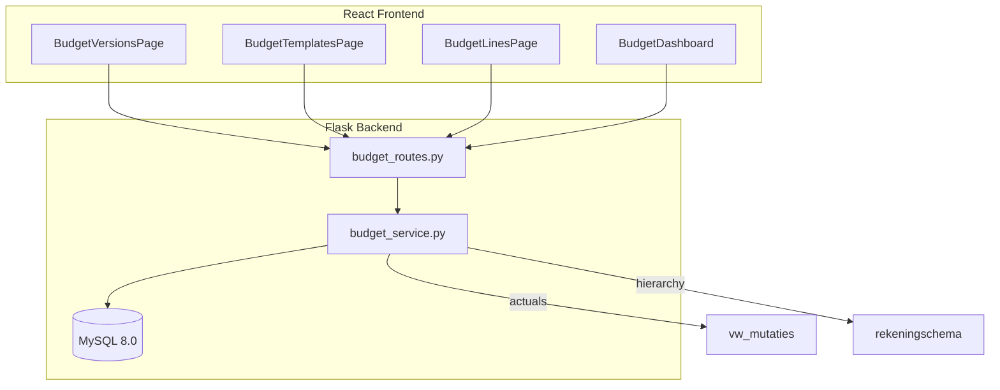

# Design Document: Budget Management (fin-budget)

## Overview

The Budget Management feature adds a category-based budget vs actuals system to the FIN module of myAdmin. It enables financial administrators to create versioned budgets at the Ledger Account level, optionally broken down by platform or ReferenceNumber, and compare them against realized transactions from `vw_mutaties`. Budget amounts roll up through the existing account hierarchy (Account → SubParent → Parent) at query time.

### Key Design Decisions

1. **Query-time rollups** — No materialized rollup tables. Hierarchy aggregation uses the live `rekeningschema` (chart_of_accounts) table so that reassignments are immediately reflected.
2. **Monthly storage** — All budget lines store 12 monthly amounts regardless of entry mode. Annual amounts are pre-divided at write time.
3. **Single active version per year** — Enforced at the database level via application logic (not a unique constraint, since most versions are inactive).
4. **Tenant isolation via `administration` column** — Following the project's defense-in-depth pattern, every budget table carries its own `administration` column and index.

## Architecture



### Layer Responsibilities

| Layer                         | Responsibility                                           |
| ----------------------------- | -------------------------------------------------------- |
| Routes (`budget_routes.py`)   | Request validation, auth decorators, response formatting |
| Service (`budget_service.py`) | Business logic, rollup computation, draft generation     |
| Database                      | Storage, tenant filtering, referential integrity         |

## Components and Interfaces

### Backend Components

| Component        | File                                       | Responsibility                                     |
| ---------------- | ------------------------------------------ | -------------------------------------------------- |
| Blueprint        | `src/routes/budget_routes.py`              | REST endpoints, auth, request parsing              |
| Service          | `src/services/budget_service.py`           | All business logic                                 |
| AI Service       | `src/services/budget_ai_service.py`        | OpenRouter integration for all 4 AI features       |
| (optional split) | `src/services/budget_dashboard_service.py` | Dashboard aggregation if service exceeds 500 lines |

### Frontend Components

| Component           | File                            | Responsibility                             |
| ------------------- | ------------------------------- | ------------------------------------------ |
| BudgetVersionsPage  | `pages/BudgetVersionsPage.tsx`  | Version CRUD, status transitions, activate |
| BudgetTemplatesPage | `pages/BudgetTemplatesPage.tsx` | Template CRUD with line configuration      |
| BudgetLinesPage     | `pages/BudgetLinesPage.tsx`     | Line entry (monthly/annual), per-version   |
| BudgetDashboard     | `pages/BudgetDashboard.tsx`     | Variance display with drill-down           |
| budgetService       | `services/budgetService.ts`     | API calls                                  |
| Budget types        | `types/budget.ts`               | TypeScript interfaces                      |

### API Contracts

#### Budget Versions

| Method | Endpoint                             | Description                       |
| ------ | ------------------------------------ | --------------------------------- |
| GET    | `/api/budget/versions`               | List versions (optional `?year=`) |
| POST   | `/api/budget/versions`               | Create version                    |
| PUT    | `/api/budget/versions/<id>/status`   | Transition status                 |
| PUT    | `/api/budget/versions/<id>/activate` | Set as active                     |
| DELETE | `/api/budget/versions/<id>`          | Delete draft version              |

**POST /api/budget/versions**

```json
Request: { "name": "Budget 2025", "fiscal_year": 2025 }
Response: { "success": true, "data": { "id": 1, "name": "Budget 2025", "fiscal_year": 2025, "status": "Draft", "is_active": false } }
```

**PUT /api/budget/versions/<id>/status**

```json
Request: { "action": "approve" }  // or "revise"
Response: { "success": true, "data": { "id": 1, "status": "Approved", "status_changed_at": "2025-01-15T10:00:00Z" } }
```

#### Budget Templates

| Method | Endpoint                     | Description             |
| ------ | ---------------------------- | ----------------------- |
| GET    | `/api/budget/templates`      | List templates          |
| GET    | `/api/budget/templates/<id>` | Get template with lines |
| POST   | `/api/budget/templates`      | Create template         |
| PUT    | `/api/budget/templates/<id>` | Update template         |
| DELETE | `/api/budget/templates/<id>` | Delete template         |

**POST /api/budget/templates**

```json
Request: {
  "name": "Standard Operating Budget",
  "lines": [
    { "account_code": "4000", "period_mode": "Monthly", "has_detail_dimension": false, "annualization_method": "equal-spread" },
    { "account_code": "4100", "period_mode": "Annual", "has_detail_dimension": true, "dimension_type": "platform", "annualization_method": "equal-spread" }
  ]
}
Response: { "success": true, "data": { "id": 1, "name": "Standard Operating Budget", "line_count": 2 } }
```

#### Budget Lines

| Method | Endpoint                          | Description                 |
| ------ | --------------------------------- | --------------------------- |
| GET    | `/api/budget/versions/<id>/lines` | List lines for a version    |
| POST   | `/api/budget/versions/<id>/lines` | Create/update a budget line |
| PUT    | `/api/budget/lines/<id>`          | Update a budget line        |
| DELETE | `/api/budget/lines/<id>`          | Delete a budget line        |

**POST /api/budget/versions/<id>/lines**

```json
Request: {
  "account_code": "4000",
  "period_mode": "Monthly",
  "amounts": [1000.00, 1200.00, 1100.00, 950.00, 1300.00, 1250.00, 1400.00, 1350.00, 1200.00, 1150.00, 1050.00, 1500.00],
  "detail_dimension_type": null,
  "detail_dimension_value": null
}
Response: { "success": true, "data": { "id": 42, "account_code": "4000", "total": 14450.00 } }
```

**Annual entry** (system divides by 12):

```json
Request: {
  "account_code": "4100",
  "period_mode": "Annual",
  "annual_amount": 12000.00,
  "detail_dimension_type": "platform",
  "detail_dimension_value": "Airbnb"
}
```

#### Draft Generation & Copy

| Method | Endpoint                     | Description                            |
| ------ | ---------------------------- | -------------------------------------- |
| POST   | `/api/budget/generate-draft` | Generate draft from prior-year actuals |
| POST   | `/api/budget/copy`           | Copy budget from previous year         |

**POST /api/budget/generate-draft**

```json
Request: { "template_id": 1, "fiscal_year": 2025, "version_name": "Draft from Actuals 2024" }
Response: { "success": true, "data": { "version_id": 5, "lines_created": 24, "accounts_with_no_actuals": ["4900"] } }
```

**POST /api/budget/copy**

```json
Request: { "source_version_id": 3, "target_fiscal_year": 2026, "version_name": "Copy of 2025 Approved" }
Response: { "success": true, "data": { "version_id": 6, "lines_copied": 30, "excluded_accounts": [] } }
```

#### Dashboard

| Method | Endpoint                | Description                  |
| ------ | ----------------------- | ---------------------------- |
| GET    | `/api/budget/dashboard` | Budget vs actuals comparison |

**GET /api/budget/dashboard?year=2025&level=parent&period=ytd**

Query parameters:

- `year` (required): fiscal year
- `level`: `parent` | `subparent` | `account` (default: `parent`)
- `parent_code`: filter to a specific parent (for drill-down)
- `subparent_code`: filter to a specific subparent (for drill-down)
- `period`: `month-1`..`month-12` | `q1`..`q4` | `ytd` | `full` (default: `ytd`)
- `reference_number`: optional filter

```json
Response: {
  "success": true,
  "data": {
    "year": 2025,
    "level": "parent",
    "period": "ytd",
    "active_version": { "id": 3, "name": "Budget 2025 Approved" },
    "rows": [
      { "code": "4000", "name": "Omzet", "budget": 45000.00, "actual": 42350.75, "variance": -2649.25 },
      { "code": "5000", "name": "Kosten", "budget": 30000.00, "actual": 31200.50, "variance": 1200.50 }
    ]
  }
}
```

#### AI Endpoints

| Method | Endpoint                            | Description                                    |
| ------ | ----------------------------------- | ---------------------------------------------- |
| POST   | `/api/budget/ai/narrative`          | Generate executive summary from dashboard data |
| POST   | `/api/budget/ai/query`              | Translate natural language to dashboard params |
| POST   | `/api/budget/ai/draft-suggestions`  | Suggest adjustments to draft budget lines      |
| POST   | `/api/budget/ai/template-recommend` | Recommend accounts for a new template          |

**POST /api/budget/ai/narrative**

```json
Request: { "year": 2025, "level": "parent", "period": "ytd" }
Response: {
  "success": true,
  "data": {
    "narrative": "De omzet ligt YTD 6% onder budget, voornamelijk door een tegenvaller op rekening 4100 (Airbnb). De kosten overschrijden het budget met 4%, gedreven door onderhoud in Q2.",
    "model_used": "google/gemini-flash-1.5",
    "tokens_used": 380
  }
}
```

**POST /api/budget/ai/query**

```json
Request: { "question": "Welke rekeningen zijn meer dan 20% over budget dit kwartaal?", "year": 2025 }
Response: {
  "success": true,
  "data": {
    "interpreted_params": { "level": "account", "period": "q2", "year": 2025 },
    "filter_description": "Accounts more than 20% over budget in Q2 2025",
    "results": [
      { "code": "5200", "name": "Onderhoud", "budget": 5000.00, "actual": 6500.00, "variance": 1500.00, "variance_pct": 30.0 }
    ],
    "model_used": "google/gemini-flash-1.5",
    "tokens_used": 290
  }
}
```

**POST /api/budget/ai/draft-suggestions**

```json
Request: {
  "version_id": 5,
  "context_notes": "Huur stijgt 5% vanaf juni. Platform Booking.com is gestopt.",
  "scope": { "parent_code": "5000" }
}
Response: {
  "success": true,
  "data": {
    "suggestions": [
      {
        "account_code": "5100",
        "account_name": "Huur",
        "affected_months": [6, 7, 8, 9, 10, 11, 12],
        "current_amounts": [2000, 2000, 2000, 2000, 2000, 2000, 2000],
        "suggested_amounts": [2000, 2000, 2000, 2000, 2000, 2100, 2100],
        "reasoning": "5% huurverhoging toegepast vanaf juni (maand 6)"
      },
      {
        "account_code": "4100",
        "account_name": "Omzet Booking.com",
        "affected_months": [1, 2, 3, 4, 5, 6, 7, 8, 9, 10, 11, 12],
        "current_amounts": [3000, 3000, 3000, 3000, 3000, 3000, 3000, 3000, 3000, 3000, 3000, 3000],
        "suggested_amounts": [3000, 3000, 3000, 0, 0, 0, 0, 0, 0, 0, 0, 0],
        "reasoning": "Platform Booking.com gestopt — budget op 0 gezet vanaf Q2"
      }
    ],
    "model_used": "deepseek/deepseek-chat",
    "tokens_used": 650
  }
}
```

**POST /api/budget/ai/template-recommend**

```json
Request: { "fiscal_year": 2025 }
Response: {
  "success": true,
  "data": {
    "recommendations": [
      { "account_code": "4000", "account_name": "Omzet", "period_mode": "Monthly", "has_detail_dimension": true, "dimension_type": "platform", "confidence": "high", "reason": "Significant multi-platform revenue in 2024" },
      { "account_code": "5100", "account_name": "Huur", "period_mode": "Annual", "has_detail_dimension": false, "dimension_type": null, "confidence": "high", "reason": "Consistent fixed monthly cost" },
      { "account_code": "5900", "account_name": "Diversen", "period_mode": "Monthly", "has_detail_dimension": false, "dimension_type": null, "confidence": "low", "reason": "Active in chart of accounts but minimal 2024 activity" }
    ],
    "model_used": "google/gemini-flash-1.5",
    "tokens_used": 420
  }
}
```

## Data Models

### Database Schema

#### budget_versions

```sql
CREATE TABLE budget_versions (
    id INT AUTO_INCREMENT PRIMARY KEY,
    administration VARCHAR(50) NOT NULL,
    name VARCHAR(100) NOT NULL,
    fiscal_year SMALLINT NOT NULL,
    status ENUM('Draft', 'Approved', 'Revised') NOT NULL DEFAULT 'Draft',
    is_active BOOLEAN NOT NULL DEFAULT FALSE,
    status_changed_at DATETIME NULL,
    created_at DATETIME NOT NULL DEFAULT CURRENT_TIMESTAMP,
    updated_at DATETIME NOT NULL DEFAULT CURRENT_TIMESTAMP ON UPDATE CURRENT_TIMESTAMP,

    INDEX idx_administration (administration),
    INDEX idx_admin_year (administration, fiscal_year),
    UNIQUE INDEX idx_admin_year_name (administration, fiscal_year, name)
) ENGINE=InnoDB DEFAULT CHARSET=utf8mb4;
```

#### budget_templates

```sql
CREATE TABLE budget_templates (
    id INT AUTO_INCREMENT PRIMARY KEY,
    administration VARCHAR(50) NOT NULL,
    name VARCHAR(100) NOT NULL,
    created_at DATETIME NOT NULL DEFAULT CURRENT_TIMESTAMP,
    updated_at DATETIME NOT NULL DEFAULT CURRENT_TIMESTAMP ON UPDATE CURRENT_TIMESTAMP,

    INDEX idx_administration (administration),
    UNIQUE INDEX idx_admin_name (administration, name)
) ENGINE=InnoDB DEFAULT CHARSET=utf8mb4;
```

#### budget_template_lines

```sql
CREATE TABLE budget_template_lines (
    id INT AUTO_INCREMENT PRIMARY KEY,
    template_id INT NOT NULL,
    administration VARCHAR(50) NOT NULL,
    account_code VARCHAR(10) NOT NULL,
    period_mode ENUM('Monthly', 'Annual') NOT NULL DEFAULT 'Monthly',
    has_detail_dimension BOOLEAN NOT NULL DEFAULT FALSE,
    dimension_type ENUM('platform', 'ReferenceNumber') NULL,
    annualization_method VARCHAR(20) NOT NULL DEFAULT 'equal-spread',

    INDEX idx_administration (administration),
    INDEX idx_template (template_id),
    UNIQUE INDEX idx_template_account (template_id, account_code),
    FOREIGN KEY (template_id) REFERENCES budget_templates(id) ON DELETE CASCADE
) ENGINE=InnoDB DEFAULT CHARSET=utf8mb4;
```

#### budget_lines

```sql
CREATE TABLE budget_lines (
    id INT AUTO_INCREMENT PRIMARY KEY,
    version_id INT NOT NULL,
    administration VARCHAR(50) NOT NULL,
    account_code VARCHAR(10) NOT NULL,
    period_mode ENUM('Monthly', 'Annual') NOT NULL,
    detail_dimension_type ENUM('platform', 'ReferenceNumber') NULL,
    detail_dimension_value VARCHAR(100) NULL,
    month_01 DECIMAL(12,2) NOT NULL DEFAULT 0.00,
    month_02 DECIMAL(12,2) NOT NULL DEFAULT 0.00,
    month_03 DECIMAL(12,2) NOT NULL DEFAULT 0.00,
    month_04 DECIMAL(12,2) NOT NULL DEFAULT 0.00,
    month_05 DECIMAL(12,2) NOT NULL DEFAULT 0.00,
    month_06 DECIMAL(12,2) NOT NULL DEFAULT 0.00,
    month_07 DECIMAL(12,2) NOT NULL DEFAULT 0.00,
    month_08 DECIMAL(12,2) NOT NULL DEFAULT 0.00,
    month_09 DECIMAL(12,2) NOT NULL DEFAULT 0.00,
    month_10 DECIMAL(12,2) NOT NULL DEFAULT 0.00,
    month_11 DECIMAL(12,2) NOT NULL DEFAULT 0.00,
    month_12 DECIMAL(12,2) NOT NULL DEFAULT 0.00,
    created_at DATETIME NOT NULL DEFAULT CURRENT_TIMESTAMP,
    updated_at DATETIME NOT NULL DEFAULT CURRENT_TIMESTAMP ON UPDATE CURRENT_TIMESTAMP,

    INDEX idx_administration (administration),
    INDEX idx_version (version_id),
    INDEX idx_version_account (version_id, account_code),
    UNIQUE INDEX idx_version_account_dim (version_id, account_code, detail_dimension_type, detail_dimension_value),
    FOREIGN KEY (version_id) REFERENCES budget_versions(id) ON DELETE CASCADE
) ENGINE=InnoDB DEFAULT CHARSET=utf8mb4;
```

### Key Constraints

- `budget_versions.idx_admin_year_name` — Prevents duplicate version names per year/tenant
- `budget_template_lines.idx_template_account` — Prevents duplicate accounts in a template
- `budget_lines.idx_version_account_dim` — Prevents duplicate account+dimension per version
- All tables carry `administration` with standalone index (defense-in-depth)

### Hierarchy Rollup Query Pattern

Rollups join `budget_lines` to `rekeningschema` at query time:

```sql
-- SubParent rollup
SELECT r.SubParent AS code, MAX(r.Parent) AS parent_code,
       SUM(bl.month_01) AS m01, ..., SUM(bl.month_12) AS m12
FROM budget_lines bl
JOIN rekeningschema r ON r.Account = bl.account_code AND r.administration = bl.administration
WHERE bl.version_id = %s AND bl.administration = %s
GROUP BY r.SubParent;

-- Parent rollup
SELECT r.Parent AS code,
       SUM(bl.month_01) AS m01, ..., SUM(bl.month_12) AS m12
FROM budget_lines bl
JOIN rekeningschema r ON r.Account = bl.account_code AND r.administration = bl.administration
WHERE bl.version_id = %s AND bl.administration = %s
GROUP BY r.Parent;
```

### Actuals Query Pattern

```sql
SELECT Reknum AS account_code, maand, SUM(Amount) AS actual_amount
FROM vw_mutaties
WHERE administration = %s AND jaar = %s
GROUP BY Reknum, maand;
```

With ReferenceNumber filter:

```sql
SELECT Reknum AS account_code, maand, SUM(Amount) AS actual_amount
FROM vw_mutaties
WHERE administration = %s AND jaar = %s AND ReferenceNumber = %s
GROUP BY Reknum, maand;
```

## Correctness Properties

_A property is a characteristic or behavior that should hold true across all valid executions of a system — essentially, a formal statement about what the system should do. Properties serve as the bridge between human-readable specifications and machine-verifiable correctness guarantees._

### Property 1: Annual division preserves total

_For any_ valid annual amount (Decimal with 2 decimal places, within the range supported by DECIMAL(12,2)), dividing by 12 using banker's rounding and adjusting the final month for remainder SHALL produce 12 monthly amounts whose sum exactly equals the original annual amount.

**Validates: Requirements 2.3, 3.2**

### Property 2: Rollup invariant — parent totals equal sum of children

_For any_ set of budget lines assigned to accounts within a hierarchy, the computed SubParent total for each month SHALL equal the sum of all its child Account budget amounts for that month, and the computed Parent total SHALL equal the sum of all its child SubParent totals for that month. This invariant holds at every level of the hierarchy.

**Validates: Requirements 6.2, 7.1, 7.2**

### Property 3: Status transition validity

_For any_ Budget Version in any status (Draft, Approved, or Revised) and any attempted target status, the transition SHALL succeed if and only if it follows the sequence Draft → Approved → Revised. All other transitions SHALL be rejected.

**Validates: Requirements 1.5**

### Property 4: Active version uniqueness

_For any_ sequence of activation operations on Budget Versions within the same fiscal year and tenant, at most one version SHALL be active at any point in time. Activating a new version SHALL deactivate the previously active version.

**Validates: Requirements 1.6, 1.8**

### Property 5: Tenant isolation

_For any_ two distinct tenant administrations A and B, and any read query executed in the context of tenant A, the result set SHALL never contain Budget Versions, Budget Templates, or Budget Lines belonging to tenant B. Cross-tenant access attempts SHALL be denied.

**Validates: Requirements 8.2, 8.4**

### Property 6: Variance calculation correctness

_For any_ budget amount and actual amount (both Decimal with 2 decimal places), the computed variance SHALL exactly equal actual minus budget, where positive indicates over-budget and negative indicates under-budget.

**Validates: Requirements 6.5**

### Property 7: Annualization preserves proportional correctness

_For any_ set of prior-year actuals with N months of data (1 ≤ N < 12), the annualized total SHALL equal (sum_of_actuals × 12 / N) rounded to 2 decimal places, and the sum of the 12 generated monthly amounts (distributed equally with banker's rounding and remainder adjustment) SHALL equal that annualized total.

**Validates: Requirements 4.2**

### Property 8: Period aggregation correctness

_For any_ set of 12 monthly amounts and any valid period selection (individual month, quarter Q1–Q4, year-to-date, or full year), the computed period total SHALL equal the sum of exactly those months included in the selected period.

**Validates: Requirements 6.7**

### Property 9: Budget copy preserves line data

_For any_ Budget Version containing N budget lines with arbitrary monthly amounts, period modes, and detail dimension associations, copying to a new fiscal year SHALL produce a new version with exactly N lines (excluding lines for deleted accounts) where every monthly amount, period mode, and dimension association is identical to the source.

**Validates: Requirements 5.1, 5.2**

### Property 10: AI query parameter safety

_For any_ natural language query processed by the AI query feature, the resulting parameter set SHALL contain only keys from the allowed dashboard parameter schema (`year`, `level`, `period`, `parent_code`, `subparent_code`, `reference_number`). No parameter value SHALL contain SQL fragments, semicolons, or strings longer than 100 characters.

**Validates: Requirements 10.2, 10.5**

## Error Handling

| Scenario                      | HTTP Status | Error Message Pattern                                                        |
| ----------------------------- | ----------- | ---------------------------------------------------------------------------- |
| Duplicate version name        | 400         | "Budget version '{name}' already exists for fiscal year {year}"              |
| Invalid status transition     | 400         | "Cannot transition from {current} to {target}. Allowed: {allowed}"           |
| Activate draft version        | 400         | "Only Approved or Revised versions may be activated"                         |
| Duplicate template name       | 400         | "Budget template '{name}' already exists"                                    |
| Invalid account code          | 400         | "Account '{code}' does not exist in chart of accounts"                       |
| Duplicate budget line         | 400         | "Budget line already exists for account {code} with dimension {dim}"         |
| Copy to same/earlier year     | 400         | "Target year must be later than source year {source_year}"                   |
| No active version (dashboard) | 200         | Returns zero budgets + `notification: "No active budget version for {year}"` |
| AI service unavailable        | 200         | Returns `{ "success": false, "error": "AI service unavailable" }`            |
| AI query parse failure        | 200         | Returns `{ "success": false, "error": "Could not interpret query..." }`      |
| AI payload too large          | 400         | "Too many budget lines for AI analysis. Select a subset (max 100 lines)."    |
| AI timeout                    | 200         | Returns `{ "success": false, "error": "AI service timed out" }`              |
| Access to other tenant's data | 403         | "Access denied"                                                              |
| Version not found             | 404         | "Budget version not found"                                                   |
| Server error                  | 500         | "An unexpected error occurred"                                               |

### Banker's Rounding

All monetary divisions use Python's `decimal.Decimal` with `ROUND_HALF_EVEN`:

```python
from decimal import Decimal, ROUND_HALF_EVEN

def divide_annual(annual_amount: Decimal, months: int = 12) -> list[Decimal]:
    """Divide annual amount into equal monthly amounts with banker's rounding."""
    monthly = (annual_amount / months).quantize(Decimal('0.01'), rounding=ROUND_HALF_EVEN)
    amounts = [monthly] * months
    # Adjust last month for rounding remainder
    remainder = annual_amount - sum(amounts)
    amounts[-1] += remainder
    return amounts
```

### AI Service Architecture

The `BudgetAIService` follows the same pattern as `AITemplateAssistant`:

```python
class BudgetAIService:
    """OpenRouter integration for budget AI features."""

    def __init__(self, db=None):
        self.api_key = os.getenv('OPENROUTER_API_KEY')
        self.api_url = 'https://openrouter.ai/api/v1/chat/completions'
        self.db = db
        self.usage_tracker = AIUsageTracker(db) if db else None

        # Same cost-optimized fallback chain
        self.models = [
            "google/gemini-flash-1.5",
            "meta-llama/llama-3.2-3b-instruct:free",
            "deepseek/deepseek-chat",
            "anthropic/claude-3.5-sonnet"
        ]

    def generate_narrative(self, dashboard_data: dict, period: str, year: int, administration: str) -> dict: ...
    def translate_query(self, question: str, year: int, hierarchy_context: list, administration: str) -> dict: ...
    def suggest_adjustments(self, budget_lines: list, context_notes: str, administration: str) -> dict: ...
    def recommend_template(self, chart_of_accounts: list, prior_actuals: dict, existing_templates: list, administration: str) -> dict: ...
```

**Design principles:**

- All AI calls are user-initiated (never automatic) — zero background cost
- Payloads are pre-aggregated structured data, not raw documents — small token usage
- Free models handle most requests; paid models are last-resort fallback
- AI responses are validated/filtered before returning to the user (e.g., query parameters are schema-checked, account codes are verified)
- Graceful degradation: if AI is unavailable, all core budget functionality works unchanged
- Usage tracking via existing `AIUsageTracker` for cost monitoring per tenant

## Testing Strategy

### Backend Testing (pytest)

**Unit tests** (`tests/unit/test_budget_service.py`):

- Status transition logic (valid/invalid paths)
- Annual amount division with banker's rounding
- Draft generation with partial-year annualization
- Rollup aggregation logic
- Validation rules (duplicates, invalid codes)

**API tests** (`tests/api/test_budget_routes.py`):

- Auth enforcement (missing token, wrong tenant)
- Request validation (missing fields, invalid types)
- CRUD operations with mocked service

**Property-based tests** (`tests/unit/test_budget_properties.py`):

- Rounding properties (see Correctness Properties below)
- Rollup invariants

### Frontend Testing (Vitest + fast-check)

**Unit tests**:

- Component rendering, form validation, API service mocking

**Property-based tests** (`tests/budget.property.test.ts`):

- Annual division rounding (mirrors backend)
- Variance calculation correctness

### Test Configuration

- Property tests: minimum 100 iterations per property
- Backend PBT library: `hypothesis`
- Frontend PBT library: `@fast-check/vitest`
- Tag format: `Feature: fin-budget, Property {N}: {description}`

### AI Feature Testing

**Unit tests** (`tests/unit/test_budget_ai_service.py`):

- Mock OpenRouter responses for each AI feature
- Verify parameter validation (query translation produces only allowed keys)
- Verify graceful degradation when API key is missing or all models fail
- Verify payload size enforcement (max 100 lines for draft suggestions)
- Verify account code filtering on suggestions

**Property-based tests**:

- Property 10: AI query parameter safety — generated parameters contain only allowed keys, no injection patterns
