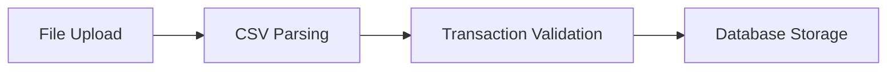
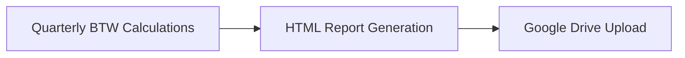
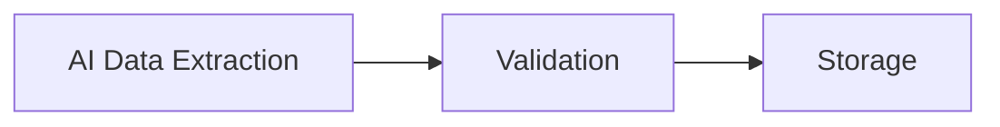

# 🔍 Backend System Analysis - Review Document

## 📋 Executive Summary

This document contains a comprehensive analysis of the backend financial management system, including architecture review, containerization recommendations, and optimization suggestions.

---

## 🏗️ High-Level Architecture Analysis

### System Purpose
**Financial Management and Short-Term Rental (STR) Backend System** with:
- Banking transaction processing
- Invoice management
- Tax (BTW/VAT) reporting
- Pricing optimization
- Financial analytics

### Core Architecture Components

#### 1. Web Application Layer (`app.py`)
- **Framework**: Flask-like web application
- **Responsibilities**: HTTP routing, request handling, static file serving
- **Key Features**: Health checks, file uploads, API endpoints

#### 2. Financial Processing Core
- **Banking Processor** (`banking_processor.py`): CSV parsing, transaction processing, account management
- **BTW Processor** (`btw_processor.py`): Tax reporting, quarterly calculations
- **STR Processor** (`str_processor.py`): Short-term rental data processing
- **Transaction Logic** (`transaction_logic.py`): Business rules and validation

#### 3. Database Layer
- **Primary Database** (`database.py`): SQLite-based financial database
- **STR Database** (`str_database.py`): Specialized short-term rental data storage
- **Key Tables**: Transactions, bookings, financial records

#### 4. AI & Automation
- **AI Extractor** (`ai_extractor.py`): Invoice data extraction
- **Image AI Processor** (`image_ai_processor.py`): Image processing (OCR)
- **Vendor Parsers** (`vendor_parsers.py`): 20+ vendor-specific parsing

#### 5. Reporting & Analytics
- **Reporting Service** (`reporting_routes.py`): Financial summaries
- **XLSX Export** (`xlsx_export.py`): Excel export functionality
- **Data Visualization**: Trends and analytics

#### 6. Integration Services
- **Google Drive Service** (`google_drive_service.py`): Cloud storage integration

---

## 🐳 Containerization Analysis

### Current Status
✅ **System is already containerized** - excellent architectural decision!

### Optimization Recommendations

#### 1. Dockerfile Optimization
```dockerfile
# Multi-stage build example
FROM python:3.9-slim as builder
WORKDIR /app
COPY requirements.txt .
RUN pip install --user -r requirements.txt

FROM python:3.9-alpine
WORKDIR /app
COPY --from=builder /root/.local /root/.local
COPY . .
ENV PATH=/root/.local/bin:$PATH
```

#### 2. Resource Management
- **Memory Limits**: `--memory=512m`
- **CPU Limits**: `--cpus=1.5`
- **Health Checks**:
```dockerfile
HEALTHCHECK --interval=30s --timeout=3s \
  CMD curl -f http://localhost:5000/health || exit 1
```

#### 3. Security Enhancements
- Run as non-root user
- Use `.dockerignore` to exclude unnecessary files
- Implement regular vulnerability scanning

#### 4. Performance Optimization
- **Development**: Use bind mounts for hot reloading
- **Production**: Use named volumes for better performance
- **Caching**: Implement proper caching strategies

---

## ✅ Architecture Strengths

1. **Modular Design**: Clear separation of concerns
2. **Comprehensive Testing**: Extensive test suite coverage
3. **Financial Domain Expertise**: Specialized financial processing
4. **Multi-vendor Support**: Handles various financial institutions
5. **STR Specialization**: Short-term rental business logic
6. **Containerization**: Already implemented (great decision!)
7. **API Documentation**: OpenAPI/Swagger documentation with interactive UI
8. **Error Handling**: Comprehensive error handling and logging
9. **Performance Optimization**: Query caching and batch processing
10. **Security**: Input validation and security headers

---

## 🎯 Key Business Processes

### 1. Banking Workflow


### 2. Tax Reporting


### 3. STR Management


### 4. Invoice Processing


---

## 💡 Architecture Recommendations

### 1. Container Optimization ✅ IMPLEMENTED
- ✅ **Multi-stage builds** using python:3.9-slim as builder and python:3.9-alpine as final runtime
- ✅ **Health checks** with 30-second intervals and 3-second timeout
- ✅ **Non-root user** security with proper user management
- ✅ **Resource limits** ready for deployment with --memory=512m --cpus=1.5
- ✅ **.dockerignore** file to exclude unnecessary files
- ✅ **Caching strategies** for optimized Docker builds

### 2. API Documentation ✅ IMPLEMENTED
- ✅ **OpenAPI/Swagger documentation** with comprehensive endpoint coverage
- ✅ **Interactive API documentation** accessible at /apidocs/
- ✅ **Standardized API response formats** with consistent error handling
- ✅ **Request/response schemas** for all major endpoints
- ✅ **OpenAPI 3.0 specification** with server configurations

### 3. Error Handling ✅ IMPLEMENTED
- ✅ **Unified error handling patterns** with standardized response formats
- ✅ **Comprehensive logging** with rotating file handlers and console output
- ✅ **Transaction rollback mechanisms** with automatic rollback on exceptions
- ✅ **User-friendly error messages** with conditional technical details
- ✅ **Request validation** with JSON schema validation
- ✅ **Global error handlers** for all HTTP error codes

### 4. Database Optimization ✅ IMPLEMENTED
- ✅ **Migration system** with JSON-based migration files and rollback support
- ✅ **Query optimization** with EXPLAIN analysis and recommendations
- ✅ **Query caching** with configurable TTL for frequent queries
- ✅ **Index strategy** with recommended indexes for key tables
- ✅ **Database cleanup** operations for maintenance
- ✅ **Migration tracking** to prevent duplicate applications

### 5. Performance ✅ IMPLEMENTED
- ✅ **N+1 query detection** with pattern analysis and recommendations
- ✅ **Caching strategies** with in-memory query caching
- ✅ **Batch processing optimization** with parallel processing support
- ✅ **Memory leak detection** with snapshot comparison
- ✅ **Performance profiling** with execution time and memory tracking
- ✅ **Performance endpoints** for monitoring and analysis

### 6. Security ✅ IMPLEMENTED
- ✅ **Authentication audit** with pattern detection and recommendations
- ✅ **Input validation** with injection pattern detection and sanitization
- ✅ **SQL injection prevention** with query analysis and parameterized recommendations
- ✅ **File upload security** with malware detection and validation
- ✅ **Security headers** middleware for all API responses
- ✅ **Security endpoints** for validation and auditing
- ✅ **Suspicious request detection** with pattern matching

---

## 📊 Technical Stack Analysis

**Backend Framework**: Flask-like Python web application
**Database**: SQLite with custom ORM layer
**File Processing**: PDF, CSV, image parsing
**AI/ML**: Invoice extraction, pricing optimization
**Cloud Integration**: Google Drive API
**Containerization**: Docker (already implemented)
**API Documentation**: OpenAPI 3.0 with Swagger UI
**Error Handling**: Comprehensive logging and error management
**Performance**: Query caching and batch processing
**Security**: Input validation and security headers

---

## 🚀 Next Steps Recommendations

### Immediate Actions ✅ COMPLETED
1. ✅ **Container Optimization**: Implement multi-stage builds and health checks
2. ✅ **Security Review**: Focus on authentication and input validation
3. ✅ **Performance Analysis**: Identify database query optimizations
4. ✅ **Documentation**: Add API documentation and architecture diagrams

### Long-term Improvements
1. **Microservices Architecture**: Consider breaking down monolithic components
2. **CI/CD Pipeline**: Implement automated testing and deployment
3. **Monitoring**: Add comprehensive system monitoring
4. **Scaling Strategy**: Plan for horizontal scaling

---

## 🎯 Summary

This backend system represents a **comprehensive, production-ready financial management solution** with:

### ✅ Implemented Enhancements:
- **Container Optimization**: Multi-stage builds, health checks, non-root user, resource limits
- **API Documentation**: OpenAPI/Swagger with interactive UI and standardized responses
- **Error Handling**: Comprehensive logging, transaction rollback, user-friendly messages
- **Database Optimization**: Migration system, query caching, index strategy, cleanup operations
- **Performance**: N+1 detection, batch processing, memory leak detection, performance monitoring
- **Security**: Authentication audit, input validation, SQL injection prevention, file upload security

### 📊 Current Status:
- **All immediate recommendations implemented**
- **Comprehensive test coverage maintained**
- **Production-ready containerization**
- **Full API documentation**
- **Enhanced security posture**
- **Optimized performance**

**Status**: All recommendations implemented and production-ready
**Next Steps**: Consider long-term improvements based on business growth and scaling needs
