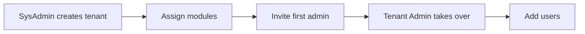

# SysAdmin Management

> Platform management, tenant creation, Docker deployment, and database administration.

## Overview

The SysAdmin section is for platform administrators with the `SysAdmin` role. Here you manage the platform itself: creating tenants, assigning modules, maintaining infrastructure, and troubleshooting.

!!! warning
This section is only for users with the **SysAdmin** role. Looking for documentation on managing your own organization (users, settings, templates)? Go to [Tenant Administration](../tenant-admin/index.md).

## What can you do here?

| Task                                         | Description                                                   |
| -------------------------------------------- | ------------------------------------------------------------- |
| [Tenant management](tenant-management.md)    | Create, configure tenants, assign modules, invite first admin |
| [Docker deployment](docker-deployment.md)    | Manage Docker containers, start, stop, and update             |
| [Database administration](database-admin.md) | MySQL management, migrations, backups                         |
| [Troubleshooting](troubleshooting.md)        | Common platform issues and solutions                          |

## Role structure

myAdmin has two administrator roles:

| Role             | Scope        | Responsibilities                                                    |
| ---------------- | ------------ | ------------------------------------------------------------------- |
| **SysAdmin**     | Platform     | Create/delete tenants, manage modules, infrastructure, manage roles |
| **Tenant Admin** | Organization | Manage users, configure settings, customize templates               |

### Workflow: Setting up a new tenant

1. **SysAdmin** creates a new tenant with basic details
2. **SysAdmin** assigns modules (Financial, STR, etc.)
3. **SysAdmin** invites the first Tenant Admin
4. **Tenant Admin** takes over organization management
5. **Tenant Admin** adds users and assigns roles

## Available roles in the system

### Platform roles

| Role           | Description                    |
| -------------- | ------------------------------ |
| `SysAdmin`     | Full platform access           |
| `Tenant_Admin` | Management of own organization |

### Module roles

| Role             | Description            |
| ---------------- | ---------------------- |
| `Finance_Read`   | View financial reports |
| `Finance_CRUD`   | Edit financial data    |
| `Finance_Export` | Export financial data  |
| `STR_Read`       | View STR reports       |
| `STR_CRUD`       | Edit STR data          |
| `STR_Export`     | Export STR data        |

## Requirements

- AWS Cognito User Pool configured
- Docker and docker-compose installed
- Access to the MySQL database
- `SysAdmin` role in AWS Cognito
