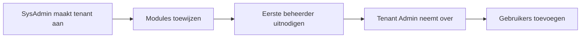

# SysAdmin Beheer

> Platformbeheer, tenants aanmaken, Docker deployment en database administratie.

## Overzicht

De SysAdmin-sectie is bedoeld voor platformbeheerders met de `SysAdmin` rol. Hier beheer je het platform zelf: tenants aanmaken, modules toewijzen, de infrastructuur onderhouden en problemen oplossen.

!!! warning
Deze sectie is alleen voor gebruikers met de **SysAdmin** rol. Zoek je documentatie over het beheren van je eigen organisatie (gebruikers, instellingen, sjablonen)? Ga dan naar [Tenant Beheer](../tenant-admin/index.md).

## Wat kun je hier doen?

| Taak                                        | Beschrijving                                                                   |
| ------------------------------------------- | ------------------------------------------------------------------------------ |
| [Tenant beheer](tenant-management.md)       | Tenants aanmaken, configureren, modules toewijzen, eerste beheerder uitnodigen |
| [Docker deployment](docker-deployment.md)   | Docker-containers beheren, starten, stoppen en bijwerken                       |
| [Database administratie](database-admin.md) | MySQL beheer, migraties, backups                                               |
| [Problemen oplossen](troubleshooting.md)    | Veelvoorkomende platformproblemen en oplossingen                               |

## Rollenstructuur

myAdmin heeft twee beheerdersrollen:

| Rol              | Scope       | Verantwoordelijkheden                                                         |
| ---------------- | ----------- | ----------------------------------------------------------------------------- |
| **SysAdmin**     | Platform    | Tenants aanmaken/verwijderen, modules beheren, infrastructuur, rollen beheren |
| **Tenant Admin** | Organisatie | Gebruikers beheren, instellingen configureren, sjablonen aanpassen            |

### Workflow: Nieuwe tenant opzetten

1. **SysAdmin** maakt een nieuwe tenant aan met basisgegevens
2. **SysAdmin** wijst modules toe (Financieel, STR, etc.)
3. **SysAdmin** nodigt de eerste Tenant Admin uit
4. **Tenant Admin** neemt het beheer van de organisatie over
5. **Tenant Admin** voegt gebruikers toe en wijst rollen toe

## Beschikbare rollen in het systeem

### Platform rollen

| Rol            | Beschrijving                 |
| -------------- | ---------------------------- |
| `SysAdmin`     | Volledige platformtoegang    |
| `Tenant_Admin` | Beheer van eigen organisatie |

### Module rollen

| Rol              | Beschrijving                  |
| ---------------- | ----------------------------- |
| `Finance_Read`   | Financiële rapporten bekijken |
| `Finance_CRUD`   | Financiële data bewerken      |
| `Finance_Export` | Financiële data exporteren    |
| `STR_Read`       | STR-rapporten bekijken        |
| `STR_CRUD`       | STR-data bewerken             |
| `STR_Export`     | STR-data exporteren           |

## Vereisten

- AWS Cognito User Pool geconfigureerd
- Docker en docker-compose geïnstalleerd
- Toegang tot de MySQL database
- `SysAdmin` rol in AWS Cognito
