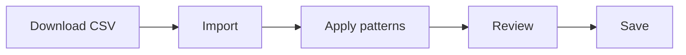

# Banking

> Import bank statements, review transactions, and let patterns automatically assign accounts.

## Overview

The Banking module is the core of your financial administration in myAdmin. Here you process bank statements, review transactions, and make sure every posting ends up on the correct general ledger account.

## What can you do here?

| Task                                             | Description                                     |
| ------------------------------------------------ | ----------------------------------------------- |
| [Import statements](importing-statements.md)     | Upload and process CSV files from your bank     |
| [Review transactions](reviewing-transactions.md) | View, edit, and save imported transactions      |
| [Apply patterns](pattern-matching.md)            | Automatically fill in debit and credit accounts |
| [Handle duplicates](handling-duplicates.md)      | Detect and prevent duplicate transactions       |

## Typical workflow

1. **Download** your bank statement as CSV from online banking
2. **Import** the file into myAdmin
3. **Apply patterns** to automatically fill in accounts
4. **Review** the transactions and correct where needed
5. **Save** to the database

## Supported banks

| Bank        | File type | Recognition                            |
| ----------- | --------- | -------------------------------------- |
| Rabobank    | CSV       | Files starting with `CSV_O` or `CSV_A` |
| Revolut     | TSV/CSV   | Dutch and English format               |
| Credit card | CSV       | Visa/Mastercard format                 |

## Transaction fields

Each transaction contains the following fields:

| Field            | Description                                    |
| ---------------- | ---------------------------------------------- |
| Transaction date | Date of the posting                            |
| Description      | Transaction description                        |
| Amount           | Transaction amount (always stored as positive) |
| Debit            | Debit account (general ledger number)          |
| Credit           | Credit account (general ledger number)         |
| Reference number | Reference for pattern matching                 |
| Ref1             | IBAN/account number                            |
| Ref2             | Sequence number (used for duplicate detection) |
| Ref3             | Balance / Google Drive link to PDF             |
| Ref4             | Source file name                               |

!!! tip
Always start in **Test mode** when importing bank statements for the first time. This way you can learn the process without risk.
