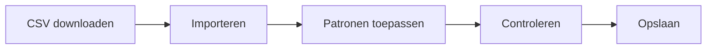

# Bankzaken

> Importeer bankafschriften, controleer transacties en laat patronen automatisch rekeningen toewijzen.

## Overzicht

De module Bankzaken is het hart van je financiële administratie in myAdmin. Hier verwerk je bankafschriften, controleer je transacties en zorg je dat elke boeking op de juiste grootboekrekening terechtkomt.

## Wat kun je hier doen?

| Taak                                                 | Beschrijving                                            |
| ---------------------------------------------------- | ------------------------------------------------------- |
| [Afschriften importeren](importing-statements.md)    | CSV-bestanden van je bank uploaden en verwerken         |
| [Transacties controleren](reviewing-transactions.md) | Geïmporteerde transacties bekijken, bewerken en opslaan |
| [Patronen toepassen](pattern-matching.md)            | Automatisch debet- en creditrekeningen laten invullen   |
| [Duplicaten afhandelen](handling-duplicates.md)      | Dubbele transacties herkennen en voorkomen              |

## Typische workflow

1. **Download** je bankafschrift als CSV vanuit internetbankieren
2. **Importeer** het bestand in myAdmin
3. **Pas patronen toe** om automatisch rekeningen in te vullen
4. **Controleer** de transacties en corrigeer waar nodig
5. **Sla op** naar de database

## Ondersteunde banken

| Bank       | Bestandstype | Herkenning                                    |
| ---------- | ------------ | --------------------------------------------- |
| Rabobank   | CSV          | Bestanden die beginnen met `CSV_O` of `CSV_A` |
| Revolut    | TSV/CSV      | Nederlands en Engels formaat                  |
| Creditcard | CSV          | Visa/Mastercard formaat                       |

## Transactievelden

Elke transactie bevat de volgende velden:

| Veld             | Beschrijving                                  |
| ---------------- | --------------------------------------------- |
| Transactiedatum  | Datum van de boeking                          |
| Omschrijving     | Beschrijving van de transactie                |
| Bedrag           | Transactiebedrag (altijd positief opgeslagen) |
| Debet            | Debetrekening (grootboeknummer)               |
| Credit           | Creditrekening (grootboeknummer)              |
| Referentienummer | Referentie voor patroonherkenning             |
| Ref1             | IBAN/rekeningnummer                           |
| Ref2             | Volgnummer (gebruikt voor duplicaatdetectie)  |
| Ref3             | Saldo / Google Drive-link naar PDF            |
| Ref4             | Bronbestandsnaam                              |

!!! tip
Begin altijd in **Testmodus** als je voor het eerst bankafschriften importeert. Zo kun je het proces leren kennen zonder risico.
