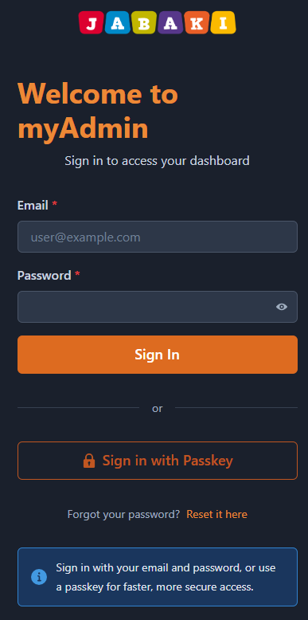
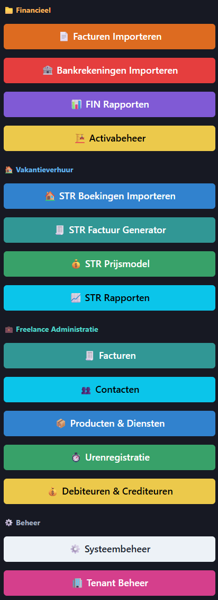

# Eerste login

> Inloggen bij myAdmin en je weg vinden in de applicatie.

## Overzicht

myAdmin gebruikt AWS Cognito voor authenticatie. Je ontvangt inloggegevens van je beheerder en kunt daarna direct aan de slag.

## Wat je nodig hebt

- Een moderne webbrowser (Chrome, Firefox, Edge of Safari)
- Je gebruikersnaam en wachtwoord (ontvangen van je beheerder)

## Stap voor stap

### 1. Open myAdmin

Ga naar de URL die je van je beheerder hebt ontvangen. Je ziet het inlogscherm.

{ width="400" }

### 2. Log in

Vul je gebruikersnaam en wachtwoord in en klik op **Inloggen**.

!!! info
Bij je eerste login word je mogelijk gevraagd om je wachtwoord te wijzigen. Kies een sterk wachtwoord dat je kunt onthouden.

### 3. Navigatie

Na het inloggen zie je het hoofdmenu met de volgende onderdelen:

{ width="700" }

| Menu-item         | Wat het doet                                           |
| ----------------- | ------------------------------------------------------ |
| **Bankzaken**     | Bankafschriften importeren en transacties beheren      |
| **Facturen**      | Facturen uploaden en verwerken                         |
| **STR**           | Kortetermijnverhuur boekingen en omzet                 |
| **STR Prijzen**   | Prijsaanbevelingen voor verhuurobjecten                |
| **Rapportages**   | Dashboards, W&V en balansen                            |
| **Belastingen**   | BTW, IB en toeristenbelasting                          |
| **PDF Validatie** | Google Drive-links controleren                         |
| **Beheer**        | Instellingen en gebruikersbeheer _(alleen beheerders)_ |

## Tips

- Gebruik de **zoekfunctie** in het menu om snel naar een module te navigeren
- Klik op het :material-help-circle: icoon rechtsboven op elke pagina voor contextuele hulp
- Je sessie verloopt na een periode van inactiviteit — log opnieuw in als dat gebeurt

## Volgende stap

Nu je bent ingelogd, stel je modules in: [Modules instellen](onboarding.md)

## Problemen oplossen

| Probleem               | Oorzaak             | Oplossing                                                         |
| ---------------------- | ------------------- | ----------------------------------------------------------------- |
| Kan niet inloggen      | Verkeerd wachtwoord | Gebruik "Wachtwoord vergeten" of neem contact op met je beheerder |
| Pagina laadt niet      | Netwerkprobleem     | Controleer je internetverbinding en ververs de pagina             |
| Geen modules zichtbaar | Onvoldoende rechten | Neem contact op met je beheerder voor de juiste rechten           |
