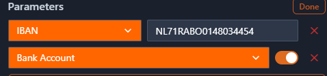
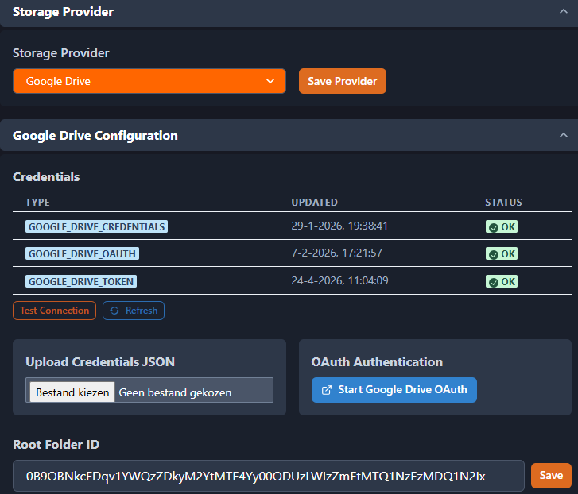

# Settings

> Manage your organization through 6 clear tabs.

## Overview

The Tenant Admin dashboard has 6 tabs. Which tabs you see depends on your modules and role.

| Tab         | Contents                                                    | Visible to         |
| ----------- | ----------------------------------------------------------- | ------------------ |
| Users       | Add users, assign roles                                     | Tenant Admin       |
| Financial   | Chart of Accounts + Tax Rates                               | Tenant Admin (FIN) |
| Storage     | Choose storage provider, Google Drive credentials & folders | Tenant Admin       |
| Templates   | Upload, edit, and approve report templates                  | Tenant Admin       |
| Tenant Info | Company details, contact info, bank details + Email log     | Tenant Admin       |
| Advanced    | Raw parameters table                                        | SysAdmin only      |

## Financial tab

The Financial tab (only visible when the FIN module is active) contains two sections for managing your general ledger (grootboek/rekeningschema) and tax rates.

### Chart of Accounts

The chart of accounts (rekeningschema) contains all general ledger accounts for your administration. The initial chart of accounts that ships with the system is an **example model** — it is not fixed. You can and should adapt it to match your own administration needs.

{ width="700" }

#### Customizing the Chart of Accounts

You can modify the chart of accounts in three ways:

- **Add** — Create a new account directly in the application
- **Edit** — Click any row to edit the account details
- **Export / Import** — Download the current model as Excel, modify it, and re-upload

#### Export and Import (Excel)

The recommended workflow for bulk changes:

1. Click **Export** to download the current chart of accounts as an Excel file
2. Open the file and make your changes (add rows, rename accounts, update categories)
3. Click **Import** to upload the modified file

!!! warning "Column structure must remain unchanged"
The Excel file must have exactly these columns in this order:

    | Column | Description | Required |
    |--------|-------------|----------|
    | `Account` | Account number (e.g., 1000, 4100) | Yes |
    | `AccountName` | Display name of the account | Yes |
    | `AccountLookup` | Lookup code or IBAN for bank accounts | No |
    | `SubParent` | Sub-category grouping | No |
    | `Parent` | Parent category grouping | No |
    | `VW` | Profit & Loss classification | No |
    | `Belastingaangifte` | Tax declaration category (e.g., Activa, Passiva) | No |
    | `Pattern` | Set to `1` for bank accounts, `0` otherwise | No |

    Do not rename, reorder, or remove columns — the import will fail if the structure doesn't match.

#### Ledger Account Parameters

Each account can have additional parameters that control how it behaves in the system. Click a row and then use the **Parameters** button to view and edit these settings:

| Parameter      | Description                                                                 |
| -------------- | --------------------------------------------------------------------------- |
| `bank_account` | Marks this account as a bank account (source account for statement imports) |
| `iban`         | The IBAN or bank account number associated with this account                |
| `purpose`      | Special purpose flag (e.g., VAT netting, year-end closure)                  |

You can also edit parameters as raw JSON via the key-value editor in the account detail view.

{ width="500" }

#### Critical: Bank Account Configuration for Banking Import

!!! danger "Required for banking statement imports"
For the banking import to work correctly, your chart of accounts **must** have at least one account configured as a bank account:

    - **`bank_account`** must be set to `true` (or `Pattern = 1` in the Excel file)
    - **`iban`** must contain the actual bank account number (e.g., `NL91ABNA0417164300`)

    Without these two fields correctly set, imported bank statements will not match to the right source account. If you have multiple bank accounts, each one needs its own ledger account with the correct IBAN.

#### Reference Numbers

Reference numbers (`ref1`) serve as labels to track details within a ledger account and to follow transactions between ledger accounts. For example:

- An imported invoice is booked on a **creditor account** with a reference number
- When the invoice is paid, the bank statement transaction is also booked on the same creditor account with the same reference number
- This links the two transactions together, making it easy to see which invoices have been paid

The same principle applies to debtor accounts for outgoing invoices: the sent invoice and the received payment share a reference number.

#### Accounts in Use

!!! info
Accounts that are already used in transactions cannot be deleted. If you need to restructure your chart of accounts, create the new account first, rebook the transactions, and then deactivate the old account.

### Tax Rates

Manage VAT rates and other tax rates. Click a row to edit. System rates (source: system) can only be changed by the SysAdmin.

## Storage tab

Configure where your files (invoices, templates, reports) are stored. The storage provider determines how myAdmin saves and retrieves documents.

### Step 1: Choose provider

Select your storage provider from the dropdown:

| Provider             | Description                                                             | Best for                                     |
| -------------------- | ----------------------------------------------------------------------- | -------------------------------------------- |
| **Google Drive**     | Files stored in your own Google Drive account with OAuth authentication | Organizations already using Google Workspace |
| **S3 Shared Bucket** | Files stored in a shared AWS S3 bucket managed by the platform          | Default option, no setup required            |
| **S3 Tenant Bucket** | Files stored in a dedicated AWS S3 bucket for your organization         | Organizations needing full data isolation    |

### Step 2: Configure provider

**Google Drive:**

1. **Upload credentials** — Upload your Google service account credentials JSON file, or click **Start OAuth** to authenticate via your browser
2. **Test the connection** — Click **Test Connection** to verify the credentials work. A green checkmark confirms the connection is active
3. **Enter the Root Folder ID** — This is the Google Drive folder ID where myAdmin will create its folder structure. You can find this in the URL when you open the folder in Google Drive (the long string after `/folders/`)
4. **Review folder mappings** — myAdmin uses subfolders for different document types:

   { width="600" }
   - **Invoices folder** — Where uploaded and processed invoices are stored
   - **Templates folder** — Where report and invoice templates are stored
   - **Reports folder** — Where generated reports are saved

!!! tip
If the folders don't exist yet, myAdmin will create them automatically under the root folder when you first use the relevant feature.

**S3 Shared Bucket:**

No additional configuration needed. The platform administrator has already set up the shared bucket. Your files are stored in a tenant-specific prefix within the shared bucket.

**S3 Tenant Bucket:**

Contact your SysAdmin to set up a dedicated S3 bucket for your organization. Once configured, enter the bucket name in the settings.

### How parameters work

The settings you configure on this tab (and on the Financial tab) are stored as **parameters** — configuration values that control how myAdmin behaves for your organization.

- Parameters are **pre-configured with sensible defaults** when your modules are activated
- You customize them through the structured settings tabs (Storage, Financial, etc.)
- Some parameters (like **branding** settings) affect how invoices and documents look
- Some parameters (like **field configurations**) control which fields are visible or required in forms
- Changes take effect immediately — no restart needed

## Advanced tab

!!! info "SysAdmin only"
This tab is only visible to users with the SysAdmin role. Tenant Admins do not see this tab.

The Advanced tab shows the raw parameters table — all configuration parameters for your tenant in their original key-value form. This is useful for advanced configuration and troubleshooting.

### Viewing parameters

The table displays all parameters with the following columns:

| Column     | Description                                                              |
| ---------- | ------------------------------------------------------------------------ |
| Namespace  | Logical grouping (e.g., `ui.pivot`, `storage`, `zzp`)                    |
| Key        | Parameter name within the namespace                                      |
| Value      | Current value (secret values are masked as `********`)                   |
| Value Type | Data type: `string`, `number`, `boolean`, or `json`                      |
| Scope      | `system default` (default value) or `tenant override` (customized value) |

Click a column header to sort. Type in the filter field below a column header to filter.

### Editing a parameter

Click any row to open the parameter. What you can do depends on the parameter type:

**System parameters** (scope: `system default`) open in **read-only mode**:

- All fields are disabled
- Click **Customize** to create a tenant-specific copy with the same value
- After customizing, you can edit the copy from the table

**Tenant parameters** (scope: `tenant override`) open in **edit mode**:

- Modify the value and click **Save**
- For JSON parameters: the system validates the JSON on every change and shows an error message when the JSON is invalid. The **Save** button is disabled while the JSON is invalid
- Use the **Format** button next to JSON fields to automatically re-indent the JSON for readability

### Resetting to default

When you open a tenant parameter that has a default value (from the system configuration), the **Reset to Default** button appears:

1. Click **Reset to Default**
2. A confirmation dialog shows your **current value** alongside the **default value**, so you can assess the impact
3. Click **Reset to Default** to confirm, or **Cancel** to go back

After resetting, the tenant-specific value is removed and the parameter falls back to the default value.

!!! tip
Resetting is not destructive — you can always customize the parameter again using the **Customize** button.

### Deleting a parameter

When a tenant parameter has no default value, a **Delete** button appears instead of "Reset to Default". This permanently removes the parameter.

## Templates tab

Templates determine how invoice processing and reports look. On this tab you can:

- **Download default template** — Download the built-in template as a starting point for customizations
- **Upload template** — Upload your own HTML template
- **Edit template** — Load an existing template, edit it, and re-upload
- **Delete template** — Remove your tenant-specific template and fall back to the default
- **Validate and approve** — Check for errors and activate the template

If there are validation errors, use **AI Help** for suggestions.

See [Template Management](template-management.md) for a detailed guide.

## Tenant Info tab

Manage your company details in the following sections:

- **Company Info** — Administration code, display name, status
- **Contact** — Email and phone number
- **Address** — Street, city, zipcode, country
- **Bank Details** — Account number and bank name
- **Email Log** — Overview of sent emails (invitations, password resets)

## Troubleshooting

| Problem                        | Cause                                | Solution                                   |
| ------------------------------ | ------------------------------------ | ------------------------------------------ |
| "Tenant admin access required" | You don't have the Tenant_Admin role | Contact your SysAdmin                      |
| Financial tab not visible      | FIN module not enabled               | Ask the SysAdmin to enable FIN             |
| Advanced tab not visible       | You're not a SysAdmin                | Only SysAdmin sees this tab                |
| Google Drive connection failed | Credentials expired or invalid       | Upload new credentials or start OAuth flow |
| Account can't be deleted       | Account is used in transactions      | The account is in use                      |
