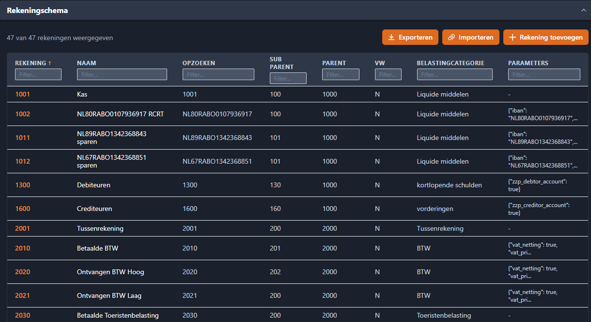
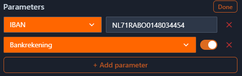
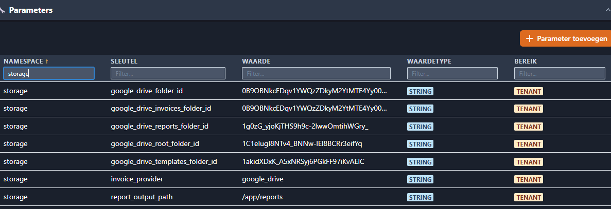
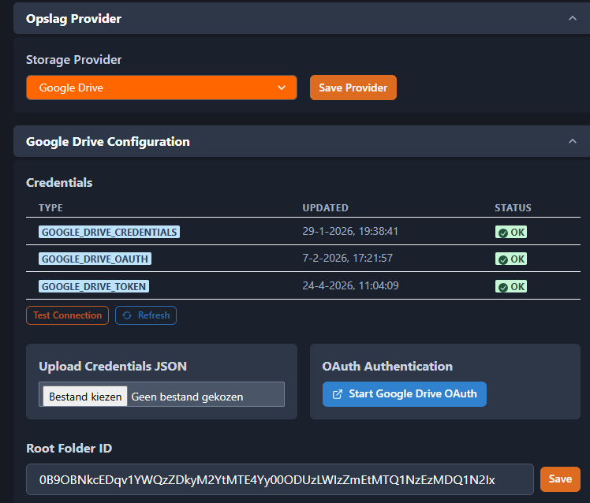

# Instellingen

> Beheer je organisatie via 6 overzichtelijke tabbladen.

## Overzicht

Het Tenant Beheer dashboard is opgebouwd uit 6 tabbladen. Welke tabbladen je ziet hangt af van je modules en rol.

| Tabblad     | Inhoud                                                   | Zichtbaar voor     |
| ----------- | -------------------------------------------------------- | ------------------ |
| Gebruikers  | Gebruikers toevoegen, rollen toewijzen                   | Tenant Admin       |
| Financieel  | Rekeningschema + Belastingtarieven                       | Tenant Admin (FIN) |
| Opslag      | Opslagprovider kiezen, Google Drive credentials & mappen | Tenant Admin       |
| Sjablonen   | Rapportagesjablonen uploaden, bewerken en goedkeuren     | Tenant Admin       |
| Tenantinfo  | Bedrijfsgegevens, contactinfo, bankgegevens + E-maillog  | Tenant Admin       |
| Geavanceerd | Ruwe parameters tabel                                    | Alleen SysAdmin    |

## Financieel tabblad

Het Financieel tabblad (alleen zichtbaar als de FIN-module actief is) bevat twee secties:

### Rekeningschema

Het rekeningschema bevat alle grootboekrekeningen voor je administratie. Het standaard rekeningschema dat met het systeem wordt meegeleverd is een **voorbeeldmodel** — het staat niet vast. Je kunt en moet het aanpassen aan je eigen administratiebehoeften.

{ width="700" }

#### Rekeningschema aanpassen

Je kunt het rekeningschema op drie manieren wijzigen:

- **Toevoegen** — Maak direct een nieuwe rekening aan in de applicatie
- **Bewerken** — Klik op een rij om de rekeninggegevens te bewerken
- **Exporteren / Importeren** — Download het huidige model als Excel, pas het aan en upload het opnieuw

#### Exporteren en importeren (Excel)

De aanbevolen werkwijze voor bulkwijzigingen:

1. Klik op **Exporteren** om het huidige rekeningschema als Excel-bestand te downloaden
2. Open het bestand en maak je wijzigingen (rijen toevoegen, rekeningen hernoemen, categorieën aanpassen)
3. Klik op **Importeren** om het gewijzigde bestand te uploaden

!!! warning "Kolomstructuur moet ongewijzigd blijven"
Het Excel-bestand moet exact deze kolommen bevatten in deze volgorde:

    | Kolom | Beschrijving | Verplicht |
    |-------|-------------|-----------|
    | `Account` | Rekeningnummer (bijv. 1000, 4100) | Ja |
    | `AccountName` | Weergavenaam van de rekening | Ja |
    | `AccountLookup` | Opzoekcode of IBAN voor bankrekeningen | Nee |
    | `SubParent` | Subcategorie groepering | Nee |
    | `Parent` | Bovenliggende categorie groepering | Nee |
    | `VW` | Winst & Verlies classificatie | Nee |
    | `Belastingaangifte` | Belastingaangifte categorie (bijv. Activa, Passiva) | Nee |
    | `Pattern` | Zet op `1` voor bankrekeningen, `0` voor overige | Nee |

    Hernoem, verplaats of verwijder geen kolommen — de import mislukt als de structuur niet overeenkomt.

#### Grootboekrekening parameters

Elke rekening kan aanvullende parameters hebben die bepalen hoe deze zich in het systeem gedraagt. Klik op een rij en gebruik de **Parameters** knop om deze instellingen te bekijken en bewerken:

| Parameter      | Beschrijving                                                                |
| -------------- | --------------------------------------------------------------------------- |
| `bank_account` | Markeert deze rekening als bankrekening (bronrekening voor afschriftimport) |
| `iban`         | Het IBAN of bankrekeningnummer dat bij deze rekening hoort                  |
| `purpose`      | Speciaal doel (bijv. BTW saldering, jaarafsluiting)                         |

Je kunt parameters ook als ruwe JSON bewerken via de sleutel-waarde editor in het rekeningdetailscherm.

{ width="500" }

#### Belangrijk: Bankrekening configuratie voor bankimport

!!! danger "Vereist voor het importeren van bankafschriften"
Om de bankimport correct te laten werken, moet je rekeningschema **minstens één rekening** als bankrekening geconfigureerd hebben:

    - **`bank_account`** moet op `true` staan (of `Pattern = 1` in het Excel-bestand)
    - **`iban`** moet het werkelijke bankrekeningnummer bevatten (bijv. `NL91ABNA0417164300`)

    Zonder deze twee velden correct ingesteld, worden geïmporteerde bankafschriften niet aan de juiste bronrekening gekoppeld. Als je meerdere bankrekeningen hebt, heeft elke rekening een eigen grootboekrekening met het juiste IBAN nodig.

#### Referentienummers

Referentienummers (`ref1`) dienen als labels om details binnen een grootboekrekening te volgen en om transacties tussen grootboekrekeningen te koppelen. Bijvoorbeeld:

- Een geïmporteerde factuur wordt geboekt op een **crediteurenrekening** met een referentienummer
- Wanneer de factuur betaald wordt, wordt de banktransactie ook op dezelfde crediteurenrekening geboekt met hetzelfde referentienummer
- Dit koppelt de twee transacties aan elkaar, zodat je eenvoudig kunt zien welke facturen betaald zijn

Hetzelfde principe geldt voor debiteurenrekeningen bij uitgaande facturen: de verzonden factuur en de ontvangen betaling delen een referentienummer.

#### Rekeningen in gebruik

!!! info
Rekeningen die al in transacties worden gebruikt, kunnen niet worden verwijderd. Als je het rekeningschema wilt herstructureren, maak dan eerst de nieuwe rekening aan, herboek de transacties en deactiveer daarna de oude rekening.

### Belastingtarieven

Beheer BTW-tarieven en andere belastingtarieven. Klik op een rij om te bewerken. Systeemtarieven (bron: system) kunnen alleen door de SysAdmin worden gewijzigd.

## Opslag tabblad

Configureer waar je bestanden (facturen, sjablonen, rapporten) worden opgeslagen. De opslagprovider bepaalt hoe myAdmin documenten opslaat en ophaalt.

### Stap 1: Provider kiezen

Kies je opslagprovider uit het dropdown-menu:

{ width="700" }

| Provider             | Beschrijving                                                                  | Geschikt voor                                         |
| -------------------- | ----------------------------------------------------------------------------- | ----------------------------------------------------- |
| **Google Drive**     | Bestanden opgeslagen in je eigen Google Drive account met OAuth-authenticatie | Organisaties die al Google Workspace gebruiken        |
| **S3 Shared Bucket** | Bestanden opgeslagen in een gedeelde AWS S3 bucket beheerd door het platform  | Standaardoptie, geen configuratie nodig               |
| **S3 Tenant Bucket** | Bestanden opgeslagen in een eigen AWS S3 bucket voor je organisatie           | Organisaties die volledige data-isolatie nodig hebben |

### Stap 2: Provider configureren

**Google Drive:**

1. **Credentials uploaden** — Upload je Google service account credentials JSON-bestand, of klik op **Start OAuth** om via je browser te authenticeren
2. **Verbinding testen** — Klik op **Test Connection** om te controleren of de credentials werken. Een groen vinkje bevestigt dat de verbinding actief is
3. **Root Folder ID invoeren** — Dit is het Google Drive map-ID waar myAdmin zijn mappenstructuur aanmaakt. Je vindt dit in de URL wanneer je de map opent in Google Drive (de lange tekenreeks na `/folders/`)
4. **Mapconfiguratie bekijken** — myAdmin gebruikt submappen voor verschillende documenttypen:

   { width="600" }
   - **Facturen map** — Waar geüploade en verwerkte facturen worden opgeslagen
   - **Sjablonen map** — Waar rapport- en factuursjablonen worden opgeslagen
   - **Rapporten map** — Waar gegenereerde rapporten worden bewaard

!!! tip
Als de mappen nog niet bestaan, maakt myAdmin ze automatisch aan onder de hoofdmap wanneer je de betreffende functie voor het eerst gebruikt.

**S3 Shared Bucket:**

Geen aanvullende configuratie nodig. De platformbeheerder heeft de gedeelde bucket al ingericht. Je bestanden worden opgeslagen in een tenant-specifiek prefix binnen de gedeelde bucket.

**S3 Tenant Bucket:**

Neem contact op met je SysAdmin om een eigen S3 bucket voor je organisatie in te richten. Na configuratie vul je de bucketnaam in bij de instellingen.

### Hoe parameters werken

De instellingen die je op dit tabblad (en op het Financieel tabblad) configureert, worden opgeslagen als **parameters** — configuratiewaarden die bepalen hoe myAdmin zich gedraagt voor je organisatie.

- Parameters worden **vooraf geconfigureerd met verstandige standaardwaarden** wanneer je modules worden geactiveerd
- Je past ze aan via de gestructureerde instellingstabbladen (Opslag, Financieel, etc.)
- Sommige parameters (zoals **huisstijl** instellingen) beïnvloeden hoe facturen en documenten eruitzien
- Sommige parameters (zoals **veldconfiguraties**) bepalen welke velden zichtbaar of verplicht zijn in formulieren
- Wijzigingen worden direct doorgevoerd — geen herstart nodig

## Sjablonen tabblad

Sjablonen bepalen hoe factuurverwerking en rapportages eruitzien. Op dit tabblad kun je:

- **Standaardsjabloon downloaden** — Download het ingebouwde sjabloon als startpunt voor aanpassingen
- **Sjabloon uploaden** — Upload een eigen HTML-sjabloon
- **Sjabloon bewerken** — Laad een bestaand sjabloon, bewerk het en upload opnieuw
- **Sjabloon verwijderen** — Verwijder je tenant-specifieke sjabloon en val terug op het standaardsjabloon
- **Valideren en goedkeuren** — Controleer op fouten en activeer het sjabloon

Bij validatiefouten kun je **AI Help** gebruiken voor suggesties.

Zie [Sjabloonbeheer](template-management.md) voor een uitgebreide handleiding.

## Tenantinfo tabblad

Beheer je bedrijfsgegevens in de volgende secties:

- **Bedrijfsinfo** — Administratiecode, weergavenaam, status
- **Contact** — E-mail en telefoonnummer
- **Adres** — Straat, stad, postcode, land
- **Bankgegevens** — Rekeningnummer en banknaam
- **E-maillog** — Overzicht van verzonden e-mails (uitnodigingen, wachtwoord resets)

## Problemen oplossen

| Probleem                            | Oorzaak                                | Oplossing                                     |
| ----------------------------------- | -------------------------------------- | --------------------------------------------- |
| "Tenant admin access required"      | Je hebt niet de Tenant_Admin rol       | Neem contact op met je SysAdmin               |
| Financieel tabblad niet zichtbaar   | FIN-module niet ingeschakeld           | Vraag de SysAdmin om FIN in te schakelen      |
| Geavanceerd tabblad niet zichtbaar  | Je bent geen SysAdmin                  | Alleen SysAdmin ziet dit tabblad              |
| Google Drive verbinding mislukt     | Credentials verlopen of ongeldig       | Upload nieuwe credentials of start OAuth flow |
| Rekening kan niet verwijderd worden | Rekening wordt gebruikt in transacties | De rekening is in gebruik                     |
