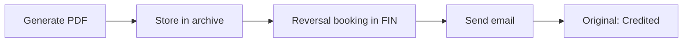

# Credit Notes

> Correct or credit previously sent invoices.

## Overview

A credit note corrects a previously sent invoice, in full or in part. The system copies the line items from the original invoice with reversed amounts and books a reversal entry in your financial administration. Credit notes have their own numbering.

## What You'll Need

- A sent invoice that needs to be corrected
- Access to the ZZP module (`zzp_crud` permissions)

## Step by Step

### 1. Create a credit note

1. Go to **ZZP** → **Invoices**
2. Open the sent invoice you want to credit
3. Click **Create credit note**
4. The line items are automatically copied with **reversed amounts** (negative)
5. Optionally adjust the lines if you only want to partially credit
6. Click **Save**

!!! info
The credit note receives its own number with the prefix `CN` (default). For example: `CN-2026-0001`. This prefix is configurable per tenant.

### 2. Send the credit note

1. Open the draft credit note
2. Review the amounts
3. Click **Send**

When you send the credit note, the following happens:

| Step                    | Description                                                           |
| ----------------------- | --------------------------------------------------------------------- |
| Generate PDF            | Credit note is converted to PDF                                       |
| Store in archive        | The PDF is stored via Google Drive or S3                              |
| Reversal booking in FIN | Reversed booking: revenue account (debit) and debtor account (credit) |
| Send email              | PDF is sent as attachment to the contact                              |
| Update status           | The original invoice gets the status "credited"                       |

### 3. Partial credit

If you only want to credit part of the invoice:

1. Create the credit note as described above
2. Remove the line items you don't want to credit
3. Adjust the quantities for partial corrections
4. Send the credit note

!!! warning
A fully credited invoice gets the status "credited" and can no longer be paid. Make sure you're crediting the correct lines and amounts.

## Tips

!!! tip
Always create a credit note instead of manually correcting an invoice. This keeps your bookkeeping correct and provides a complete audit trail.

- Credit notes are numbered separately from invoices
- The reversal booking in FIN is created automatically
- You can download the credit note PDF just like a regular invoice
- The original invoice remains visible with the status "credited"

## Troubleshooting

| Problem                       | Cause                             | Solution                                               |
| ----------------------------- | --------------------------------- | ------------------------------------------------------ |
| Cannot create credit note     | Invoice is still in draft status  | Send the invoice first before creating a credit note   |
| Amounts are not negative      | Line items not correctly reversed | Check that the amounts are negative on the credit note |
| Original invoice not credited | Credit note has not been sent yet | Send the credit note to update the original's status   |
