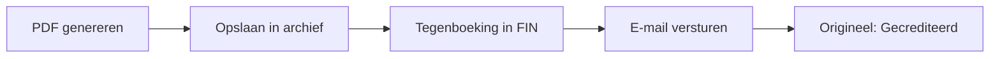

# Creditnota's

> Eerder verstuurde facturen corrigeren of crediteren.

## Overzicht

Een creditnota corrigeert een eerder verstuurde factuur, geheel of gedeeltelijk. Het systeem kopieert de regelitems van de originele factuur met omgekeerde bedragen en boekt een tegengestelde boeking in je financiële administratie. Creditnota's hebben een eigen nummering.

## Wat je nodig hebt

- Een verstuurde factuur die gecorrigeerd moet worden
- Toegang tot de ZZP-module (`zzp_crud` rechten)

## Stap voor stap

### 1. Creditnota aanmaken

1. Ga naar **ZZP** → **Facturen**
2. Open de verstuurde factuur die je wilt crediteren
3. Klik op **Creditnota aanmaken**
4. De regelitems worden automatisch overgenomen met **omgekeerde bedragen** (negatief)
5. Pas eventueel de regels aan als je slechts gedeeltelijk wilt crediteren
6. Klik op **Opslaan**

!!! info
De creditnota krijgt een eigen nummer met het prefix `CN` (standaard). Bijvoorbeeld: `CN-2026-0001`. Dit prefix is instelbaar per tenant.

### 2. Creditnota versturen

1. Open de concept-creditnota
2. Controleer de bedragen
3. Klik op **Versturen**

Wanneer je de creditnota verstuurt, gebeurt het volgende:

| Stap                | Beschrijving                                                             |
| ------------------- | ------------------------------------------------------------------------ |
| PDF genereren       | Creditnota wordt omgezet naar PDF                                        |
| Opslaan in archief  | De PDF wordt opgeslagen via Google Drive of S3                           |
| Tegenboeking in FIN | Omgekeerde boeking: omzetrekening (debet) en debiteurenrekening (credit) |
| E-mail versturen    | PDF wordt als bijlage verstuurd naar het contact                         |
| Status bijwerken    | De originele factuur krijgt de status "gecrediteerd"                     |

### 3. Gedeeltelijke creditering

Als je slechts een deel van de factuur wilt crediteren:

1. Maak de creditnota aan zoals hierboven
2. Verwijder de regelitems die je niet wilt crediteren
3. Pas de hoeveelheden aan voor gedeeltelijke correcties
4. Verstuur de creditnota

!!! warning
Een volledig gecrediteerde factuur krijgt de status "gecrediteerd" en kan niet meer worden betaald. Controleer of je de juiste regels en bedragen crediteert.

## Tips

!!! tip
Maak altijd een creditnota aan in plaats van een factuur handmatig te corrigeren. Zo blijft je boekhouding correct en heb je een volledig auditspoor.

- Creditnota's worden apart genummerd van facturen
- De tegenboeking in FIN wordt automatisch aangemaakt
- Je kunt de creditnota-PDF downloaden net als een gewone factuur
- De originele factuur blijft zichtbaar met de status "gecrediteerd"

## Problemen oplossen

| Probleem                            | Oorzaak                           | Oplossing                                                           |
| ----------------------------------- | --------------------------------- | ------------------------------------------------------------------- |
| Kan geen creditnota aanmaken        | Factuur is nog in concept-status  | Verstuur de factuur eerst voordat je een creditnota aanmaakt        |
| Bedragen zijn niet negatief         | Regelitems niet correct omgekeerd | Controleer of de bedragen negatief zijn op de creditnota            |
| Originele factuur niet gecrediteerd | Creditnota is nog niet verstuurd  | Verstuur de creditnota om de status van het origineel bij te werken |
