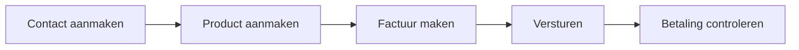

# ZZP Facturatie

> Factureer klanten, registreer uren en beheer debiteuren en crediteuren.

## Overzicht

De ZZP-module is speciaal ontworpen voor zzp'ers en freelancers. Je maakt en verstuurt facturen, registreert uren per klant en project, en houdt overzicht over openstaande vorderingen en schulden. Alle facturen worden automatisch geboekt in je financiële administratie.

!!! info
De ZZP-module vereist dat de FIN-module (Financiële Administratie) actief is voor je tenant. Vraag je SysAdmin om beide modules in te schakelen.

## Wat kun je hier doen?

| Taak                                      | Beschrijving                                         |
| ----------------------------------------- | ---------------------------------------------------- |
| [Contacten beheren](contacts.md)          | Klanten en leveranciers registreren en beheren       |
| [Producten & diensten](products.md)       | Je product- en dienstencatalogus bijhouden           |
| [Facturen aanmaken](creating-invoices.md) | Conceptfacturen opstellen met regelitems             |
| [Facturen versturen](sending-invoices.md) | PDF genereren, boeken in FIN en per e-mail versturen |
| [Creditnota's](credit-notes.md)           | Eerder verstuurde facturen corrigeren of crediteren  |
| [Urenregistratie](time-tracking.md)       | Gewerkte uren bijhouden per klant en project         |
| [Debiteuren & crediteuren](debtors.md)    | Openstaande vorderingen en schulden beheren          |

## Typische workflow

1. **Maak een contact aan** met klantgegevens en een uniek Klant-ID
2. **Maak een product of dienst aan** met prijs en BTW-code
3. **Maak een factuur** met regelitems op basis van je producten
4. **Verstuur de factuur** — PDF wordt gegenereerd, geboekt in FIN en per e-mail verstuurd
5. **Controleer betalingen** — het systeem matcht bankbetalingen automatisch met openstaande facturen

## Factuurnummering

Facturen worden automatisch genummerd per tenant en jaar:

| Onderdeel  | Voorbeeld | Beschrijving                                     |
| ---------- | --------- | ------------------------------------------------ |
| Prefix     | `INV`     | Instelbaar per tenant                            |
| Jaar       | `2026`    | Viercijferig jaar van de factuurdatum            |
| Volgnummer | `0001`    | Oplopend per tenant en jaar (minimaal 4 cijfers) |

Voorbeeld: `INV-2026-0001`, `INV-2026-0002`, enzovoort.

Creditnota's gebruiken een apart prefix (standaard `CN`): `CN-2026-0001`.

## Rechten

| Recht        | Wat de gebruiker kan                                   |
| ------------ | ------------------------------------------------------ |
| `zzp_read`   | ZZP-gegevens bekijken (facturen, contacten, producten) |
| `zzp_crud`   | ZZP-gegevens aanmaken, bewerken en verwijderen         |
| `zzp_export` | ZZP-gegevens exporteren                                |
| `zzp_tenant` | ZZP-instellingen beheren voor de tenant                |

!!! warning
Welke rechten beschikbaar zijn hangt af van de modules die de SysAdmin voor je tenant heeft ingeschakeld. Als de ZZP-module niet is ingeschakeld, zijn de ZZP-rechten niet beschikbaar.
