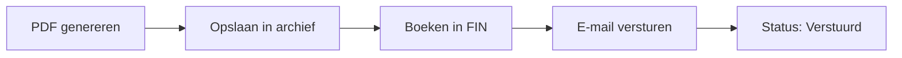

# Facturen versturen

> PDF genereren, boeken in de financiële administratie en per e-mail versturen.

## Overzicht

Wanneer je een conceptfactuur verstuurt, gebeuren er meerdere dingen automatisch: er wordt een professionele PDF gegenereerd met je bedrijfslogo, de factuur wordt geboekt in je financiële administratie (FIN), en de PDF wordt per e-mail naar je klant gestuurd. De factuurstatus verandert van "concept" naar "verstuurd".

## Wat je nodig hebt

- Een conceptfactuur met minimaal één regelitem
- Een contact met een e-mailadres (factuur of algemeen)
- Toegang tot de ZZP-module (`zzp_crud` rechten)

## Stap voor stap

### 1. Factuur versturen

1. Ga naar **ZZP** → **Facturen**
2. Open de conceptfactuur die je wilt versturen
3. Controleer de gegevens en totalen
4. Klik op **Versturen**

!!! warning
Na het versturen kunnen de financiële gegevens van de factuur niet meer worden gewijzigd. Controleer alles zorgvuldig voordat je verstuurt.

### 2. Wat er op de achtergrond gebeurt

Wanneer je op **Versturen** klikt, voert het systeem de volgende stappen uit:

| Stap               | Beschrijving                                                                           |
| ------------------ | -------------------------------------------------------------------------------------- |
| PDF genereren      | Factuur wordt omgezet naar een professionele PDF met je bedrijfslogo en klantgegevens  |
| Opslaan in archief | De PDF wordt opgeslagen via Google Drive of S3                                         |
| Boeken in FIN      | Dubbele boeking: debiteurenrekening (debet) en omzetrekening (credit), plus BTW-regels |
| E-mail versturen   | PDF wordt als bijlage verstuurd naar het factuur-e-mailadres van het contact           |
| Status bijwerken   | Factuurstatus verandert van "concept" naar "verstuurd"                                 |

!!! info
Het Klant-ID van het contact wordt opgenomen in de betalingsreferentie. Zo kan het systeem later bankbetalingen automatisch matchen met deze factuur.

### 3. PDF downloaden

Je kunt de PDF van een verstuurde factuur altijd opnieuw downloaden:

1. Ga naar **ZZP** → **Facturen**
2. Open de verstuurde factuur
3. Klik op **PDF downloaden**

Als het originele bestand niet beschikbaar is, wordt een kopie gegenereerd met de markering "KOPIE".

### 4. Bijlagen meesturen

Je kunt extra documenten meesturen met de factuur-e-mail:

1. Open de conceptfactuur
2. Klik op **Bijlagen** en selecteer de documenten
3. De geselecteerde bijlagen worden samen met de factuur-PDF verstuurd

!!! tip
Gebruik bijlagen voor urenstaten, contracten of leveringsbevestigingen die je klant nodig heeft bij de factuur.

## De factuur-PDF

De gegenereerde PDF bevat:

| Onderdeel         | Beschrijving                                |
| ----------------- | ------------------------------------------- |
| Bedrijfslogo      | Je eigen logo (indien geconfigureerd)       |
| Bedrijfsgegevens  | Naam, adres, KvK, BTW-nummer van je bedrijf |
| Klantgegevens     | Naam, adres en referenties van het contact  |
| Factuurnummer     | Automatisch toegewezen nummer               |
| Factuurdatum      | Datum van de factuur                        |
| Vervaldatum       | Berekend op basis van betalingstermijn      |
| Regelitems        | Alle factuurregels met bedragen             |
| BTW-overzicht     | BTW gegroepeerd per tarief                  |
| Totalen           | Subtotaal, BTW en eindtotaal                |
| Betalingsgegevens | IBAN, Klant-ID als referentie               |

## Factuurstatussen

| Status       | Beschrijving                                  |
| ------------ | --------------------------------------------- |
| Concept      | Factuur is aangemaakt maar nog niet verstuurd |
| Verstuurd    | Factuur is verstuurd en geboekt in FIN        |
| Betaald      | Betaling is ontvangen en gematcht             |
| Verlopen     | Vervaldatum is verstreken zonder betaling     |
| Gecrediteerd | Factuur is gecorrigeerd via een creditnota    |

## Tips

!!! tip
Stel je bedrijfslogo in via de tenant-instellingen voordat je je eerste factuur verstuurt. Zo ziet je factuur er meteen professioneel uit.

- Controleer het e-mailadres van het contact voordat je verstuurt
- De e-mail onderwerpregel is instelbaar per tenant
- Als het versturen mislukt, blijft de factuur in "concept" status — je kunt het opnieuw proberen
- Verstuurde facturen worden bewaard voor de wettelijke bewaartermijn (standaard 7 jaar)

## Problemen oplossen

| Probleem                    | Oorzaak                                 | Oplossing                                                         |
| --------------------------- | --------------------------------------- | ----------------------------------------------------------------- |
| "Geen e-mailadres gevonden" | Contact heeft geen e-mailadres          | Voeg een e-mailadres toe aan het contact                          |
| E-mail niet ontvangen       | E-mail in spam of verkeerd adres        | Controleer het e-mailadres en de spammap van de ontvanger         |
| PDF zonder logo             | Geen logo geconfigureerd voor de tenant | Stel een bedrijfslogo in via de tenant-instellingen               |
| Boeking mislukt             | Ontbrekende grootboekrekeningen         | Controleer of de debiteuren- en omzetrekening zijn geconfigureerd |
